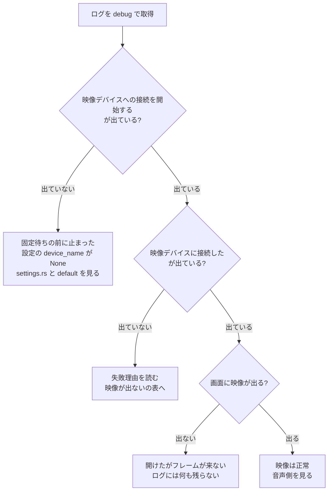

# デバイス不具合の切り分け

Capturecard_Viewer の不具合の大半は、映像（nokhwa / MediaFoundation）か音声（cpal / WASAPI）のどちらかでデバイスを開けていないことに帰着する。**推測で直さず、まずログで「どこまで進んだか」を確定させる。**

`docs/TROUBLESHOOTING.md` は利用者向けで、手元で試せる回避策を並べたもの。**このファイルは Claude が原因を特定するための手順**で、読者が違う。利用者に案内する内容は `docs/TROUBLESHOOTING.md` にだけ書き、ここには書かない。

## 前提

ログの場所・レベル・世代管理は `docs/design/logging.md` にある。ここでは繰り返さない。

## 手順 1: ログを取る

`info` のままでも接続の成否と失敗理由は残る。**まず既定のレベルで再現させ、足りなければ `debug` に上げる。**

```bash
CAPTURECARD_VIEWER_LOG=debug ./target/release/capturecard_viewer.exe
```

**`trace` は原則使わない。** eframe / winit のイベントが毎フレーム流れ、12 秒の起動で 9,000 行・1.1MB に達する（実測）。自前のログはその中に数十行しかない。デバイス調査で `trace` にして増えるのは 2 秒ごとの再適用の記録と、フレーム 1 枚ごとの `フレームが届いた`（1080p60 で毎秒 60 行）だけ。**フレームが届いているかは `info` の `最初のフレームが届いた` で判る**ので、通常は `trace` まで上げる必要がない。

ログから自前の行だけを抜く。

```bash
grep -E '\] capturecard_viewer(::| )' "$APPDATA/capturecard_viewer/logs/<ファイル名>.log" | grep -vE 'eframe|winit'
```

ターゲットはモジュールのパスがそのまま入るので、アプリ本体の行は `capturecard_viewer::app::worker_connect` のように `app::` から始まる。`main.rs` にはログを出す処理が残っていないため、ターゲットが `capturecard_viewer` だけの行は出ない。

**デバイス関係の行はほぼすべてデバイスワーカースレッドが出している。**

| ターゲット | 何を出すか |
|---|---|
| `app::worker` | ワーカースレッドの起動と終了（`debug`） |
| `app::worker_loop` | ワーカーの開始・停止、「デバイス再接続」の要求、最小化中のホットキー（音量・ミュート） |
| `app::worker_timers` | 切断の検出、再接続の要求、既定デバイスの切り替え、音声のリサンプル比の補正 |
| `app::worker_connect` | 接続の試行と成否、デバイス能力・対応設定の取得、既定デバイス名の確定 |
| `app::device` | 起動直後の設定適用（`app` 側）。接続そのものは出さない |
| `video` / `audio` | デバイスを開く処理の中身（列挙、`Camera::new`、選んだ設定、ストリームのエラー） |

**`app::monitor` はログを出さない。** 切断や既定切り替えの「判定」だけを持つ純粋関数の置き場所で、ログは呼び出し側の `app::worker_timers` が出す。

## 手順 2: 正常時の目安と突き合わせる

AVerMedia Live Gamer EXTREME 3 + Windows 11 での実測（2026-09、release ビルド、6 回起動）。**桁が違えばそこが原因。**

| 区間 | ログ上の目印 | 実測 |
|---|---|---|
| プロセス開始 → 最初の `update()` | `を起動した` → `起動直後の設定適用とデバイスの接続を始める` | 242〜252ms |
| 映像デバイスの列挙 | `映像デバイスを N 件列挙した` の中の ms | 0.9〜1.4ms |
| `Camera::new` | `映像ストリームを開いた` の中の `Camera::new` | 19.1〜92.7ms（下記参照） |
| `open_stream` | `映像ストリームを開いた` の中の `open_stream` | 0.0〜0.1ms |
| 映像の接続 | `映像デバイスへの接続を試す（1 回目）` → `映像デバイスに接続した` | 38〜94ms |
| 音声デバイスの列挙 | `音声デバイスへの接続を試す（1 回目）` → `入力デバイスの対応設定を取得した` | 240〜340ms |
| 音声の対応設定の取得 | `入力デバイスの対応設定を取得した` / `出力デバイスの対応設定を取得した` の中の ms | 21〜26ms / 96〜110ms |
| 音声の接続 | `音声デバイスへの接続を試す（1 回目）` → `音声デバイスに接続した` | 575〜631ms |
| プロセス開始 → 接続完了 | `を起動した` → `音声デバイスに接続した` | **0.91〜0.92 秒** |
| ストリーム開始 → 1 枚目 | `映像ストリームを開いた` → `最初のフレームが届いた` | 812〜813ms |
| プロセス開始 → 映像が出る | `を起動した` → `最初のフレームが届いた` | **1.09〜1.16 秒** |

**この表は `CAPTURECARD_VIEWER_LOG=debug` で測ったもの。** 既定の `info` では、音声の接続に含まれるデバイス一覧の記録（`利用できる入力デバイス` / `利用できる出力デバイス`、合わせて 240〜340ms）が丸ごと消える。同じ環境の `info` での実測は次のとおり。

| 区間 | `info` での実測 |
|---|---|
| プロセス開始 → 最初の `update()` | 218ms |
| 音声の接続 | 294ms |
| プロセス開始 → 接続完了 | **0.60 秒** |
| プロセス開始 → 映像が出る | 1.12 秒 |

**調査で `debug` を使うときは、この差を接続の遅れと読み違えないこと。**

読み取れること。

- **MediaFoundation の列挙（`nokhwa::query`）は 1〜3ms 程度。** 存在しないデバイス名を設定して測っても、列挙 + 名前検索 + エラー生成で数 ms しかかからない。**映像側の 21〜78ms はほぼ `Camera::new` の時間**で、列挙ではない
- `Camera::new` はビルド直後の 1 回目だけ 68〜77ms で、2 回目以降は 19〜21ms に落ちる。MediaFoundation 側のキャッシュが温まるため
- `open_stream` は 0.0ms。フレーム取得スレッドを起こすだけ
- 音声の列挙は映像の 100 倍遅い。デバイス数に比例するので、オーディオデバイスが多い環境ではさらに伸びる。**接続完了までの 0.9 秒のうち 1/3 は cpal の入出力デバイス列挙で、これは `debug` のときだけ走る**
- **ストリームを開いてから 1 枚目が届くまでに 0.81 秒かかる。** 接続が成功しても画面はしばらく `映像信号がありません` のまま。この 0.8 秒はデバイス側の都合なので、接続を早めても縮まらない。**「接続完了 0.8 秒」と「映像が出るまで 1.1 秒」の差はこれ**

以前（固定 2 秒待ちがあった頃）はプロセス開始から接続完了まで 2.80〜2.96 秒だった。**2 秒ちょうど短くなっている**ので、この区間が 2.8 秒に戻っていたら固定待ちが復活したと考えてよい。

## 手順 3: 待ちとリトライの実装を思い出す

`src/app/worker_timers.rs` の `poll_connection()`、`src/app/worker_connect.rs` の `try_connect_video` / `try_connect_audio`、`src/app/retry.rs` の `ConnectRetry`。**`sleep` は使っていないので、リトライで秒単位止まることはない。** 「数秒〜ずっと応答しない」という報告が来たらリトライ以外を疑う。

**デバイスを開く処理は専用のワーカースレッドにある。** UI スレッドは止まらないので、**「接続を試している間だけウィンドウが固まる」という症状はもう出ない。** 出るなら UI スレッド側に別の原因がある（`rfd` のファイルダイアログ、フォントの読み込みなど）。1 回の試行にかかる時間は次のとおりで、**この間はワーカーが次のコマンドを処理できない**（設定ダイアログでのデバイス切り替えがその分だけ遅れる）。

| 試行 | 実測 |
|---|---|
| 映像・デバイスが見つからない | 1ms |
| 映像・開けた | 20〜93ms |
| 音声・初回（`利用できる入力デバイス` の記録を含む） | 251〜454ms |
| 音声・2 回目以降で見つからない | 22ms |
| 音声・開けた | 293ms |

**音声の初回だけ重いのは、診断用のデバイス一覧を記録しているから。** 2 回目以降は出さないので、失敗が続いても 1 回あたり 22ms に収まる。

| | 値 |
|---|---|
| 初回の試行 | 最初の `update()` が送る `ApplyConfig` の直後（起動から 0.2〜0.3 秒。固定待ちは無い） |
| 判定 | ワーカーの `tick` のたびに `is_due()` を見て、期限が来ていれば 1 回だけ試す。`tick` の間隔は再試行中が 100ms、それ以外が 500ms |
| 間隔 | 200ms → 400 → 800 → 1600 → 3200 → 5000ms 頭打ち |
| 上限回数 | 無し。繋がるまで続く |
| 成功時 | 失敗回数と待ち時間をリセットし、要求があるまで試さない |
| 音声のフォールバック | **しない。** 設定のデバイスが戻るまで同じ対象で試し続ける。3 回目の失敗で `warn` を 1 度出すだけ |

ログの目印。

- `映像デバイスへの接続を試す（N 回目）: <デバイス名>` / `音声デバイスへの接続を試す（N 回目）- 入力: ...、出力: ...`（`info`）
- `映像デバイスへの接続に失敗した（N 回目）: <理由>`（`warn`）
- `映像デバイスへの再試行は N ms 後`（`debug`）。**バックオフが伸びているかはこの行で見る**
- `音声デバイスに 3 回続けて接続できない。既定のデバイスへは倒さず、戻るまで再試行を続ける`（`warn`）。**この行が出ていたら、音声は設定のデバイスを待っている状態。** マイクなど別のデバイスへは倒していない（#134）
- `映像が戻ったので、音声デバイスの再接続も要求した`（`info`）。映像の復帰にあわせて音声のバックオフを飛ばした

知っておくと読み間違えない点。

- **`ConnectRetry` は「いま何へ繋ごうとしているか」を持つ。** 2 秒ごとの `apply_settings` が同じ対象を要求し続けても、進行中のバックオフは維持される。対象（デバイス名・解像度・フォーマット・fps、音声は入出力名・レート・チャンネル数）が変われば数え直して即座に試す
- `N 回目` が 1 に戻っているのに成功していない場合、**設定側の対象が変わっている**（設定ダイアログでの変更、右クリックの「デバイス再接続」）。設定を触っていないのに戻るなら不具合
- **映像と音声は別々に数える。** 片方が成功してももう片方の再試行は続く
- **稼働中に消えた場合の再接続は、設定の差分ではなく監視が起こす。** `monitor_video_link`（フレームが 3 秒途絶えた）と `monitor_audio_stream`（cpal のエラーコールバック）が `request_now` で要求する。右クリック → デバイス再接続は、自動再接続を切っている場合と、監視が拾えない症状のための手動経路
- **最小化していても再試行と監視は動く。** ワーカースレッドはウィンドウの状態に関係なく回るため（#133）。最小化していた時間帯のログに `映像デバイスへの接続を試す（N 回目）` が並んでいるかで確認できる

## 手順 4: 症状から見る場所を決める



### 映像が出ない

`映像デバイスへの接続に失敗した（N 回目）: <理由>` の `<理由>` で分岐する。文字列は `src/video/capture.rs` の `start_capture` が組み立てている。

| 理由 | 起きていること | 次に見る |
|---|---|---|
| `Failed to query devices: ...` | MediaFoundation の列挙自体が失敗。`MFStartup` / `CoInitializeEx` の失敗を含む | 極めて稀。OS 側の MediaFoundation が壊れている可能性。デバイスマネージャでカメラが見えるか |
| `Device '<名前>' not found` | 列挙はできたが、設定の名前に一致するデバイスがない | 設定ファイルの `device_name` と、実際に列挙されたデバイス名を突き合わせる。製品名がそのまま入るので、挿し直しや別ポートで名前が変わることがある |
| `No video devices found` | 列挙は成功したが 0 件 | デバイスが OS から見えていない。デバイスマネージャを確認 |
| `Failed to create camera: ...` | 列挙にはいたが開けない。`IMFActivate::ActivateObject` の失敗 | 他アプリの占有、カメラのプライバシー設定、ドライバの状態 |
| `Failed to open camera stream: ...` | 開けたがストリームを始められない。要求したフォーマットをデバイスが出せない場合を含む | 設定の解像度・fps を落として再現するか確認。`start_capture` は `RequestedFormatType::Closest` で寄せるが、寄せた先も出せないことがある |

**`映像デバイスに接続した` は「フレームが届く」を意味しない。** `start_capture` は `open_stream()` が成功した時点で `Ok` を返す。信号が無い、フォーマットが合わない、途中でデバイスが消えた、いずれの場合も接続成功と記録される。画面には `映像信号がありません` が出る。

**フレームを処理できたかどうかは `最初のフレームが届いた`（`info`）で判る。**

```
[INFO ] capturecard_viewer::video - 最初のフレームが届いた（1920x1080、フォーマット: YUYV、変換 4.20ms、経路: 高速パス）
```

- この行は **RGB への変換とフレームバッファへの格納まで通った**ときに出る。**「届いていない」と「届いたが捨てた」は区別が要る**
  - この行も破棄の `warn` も無い → コールバックまで 1 枚も来ていない。信号なし、またはデバイス側が出していない
  - この行が無く破棄の `warn` がある → フレームは来ているが捨てている。`warn` の内容が理由
- ストリームを開いてから 1 枚目までは正常時でも 0.81 秒かかる。数秒待っても出なければ異常
- 2 枚目以降は `trace` の `フレームが届いた` に落としてある。毎フレーム `info` を出さないため
- **破棄を表す `warn` は 3 つ**。いずれも**初回だけ**出る

| `warn` | 起きていること |
|---|---|
| `YUY2 のフレームが短いので破棄した` | YUY2 だがデータ長が解像度に足りない |
| `フレームのデコードに失敗した` | デコーダが復号できなかった |
| `フレームバッファのロックを取得できないのでフレームを捨てた` | 変換は済んだが格納できなかった |

- **`YUY2 の高速パスを使えないのでデコーダへフォールバックする` は破棄ではない。** フォーマットが YUYV でない、幅が奇数、といった理由で自前の高速パスを通らなかったことを示すだけで、デコーダが成功すればフレームは格納され `最初のフレームが届いた` も出る（`経路: デコーダ` になる）。**この行だけでフレームが失われたと判断しない**

残る穴は nokhwa 側。**nokhwa のフレーム取得ループがエラーを捨てている。** `nokhwa-0.10.11/src/threaded.rs` の `camera_frame_thread_loop` が `if let Ok(frame) = camera.frame()` で握り潰し、sleep も挟まずに回り続ける。ここはコールバックまで来ないので本アプリのログには現れない。**CPU 使用率が高いのに映像が出ない場合はこれ**

**`映像ストリームを開いた` の「実際の設定」に fps は載っていない。** `nokhwa-bindings-windows 0.4.6` の `format_refreshed` が `MF_MT_FRAME_RATE`（上位 32 ビットが分子、下位 32 ビットが分母）を `fps as u32` で読んでおり、整数フレームレートでは分母の 1 しか取れない。解像度とピクセルフォーマットは正しいので、その 2 つだけを載せている。**おおよそのフレームレートを知りたい場合は `trace` の `フレームが届いた` の行数を数える**（実測では 5.5 秒で 293 行 ≒ 53 枚/秒）。**これは処理できた枚数であって、デバイスが出した枚数ではない。** 捨てた枚数は数えていないので、入力の fps そのものを測る用途には使えない。

**毎フレーム出るログを `info` 以上で足さないこと。** 1 行ごとにフラッシュしているため、1080p60 では毎秒 60 回のディスク書き込みになる。初回だけ出す判定は `video/frame_sink.rs` の `FirstTimeOnly` にまとめてある。

### 音が出ない

映像と違い、`src/audio/` はデバイス選択から設定確定まで残している。上から順に追う。

1. `利用できる入力デバイス: [...]` — 設定の `input_device_name` がこの一覧に含まれているか。含まれていなければ `find_device_by_name` が失敗する
2. `使用するデバイス - 入力: X、出力: Y` — 出力の設定が `None` のとき `Y` は Windows の既定の再生デバイス。**ユーザーが思っている出力先と違うことが多い**
3. `音声の設定 - 入力: 48000Hz 2ch (F32)、出力: ...` — 設定画面で選んだ値と違ってよい。`select_best_config` がデバイスの対応範囲で最も近いものへ寄せる。**入力と出力でサンプリングレートが違うと再生速度と音程がずれる**（リサンプリングしていない）
4. `音声パススルーを開始した` — ここまで出ていれば cpal のストリームは動いている。無音ならパススルーのフラグ、音量、Windows 側のミキサーを見る
5. `入力ストリームのエラー` / `出力ストリームのエラー` — 稼働中にデバイスが落ちた。`error!` で残る

`音声デバイスへの接続に失敗した（N 回目）: <理由>`（`warn`）が続いていれば、設定のデバイスをまだ掴めていない。**上限回数は無いので、この行は繋がるまで（間隔は最大 5 秒で）出続ける。** 諦めて別のデバイスへ倒すことはしないため、**ログに出ていない音がどこかから鳴っていることはない**（手順 3 の表を参照）。

### 設定画面に選択肢が出ない

`VideoCapture::get_device_capabilities` はデバイスワーカースレッドで走り、結果はチャネルで UI スレッドへ返る（`src/app/capabilities.rs` の `dispatch_capability_requests` → `src/app/worker_connect.rs` の `query_video_capabilities` → `src/app/device.rs` の `drain_device_events`）。

- 成否は呼び出し側が残す。成功なら `info` の `デバイス能力を取得した: <デバイス名>（N フォーマット, N ms）`、失敗なら `warn` の `デバイス能力を取得できない: <デバイス名>: <理由>`。**失敗は設定ダイアログにも「⚠ 対応形式を取得できませんでした」として出る**ので、ユーザーの報告と突き合わせられる
- フォーマットごとの件数は `video/capabilities.rs` が `debug` の `デバイス能力の内訳（<デバイス名>、N ms）: YUY2: n 件、…` に残す。`Camera::new` の所要時間は `能力取得のためにデバイスを開いた（N ms）`
- `get_device_capabilities` は `Camera::new` で**キャプチャ中のデバイスをもう一度開く**。ワーカースレッドなので UI は止まらないが、ここが伸びると「対応形式を取得中...」が長く出たままになり、その間ワーカーは次のコマンドを処理できない
- 全フォーマットで `compatible_list_by_resolution` が失敗したときは、コード内にベタ書きされた既定の解像度リストが返る。**画面に出ている選択肢がデバイスの実際の能力とは限らない。** この差し替えは `warn` の `… の対応する組み合わせを取得できないので既定値を使う` で分かる

デバイス一覧（`cached_video_devices`）は 5 秒間隔のキャッシュで、列挙もワーカーが行う。**設定画面を開いた最初の数フレームは前回の一覧が出る**（開いた時点で要求を送り、返ってくるまで前の値を使う）。デバイスを挿してすぐ設定画面を開くと出てこないことがある。

### 起動時に接続できない

**固定待ちの 2 秒は廃止済み。** 根拠が残っておらず（v1.0.4 の初期実装にコメント「画面投影問題を解決」があるだけ）、実測では MediaFoundation の列挙が 1〜3ms、映像の接続全体でも 20〜78ms で、待つべき時間として過大だった。いまは最初の `update()` で試し、失敗したらバックオフで繋がるまで再試行する（手順 3）。

**「列挙が遅れているだけ」なら、待たなくても再試行で拾える。** 起動直後に失敗しても数百 ms 後の再試行で繋がるので、ログの `N 回目` を見れば何回目で繋がったかが分かる。

- `Device '<名前>' not found` のときは、直前の `debug` に**実際に列挙されたデバイス名**が出る（`映像デバイスを N 件列挙した（N ms）: [...]`）。設定値との突き合わせはこれで足りる
- 手元では 3 回の起動すべてで 1 回目に成功し、失敗を再現できていない。**OS 起動直後・スリープ復帰直後にデバイスが列挙に現れないケースは未検証**

再現を試みるときの手順。

1. OS を再起動し、ログイン直後（デスクトップが出た瞬間）に起動する
2. スリープから復帰した直後に起動する
3. キャプチャーボードを USB に挿した直後（ドライバが読み込まれる前）に起動する

いずれも `映像デバイスへの接続に失敗した（1 回目）` の理由と、**その後の再試行で繋がったか**を記録する。

- `Device '<名前>' not found` — 設定の名前が列挙結果に無いというだけで、未接続・名前変更・列挙の遅れのどれでも起きる。**再試行で現れたときに限って列挙の遅れと判断する。** 現れないなら待っても解決しないので、列挙されたデバイス名と設定値を突き合わせる
- `Failed to create camera` — 列挙には出るが開けない。待ちを伸ばしても解決しない可能性がある

**この区別がリトライ設計を決めるので、理由の文字列を必ず残す。**

## 占有の確認

`docs/TROUBLESHOOTING.md` には「同時に 1 つのアプリからしか開けないことが多い」とあるが、**デバイスによる。**

実測（Live Gamer EXTREME 3）では、**本アプリを 2 つ同時に起動しても両方が映像・音声とも接続に成功した。** MediaFoundation のフレームサーバーが共有するため。したがって「他アプリが掴んでいる」という仮説は、少なくともこのデバイスでは映像の失敗理由として成立しない。排他で開くデバイス（Web カメラなど）では成立しうるので、デバイスを混同しない。

一方で **2 つ目のインスタンスはホットキーの登録に必ず失敗する。**

```
[ERROR] capturecard_viewer::screenshot - ホットキーの登録に失敗した: ... HotKey already registerd: ...
```

この行が出ていたら、**本アプリが既に別プロセスで動いている。** 2 秒ごとに再試行して同じエラーを吐き続けるので、ログがこの行で埋まる。スクリーンショットが撮れないという報告では最初に確認する。

## 実機テスト

```bash
cargo test --locked -- --ignored
```

**現時点で `#[ignore]` が付いているのは `src/video/convert.rs` の `yuy2_to_rgb_naive_1080p_conversion_time` だけで、これは計測用でデバイスを使わない。** デバイスを開くテストはまだ 1 つもないので、このコマンドでデバイス起因の不具合は捕まらない。

デバイスを開くテストを足すときの書き方は `.claude/skills/testing-conventions/SKILL.md` の「結合テスト（実機必須）」に従う。

UI 操作を伴う確認は `docs/MANUAL-TEST.md` のチェックリスト。デバイス接続まわりを触ったら、該当項目を名指しでユーザーに依頼する。

## Windows 側の確認

ログで原因が絞れないときに OS 側の状態を確認する。**いずれも Claude が変更してはいけない。ユーザーに確認を依頼する。**

| 見るもの | 開き方 | 何を見るか |
|---|---|---|
| デバイスマネージャ | `devmgmt.msc` | 「カメラ」「サウンド、ビデオ、およびゲーム コントローラー」に製品名があるか。警告アイコンが付いていないか |
| サウンド設定（録音） | `mmsys.cpl` → 録音 | キャプチャーボードの入力が有効か。プロパティ → 詳細の「既定の形式」が設定画面で選んだ値と一致するか。**WASAPI はここの値しか報告しない** |
| サウンド設定（再生） | `mmsys.cpl` → 再生 | 既定のデバイスがログの `使用するデバイス - ... 出力: Y` と一致するか |
| カメラのプライバシー設定 | 設定 → プライバシーとセキュリティ → カメラ | デスクトップアプリのカメラアクセスが許可されているか。**拒否されていると `Failed to create camera` になる** |
| マイクのプライバシー設定 | 設定 → プライバシーとセキュリティ → マイク | 同上。音声側の `find_device_by_name` が失敗する |
| 実行中のプロセス | タスクマネージャー | `capturecard_viewer.exe` が複数ないか |

## 実機で再現を試すとき

release exe を起動して確かめる場合は、**先に設定ファイルを退避し、終了後に差分がないことを確認する。**

```bash
cp "$APPDATA/capturecard_viewer/config/default-config.toml" /tmp/ccv-config-backup.toml
```

```bash
taskkill //IM capturecard_viewer.exe //F
```

```bash
diff /tmp/ccv-config-backup.toml "$APPDATA/capturecard_viewer/config/default-config.toml"
```

アプリはウィンドウのサイズと位置を設定に書き戻すため、**起動しただけで設定ファイルは変わりうる。** 調査で意図的に設定を書き換えた場合は、必ず退避したものへ戻す。

ログは直近 10 回分しか残らない。**再現のために何度も起動すると、目的の回のログが押し出される。** 先に対象のログを別の場所へコピーする。

## 実機が無いときの確認手順

キャプチャーボードもオーディオ入力も無い環境（CI、手元に機器が無いとき）では、**フェイクデバイスで起動して、デバイス以外の部分を確かめる。** 仕組みと名乗るデバイスの一覧は `docs/design/device-worker.md` の「フェイクデバイス（#142）」にある。

```bash
CAPTURECARD_VIEWER_FAKE_DEVICES=2 CAPTURECARD_VIEWER_LOG=debug ./target/release/capturecard_viewer.exe
```

設定ファイルは「実機で再現を試すとき」と同じく**先に退避する。** 退避して空の状態で起動すると、「Fake Camera 1」「Fake Audio Input 1」が既定のデバイスとして選ばれ、設定へ書き戻される。**実機のデバイス名が書かれた設定のまま起動すると、フェイクはその名前を「見つからない」として再試行し続ける**（実機と同じ振る舞いで、別のデバイスへは倒さない）。その場合は設定画面でフェイクのデバイスを選ぶ。

フェイクで起動できていれば、ログの先頭近くに `warn` で次の行が出る。**これが無ければ環境変数が効いていない**（値が 0・空・数字でない場合はフェイクを使わず実機で起動する）。

```
[WARN ] capturecard_viewer::app::backend - CAPTURECARD_VIEWER_FAKE_DEVICES が指定されているので、実機ではなくフェイクデバイスで動く（2 台、シナリオ: ...）
```

切断と再試行は `CAPTURECARD_VIEWER_FAKE_SCENARIO` で起こせる。

| 確かめたいこと | 指定 | ログで見る行 |
|---|---|---|
| 接続失敗からの再試行（バックオフ） | `fail:3` | `フェイクの映像デバイスを開くのに失敗させた（シナリオ fail、残り N 回）` → `映像デバイスへの接続に失敗した（N 回目）` が 3 回 → `映像デバイスに接続した` |
| 途絶の検出と自動復帰 | `disconnect:5` | `フェイクの映像を止めた（シナリオ disconnect、N 枚目まで）` → 約 3 秒後に `映像フレームが N ms 途絶えたので、…切断として扱う` → `フェイクの映像デバイスを開いた` |
| 両方 | `fail:2,disconnect:10` | 上の 2 つが順に出る |

フェイクで確かめられるのは、ワーカーの再試行と切断監視、デバイス切替 UI（2 台を切り替えると カラーバー ⇄ 青のベタ塗り で見分けられる）、色空間・色レンジ・映像調整、統計 OSD、スクリーンショット、音量・ミュートと「接続状態」タブの音声の欄（出力に「Fake Audio Output 2」を選ぶとリサンプル比と水位が動く）。**Media Foundation / WASAPI そのものの挙動（列挙の遅さ、`Camera::new` の所要時間、MJPEG、デバイスが消えたときの cpal のエラー、手順 2 の実測値）はフェイクでは再現できない。** そこが疑わしいときは実機で確かめる。

`cargo test` にもフェイクを使うテストが入っている（`src/video/test_pattern.rs` の色の期待値、`src/app/backend/fake.rs` のワーカーを通したテスト）。どれも `#[ignore]` なしで CI で走る。

## 調査で分かったことの置き場所

- **利用者が自分で試せる回避策** → `docs/TROUBLESHOOTING.md`
- **実測値・失敗パターン・ログの読み方** → このファイル
- **設計判断（なぜその待ち時間なのか等）** → `docs/design/` か `docs/ARCHITECTURE.md`

`git log` には書かない。新しいセッションで読まれない。

## 報告

- どのログファイルを見たか（ファイル名と起動時刻）
- 接続がどこまで進んだか。手順 2 の表のどの区間で止まったか、あるいは所要時間が目安から外れたか
- 失敗理由の文字列。**そのまま引用する。要約しない**
- ログに残らないため確認できなかったこと（フレームの到着、`get_device_capabilities` の失敗など）を明示する。**「ログに出ていない = 起きていない」ではない**
- ユーザーに依頼した Windows 側の確認と、その結果
