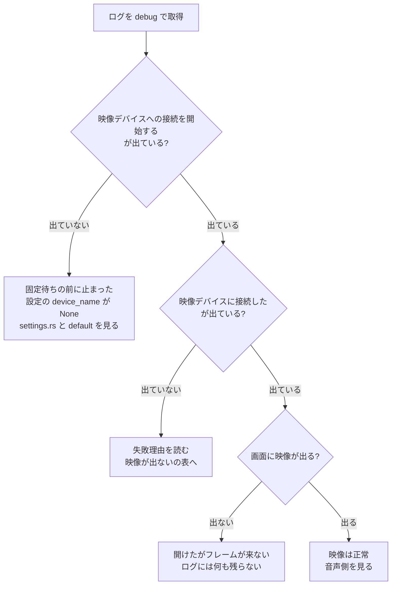

# デバイス不具合の切り分け

Capturecard_Viewer の不具合の大半は、映像（nokhwa / MediaFoundation）か音声（cpal / WASAPI）のどちらかでデバイスを開けていないことに帰着する。**推測で直さず、まずログで「どこまで進んだか」を確定させる。**

`docs/TROUBLESHOOTING.md` は利用者向けで、手元で試せる回避策を並べたもの。**このファイルは Claude が原因を特定するための手順**で、読者が違う。利用者に案内する内容は `docs/TROUBLESHOOTING.md` にだけ書き、ここには書かない。

## 前提

ログの場所・レベル・世代管理は `CLAUDE.md` の「標準出力は届かない。ログは log クレートを使う」にある。ここでは繰り返さない。

## 手順 1: ログを取る

`info` のままでも接続の成否と失敗理由は残る。**まず既定のレベルで再現させ、足りなければ `debug` に上げる。**

```bash
CAPTURECARD_VIEWER_LOG=debug ./target/release/capturecard_viewer.exe
```

**`trace` は原則使わない。** eframe / winit のイベントが毎フレーム流れ、12 秒の起動で 9,000 行・1.1MB に達する（実測）。自前のログはその中に数十行しかない。デバイス調査で `trace` にして増えるのは 2 秒ごとの再適用の記録と、フレーム 1 枚ごとの `フレームが届いた`（1080p60 で毎秒 60 行）だけ。**フレームが届いているかは `info` の `最初のフレームが届いた` で判る**ので、通常は `trace` まで上げる必要がない。

ログから自前の行だけを抜く。

```bash
grep -E '\] capturecard_viewer(::| )' "$APPDATA/capturecard_viewer/logs/<ファイル名>.log" | grep -vE 'eframe|winit'
```

`capturecard_viewer::audio` のようにモジュールまで入るのは `audio` / `video` / `screenshot` / `settings` / `logging` の行で、`main.rs` の行はターゲットが `capturecard_viewer` だけになる。**`grep 'capturecard_viewer::'` だと `main.rs` の行が丸ごと落ちる。** 接続の開始・成否は `main.rs` の `apply_settings` が出しているので、これを落とすと何も分からなくなる。

## 手順 2: 正常時の目安と突き合わせる

AVerMedia Live Gamer EXTREME 3 + Windows 11 での実測（2026-09、release ビルド、5 回起動）。**桁が違えばそこが原因。**

| 区間 | ログ上の目印 | 実測 |
|---|---|---|
| プロセス開始 → `AudioCapture::new` | `を起動した` → `AudioCapture を作成した` | 207〜231ms |
| 固定待ち | → `起動から 2 秒経過した` | 2,000ms（コード上の定数） |
| 映像の接続 | `映像デバイスへの接続を開始する` → `映像デバイスに接続した` | 28〜91ms |
| 音声デバイスの列挙 | `音声デバイスへの接続を開始する` → `利用できる入力デバイス` | 291〜323ms |
| 音声の接続 | `音声デバイスへの接続を開始する` → `音声パススルーを開始した` | 517〜621ms |
| プロセス開始 → 接続完了 | `を起動した` → `遅延接続の一連の処理が終わった` | 2.80〜2.96 秒 |
| 映像デバイスの列挙 | `映像キャプチャの要求` → `映像デバイスを N 件列挙した` | 0.9〜1.6ms |
| `Camera::new` | `映像ストリームを開いた` の中の `Camera::new` | 29〜90ms |
| `open_stream` | `映像ストリームを開いた` の中の `open_stream` | 0.0ms |
| ストリーム開始 → 1 枚目 | `映像ストリームを開いた` → `最初のフレームが届いた` | 811〜813ms |

読み取れること。

- **MediaFoundation の列挙（`nokhwa::query`）は 3ms 程度。** 存在しないデバイス名を設定して測ると、列挙 + 名前検索 + エラー生成で 3ms しかかからない。**映像側の 28〜91ms はほぼ `Camera::new` と `open_stream` の時間**で、列挙ではない
- 初回起動（ビルド直後で MediaFoundation のキャッシュが冷えている状態）だけ 85〜91ms、2 回目以降は 28〜30ms に落ちる
- **待ち時間の大半（2.9 秒のうち 2.0 秒）は固定待ちで、実際の接続は 0.6〜0.7 秒。** そのうち 2/3 は cpal の入出力デバイス列挙
- 音声の列挙は映像の 100 倍遅い。デバイス数に比例するので、オーディオデバイスが多い環境ではさらに伸びる
- **映像側の 28〜91ms はほぼ `Camera::new`。** `open_stream` は 0.0ms で、フレーム取得スレッドを起こすだけ
- **ストリームを開いてから 1 枚目が届くまでに 0.81 秒かかる。** 接続が成功しても画面はしばらく `映像信号がありません` のまま。この 0.8 秒はデバイス側の都合なので、接続を早めても縮まらない

## 手順 3: 待ちとリトライの実装を思い出す

`src/main.rs` の `update()` と `apply_settings()`。**リトライの `sleep` は UI スレッドを止める。** 失敗が続くとウィンドウが固まるので、「応答しない」という報告はリトライ中の可能性がある。

| | 起動時 `apply_settings(true)` | 定期適用 `apply_settings(false)` |
|---|---|---|
| 発火 | 起動から 2.0 秒後に 1 回 | `last_settings_applied` から 2.0 秒経過するたび |
| 映像 | 最大 3 回、間隔 1,000ms | 最大 1 回、間隔なし |
| 音声 | 最大 5 回、間隔 300ms。3 回目の失敗後に既定デバイス（入出力とも `None`）で 1 回だけ試す | 最大 2 回、間隔 300ms。既定デバイスへのフォールバックなし |
| 全滅したとき | 映像は無言、音声は `error!` を 1 行 | 同左 |

知っておくと読み間違えない点。

- **`apply_settings(true)` は `last_settings_applied` を更新しない。** そのため初回適用の直後に定期適用がもう 1 回走る。ログで接続処理が 2 回並ぶのは正常
- **成功するまで `last_*` が更新されないので、失敗した側は 2 秒ごとに無限に再試行される。** 後からデバイスを挿せば勝手に繋がる。固定待ちを過ぎてからの再試行は既に「繋がるまで続く」形になっており、問題は起動直後の 2 秒だけ
- 逆に**一度成功すると再接続は起きない。** 稼働中にデバイスが消えても `last_video_device` は残ったままなので `need_video_restart` が偽になり、再接続されない。右クリック → デバイス再接続が要るのはこのため

## 手順 4: 症状から見る場所を決める



### 映像が出ない

`映像デバイスへの接続に失敗した（N 回目）: <理由>` の `<理由>` で分岐する。文字列は `src/video.rs` の `start_capture` が組み立てている。

| 理由 | 起きていること | 次に見る |
|---|---|---|
| `Failed to query devices: ...` | MediaFoundation の列挙自体が失敗。`MFStartup` / `CoInitializeEx` の失敗を含む | 極めて稀。OS 側の MediaFoundation が壊れている可能性。デバイスマネージャでカメラが見えるか |
| `Device '<名前>' not found` | 列挙はできたが、設定の名前に一致するデバイスがない | 設定ファイルの `device_name` と、実際に列挙されたデバイス名を突き合わせる。製品名がそのまま入るので、挿し直しや別ポートで名前が変わることがある |
| `No video devices found` | 列挙は成功したが 0 件 | デバイスが OS から見えていない。デバイスマネージャを確認 |
| `Failed to create camera: ...` | 列挙にはいたが開けない。`IMFActivate::ActivateObject` の失敗 | 他アプリの占有、カメラのプライバシー設定、ドライバの状態 |
| `Failed to open camera stream: ...` | 開けたがストリームを始められない。要求したフォーマットをデバイスが出せない場合を含む | 設定の解像度・fps を落として再現するか確認。`start_capture` は `RequestedFormatType::Closest` で寄せるが、寄せた先も出せないことがある |

**`映像デバイスに接続した` は「フレームが届く」を意味しない。** `start_capture` は `open_stream()` が成功した時点で `Ok` を返す。信号が無い、フォーマットが合わない、途中でデバイスが消えた、いずれの場合も接続成功と記録される。画面には `映像信号がありません` が出る。

**フレームが届いたかどうかは `最初のフレームが届いた`（`info`）で判る。**

```
[INFO ] capturecard_viewer::video - 最初のフレームが届いた（1920x1080、フォーマット: YUYV、変換 4.20ms、経路: 高速パス）
```

- この行が無ければ 1 枚も届いていない。**信号なしと、開けたがフレームが来ない状態を、ここで切り分ける**
- ストリームを開いてから 1 枚目までは正常時でも 0.81 秒かかる。数秒待っても出なければ異常
- 2 枚目以降は `trace` の `フレームが届いた` に落としてある。毎フレーム `info` を出さないため
- フォーマットが YUYV でない、幅が奇数、といった理由で高速パスを外れた場合は `warn` の `YUY2 の高速パスを使えないのでデコーダへフォールバックする` が**初回だけ**出る。デコードそのものに失敗した場合も同様に初回だけ `warn` が出る

残る穴は nokhwa 側。**nokhwa のフレーム取得ループがエラーを捨てている。** `nokhwa-0.10.11/src/threaded.rs` の `camera_frame_thread_loop` が `if let Ok(frame) = camera.frame()` で握り潰し、sleep も挟まずに回り続ける。ここはコールバックまで来ないので本アプリのログには現れない。**CPU 使用率が高いのに映像が出ない場合はこれ**

**`映像ストリームを開いた` の「実際の設定」に fps は載っていない。** `nokhwa-bindings-windows 0.4.6` の `format_refreshed` が `MF_MT_FRAME_RATE`（上位 32 ビットが分子、下位 32 ビットが分母）を `fps as u32` で読んでおり、整数フレームレートでは分母の 1 しか取れない。解像度とピクセルフォーマットは正しいので、その 2 つだけを載せている。**実際のフレームレートを知りたい場合は `trace` の `フレームが届いた` の行数を数える**（実測では 5.5 秒で 293 行 ≒ 53fps）。

**毎フレーム出るログを `info` 以上で足さないこと。** 1 行ごとにフラッシュしているため、1080p60 では毎秒 60 回のディスク書き込みになる。初回だけ出す判定は `video.rs` の `FirstTimeOnly` にまとめてある。

### 音が出ない

映像と違い、`src/audio.rs` はデバイス選択から設定確定まで残している。上から順に追う。

1. `利用できる入力デバイス: [...]` — 設定の `input_device_name` がこの一覧に含まれているか。含まれていなければ `find_device_by_name` が失敗する
2. `使用するデバイス - 入力: X、出力: Y` — 出力の設定が `None` のとき `Y` は Windows の既定の再生デバイス。**ユーザーが思っている出力先と違うことが多い**
3. `音声の設定 - 入力: 48000Hz 2ch (F32)、出力: ...` — 設定画面で選んだ値と違ってよい。`select_best_config` がデバイスの対応範囲で最も近いものへ寄せる。**入力と出力でサンプリングレートが違うと再生速度と音程がずれる**（リサンプリングしていない）
4. `音声パススルーを開始した` — ここまで出ていれば cpal のストリームは動いている。無音ならパススルーのフラグ、音量、Windows 側のミキサーを見る
5. `入力ストリームのエラー` / `出力ストリームのエラー` — 稼働中にデバイスが落ちた。`error!` で残る

`音声デバイスへの接続を全て試したが失敗した` が出ていれば全滅。直前に 5 回分の `音声デバイスへの接続に失敗した` があり、3 回目の後に `既定のデバイスで接続し直す` が挟まる。**既定デバイスでの試行は失敗理由しか記録されず、どのデバイスを試したかが残らない。**

### 設定画面に選択肢が出ない

`VideoCapture::get_device_capabilities` は `capability-query` スレッドで走り、結果はチャネルで UI スレッドへ返る（`main.rs` の `dispatch_capability_requests` / `drain_capability_results`）。

- 成否は呼び出し側が残す。成功なら `info` の `デバイス能力を取得した: <デバイス名>（N フォーマット, N ms）`、失敗なら `warn` の `デバイス能力を取得できない: <デバイス名>: <理由>`。**失敗は設定ダイアログにも「⚠ 対応形式を取得できませんでした」として出る**ので、ユーザーの報告と突き合わせられる
- フォーマットごとの件数は `video.rs` が `debug` の `デバイス能力の内訳（<デバイス名>、N ms）: YUY2: n 件、…` に残す。`Camera::new` の所要時間は `能力取得のためにデバイスを開いた（N ms）`
- `get_device_capabilities` は `Camera::new` で**キャプチャ中のデバイスをもう一度開く**。別スレッドなので UI は止まらないが、ここが伸びると「対応形式を取得中...」が長く出たままになる
- 全フォーマットで `compatible_list_by_resolution` が失敗したときは、コード内にベタ書きされた既定の解像度リストが返る。**画面に出ている選択肢がデバイスの実際の能力とは限らない。** この差し替えは `warn` の `… の対応する組み合わせを取得できないので既定値を使う` で分かる

デバイス一覧（`cached_video_devices`）は 5 秒間隔のキャッシュ。デバイスを挿してすぐ設定画面を開くと出てこないことがある。

### 起動時に接続できない

README と `docs/TROUBLESHOOTING.md` にある既知問題。**調査の結論は「固定待ちの 2 秒に根拠がない」。**

- 2 秒待ちは v1.0.4 の初期実装から入っており、コメントに「画面投影問題を解決」とあるが根拠が残っていない
- 実測では MediaFoundation の列挙は 1〜3ms、映像の接続全体でも 28〜91ms。**待つべき時間として 2 秒は過大**
- `Device '<名前>' not found` のときは、直前の `debug` に**実際に列挙されたデバイス名**が出る（`映像デバイスを N 件列挙した（N ms）: [...]`）。設定値との突き合わせはこれで足りる
- 手元では 5 回の起動すべてで 1 回目に成功し、失敗を再現できていない。**OS 起動直後・スリープ復帰直後にデバイスが列挙に現れないケースは未検証**

再現を試みるときの手順。

1. OS を再起動し、ログイン直後（デスクトップが出た瞬間）に起動する
2. スリープから復帰した直後に起動する
3. キャプチャーボードを USB に挿した直後（ドライバが読み込まれる前）に起動する

いずれも `映像デバイスへの接続に失敗した（1 回目）` の理由と、**その後の再試行で繋がったか**を記録する。

- `Device '<名前>' not found` — 設定の名前が列挙結果に無いというだけで、未接続・名前変更・列挙の遅れのどれでも起きる。**再試行で現れたときに限って列挙の遅れと判断する。** 現れないなら待っても解決しないので、列挙されたデバイス名と設定値を突き合わせる
- `Failed to create camera` — 列挙には出るが開けない。待ちを伸ばしても解決しない可能性がある

**この区別がリトライ設計を決めるので、理由の文字列を必ず残す。**

## 占有の確認

`docs/TROUBLESHOOTING.md` には「同時に 1 つのアプリからしか開けないことが多い」とあるが、**デバイスによる。**

実測（Live Gamer EXTREME 3）では、**本アプリを 2 つ同時に起動しても両方が映像・音声とも接続に成功した。** MediaFoundation のフレームサーバーが共有するため。したがって「他アプリが掴んでいる」という仮説は、少なくともこのデバイスでは映像の失敗理由として成立しない。排他で開くデバイス（Web カメラなど）では成立しうるので、デバイスを混同しない。

一方で **2 つ目のインスタンスはホットキーの登録に必ず失敗する。**

```
[ERROR] capturecard_viewer::screenshot - ホットキーの登録に失敗した: ... HotKey already registerd: ...
```

この行が出ていたら、**本アプリが既に別プロセスで動いている。** 2 秒ごとに再試行して同じエラーを吐き続けるので、ログがこの行で埋まる。スクリーンショットが撮れないという報告では最初に確認する。

## 実機テスト

```bash
cargo test --locked -- --ignored
```

**現時点で `#[ignore]` が付いているのは `src/video.rs` の `yuy2_to_rgb_naive_1080p_conversion_time` だけで、これは計測用でデバイスを使わない。** デバイスを開くテストはまだ 1 つもないので、このコマンドでデバイス起因の不具合は捕まらない。

デバイスを開くテストを足すときの書き方は `.claude/skills/testing-conventions/SKILL.md` の「結合テスト（実機必須）」に従う。

UI 操作を伴う確認は `docs/MANUAL-TEST.md` のチェックリスト。デバイス接続まわりを触ったら、該当項目を名指しでユーザーに依頼する。

## Windows 側の確認

ログで原因が絞れないときに OS 側の状態を確認する。**いずれも Claude が変更してはいけない。ユーザーに確認を依頼する。**

| 見るもの | 開き方 | 何を見るか |
|---|---|---|
| デバイスマネージャ | `devmgmt.msc` | 「カメラ」「サウンド、ビデオ、およびゲーム コントローラー」に製品名があるか。警告アイコンが付いていないか |
| サウンド設定（録音） | `mmsys.cpl` → 録音 | キャプチャーボードの入力が有効か。プロパティ → 詳細の「既定の形式」が設定画面で選んだ値と一致するか。**WASAPI はここの値しか報告しない** |
| サウンド設定（再生） | `mmsys.cpl` → 再生 | 既定のデバイスがログの `使用するデバイス - ... 出力: Y` と一致するか |
| カメラのプライバシー設定 | 設定 → プライバシーとセキュリティ → カメラ | デスクトップアプリのカメラアクセスが許可されているか。**拒否されていると `Failed to create camera` になる** |
| マイクのプライバシー設定 | 設定 → プライバシーとセキュリティ → マイク | 同上。音声側の `find_device_by_name` が失敗する |
| 実行中のプロセス | タスクマネージャー | `capturecard_viewer.exe` が複数ないか |

## 実機で再現を試すとき

release exe を起動して確かめる場合は、**先に設定ファイルを退避し、終了後に差分がないことを確認する。**

```bash
cp "$APPDATA/capturecard_viewer/config/default-config.toml" /tmp/ccv-config-backup.toml
```

```bash
taskkill //IM capturecard_viewer.exe //F
```

```bash
diff /tmp/ccv-config-backup.toml "$APPDATA/capturecard_viewer/config/default-config.toml"
```

アプリはウィンドウのサイズと位置を設定に書き戻すため、**起動しただけで設定ファイルは変わりうる。** 調査で意図的に設定を書き換えた場合は、必ず退避したものへ戻す。

ログは直近 10 回分しか残らない。**再現のために何度も起動すると、目的の回のログが押し出される。** 先に対象のログを別の場所へコピーする。

## 調査で分かったことの置き場所

- **利用者が自分で試せる回避策** → `docs/TROUBLESHOOTING.md`
- **実測値・失敗パターン・ログの読み方** → このファイル
- **設計判断（なぜその待ち時間なのか等）** → `CLAUDE.md` か `docs/ARCHITECTURE.md`

`git log` には書かない。新しいセッションで読まれない。

## 報告

- どのログファイルを見たか（ファイル名と起動時刻）
- 接続がどこまで進んだか。手順 2 の表のどの区間で止まったか、あるいは所要時間が目安から外れたか
- 失敗理由の文字列。**そのまま引用する。要約しない**
- ログに残らないため確認できなかったこと（フレームの到着、`get_device_capabilities` の失敗など）を明示する。**「ログに出ていない = 起きていない」ではない**
- ユーザーに依頼した Windows 側の確認と、その結果
