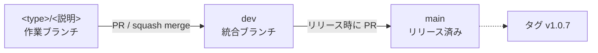

# ブランチ・コミット・PR の規約

Capturecard_Viewer リポジトリの規約。ブランチ作成・コミット・PR 作成のいずれかを行う前に必ずこれに従う。

## 種別（type）

ブランチ名とコミットメッセージで共通して使う。

| type | 用途 | 対応する area ラベル |
|---|---|---|
| `feat` | 新機能の追加 | `area:feature` |
| `fix` | 不具合の修正 | `area:bug` |
| `perf` | 動作を変えない性能改善 | `area:perf` |
| `refactor` | 動作を変えない内部構造の整理 | `area:refactor` |
| `docs` | ドキュメントのみの変更 | `area:docs` |
| `test` | テストの追加・修正 | `area:ci` |
| `ci` | CI 設定・ビルド基盤の変更 | `area:ci` |
| `chore` | 依存更新、skill、設定ファイルなど上記以外 | `area:ci` / `area:release` |

迷ったら「ユーザーから見て動作が変わるか」で判断する。変わるなら `feat` か `fix`、変わらないなら `perf` / `refactor` / `chore`。

## ブランチ戦略



- **作業ブランチは `dev` から切る。** `main` からではない
- **PR は `dev` へ向ける。** 既定のマージ先を間違えやすいので毎回確認する
- **`main` へ入れるのはリリースのときだけ。** `dev` → `main` の PR を作り、マージ後に `main` でタグを打つ
- `main` へ直接 PR を出さない

例外として、リリース済みの版に緊急の修正が要る場合は `main` から切って `main` へ戻してよい。その場合は同じ修正を `dev` にも取り込む。

## ブランチ名

```
<type>/<英語のケバブケース>
```

- 英小文字・数字・ハイフンのみ。日本語や大文字は使わない
- 2〜4 語程度に収める。何を触るかが分かる名前にする
- Issue 番号は入れない。Issue との紐づけは PR 本文とコミットの `Refs:` 行で行う

```
fix/audio-passthrough-toggle
perf/frame-clone-removal
refactor/replace-println-with-log
docs/architecture
ci/github-actions
chore/bump-egui
```

避ける例: `fix/bug`（何の不具合か不明）、`update`（type がない）、`fix/音声パススルー`（日本語）

### worktree を使う場合

`EnterWorktree` は自動でブランチ名に `worktree-` を付けるため、作成直後に改名する。

```bash
git branch -m fix/audio-passthrough-toggle
```

## コミットの考え方

コミットは作業ログとして扱う。**まとまった単位ができたらどんどんコミットする。** 1 つの PR に複数のコミットが並ぶのが普通の状態。

### 各コミットが満たすこと

**ビルドが通り、テストが通る状態でコミットする。** これは必須。

```bash
cargo build
```

```bash
cargo test
```

途中経過を残すことと、壊れた状態を残すことは別。WIP コミットや、次のコミットと合わせないと動かないコミットを積まない。これが守られていれば `git bisect` が使えるため、後から「どの変更で壊れたか」を機械的に絞り込める。

作業を中断したいだけなら、コミットせず worktree をそのまま残す。

### 履歴を作り直さない

- **レビュー指摘への対応は、元のコミットを直さず追加のコミットで積む**
- **push 済みの履歴に対して amend や rebase による force push を行わない**
- 誤った実装を入れてしまっても、修正コミットを重ねればよい。履歴から消そうとしない

AI が実装してコミットし、人がレビューしてコメントし、AI が修正をコミットする、という往復を前提にしている。**何を指摘されて何を直したかが履歴に残っているほうが、後から判断の経緯を追える。**

`main` が進んで取り込みが必要になった場合も、リベースではなくマージで取り込む。

例外は、push していないコミットの書き損じ（`Co-Authored-By` の付け忘れなど）。これは amend してよい。

### マージ戦略

PR のマージは **merge commit** を既定とする。

- **squash merge を使わない。** 個別のコミットが `dev` と `main` の履歴から消えてしまい、作業過程を残すという目的と衝突する
- **rebase and merge も使わない。** 個別コミットは残るが SHA が変わるため、「履歴を作り直さない」方針と噛み合わない

各コミットがビルドとテストを通している前提なので、merge commit でも `git bisect` は機能する。

`dev` の履歴はマージコミットで賑やかになるが、PR 単位の一本道として読みたいときは以下で足りる。

```bash
git log --first-parent dev
```

### コミットメッセージが履歴の価値を決める

作業過程を残す方針は、**メッセージが具体的でなければ意味がない。**

履歴を後から読むとき、実際には差分をすべて追うのではなく 1 行目を眺めて必要な箇所だけ開く。`fix: 微調整` のようなメッセージは、そこに何があるか分からないため事実上到達できない。

「使ってみて使い勝手が悪かったので直した」類の変更では、**何が問題で、どう変えたか**を 1 行目に書く。

```
fix: 音量スライダーの刻みが細かすぎて合わせにくいので 5% 単位にする
refactor: デバイス一覧の取得を毎フレームから 5 秒間隔に変える
```

### 履歴に頼りすぎない

**重要な結論は履歴ではなく `CLAUDE.md` か `docs/` に書く。**

新しいセッションで最初に読まれるのは `CLAUDE.md` とコードであって、`git log` ではない。履歴に書いた判断は、明示的に調べない限り参照されない。

履歴は「どういう経緯でそうなったか」を後から追うための補助であって、設計判断の置き場所ではない。

## コミットメッセージ

```
<type>: <日本語の要約>

<空行>
<本文：なぜその変更が必要か、何をしたか>

Refs: #<Issue 番号>

Co-Authored-By: Claude Opus 5 <noreply@anthropic.com>
```

- 1 行目は日本語で、50 字程度まで。句点は付けない
- 「修正」「更新」だけで終わらせず、何をどうしたかを書く
- 本文は「何をしたか」より「なぜそうしたか」を優先する
- 対応する Issue がある場合は `Refs: #<番号>` 行を入れる。**`Closes` / `Fixes` は使わない**（理由は「PR 本文」の節）
- Claude が作成したコミットには `Co-Authored-By` を付ける

```
fix: 音声パススルーの無効化がストリームに反映されない問題を修正

audio_passthrough_enabled が出力ストリームのコールバックから
参照されておらず、チェックを外しても音が止まらなかった。
コールバック内でフラグを見て、無効時は無音を書き込むようにする。
リングバッファは消費し続けて溢れを防ぐ。

Refs: #90

Co-Authored-By: Claude Opus 5 <noreply@anthropic.com>
```

## PR タイトル

コミットメッセージの 1 行目と同じ形式にする。

```
fix: 音声パススルーの無効化がストリームに反映されない問題を修正
```

複数のコミットをまとめる PR では、代表する type を選んで全体を要約する。

## PR 本文

**見出しの構成は `.github/pull_request_template.md` が持つ。ここには再掲しない。** 本文はその見出しに揃えて書く。

GitHub が自動で差し込むのは**既定ブランチ（`main`）にある版のテンプレート**なので、この仕組みが効くのは次のリリースで `main` に入ってから。それまではブラウザで PR を作っても空のままになる。また `gh pr create --body-file` で本文を渡す経路では、`main` に入ったあとも差し込まれない（`--template` は本文を指定しないときだけ効く）。**どちらの場合も、テンプレートのファイルを読んで見出しを自分で並べる。**

テンプレートに書いていない、埋めるときの決まりだけを挙げる。

- 対応する Issue がない場合も見出しごと消さず、「なし」と書く
- 使わない見出し（「判断を仰ぐ点」など）は、中身を空で残さず見出しごと消す
- `<!-- -->` のコメント行は提出前に消す
- 末尾に `🤖 Generated with [Claude Code](https://claude.com/claude-code)` を付ける。**テンプレート側には入れていない。** 人が手で書いた PR にまで付くのはおかしいため

### `Closes` ではなく `Refs` を使う

**PR 本文にもコミットメッセージにもクローズ用キーワードを書かない。**

対象は `Closes` / `Fixes` だけではない。GitHub が拾うのは `close` / `closes` / `closed` / `fix` / `fixes` / `fixed` / `resolve` / `resolves` / `resolved` の 9 語で、大文字小文字は区別しない。**Issue 番号の前に置いてよいのは `Refs` だけ**と覚える。

GitHub の自動クローズはどちらも**既定ブランチ（`main`）に入ったとき**に起きるが、`dev` 経由でそこへ至る道筋が違う。

- **`dev` 向け PR の本文** — 既定ブランチ以外を対象にした PR のキーワードは無視され、リンクすら張られない。マージしても、あとで `dev` → `main` が入っても発火しない
- **コミットメッセージ** — `dev` にいる間は閉じないが、**リリースで `dev` → `main` を入れた瞬間、履歴に含まれるキーワード付きコミットがまとめて発火する**
- **`dev` → `main` のリリース PR の本文** — 既定ブランチ向けなのでそのまま効く

危ないのは後ろの 2 つ。キャプチャーデバイス依存の不具合が多く CI で確かめられる範囲は狭いため、人間の実機確認が済む前に「完了」へ流れるのは困る。

`dev` 向け PR の本文だけは書いても実害が無いが、**場所ごとに可否を覚える運用が事故の元なので、全ての場所で `Refs` に揃える。**

**Issue を閉じるのは人が実機で確認したとき。** Claude は閉じない。

## PR を出したあとにやること

1. Issue に PR の URL をコメントする（双方向リンクにする）。**「人間が dev で確認すること」を箇条書きで添える**
2. マージされたらローカルを同期し、worktree とブランチを後片付けする

```bash
git checkout dev && git pull --ff-only
git worktree remove .claude/worktrees/<name>
git branch -D <branch>
git push origin --delete <branch>
```

3. Project の Status を「人間確認待ち」にする。**Issue は閉じない**

```bash
bash ~/.claude/skills/github-issues/set-status.sh <番号> -- 人間確認待ち
```

**進行状況はラベルでは表さない。** `status:` ラベルは廃止済みで、ラベルは分野（`area:`）と優先度（`P1`〜`P3`）だけに使う。詳細は `CLAUDE.md` の「タスク管理」を参照。

部分実装だった場合は Status を変えず、残りのスコープを Issue にコメントして「作業中」のままにする。

## 1 つの PR に入れる範囲

- **整形のみの変更は必ず単独の PR にする。** `rustfmt.toml` の変更や rustfmt の版上げで広い範囲に差分が出たとき、他の変更と混ぜるとレビューが不可能になる
- 依存クレートのメジャー更新（特に egui）は単独の PR にする。破壊的変更の追跡が必要なため
- バグ修正とリファクタリングは分ける。壊れたときの切り分けができなくなる
