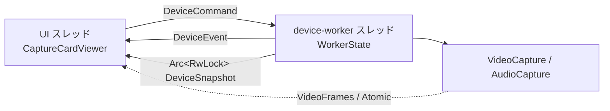

# CLAUDE.md

このファイルは Claude Code がこのリポジトリで作業するときの手引きです。

## プロジェクト概要

キャプチャーボード（キャプチャーカード）の映像と音声を、低遅延・シンプルな画面で表示する Windows 10/11 専用アプリ。Rust + eframe/egui 製の単一バイナリ。

- キャプチャーデバイスは Windows Media Foundation 経由で Web カメラとして扱う（nokhwa）
- 音声は WASAPI 経由の入力 → リングバッファ → 出力のパススルー（cpal）
- 設定は `%AppData%\capturecard_viewer\config\default-config.toml`（confy）

## ビルドと検証

```bash
cargo build --release
```

- ビルドには MSVC ツールチェインと Windows SDK が必要（`build.rs` が `embed_resource` で `app.rc` をコンパイルするため）
- バージョン番号の出どころは `Cargo.toml` の `version` だけ。`build.rs` が `app.rc` 用のヘッダーを生成するので、他の場所に数値を書かない（`docs/BUILD.md` の「バージョン番号」）
- **検証は `.claude/skills/verify/SKILL.md` の手順で回す。** fmt → clippy → release ビルド → test を CI と同じ引数で通す。ここにコマンドを再掲しない
- 整形の基準はリポジトリ直下の `rustfmt.toml`。`edition` だけ指定し、他は rustfmt の既定値に従う

## モジュール構成

| ファイル | 役割 |
|---|---|
| `src/main.rs` | エントリポイント。ロガーの初期化、`NativeOptions` の組み立て、`run_native` だけ |
| `src/platform.rs` | Windows 固有処理。日本語フォントの探索、埋め込みアイコンの読み込み、モニタの作業領域の列挙、保存されたウィンドウの大きさ・位置が使えるかの判定 |
| `src/app/mod.rs` | アプリ状態 `CaptureCardViewer` の定義、`Default`、`eframe::App` 実装（`update` / `on_exit`） |
| `src/app/view.rs` | 映像の描画（ウィンドウ表示とフルスクリーン）、プレースホルダーの文言、統計 OSD、テクスチャの取り込み |
| `src/app/menu.rs` | 右クリックメニューの中身と、平らな一覧／サブメニューの出し分け |
| `src/app/window.rs` | 最前面表示、タイトルバーの有無、装飾なしのときの端のドラッグによるリサイズ、大きさのリセット、フルスクリーンの切り替え |
| `src/app/device.rs` | `apply_settings`（設定をワーカーへ渡す）と、ワーカーから届いたイベントの取り込み |
| `src/app/worker.rs` | デバイスワーカーとやり取りする型（コマンド / イベント / `DeviceConfig` / `DeviceSnapshot`）と、UI 側の窓口 `DeviceWorker` |
| `src/app/worker_loop.rs` | デバイスワーカースレッドの本体。コマンドの受け口、再試行と監視のタイマー、観測値の書き出し |
| `src/app/worker_connect.rs` | ワーカーが行うデバイス操作。開く・閉じる・列挙する・能力を問い合わせる |
| `src/app/monitor.rs` | 切断や既定デバイスの切り替えの**判定**（純粋関数）。ワーカーが使う |
| `src/app/retry.rs` | `ConnectRetry` とバックオフ。「いつ試してよいか」だけを持つ。ワーカーが持つ |
| `src/app/capabilities.rs` | デバイス一覧のキャッシュと、デバイス能力・対応設定の取得要求（ワーカーへ流すところまで） |
| `src/app/screenshot.rs` | 撮影、保存スレッドの管理、結果の取り込み |
| `src/app/settings_dialog.rs` | 設定ダイアログの操作の受け止め、インポート / エクスポート / 初期化、プリセットの適用 |
| `src/app/settings_store.rs` | 設定のデバウンス保存と即時保存 |
| `src/app/hotkeys.rs` | ホットキーの適用と、押されたときのアクションの実行 |
| `src/app/audio_control.rs` | 音量とミュートの操作、その OSD |
| `src/app/error_report.rs` | 失敗の記録と、トースト・「接続状態」タブへの出し方 |
| `src/video.rs` | nokhwa `CallbackCamera` によるキャプチャ、YUY2→RGB 変換、`FrameBuffer`（`Arc` によるフレーム共有と世代番号）、デバイス能力の取得 |
| `src/audio.rs` | cpal による入力→リングバッファ→出力のパススルー、音量制御 |
| `src/hotkey.rs` | `HotkeyAction`（ホットキーを割り当てられる操作）、global-hotkey によるアクション別の登録とリスナースレッド、押下の検出とデバウンス、ホットキー文字列のパース |
| `src/screenshot.rs` | rodio による効果音の読み込みと再生 |
| `src/settings.rs` | `AppSettings` とその serde 定義、confy による読み書き、保存パスの決定、旧形式からの移行 |
| `src/logging.rs` | `log` クレートのロガー実装。ログファイルの置き場所・命名・世代管理、レベルの決定 |
| `src/ui.rs` | 設定ダイアログとホットキー設定ダイアログの描画。**状態を持たず、書き換えるのもドラフトだけ。** 起きたことは `SettingsEvent` / `HotkeyDialogEvent` の列で返す |
| `src/status.rs` | 失敗の記録（`ErrorCenter`）とトーストの間引き判定、設定ダイアログへ渡す接続状態（`ConnectionStatus`）、日本語の定型文 |
| `src/repaint.rs` | 次の再描画までの間隔の判定（`next_repaint_delay`）と、UI スレッド以外から再描画を促す窓口（`RepaintWaker`） |

`src/app/` の子モジュールは**基本どれも `impl CaptureCardViewer` を足す形**で、状態そのものは `app/mod.rs` の構造体 1 つに集めてある。**子モジュール側にフィールドや `static` を持たせないこと。** 他の子モジュールから呼ぶメソッドにだけ `pub(super)` を付け、そのファイルの中だけで使うものは私有のままにする。

**例外はデバイスワーカーの 3 つ**（`worker.rs` / `worker_loop.rs` / `worker_connect.rs`）。こちらは UI スレッドとは別のスレッドで動くので、状態を `CaptureCardViewer` に置けない。`worker_loop.rs` の `WorkerState` へ同じやり方で集めてあり、`worker_connect.rs` がそこへ `impl` を足す。

1 ファイル 800 行以内を目安にする。超えそうなら分け方を見直す。

### デバイス操作はワーカースレッドが行う

**デバイスを開く・閉じる・列挙する・能力を問い合わせる処理は、すべて専用のワーカースレッド 1 本の上で起きる。** UI スレッドは `DeviceCommand` を送り、`DeviceEvent` を `update()` の中で非ブロックに受け取るだけ。`start_capture` は実測 20〜93ms、`start_passthrough` は 300ms 前後、音声デバイスの列挙も 300ms 前後かかる。これを `update()` の中でやっていた頃は、接続を試すたびに描画がその分だけ飛んでいた。



**チャネルを通さない共有が 4 つある。** どれもデバイスを開く処理を挟まないので、コマンドの列に並べる理由がない。

| 共有するもの | 型 | 触る側 |
|---|---|---|
| 映像フレーム | `video::VideoFrames`（`Arc<Mutex<FrameBuffer>>`） | フレームコールバックが書き、UI スレッドが読む |
| 色空間・レンジ・明るさ・コントラスト・彩度 | `Arc<video::SharedColorConversion>`（Atomic） | UI スレッドが書き、フレームコールバックが読む |
| 音量・ミュート・パススルー | `Arc<audio::AudioControls>`（Atomic） | UI スレッドが書き、出力コールバックが読む |
| 音声のリサンプル補正の水位・補正係数 | `Arc<audio::ResampleTelemetry>`（Atomic） | 出力コールバックが水位を書き、デバイスワーカーが `tick` の中で補正係数を書く。**入出力の形が揃っている（identity）ストリームでは作らない**（`AudioCapture::resample_telemetry()` が `None` を返す） |

**映像フレームを `DeviceEvent` で送らないこと。** 接続やデバイス列挙の後ろで待たされ、遅延が増える。

これとは別に、「いま何に繋がっているか」もチャネルを通さず `DeviceSnapshot`（`Arc<RwLock<..>>`）で共有する。UI は `update()` の先頭で 1 回だけ複製を読み、描画も「接続状態」タブもそこから引く。**イベントを取りこぼしても表示が食い違わないよう、状態は必ずこちらを正とする。** ワーカーはイベントを送る前に観測値を書き出すので、UI 側は**イベントを取り込んでからスナップショットを読む**。逆にすると「接続に失敗した」を受け取ったフレームで失敗前の観測値を見る。

**開き直しが要るかの差分判定はワーカー側が持つ。** UI は 2 秒ごとに `DeviceConfig` を丸ごと送り、ワーカーが前回接続できた対象（`last_video_target` / `last_audio_target`）と比べる。UI 側に記録を置くと、接続の成否を知っているのはワーカーなのに記録は UI、という分かれ方になる。

- コマンドは受けた順に 1 つずつ処理する。**ワーカーは止まってよい。** 音声の対応設定が無ければ開く直前にその場で取りに行く（以前は届くまで接続を見送る仕組みを UI 側に持っていた）
- ループはコマンドを待つ前に期限（`tick`）を片付ける。こうしないと、起動直後に積まれる「デバイス能力の取得」（数百 ms）の後ろで最初の接続が待たされる
- コマンドを待つ間隔は、接続を追いかけている間が 100ms、それ以外が 500ms（`next_tick_delay`）。バックオフの最小値が 200ms なので、それより細かく起きる意味はない
- 終了は `on_exit` が `DeviceWorker::shutdown()` を呼んでストリームを閉じさせ、join する。**スクリーンショットの保存スレッドと同じ扱い。** 待たないと閉じる途中でプロセスが落ちる
- **`AudioCapture` はワーカースレッドの中で作る。** `cpal::Stream` は `!Send` で、作ったスレッド以外へ持ち出せない

### 最小化中も再接続と切断監視は止まらない

接続の再試行・フレーム途絶の検出・音声ストリームのエラーの回収・Windows 側の既定デバイスの追従は、どれもワーカー自身のタイマーで回す。**`update()` からは何も駆動しない。**

eframe は最小化されたウィンドウの再描画要求を捨てるため、最小化中は `update()` が呼ばれない。`update()` から駆動していた頃は、その間これらがすべて止まっていた（#133）。**時間で動くデバイス処理を `update()` から呼ぶ形へ戻さないこと。**

`update()` に残っている `#133` の範囲は**ホットキーのアクション実行**だけ。押下の検出はリスナースレッドが行うが、実行（フルスクリーン切替、音量 OSD など）は UI スレッドでしかできないため、最小化中は復帰まで持ち越される。

### 映像パイプライン

キャプチャーデバイス → nokhwa `Buffer` → フレームコールバックで YUY2→RGB 変換 → `FrameBuffer` → `update_video_texture` で egui テクスチャ化 → 描画

`FrameBuffer` はフレームを `Arc<VideoFrame>` で保持し、取り出し側へは `Arc` の複製を渡す。**画素データを複製しないので、取り出しても 1080p で 6MB の memcpy は発生しない。**

色変換の係数は `ColorMatrix` の表で持つ。**色空間・レンジの選択に加えて、明るさ・コントラスト・彩度もこの表へ畳み込む**（`adjusted_color_matrix`）。Y'CbCr → RGB がアフィン変換であることを使い、コントラストは輝度と色差の係数へ、彩度は色差の係数へ、明るさとコントラストの定数分は `ColorMatrix::offset` へ落とす。変換関数の入口で `y_offset` と `offset` を 1 つの `bias` に畳むので、**調整の有無で 1 画素あたりの演算数は変わらない。** 調整を後段のフィルタとして足さないこと。

色空間・レンジ・映像調整はすべて `SharedColorConversion`（`AtomicU8` ×2 と `AtomicI32` ×3）でフレームコールバックスレッドと共有する。**デバイスを開き直さずに次のフレームから効く。** ここに項目を足すときも `Mutex` にしないこと。フレームコールバックが毎フレーム読む。

`FrameBuffer` は push のたびに進む世代番号を持つ。`update_video_texture` は `VideoFrames::newer_than` で前回反映した世代と比較し、新着が無ければテクスチャを更新しない。**新着の有無を問わず最後のフレームが要る用途（スクリーンショット）は `VideoFrames::latest` を使う。** 世代番号はキャプチャ停止時も巻き戻さない。巻き戻すと再接続後の最初のフレームが呼び出し側の記録と一致し、新着と判別できなくなる。

### 再描画をいつ要求するか

eframe は **`update()` の中で要求された再描画しか予約しない。** 何も要求しなければ次の `update()` は来ないので、時間で動くもの（フレームの途絶の判定、接続の再試行、OSD の消滅、設定の遅延書き出し）は自分の都合で予約する必要がある。判断は `src/repaint.rs` に集めてある。

`update()` の末尾で `next_repaint_delay` が「次の `update()` までに空けてよい時間」を 1 回だけ要求する。

| 状態 | 間隔 |
|---|---|
| 最小化している | 1 秒 |
| 最後のフレームから 200ms 以内 | 16ms（60fps） |
| それ以外（信号なし、デバイスなし） | 250ms |

- **ここは上限であって下限ではない。** `overlay.rs` の OSD（消える時刻）、`flush_settings_if_due`（書き出す時刻）はそれぞれ自分で予約している。egui の `request_repaint_after` は同じフレームで要求された中の最短を採るので、互いに邪魔しない
- 以前は `update_video_texture` が無条件に 16ms を予約しており、映像が来ていなくても 60fps で描き続けていた（Issue #98）。**映像の有無にかかわらず一定間隔で予約する形へ戻さないこと**

映像が来ていないときは `RepaintWaker`（`repaint.rs`）が UI スレッド以外からの再描画を引き受ける。`egui::Context` を 1 つだけ持ち、フレームコールバックスレッドとホットキーのリスナースレッドが複製を握っている。これがあるので、250ms へ広げていても映像やホットキーはその場で反応する。

- **起こすのは間隔を広げているときだけ**（`should_wake_on_event`）。16ms で回っている間に起こすと、描いている最中に届いた通知が「新着なし」の `update()` を増やし、**1080p60 の実測で CPU が 66% → 85%（1 コアあたり）に増えた**
- **最小化中も起こさない。** eframe は最小化されたウィンドウの再描画要求を捨てる（`eframe::native::run` の `windows_next_repaint_times`）ため、起こしてもイベントループが動くだけで何も描かれない。**最小化中は `update()` 自体が呼ばれない**ので、そこで動く処理も止まる。接続の再試行と切断の監視はデバイスワーカースレッドへ移したので影響を受けない（#133）。残るのは**ホットキーのアクション実行**で、こちらは復帰まで持ち越される
- 広げる判断に 200ms の猶予を置いてあるのは、広げた直後に次のフレームが届くと `RepaintWaker` を有効にするより先に到着してしまい、その 1 枚が 250ms 遅れて出るため
- `Context` と結びつくのは最初の `update()`（`RepaintWaker::bind`）。**`RepaintWaker` は `VideoCapture::new` の引数で渡す。** フレームコールバックは `start_capture` の時点の複製を持つので、開いたあとに差し替える手段は用意していない
- 渡し忘れても映像は止まらない。既定の `RepaintWaker` は何もせず、ポーリングだけで動き続ける

### 切断の検出と再接続

デバイスワーカーの `monitor_video_link` が自前のタイマー（100〜500ms おき）で、`VideoCapture::link_state`（ストリームを開けているか／最後にフレームが届いてからの経過時間）を見る。判定は純粋関数 `decide_video_link`（`app::monitor`）に切り出してあり、`VIDEO_SIGNAL_TIMEOUT`（3 秒）途絶えたら `DeviceEvent::VideoSignalLost` を返す。テクスチャを捨てて表示を戻すのは UI 側の仕事。

- **ここでデバイスを開かない。** `ConnectRetry` へ要求を積むところまでで、実際に開くのは次の `tick` の `poll_connection`。開く処理を 2 か所に持つと、起動時の接続と競合して同じデバイスを二重に開こうとする
- **まだ 1 枚も届いていない状態は切断とみなさない。** 開いた直後は 1 枚目まで実測 0.8 秒かかり、入力信号が無いデバイスは開けても永久にフレームを出さない。ここを切断と判断すると開き直しが止まらなくなる
- **再接続の前にデバイスを列挙しない。** 対象が戻っているかは `start_capture` の中の列挙（実測 1〜3ms）が確かめる。`ConnectRetry` の間隔は最大 5 秒で頭打ちなので、MediaFoundation への問い合わせもその頻度を超えない。`cached_video_devices` の 5 秒キャッシュは**設定ダイアログを描画しているときしか更新されない**ので、ここからは使えない
- 自動再接続を無効にしてもテクスチャは捨てる。止まった画を残し続けるのが元の不具合であって、開き直すかどうかとは別の話
- **同じ処置を繰り返さないための記録は、真偽値ではなく「何をしたか」（`last_video_link_action`）で持つ。** 「一度扱った」という真偽値にすると、自動再接続を切ったまま途絶したあとに有効化しても、記録に阻まれて開き直せない
- **見送った音声のエラーを捨てない。** `take_stream_error` は読んだ時点で旗を下ろすため、自動再接続が無効な間や開き直しの下限（`AUDIO_ERROR_RECONNECT_MIN_INTERVAL`、5 秒）に達していない間のエラーは `audio_stream_error_pending` へ移して持ち越す。捨てると、誰も開き直さないまま音が戻らなくなる
- 表示は「デバイスは開けているが信号が来ていない（`映像信号がありません`）」と「デバイスそのものが消えた（`デバイスが接続されていません`）」で分ける。ユーザーが見るべきものが入力機器かケーブルかで違うため。文言は `video_placeholder_message` が決める
- **映像が途絶から復帰したら、音声の再接続も要求する。** 同じ USB 機器なので映像が戻ったなら音声も戻っている。`monitor_video_link` が `video_reconnect_after_loss` を立て、次に映像が繋がった時点で `resync_audio_after_video_recovery` が音声側のバックオフの残り（最大 5 秒）を飛ばす。**主経路ではなく保険。** 音声の切断は cpal のエラーコールバックが拾う。起動時の接続と区別するために旗を持つ（毎回やると、音声が無事なときまで開き直して 300ms ぶん音が途切れる）
- **「フレームが再び届き始めた」ログは、実際に届いたときだけ出す。** 開き直しでストリームを閉じた直後も `decide_video_link` は `Keep` を返すので、`Keep` へ戻ったことだけを条件にすると嘘になる。`capturing` と「1 枚でも届いているか」を合わせて見る。一方で**記録（`last_video_link_action`）は `Keep` なら必ず戻す。** 戻さないと、開き直したあとの途絶が「同じ処置が続いている」と見なされて検出されなくなる

### 音声は繋がらなくても別のデバイスへ倒さない

**設定に書かれた音声デバイスで開けないとき、Windows の既定デバイスへフォールバックしない。** 繋がるまで `ConnectRetry` のバックオフ（上限 5 秒）で試し続ける。判定は純粋関数 `decide_audio_fallback`。

以前は 3 回続けて失敗した時点で、入出力とも既定のデバイスで 1 度開き直していた。これが切断後の再接続でも効いており、次の順に壊れていた（#134）。

1. USB を抜くと音声ストリームのエラーで再接続が始まる
2. デバイスが消えているので必ず 3 回失敗する（1.5 秒）
3. 既定のデバイス（この環境では PC のマイク）で開けてしまい、**接続成功として確定する**
4. 以後は設定のデバイスを試さない。USB の再列挙には 10 秒以上かかるので、フォールバックが必ず勝つ
5. 副作用として、切断のたびに **PC のマイクの音がスピーカーへ流れる**

**起動時も同じ扱いにしてある。** 「設定のデバイスが無いときの救済」として入っていたが、黙って別のデバイスを開くのは音が出ないことより分かりにくい誤動作で、マイクを繋いでいる環境ではハウリングの元になる。繋がっていないことは「接続状態」タブと通知に出るので、気付く手段はある。

**例外は設けていない。** 「入出力とも未指定のときだけ、レートとチャンネル数を緩めて開き直す」案も検討したが、デバイスワーカーが起動直後の `ApplyConfig` で入力の未指定を列挙結果の先頭で埋めるため（`resolve_default_devices`）、実機のある環境では到達しない枝になる。未指定の意図を別に持ち回してまで残す価値が無いので置いていない。レートとチャンネル数はもともと `select_best_config` がデバイスの対応範囲へ寄せる。

- 接続に失敗するたびに、音声デバイスの能力キャッシュを `retry` で捨てて取り直す。挿し直しでデバイスの対応設定が変わっても、古い一覧で失敗し続けないため。**フォールバックが成功扱いになっていた間はこの経路が通らず、キャッシュが抜く前の状態のまま残っていた**
- 繋がらないまま再試行を続けることは、3 回目に 1 度だけ `warn` で残す（`AUDIO_RETRY_WARN_AFTER`）。毎回出すとログが埋まり、一度も出さないと「音が出ない」の調査でこの状態に気付けない。回数を以前のフォールバックと同じ 3 に合わせてあるのは、古いログと同じ位置に目印を置くため

### 「既定のデバイス」設定は Windows 側の既定切り替えを追いかける

cpal は WASAPI の `IMMNotificationClient` を公開していないため、開いたあとに Windows 側で既定入出力デバイスが変わっても通知が来ない。`poll_default_audio_device` が `DEFAULT_AUDIO_DEVICE_POLL_INTERVAL`（4 秒）おきに `default_input_device()` / `default_output_device()` の名前を問い合わせ、実際に開いている名前（`audio::ActiveAudio`）と食い違っていれば再接続を要求する（#135）。判定は純粋関数 `default_audio_device_changed`。設定で明示的にデバイスを選んでいる向きは対象にしない（フォールバックの話とは別）。`audio_retry` が既に再試行中のフレームは何もしない。設定ダイアログの開閉に関係なく動く点が `cached_output_devices` の 5 秒キャッシュと違う。切り替わったと判定した向きは、対応設定のキャッシュ（`DEFAULT_DEVICE_KEY` のキーのまま）も `retry` で取り直す。物理デバイスが変わっても文字列としてのキーは同じままなので、取り直さないと古いデバイスの対応設定で開こうとする。

**入力側の追従（`track_input`）は、実運用ではほぼ発生しない。** デバイスワーカーが起動直後の `ApplyConfig` で入力デバイス未設定（`None`）を列挙した先頭のデバイス名へ書き換え（`resolve_default_devices`）、`DefaultDevicesResolved` を受けた `device::store_resolved_devices` が設定へ書き戻す（`mark_settings_dirty` 経由なので、実際の書き出しは 2 秒後のデバウンス保存か終了時）。このため次回起動以降は常に具体的なデバイス名になる。これは意図的で、消さないこと。**入力の既定を出力と同じく `None`（Windows の既定デバイス）のまま残すと、ノート PC などでは内蔵マイクが開かれ、パススルーでその音がスピーカーへ流れる。** #134（PR #147）で切断時に同じ誤動作を直したばかりで、初回起動で再発させるわけにいかない。設定画面のオーディオ入力デバイスの選択肢にも出力と違って「デフォルト」が無い（追加するかは別 Issue で判断）。入力側の追従を試すには、設定ファイルを手で編集して `input_device_name` を消す。

### スレッド構成

| スレッド | 本数 | 役割 |
|---|---|---|
| egui/eframe の UI スレッド | 1 | `update()` が再描画のたびに呼ばれる。呼ばれる間隔は「再描画をいつ要求するか」を参照 |
| デバイスワーカー（`device-worker`） | 1 | デバイスを開く・閉じる・列挙する・能力を問い合わせる。接続の再試行と切断の監視のタイマーもここ |
| nokhwa のフレームコールバック | 1（キャプチャ中） | nokhwa が作る。YUY2→RGB 変換と `FrameBuffer` への格納 |
| cpal の入力コールバック／出力コールバック | 各 1（再生中） | cpal が作る。リングバッファの読み書き |
| ホットキーリスナー | 1 | `HotkeyManager::new` で起動し、`Drop` で join する |
| 効果音再生 | 再生ごと | rodio による再生 |
| スクリーンショットの保存 | 撮影ごと | JPEG / PNG エンコードとファイル書き出し、設定によってはクリップボードへの転送 |

**`update()` はもう「全ての起点」ではない。** 時間で動くデバイス処理はデバイスワーカーが持つ。`update()` が起点なのは描画・入力・設定の保存・ホットキーのアクション実行。

デバイスワーカーの詳しい扱いは「デバイス操作はワーカースレッドが行う」を参照。**デバイスに触る使い捨てのスレッドを新しく作らないこと。** 1 本に集めてあるのは、同じデバイスを複数のスレッドから同時に開かないため。

ホットキーのリスナースレッドは `GlobalHotKeyEvent::receiver()` が返すイベントチャネルを `recv_timeout(200ms)` で待つ。**このチャネルはプロセスに 1 つしかないので、リスナーもアプリ全体で 1 本だけにする。** `HotkeyManager::apply` は登録と解除だけを行い、スレッドは作り直さない。終了要求は `AtomicBool` で、タイムアウトのたびに確認する（終了までに最大 200ms かかる）。

リスナーと共有するのは `Arc<Mutex<ListenerState>>` 1 つで、中身は「登録中のホットキー ID → アクション」「検出した押下（アクションの集合）」「UI スレッドを起こすための `RepaintWaker`」。**この 2 つを別々のロックに分けないこと。** リスナーは ID の照合と押下の記録を同じロックの中で行い、解除側も ID の削除と保留中の押下の削除を同じロックの中で行う。分けると、リスナーが照合を終えてから記録するまでの隙に解除が完了し、**クリアしたはずのキーで 1 回だけ実行される**（PR #55）。

`HotkeyManager` 自体は `Arc<Mutex<..>>` で包んでいない。触るのは UI スレッドだけで、スレッドをまたぐのは上の共有状態だけのため。

保存スレッドの `JoinHandle` は `CaptureCardViewer::screenshot_save_threads` が持ち、`on_exit` で全て join する。**ここを捨てるとスレッドが切り離され、撮影直後に閉じたときプロセスの終了が書き出しを追い越して壊れた JPEG が残る。** 溜め込まないよう、撮影のたびに `drop_finished_threads` で完了済みのハンドルを落としている。

クリップボードへのコピー（`screenshot::copy_frame_to_clipboard`）も同じスレッドで行う。**UI スレッドへ移さないこと。** Windows のクリップボードは一度に 1 つのプロセスしか開けず、他のアプリが掴んでいる間は待たされる（arboard は 5ms 間隔で 5 回まで再試行する）。

**撮影ごとの短命なスレッドからコピーしても内容は失われない。** Windows の `SetClipboardData` は渡したメモリの所有権をシステムへ移すため、`arboard::Clipboard` を落としても中身は残る（遅延レンダリングを使っていないので、貼り付けのたびに元のスレッドへ問い合わせに行くこともない）。`arboard::Clipboard` は `OpenClipboard` が呼んだスレッドに紐づくので、**使うスレッドごとに作る。** 持ち回さない。

出力先が「両方」のときは**クリップボードを先、ファイルを後**にする。撮ってすぐ貼る使い方でディスクへの書き出しを待たせないため。**片方が失敗しても他方は行う。**

**cpal のコールバックスレッドから再接続を始めない。** ストリームのエラーコールバックはそのストリーム自身のスレッドから呼ばれるため、そこで開き直すと自分を drop することになる。`AudioCapture` の `stream_error`（`AtomicBool`）へ旗を立てるだけにして、デバイスワーカーの `monitor_audio_stream` が回収する。**旗はストリームを開き直すたびに新しい `Arc` へ差し替える。** 使い回すと、閉じたストリームのエラーコールバックが後から旗を立て、開き直した直後の正常なストリームを切断と誤判定する。

デバイス能力の取得状態（`ui::CapabilityCache`）は `SettingsDialogState` の中にあり、**UI スレッドだけが触る。** ワーカーは結果をイベントで送るだけで、キャッシュには触れない。`update()` の先頭の `drain_device_events()` が受け取って反映する。**このキャッシュは設定ダイアログの選択肢のためのもので、音声を開くときに使う一覧はワーカーが別に持っている。**

スクリーンショットの出力結果も同じ形で戻す。保存スレッドは成功（何をしたか）も失敗（理由）も mpsc で送るだけで、ログ出力と画面への表示は `update()` の先頭の `drain_screenshot_results()` が行う。**保存スレッドから直接 `error!` を出さない。** 失敗を画面に出せるのは UI スレッドだけなので、判断の場所を 1 つにしてある。出力先ごとの結果を 1 つの文へ畳むのは純粋関数の `summarize_screenshot_delivery`。

### ロック順序

**ネストしたロックを取る場面が無くなった。** デバイス操作をワーカースレッドへ移した結果、`CaptureCardViewer` がスレッドをまたいで持つ `Mutex` は 2 つだけになり、どちらも他方と重ねて取る経路が存在しない。

| 共有するもの | 型 | 誰と共有しているか |
|---|---|---|
| `settings` | `Arc<Mutex<AppSettings>>` | 実質 UI スレッドだけ。値を取り出したらすぐ手放す |
| `screenshot_manager` | `Arc<Mutex<ScreenshotManager>>` | 実質 UI スレッドだけ（効果音の再生は内部で spawn する） |
| `frames` | `video::VideoFrames`（内部が `Arc<Mutex<FrameBuffer>>`） | フレームコールバックスレッド ⇄ UI スレッド ⇄ ワーカー |

- `VideoCapture` / `AudioCapture` はワーカースレッドが所有していて `Mutex` が無い。**UI スレッドからは触れない**
- `hotkey_manager` も `Mutex` を持たない。UI スレッドからしか触らないため（内部の `ListenerState` だけがリスナースレッドと共有されている）
- `apply_settings` は先頭で設定を丸ごと複製し、以降はその複製だけを見る
- `take_screenshot` は settings → frames → screenshot の順に 1 つずつ取り、エンコードと保存とクリップボードへの転送は別スレッドへ渡す

**新しく `Arc<Mutex<..>>` を足すなら、まず「ワーカーへのコマンドで済まないか」を考えること。** どうしても要る場合は、**ロックを握ったまま重い処理（デバイスの開き直し、画像のエンコード、ファイル I/O）を行わない。** 特に `frames` の中の `Mutex` はフレームコールバックスレッドと共有しており、握っている間そちらの `push_back` が止まる。`VideoFrames` のメソッドがどれも「`Arc` の複製」か「最大 120 要素の集計」で終わるのはこのため。

### デバイスの接続はバックオフで再試行する

**接続を待つために `thread::sleep` を使わない。** 待つ代わりに「次に試してよい時刻」を覚えておき、期限が来たフレームで 1 回だけ試す。以前は起動時に固定 2 秒待ち、さらにリトライで最大 3.2 秒眠っていた。**眠らせる先がワーカースレッドになったいまでも同じ。** 眠っている間はコマンドを受け取れず、設定ダイアログでのデバイス切り替えがその分だけ遅れる。

`ConnectRetry` は映像・音声それぞれの期限を持ち、デバイスワーカーの `poll_connection()` が `tick` のたびに期限を見て、来ていれば **1 回だけ**試す。

| | 値 |
|---|---|
| 初回の試行 | 最初の `update()` が送る `ApplyConfig` の直後（待ち時間なし） |
| 間隔 | 200ms → 400 → 800 → 1600 → 3200 → 5000ms 頭打ち |
| 上限回数 | 無し。繋がるまで試し続ける |
| 成功時 | 失敗回数と待ち時間をリセットし、要求があるまで試さない |
| 音声のフォールバック | **しない。** 3 回目の失敗で `warn` を 1 度出すだけで、繋ぐ相手は変えない（「音声は繋がらなくても別のデバイスへ倒さない」を参照） |

**`ConnectRetry` は「いま何へ繋ごうとしているか」（`VideoTarget` / `AudioTarget`）を持つ。** これが要る理由は、2 秒ごとの `apply_settings` が同じ対象を何度も要求してくるため。対象が同じなら進行中の待ちを維持し、変わったときだけ数え直して即座に試す。持たせずに毎回リセットすると、**バックオフが 200/400/800/1600ms を繰り返すだけで伸びなくなる**（実機で確認済み）。

- 接続処理を足すときは `apply_config` で開かず、`ConnectRetry::request()` で要求だけ立てる。実際に開くのは `poll_connection()`
- ユーザーが明示的にやり直しを求める経路（右クリック → デバイス再接続）は `request_now()` を使い、待ち時間を飛ばす
- 最後の失敗理由は `ConnectRetry` が保持している。画面へ出すのは「エラー通知 UI」の Issue の範囲

## 作業時の注意点

### 標準出力は届かない。ログは log クレートを使う

`src/main.rs` 冒頭に `#![windows_subsystem = "windows"]` があるためコンソールが存在せず、`println!` / `eprintln!` の出力はどこにも届かない。**デバッグ目的で `println!` を足さないこと。**

代わりに `log` クレートのマクロ（`error!` / `warn!` / `info!` / `debug!` / `trace!`）を使う。`main()` の先頭で `logging::init()` を呼んでおり、出力先は設定ファイルの隣。

```
%AppData%\capturecard_viewer\logs\capturecard_viewer-YYYYMMDD-HHMMSS.log
```

- **1 回の起動につき 1 ファイル。** 起動時に新しいものから 10 個だけ残して古い世代を削除する。同じ秒に 2 つ起動した場合は `_1` から始まる連番が付き、互いのログが混ざらない
- レベルは環境変数 `CAPTURECARD_VIEWER_LOG`（`error` / `warn` / `info` / `debug` / `trace`、既定 `info`）。解釈できない値は `info` に倒れる。設定ファイルには持たせていない
- `panic = "abort"` で終了時のフラッシュが走らないため、1 行ごとにフラッシュしている
- `logging::init()` が失敗してもアプリは起動する。ログが無いだけで機能には影響しない

レベルの使い分け。

| レベル | 使う場面 |
|---|---|
| `error` | 復旧できない失敗。ストリームのエラー、設定の保存失敗、ホットキーの登録失敗 |
| `warn` | 続行できるが想定外。フォールバックした、ロックを取れなかった |
| `info` | 状態の遷移。デバイスの接続、キャプチャの開始と停止、確定した設定値 |
| `debug` | 経過の詳細。デバイスの探索、スレッドの起動と終了 |
| `trace` | 毎フレーム・毎イベント流れるもの。ホットキーイベントの受信、2 秒ごとの再適用、フレームの到着 |

**アプリ本体に `println!` / `eprintln!` は 1 つも残っていない。** 足し直すと CI で落ちる。`Cargo.toml` の `[lints.clippy]` で `print_stdout` / `print_stderr` を `warn` にしてあり、CI は `-D warnings` で clippy を回すため。

**例外はテストコードの中。** テストバイナリの標準出力は `cargo test -- --nocapture` で読めるため、`println!` を使ってよい（`src/video.rs` の計測用テストがその例）。`src/main.rs` 冒頭の `#![cfg_attr(test, allow(clippy::print_stdout))]` がこれを許している。**クレートルートに置いてあるのは、テストを持つモジュール側に `#[allow]` を散らかさないため。**

**デバイス起因の不具合を調べるときは `.claude/skills/device-debug/SKILL.md` の手順に従う。** ログの読み方、正常時の所要時間の目安、症状ごとの確認順をまとめてある。

### catch_unwind は使わない

`Cargo.toml` の `[profile.release]` に `panic = "abort"` があるため、`std::panic::catch_unwind` は release ビルドで一切機能しない。パニックが起きればプロセスごと落ちる。

以前は `update()` の中で `ViewportCommand` の送出と `apply_settings` を `catch_unwind` で囲み、失敗を警告に落としているように見えていた。**実際には守っておらず、読む側に「ここはパニックしても続く」と誤解させるだけなので削除した。** 代わりに、囲んでいた処理がパニックしないことを確認してある（`unwrap` / `expect` / 添字が無く、`Mutex::lock()` の失敗も `if let Ok` で受けている）。

**パニックしうる処理を書かない側で担保すること。** `Option` と `Result` は `unwrap` せずに分岐し、ロックの失敗はログに残して諦める。`catch_unwind` を足しても release では効かない。

### 設定構造体の `#[serde(default)]` を外さない

`AppSettings` と配下の 4 構造体には、構造体レベルで `#[serde(default)]` が付いている。これが無いと、項目を 1 つ足すだけで既存ユーザーの設定が失われる。`Option` 以外の項目はパース自体が失敗して全項目が初期化され、`Option` の項目は `None` になって `Default` に書いた既定値が効かなくなる。**設定の構造体を新しく足すときも必ず付けること。**

読み込みに失敗した場合、`AppSettings::load()` は壊れたファイルの `.bak` への退避を試みてから既定値で起動する。退避は失敗することがある（保存先のパスが取れない、rename が拒否される）。読み込みの失敗・退避の成否・退避先のパスはログに残る。

`load()` は `(AppSettings, LoadOutcome)` を返す。`LoadOutcome` は退避まで含めて成功したかを表し、**退避できなかった場合に起動時の書き戻しを止めるためにある。** 退避に失敗すると読めなかったファイルがディスクに残るので、そこへ既定値を `save()` すると証跡ごと潰れる。`CaptureCardViewer::default` の起動時保存は `may_write_defaults_on_startup()` で守ってあるので、**起動経路に `save()` を足すときは同じ判断を通すこと。** 設定ダイアログからの明示的な保存は、ユーザーの意思なので抑止していない。

### ホットキーはアクションごとに持つ

割り当ては `AppSettings::hotkeys`（`BTreeMap<HotkeyAction, String>`）にあり、設定ファイルでは独立した `[hotkeys]` セクションになる。キーは `HotkeyAction::as_str()` の文字列。

```toml
[hotkeys]
screenshot = "F5"
toggle_fullscreen = "Ctrl+F11"
```

- **`[hotkeys]` セクションが無い場合と、空のセクションがある場合は意味が違う。** 前者は旧版が書いた設定ファイル（既定の F5 を入れる）、後者はすべての割り当てを外した状態（何も入れない）。`RawAppSettings::hotkeys` を `Option` で受けているのはこの区別のため
- **既定で割り当てるのはスクリーンショットの F5 だけ。** グローバルホットキーは他のアプリより先にキーを奪うので、こちらから F11 のような一般的なキーを押さえない
- **旧版の `screenshot.hotkey` は読むだけで書き戻さない。** `ScreenshotSettings::legacy_hotkey` が `#[serde(rename = "hotkey", skip_serializing)]` で受け、`[hotkeys]` が無いときだけスクリーンショットへ移す。移行後の最初の保存で旧項目は設定ファイルから消える（新しい版で一度起動すると、古い版へ戻したときはホットキーが既定の F5 に戻る）
- 知らないアクション名は読み飛ばしてログに残す。エラーにすると設定ファイル全体が読めなくなる
- **読み込みは `#[serde(from = "RawAppSettings")]` を通る。** どの経路で読んでも移行が走るようにするためで、`AppSettings` に項目を足すときは `RawAppSettings` と `From` にも足すこと

アクションを増やすときは `HotkeyAction` に variant を足し、`ALL` / `as_str` / `label` の 3 か所と、`src/app/hotkeys.rs` の `run_hotkey_action` を埋める。**`as_str` の文字列は設定ファイルに書かれるので、一度出した名前は変えない。** 実行は右クリックメニューや映像上の操作と同じメソッドを呼ぶこと（`set_always_on_top` / `adjust_volume` / `reconnect_devices` / `toggle_fullscreen`）。独自に書くと、同じ操作なのに設定の保存やオーバーレイ表示の有無が経路で変わる。

登録は `HotkeyManager::apply` が差分だけ行う。2 秒ごとに呼ばれるため、無条件に登録し直すとその瞬間の入力を取りこぼす。登録できなかったものは `errors()` に残り、設定画面に理由が出る。**直るまで毎回試し直すが、ログに出すのは理由が変わったときだけ**（同じ失敗が 2 秒ごとに積もらないように）。

**`HotkeyManager::apply` を直接呼ばないこと。** 呼ぶのは `CaptureCardViewer::apply_hotkey_assignments` だけで、そこで `report_error(ErrorSource::Hotkey, ..)` によるトースト通知と、全て登録できたときの `ErrorCenter::clear` を行っている。直接呼ぶとこれらが抜ける。設定画面の一覧に出す見出しも `ErrorSource::Hotkey.headline()` を使い、トーストと同じ文言に揃えてある。

### プリセットに入れるのは `video` と `audio` だけ

`AppSettings` は `presets: Vec<Preset>` と `active_preset: Option<String>` を持つ。`Preset` の中身は `name` / `video` / `audio` の 3 つ。

**`screenshot` / `hotkeys` / `ui` を入れないこと。** プリセットの用途は「複数のキャプチャボードの使い分け」と「低遅延優先 / 画質優先の切替」で、どちらも映像と音声の取り込み方の話。切り替えただけでスクリーンショットの保存先やホットキーまで変わると、「プリセットを切り替えたらホットキーが効かなくなった」という迷い方をさせる。

**`video.auto_reconnect` は `VideoSettings` の中にありながら対象外。** `Preset::apply_to` が写さず、`matches_preset` も比較しない。右クリックメニューだけで切り替える項目で、設定ダイアログにもプリセットの管理 UI にも出てこないため。含めると、プリセットを読み込んだだけで自動再接続が切り替わり、逆に自動再接続を切り替えただけでプリセットが「（変更あり）」になる。**適用する項目と比較する項目は必ず揃えること。** 片方だけ足すと、読み込んだ直後から「（変更あり）」になる。

`active_preset` は「いま選んでいるプリセット名」。`resolved_active_preset` が実際の `video` / `audio` と突き合わせ、食い違っていれば `None` を返す（これが「（変更あり）」表示の判定そのもの）。`video` / `audio` を書き換えたあとは `refresh_active_preset()` を呼んで辻褄を合わせる。**`commit_draft` の末尾で呼んでいるのを外さないこと。** 外すと、プリセットを読み込んだあと解像度を変えて「適用」したときに選択が残り、右クリックメニューのチェックが実際の設定と食い違う。

**名前の検証は 2 か所にある。** 設定ダイアログの入力は `validate_preset_name`、設定ファイルから読んだ一覧は `sanitize_presets`（`From<RawAppSettings>` の中）。後者が無いと、手で書き換えた設定ファイルからダイアログを通さずに不正な状態を作れる。空の名前はメニューに空の項目として並び、重複した名前は `preset()` も `remove_preset()` も先頭しか見ないため 2 つ目以降を選ぶことも消すこともできない。名前の前後の空白は両方で落とし、`active_preset` も同じ形に揃える。

**`active_preset` は `AppSettings` の先頭に宣言してある。** TOML はテーブルのあとに素の値を書けないため、`video` などの後ろへ移すと保存で落ちる（`presets_survive_a_save_and_load_roundtrip` が検出する）。`Preset` の `name` も同じ理由で `video` / `audio` より前に置いてある。

書き出し・読み込み・初期化との関係。

- **エクスポートにはプリセットが含まれる。** 設定ファイル丸ごとの書き出しなので自然に入る
- **インポートはファイルのプリセットを採る**（`draft_from_imported`）。落とすと往復にならず、別の PC で作ったプリセットを持ち込めない
- **初期化はプリセットを消さない**（`draft_from_defaults` が `presets` を保つ）。初期化は「いまの設定を既定へ戻す」操作で、ユーザーが作り溜めた名前付きの設定を捨てる操作ではない。捨てると復旧の手段が書き出したファイルしかなく、初期化を押しにくくなる。消したいときは管理 UI の一覧から 1 つずつ削除する

管理 UI（設定ダイアログの「その他」タブ）の操作は**すべてドラフトに対して行う。** 一覧の編集（新規保存・上書き・削除）も「読み込む」も、実行中の設定へ移るのは「適用」か「OK」のとき。右クリックメニューからの切替だけが実行中の設定を直接触る（こちらは `mark_settings_dirty` + `apply_settings(false)`）。

プリセットの適用は `apply_settings` の差分判定に乗る。同じ内容のプリセットを選び直してもデバイスの開き直しは起きない。

### 設定の保存はデバウンスされる

ウィンドウの移動・リサイズ、音量スクロール、コンテキストメニューの各操作は、その場ではディスクへ書かない。`mark_settings_dirty()` で変更を記録し、`update()` の末尾の `flush_settings_if_due()` が最後の変更から 2 秒空いたところでまとめて書き出す。終了時は `on_exit` が保留の有無にかかわらず書き出す。

**設定を書き換える処理を足すときは `AppSettings::save()` を直接呼ばず `mark_settings_dirty()` を使うこと。** 直接呼ぶと、ウィンドウをドラッグしている間ずっと毎フレーム TOML を書き出す元の問題に戻る。

例外は 2 つ。起動時の書き戻し（`may_write_defaults_on_startup()` で守られている）と、設定ダイアログの「適用」「OK」（`src/app/settings_dialog.rs` の `apply_dialog_action`）。後者はユーザーの明示的な保存操作なので即座に書き出す。

#### 壊れた設定ファイルが残っている間は自動保存しない

読み込みに失敗した設定ファイルを `.bak` へ退避できなかった場合（`LoadOutcome::BrokenFileLeftBehind`）、読めなかったファイルがディスクに残る。**起動時の書き戻しだけを止めても足りない。** ウィンドウを動かせば 2 秒後のデバウンス保存が、何もしなくても `on_exit` が、同じファイルを既定値で上書きしてしまう。

そのため `CaptureCardViewer` は `settings::AutoSavePolicy` を持ち、`mark_settings_dirty` / `flush_settings_if_due` / `on_exit` をこれで守っている。止めている間は**ウィンドウの位置・サイズや音量も永続化されない。** 設定を取り戻す手段を残すほうを優先している。

解除するのは設定ダイアログの「適用」「OK」で保存に成功したときだけ（`AutoSavePolicy::note_explicit_save`）。その時点で壊れたファイルはユーザーの意思で置き換わっているため、守る対象がもう無い。**自動保存の経路を足すときは `AutoSavePolicy::is_allowed()` を通すこと。**

### 設定ダイアログはドラフトを編集する

設定ダイアログは共有の `AppSettings` を直接書き換えない。開いたときに複製した `SettingsDialogState` のドラフトを編集し、実行中の設定へ移るのは「適用」と「OK」のときだけ。閉じるときは必ずドラフトを捨てる。

**描画関数が書き換えてよいのはそのドラフトだけ。** `ui::show_settings_dialog` が受け取るのは `&mut AppSettings`（ドラフト）と、`SettingsDialogState::split_for_draw` が作る読み取り専用の `SettingsDialogView`（タブの選択、デバイス能力キャッシュ、「その他」タブのメッセージ、プリセットの名前入力）だけで、**共有設定の `Arc<Mutex<AppSettings>>` は渡さない。** ダイアログの開閉・タブの切り替え・能力の取得要求・ファイルダイアログといった副作用は `SettingsEvent` の列で返し、`app::settings_dialog::handle_settings_events` が処理する。

- **イベントは受け取った順に処理する。** 並びに意味がある。名前を打ちながら「保存」を押すと `SetNewPresetName` → `SaveNewPreset` の順で並び、後者は呼び出し側が持つ入力欄の値を使う
- **`SettingsEvent::Dialog`（適用 / OK / キャンセル）は必ず列の最後。** 同じフレームに起きた他の操作（プリセットの読み込みなど）を反映してから閉じるため
- `SettingsDialogAction` に入れてよいのはダイアログの開閉と反映に関わる 3 つだけ。テスト再生や書き出しのようにダイアログを動かさない操作は `SettingsEvent` の別の変種にする。混ぜると `transition_for` が「何もしない」変種ばかりになり、足した操作が誤って反映や保存を引き起こす余地が残る
- **タブの選択とタイトルバーの × は、複製したローカルへ書かせてからイベントで返す。** `selectable_value` と `egui::Window::open()` が `&mut` を要求するため。このフレームの描画にはローカルの値を使うので、切り替えた直後の 1 フレームだけ前のタブが出ることはない
- ホットキー入力ダイアログも同じ。`ui::show_hotkey_capture_dialog` は `HotkeyDialogEvent` の列を返し、**受け取る側は `Close` を反映してから `Captured` を処理する。** 登録に失敗したときはそのあと開き直すので、順序が逆だと開き直した直後に閉じてしまう
- 拒否の理由は、そのフレームの判定結果を表示に使い、覚えてもらうために `Rejected` も返す。イベントの反映を待って表示すると、キーを押したまま次の再描画が来ないときに一度も出ない

| 操作 | 反映 | ファイルへ保存 | 閉じる |
|---|---|---|---|
| 適用 | する | する | しない |
| OK | する | する | する |
| キャンセル | しない | しない | する |
| ×（タイトルバー） | しない | しない | する（キャンセルと同じ） |

- × は `egui::Window::open()` に渡したローカルの bool を false にするだけでボタンが押されないため、描画後の開閉状態から `ui::resolve_action` が拾ってキャンセルへ倒している
- **「適用」と「OK」の違いは閉じるかどうかだけ。** 保存の有無で分けると「適用したのに再起動で戻る」という曖昧さが残るため、Windows のプロパティシートと同じ意味に揃えてある
- **キャンセルは「適用」で反映済みの内容を戻さない。** 戻すには反映前の状態をもう 1 つ持つ必要があり、デバイスの開き直しも 2 度走る
- 反映は `ui::commit_draft` が `video` / `audio` / `screenshot` / `hotkeys` / `presets` / `active_preset` と、ダイアログが編集する `ui` の 2 項目（`maintain_aspect_ratio` / `volume`）だけに限っている。`ui` を丸ごと入れると、ダイアログを開いている間に動かしたウィンドウの位置が巻き戻る。**ダイアログに `ui` の項目を足すときは `commit_draft` にも足すこと**
- 逆に、**`video` / `audio` / `screenshot` にダイアログの外から変わる項目を足すときは、`commit_draft` で開いた時点の値と比べ、ドラフトで変わったときだけ反映すること。** `video.auto_reconnect`（右クリックメニューの「デバイスの自動再接続」）がその例。セクションを丸ごと入れるとダイアログを開いている間の切り替えが開いた時点のスナップショットで巻き戻り、逆に無条件で実行中の値を残すと設定の読み込みと初期化で反映されない項目になる
- **`ui` にダイアログの外だけで変わる項目を足すときは、`commit_draft` に足さないこと。** `ui.muted`（ミュート）と `ui.borderless`（タイトルバーを隠す）がその例で、どちらも右クリックメニューからしか変わらない。`commit_draft` が触ると、ダイアログを開いている間の切り替えが「適用」で巻き戻る。**`ui.enable_drag_move` も同じ。** これは `ui.borderless` を有効にしたときのガードが書き換えるため、`commit_draft` で拾うと「タイトルバーも無く動かせないウィンドウ」が作れてしまう
- `ui` の 2 項目はダイアログの外（ホイールでの音量調整、コンテキストメニュー）でも変わるため、開いた時点の値（`SettingsDialogState::original`）と比べて**ダイアログで実際に編集されたときだけ**反映する。無条件に入れると、ダイアログを開いたままホイールで音量を変えて「適用」を押したときに巻き戻る
- ホットキー入力ダイアログと効果音のテスト再生もドラフトを見る。ドラフトへ書いたホットキーはその場で登録しない（2 秒ごとの `apply_settings` が共有設定側の古い値で登録し直してしまうため）
- ホットキー入力ダイアログは**どのアクションを編集中か**を `HotkeyCaptureState::editing` で持つ。`reset()` でも消さないのは、「クリア」で閉じたときに呼び出し側がどのアクションを未設定にすべきか分からなくなるため

タブ選択・デバイス能力キャッシュ・ホットキー入力・「その他」タブの表示状態も `SettingsDialogState` が持つ。これらは設定の中身ではないので「キャンセル」や `end_edit` では捨てず、ダイアログを開き直しても引き継ぐ（「その他」タブのメッセージと確認待ち、プリセットの名前入力だけは例外で、ドラフトについての表示なので `begin_edit` / `end_edit` で捨てる）。**`ui.rs` に `static` を追加しないこと。** ダイアログの新しい状態は `SettingsDialogState` へ追加し、**描画側へは `SettingsDialogView` の読み取り専用の借用として渡すこと。**

「テスト再生」は `SettingsEvent::TestSound` として呼び出し側へ返し、`CaptureCardViewer` が鳴らす。ダイアログは閉じず、設定も保存もしない。

デバイス能力のキャッシュも描画中には触らない。描画は `CapabilityCache::awaits_defaults` のような `&self` のメソッドで読み、「取得したい」「既定値の選び直しを済ませたので目印を落としてよい」を `SettingsEvent::Capability` で返す。**目印（`awaiting_defaults`）を読んだら必ず落とす要求を返すこと。** 残すと、ユーザーが選び直したフォーマットを毎フレーム先頭へ戻してしまう。

`rfd` のファイルダイアログも描画の中からは開かない。`PickScreenshotFolder` / `PickSoundFile` を返し、フレームを描き終えた `app` が開く。UI スレッドを止めるモーダルなので、描画の途中で開くと止まった位置のフレームが画面に残る。

**警告や状態の表示は `ui.rs` のヘルパー（`warning_label` / `notice_label` / `status_badge`）を使い、`Color32::YELLOW` のような固定色を直接書かないこと。** 彩度の高い色を文字に使うとテーマの背景と合わずに読めなくなる。ヘルパーはテーマ由来の色を薄く敷いた背景と記号（`⚠` / `×` / `●`）で種別を示す。

### 設定の書き出し・読み込み・初期化は「その他」タブ

`SettingsTab::Other`（`ui::show_other_tab`）に 3 つのボタンを置いてある。下部の「OK / キャンセル / 適用」の並びへ足さなかったのは、**「初期化」が「OK」の隣に来る並びを作らないため。** 説明をボタンの真下に書けることも理由。

`ui.rs` は何も実行しない。`SettingsEvent::ExportSettings` / `ImportSettings` / `ResetDraft` を返し、`CaptureCardViewer` がファイルダイアログとファイル I/O を行う。

| 操作 | 対象 | 反映のタイミング |
|---|---|---|
| 設定を書き出す | **実行中の設定**（ドラフトではない） | — |
| 設定を読み込む | ドラフト | 「適用」「OK」 |
| 設定を初期化 | ドラフト | 「適用」「OK」 |

- **書き出すのは実行中の設定。** 未確定のドラフトをファイルとして配ると、手元で動いている設定と中身が食い違う
- **読み込みと初期化はドラフトを差し替えるだけ。** その場で反映すると「キャンセル」で取り消せない
- `rfd` のファイルダイアログは UI スレッドを止めるモーダル。出している間は映像の更新も止まる（効果音ファイル選択と同じ割り切り）。**`settings` のロックを握ったまま出さないこと**
- 読み書きは `settings::export_to` / `settings::import_from`。中身は confy の `store_path` / `load_path` で、`%AppData%` の設定ファイルと書式を揃えている。**`load_path` はファイルが無いと既定値で新しく作る**ため、`import_from` が先に存在を確かめている
- 読み込んだ内容からドラフトを作るのは `ui::draft_from_imported`、初期化は `ui::draft_from_defaults`（既定値を読み込んだのと同じ扱い）。**`commit_draft` が反映する項目だけを読み込んだ側から採り、残りは現在の値を保つ。** 採るのは `video` / `audio` / `screenshot` / `hotkeys` / `presets` / `active_preset` と、`ui` の 2 項目（`volume` / `maintain_aspect_ratio`）。ウィンドウの位置とサイズを持ち込むと別の画面構成で画面外に飛ぶこと、`ui` の他の項目（`always_on_top` など）は `commit_draft` が実行中の値を残すので入れても「適用」で消えるだけ、という 2 つの理由。`video.auto_reconnect` は `commit_draft` を「ドラフトで変わったときだけ反映する」形に変えたので読み込める。**`commit_draft` が反映する項目を増減させたときは `draft_from_imported` も合わせること。** 食い違うと「読み込んだのに反映されない項目」が生まれる
- 結果は `SettingsDialogState::management_message` に入れてタブ内に 1 行で出す。失敗は `ErrorSource::Settings` としてトーストにも出す（トーストは画面下部に出るためダイアログに隠れることがある）。メッセージはドラフトについての説明なので、`begin_edit` / `end_edit` と「適用」で捨てる
- 「初期化」は 1 段目のボタンで `reset_confirm` を立て、2 段目の「初期化する」で確定する 2 段階。押し間違いで設定が消えないようにするため

### 失敗はログだけで終わらせない

デバイスの接続やスクリーンショットの保存に失敗したら、`error!` / `warn!` を出すのに加えて `CaptureCardViewer::report_error(ErrorSource::_, 理由)` を呼ぶ。ログは残るが、ユーザーは見ない。

- `src/status.rs` の `ErrorCenter` が**発生源ごとに直近の 1 件だけ**を持つ。履歴は積まない（再試行のたびに同じ失敗が来るため）
- 新しい失敗は `TransientOverlay`（音量 OSD と同じヘルパー）に 4 秒出す。**同じ発生源で同じ文言が続く間は 60 秒間引く。** 接続の再試行は最大 5 秒間隔で無限に続くため、間引かないと出っぱなしになる
- 同じフレームで複数の発生源が失敗したら**後勝ち**。`TransientOverlay` は 1 件しか持たない。優先度は付けていない。消えたほうもログと「接続状態」タブに残り、次の再試行でまた記録されるため
- 接続に成功したら `errors.clear(..)` を呼ぶ。**呼ばないと繋がったあとも古い失敗が画面に残る**
- **日本語化は `status.rs` で行う。** `video.rs` / `audio.rs` / `screenshot.rs` が返すのは `Result<_, String>` のままにして、定型文（`ErrorSource::headline`）と元のエラー文の連結を UI 層に閉じる
- **ホットキーの登録失敗はまだ繋いでいない。** `ErrorSource::Hotkey` と `report_error` は用意してあるので、登録処理側から呼べば出る。呼び始めたら `ErrorSource::Hotkey` の `expect(dead_code)` を外すこと

映像のプレースホルダー（`video_placeholder_text`）に添える理由は、**ストリームを開けていないときだけ**出す。開けていて信号だけが来ていない状態に接続エラーを出すと、入力機器ではなく USB を疑わせる。

### 接続状態は設定ダイアログのタブに出す

映像・音声が実際に何へ繋がっているかは、設定ダイアログの「接続状態」タブ（`SettingsTab::Status`）に出す。**タブは最後に置き、既定は「デバイス設定」のまま。** ダイアログを開く主な目的は設定の変更で、状態の確認は調べたいときだけだから。

値は `CaptureCardViewer::connection_status()` が作って `status::ConnectionStatus` で渡す。**描画中にデバイスへ問い合わせない。** ワーカーが定期的に書き出している `DeviceSnapshot`（`video::ActiveVideo` / `audio::ActiveAudio` を含む）を `update()` の先頭で 1 回読んであり、ここはその複製を組み替えるだけ。

出すのは設定に書かれた値ではなく**デバイスが確定させた値**。設定画面では対応していない組み合わせも選べるため、要求した値と食い違う。例外はフレームレートで、nokhwa のバインディングが実際の値を取れないため要求した値を「要求フレームレート」として出している（`video.rs` の `start_capture` のコメント）。

### ミュートは音量と別に持つ

`AudioCapture` の `muted`（`Arc<AtomicBool>`）と設定の `ui.muted` で表す。**音量 0% で代用しない。** 代用すると、解除したときに戻すべき値が残らない。出力コールバックは `output_is_audible(passthrough_enabled, muted)` の 1 つの判定だけを見る。パススルーの無効とミュートは理由も操作経路も別だが、コールバックから見ればどちらも「無音を書く」に落ちるため。

切り替えの経路は右クリックメニューのチェック・映像上のミドルクリック・ホットキー（`ToggleMute`）の 3 つで、すべて `toggle_mute` を通す。設定ダイアログには出さないので、`ui::commit_draft` は `ui.muted` に触れない（触れるとダイアログを開いている間の切り替えが巻き戻る）。

**ミュート中にホイールを回す、または音量のホットキーを押したら、ミュートを解除する。** 判定は `volume_change_result` に切り出してある。これらの操作の近くにはミュートの表示が無く、解除しないと「音量を上げたのに鳴らない」状態になって原因が分からないため。**右クリックメニューのスライダーは解除しない。** すぐ下にミュートのチェックが見えているので、こちらは音量 OSD のバーを灰色（`OverlayContent::Bar` の `dimmed`）にして「値は有効だがいま効いていない」ことだけを示す。

### 装飾なし（ボーダーレス）は動かす手段と閉じる手段をセットで用意する

`ui.borderless` を有効にするとタイトルバーと枠が消える。**消えるのは見た目だけでなく、ウィンドウを動かす手段・大きさを変える手段・閉じる手段でもある。** 3 つとも代わりを用意してあり、どれか 1 つでも欠けると操作不能なウィンドウが作れる。

| 失うもの | 代わり |
|---|---|
| タイトルバーのドラッグ（移動） | 映像部分のドラッグ（`ui.enable_drag_move`） |
| 枠のドラッグ（リサイズ） | ウィンドウ端 8px の帯（`resize_direction_at` → `ViewportCommand::BeginResize`） |
| × ボタン（終了） | 右クリックメニューの「終了」、Alt+F4 |

- **`enable_drag_move` が切れている状態で装飾を外させない。** `needs_drag_move_guard` が判定し、`set_borderless` が自動で有効にして OSD で伝える。設定ファイルは手で編集できるので、`CaptureCardViewer::default` の起動時にも同じ判定を通す。装飾なしの間はメニューの「画面ドラッグ移動」自体を無効にする
- リサイズの帯と映像のドラッグ移動は**同じピクセルで競合する。** `handle_borderless_resize` が「帯の上にいるか」を返し、その間は `StartDrag` を送らない。両方効くと、端を掴んだつもりでウィンドウごと動く
- 帯の判定はメニュー・設定ダイアログ・ホットキー入力ダイアログのいずれかが開いている間は行わない。ウィンドウ端に重なったボタンを押そうとしてリサイズが始まるため
- **フルスクリーン中は切替を無効にする。** OS が元から装飾を外しているので、切り替えても見た目は変わらず、フルスクリーンを抜けたときに初めて効く。操作と結果が結びつかない。フルスクリーンから戻ったときの装飾は winit がウィンドウの設定どおりに復元するので、こちらから送り直す必要はない
- 起動時の装飾は `ViewportBuilder::with_decorations` で決める。**生成後に `ViewportCommand::Decorations` で外すと、装飾ありのウィンドウが一瞬見える。** `apply_settings` は値を取り込むだけで、コマンドは送らない（2 秒ごとに送るとフルスクリーン中にちらつく）

### UI にあるが動作していない設定がある

以下は設定画面から変更できるが実装が追いついていない。README の記述もこれらを前提に書かれているため、修正時は README も合わせて更新すること。

- ビデオフォーマットの MJPEG / RGB24（内部で YUYV に強制される）

オーディオのサンプリングレート／チャンネル数は `select_best_config` でストリームに反映され、**選択肢も入出力デバイスの対応設定から生成している**（`audio::selectable_sample_rates` / `selectable_channels`）。デバイスの能力を取得できなかった場合だけ固定の既定一覧へ倒すので、そのときは対応しない値も選べる。

### 入出力の形が違う場合は出力側で変換する

リングバッファには**入力デバイスの形**（入力のレート、入力のチャンネル数でインターリーブ）のまま積まれている。出力デバイスの形が違うと、そのまま出しては再生速度とピッチがずれ、チャンネルの割り当ても崩れる。

まず `select_aligned_configs` が入出力の共通の設定を探し、見つかれば揃えて開く（変換なし）。見つからない場合は `PassthroughConverter` が出力コールバックの中で変換する。

- サンプリングレートは**線形補間**。外部クレートを足さずに済み、遅延も 1 入力フレームで足りる
- チャンネル数はアップ／ダウンミックス。モノラル → 多ch は同じ値を全チャンネルへ、多ch → モノラルは平均、それ以外は先頭から対応させて余った出力チャンネルは無音
- **リアルタイムスレッドなのでアロケーションもロックもしない。** バッファは `PassthroughConverter::new`（ストリーム構築時）で確保する。ここを崩すと出力コールバックが間に合わず音が途切れる
- 入力が尽きたら**出力フレームの境界まで `None` を返し続ける**（`starved`）。尽きた直後に読み直すと、出力チャンネルの途中から新しいフレームの 0 番を書くことになり左右が入れ替わる
- `render_output_samples` は変えていない。変換は「1 サンプル取り出す」関数の側に入れてあるので、音量・パススルーの扱いは従来どおり

クロックドリフト（入出力のハードウェアクロックが厳密には一致しないこと）は、リングバッファの水位から補正する。出力コールバックが毎回の水位を `ResampleTelemetry`（`AudioControls` と同じ、ロックを使わない Atomic 共有）へ書き、デバイスワーカーが `tick` の中で数秒ごとに読み、目標水位（リングバッファ容量の半分）からのずれに比例してレート比を ±0.1% の範囲で動かす（`audio::decide_resample_correction`、純粋関数）。**揃っている組み合わせ（identity 経路）では `ResampleTelemetry` 自体を作らない。** 出力コールバックは水位を書き、補正係数を読むだけ。判定（水位と目標から新しい係数を決めるところ）と係数の書き込みはデバイスワーカースレッドが行う。

### オーディオデバイスの対応設定はワーカーが取る

`supported_input_configs()` / `supported_output_configs()` は WASAPI で 13 レート × 5 形式の `IsFormatSupported`（COM 呼び出し 65 回、実測約 300ms）になる。**UI スレッドから呼ばないこと。**

**一覧は 2 か所にある。** 用途が違うので統合していない。

| 置き場所 | 用途 | 更新のきっかけ |
|---|---|---|
| `ui::CapabilityCache`（`SettingsDialogState` の中） | 設定ダイアログの選択肢とスピナー、「再取得」ボタン | ダイアログが `request` / `retry` を積み、`dispatch_capability_requests` がワーカーへ流す。結果は `drain_device_events` が入れる |
| `WorkerState::audio_capabilities` | `start_passthrough` へ渡す（渡さないとその場で列挙する） | 開く直前に無ければその場で取る（`ensure_audio_capabilities`）。接続に失敗したら捨てて取り直す |

ビデオの `ui::CapabilityCache` を型引数付きに一般化し、オーディオもそこへ乗せてある。入力と出力で別のキャッシュを持つ（同名のデバイスが両方にあっても混ざらないため）。

- キャッシュのキーはデバイス名。「デフォルト」（設定上は `None`）は `audio::DEFAULT_DEVICE_KEY` で表す。変換は `audio::cache_key` / `audio::device_name_from_key`
- **音声を開く `start_passthrough` は、その一覧を `PassthroughRequest` で受け取る。** 渡さないとその場で列挙する
- ワーカーが問い合わせた結果は、要求元がダイアログでなくても `DeviceEvent::AudioCapabilities` で UI 側へも返す。ダイアログを開いた時点で選択肢が揃っているようにするため
- **「届くまで接続を見送る」仕組みは持たない。** 以前は UI スレッドで開いていたため `audio_capabilities_ready` と `AUDIO_CAPABILITY_WAIT_LIMIT`（3 秒）で待っていた。ワーカーは止まってよいので、素直にその場で取る
- 接続に失敗したらワーカー側の控えを捨てる。デバイスを挿し直したときに古い一覧で失敗し続けるのを防ぐ

### アセットは exe に埋め込んである

`icon.ico` と既定の効果音 `sound/SS.mp3` は `include_bytes!` で実行ファイルに埋め込んである。ファイルとして読みに行かないため、カレントディレクトリに左右されない。

設定に保存された効果音のパスだけは外部のファイルを読む。相対パスは `current_exe()` の親ディレクトリ基準で解決し、見つからなければ埋め込みの既定音へ倒す（`screenshot::resolve_sound_path`）。**カレントディレクトリ基準でファイルを解決する処理を新たに足さないこと。**

## コーディング規約

- コードコメント、UI 文字列、コミットメッセージは日本語
- 既存の命名（snake_case、モジュール構成）に合わせる
- コメントは Issue #73 で一巡整理済み（ワーカースレッド化と競合するため後回しにしていた `src/app/device.rs` / `monitor.rs` / `retry.rs` / `capabilities.rs`、`src/video.rs`、`src/audio.rs` も含む）。とはいえ実装とコメントが食い違っている箇所が今後また出うるので、コメントを鵜呑みにせず実コードを確認すること

ブランチ名・コミットメッセージ・PR の書き方は `.claude/skills/naming-conventions/SKILL.md` にまとめてある。ブランチを切る前、コミットする前、PR を作る前に参照すること。

## テスト

テストの方針は `.claude/skills/testing-conventions/SKILL.md` にまとめてある。デバイス依存が強いため、一般的な 3 層ではなく「CI で自動実行できるか」で区分している。

実機でしか確認できない項目は `docs/MANUAL-TEST.md` のチェックリストで担保する。既知の不具合で現在失敗する項目も同ファイルに明記してあるので、不具合を直したらチェックリスト側も更新すること。

## タスク管理

改善バックログは **GitHub Issues** で管理している。進行状況は GitHub Project「Capturecard_Viewer」で見る。

- Issues: https://github.com/Mui-MuiMui/Capturecard_Viewer/issues
- Project: https://github.com/users/Mui-MuiMui/projects/2

2026-09-20 に Asana から移行した。移行済みの Issue には本文末尾に移行元の Asana タスクの URL が残っている。**過去の PR 本文や `CHANGELOG.md` に残る Asana の URL は書き換えていない。** 当時の記録なので、そのまま読めばよい。

### 分類

| 軸 | 表し方 |
|---|---|
| 分野 | `area:` ラベル（`ci` / `docs` / `bug` / `perf` / `refactor` / `feature` / `release`）。Asana のセクションに 1 対 1 で対応する |
| 優先度 | `P1` / `P2` / `P3` ラベル。本文冒頭の `[P1]` 表記も残してある |
| 進行状況 | Project の Status（未着手 / 作業中 / レビュー待ち / 人間確認待ち / 完了） |

**進行状況は Project の Status だけで管理する。ラベルでは表さない。** ラベルは分野（`area:`）と優先度（`P1`〜`P3`）のフィルタ用途に限る。2026-09-21 まで併用していた `status:人間確認待ち` ラベルは廃止し、全 Issue から外して削除済み。**二重管理は片方の更新漏れで必ず食い違うので、復活させないこと。**

Status で絞った一覧は Project から引く。着手候補は **Status が「未着手」のもの**から選ぶ。open な Issue には実装済みで人の確認を待っているだけのものが混ざっているため、`gh issue list` だけで選ばない。

```bash
gh project item-list 2 --owner Mui-MuiMui --format json --limit 300 --jq '.items[]|select(.status=="未着手" and .content.type=="Issue")|"#\(.content.number) \(.content.title)"'
```

Status の変更はユーザーレベルの `github-issues` skill にあるヘルパーを使う。**このスクリプトは個人環境の手順なのでリポジトリには置かない。**

```bash
bash ~/.claude/skills/github-issues/set-status.sh <番号...> -- <Status>
```

Project の Workflows（Item closed → 完了、Item reopened → 未着手、auto-add → 未着手）はユーザーがブラウザで設定するもの。**有効なら Claude は Issue のクローズと起票だけでよく、Status の手当ては要らない。**

各 Issue の本文には `file:line` 形式で該当箇所を書く。**この記述は起票時点のスナップショットなので、着手前に実コードで裏を取ること。**

### PR と Issue のリンク

**PR 本文にもコミットメッセージにも `Refs #<番号>` を書く。`Closes` / `Fixes` は使わない。**

GitHub の自動クローズは、キーワードを書く場所によって挙動が違う。**どちらも「既定ブランチ（`main`）に入ったとき」に閉じる**が、`dev` 経由でそこへ至る道筋が別なので分けて理解する。

| 書く場所 | `dev` 向け PR をマージした時点 | リリースで `dev` → `main` を入れた時点 |
|---|---|---|
| `dev` 向け PR の本文 | **何も起きない。** 既定ブランチ以外を対象にした PR のキーワードは無視され、リンクすら張られない | 何も起きない。その PR は既にマージ済みで、後から再評価されない |
| コミットメッセージ | 閉じない（`main` に載っていないため） | **閉じる。** 履歴に含まれるキーワード付きコミットが `main` に載った瞬間にまとめて発火する |
| `dev` → `main` のリリース PR の本文 | — | **閉じる。** これだけは既定ブランチ向けの PR なのでキーワードが効く |

つまり危ないのは**コミットメッセージとリリース PR の本文**の 2 つ。ここに `Closes` が紛れていると、リリースの瞬間に人間の実機確認が済んでいない Issue まで閉じる。キャプチャーデバイス依存の不具合が多く CI で確かめられる範囲が狭いため、確認されないまま「完了」へ流れるのは困る。

`dev` 向け PR の本文に書いた `Closes` は実際には無視されるだけで害が無い。**それでも書かないのは、場所ごとに可否を覚える運用が事故の元だから。** 全ての場所で `Refs` に揃える。

PR 本文の雛形は `.github/pull_request_template.md`。**GitHub が自動で差し込むのは既定ブランチ（`main`）にある版なので、この仕組みが効くのは次のリリースで `main` に入ってから。** それまでは見出しを自分で並べる。`gh pr create --body-file` で本文を渡す経路では、いずれにせよテンプレートは差し込まれない。

したがって流れはこうなる。

1. PR を作るとき本文の「対応する Issue」に `Refs #<番号>` を書く
2. Issue 側にも PR の URL と「人間が確認すること」をコメントする
3. マージされたら Status を「人間確認待ち」にする
4. **Issue を閉じるのは人が実機で確認したとき。** Claude は閉じない

部分実装の PR なら、Issue にその旨と残りのスコープを書いて Status は「作業中」のままにする。

## 開発フロー

計画 → 実装 → レビュー → PR 作成 の 4 段階を slash command にしてある。各段階の終わりに人の判断が入るゲートとして機能する。

| コマンド | 段階 |
|---|---|
| `/cv:plan <Issue 番号・URL または説明>` | 計画。コードは書かず、方針を提示して承認を待つ |
| `/cv:implement` | 承認済みの計画に従って worktree を切り実装する。まとまった単位でコミットする |
| `/cv:review` | 検証コマンドを走らせ、観点に沿ってセルフレビューする |
| `/cv:pr` | push、PR 作成、Issue との相互リンク。レビュー指摘への対応にも使う |

`cv:` の名前空間を付けているのは、`/plan` や `/review` が組み込みコマンドや他のプラグインと衝突するのを避けるため。

コマンドは「やること」だけを持ち、書式や基準は skill を参照する。**同じ内容を両方に書かない。** 片方を直したときにもう片方が古くなるため。

リリースはこの 4 段階の外側にある。手順は `docs/RELEASE.md`、Claude がなぞる場合は `.claude/skills/release/SKILL.md` を使う。

**`CONTRIBUTING.md` は人向けの入口。** 規約の要約と各ドキュメントへの道案内だけを持ち、`CLAUDE.md` や skill と同じ内容を重複させない。

### ブランチとコミット

`<type>/<説明>` の作業ブランチ → `dev` → `main`。**PR のマージ先は `dev`。** `main` へ入れるのはリリースのときだけ。

コミットは作業ログとして扱い、まとまった単位でどんどん積む。ただし**各コミットはビルドとテストが通る状態にする**。レビュー指摘への対応は元のコミットを直さず追加のコミットで積み、push 済みの履歴を force push で作り直さない。

詳細は `.claude/skills/naming-conventions/SKILL.md` を参照。

**設計判断や方針は履歴ではなく `CLAUDE.md` か `docs/` に書くこと。** 新しいセッションで読まれるのはこれらであって `git log` ではない。

