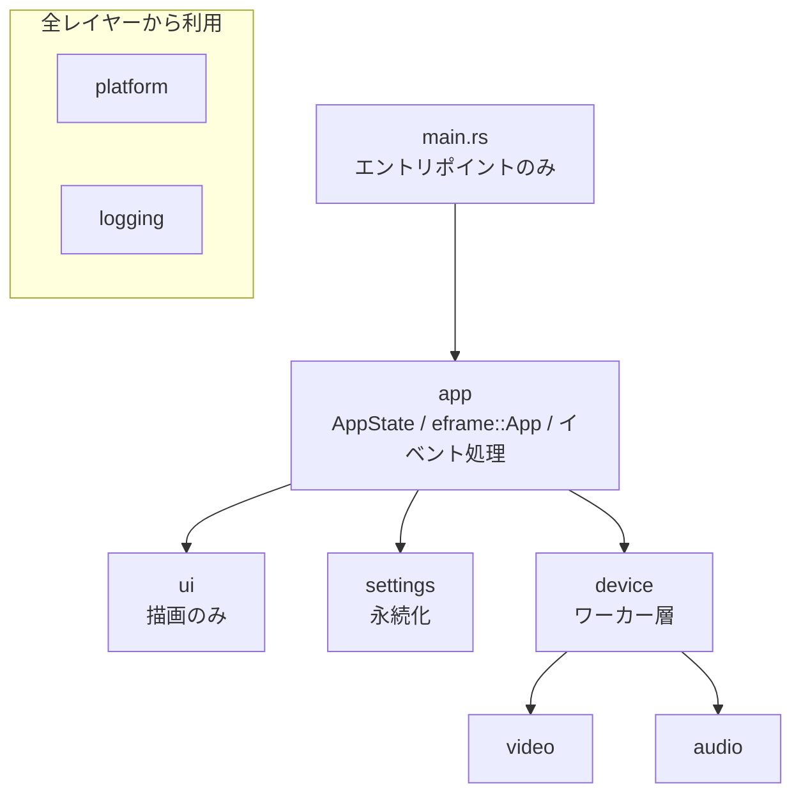
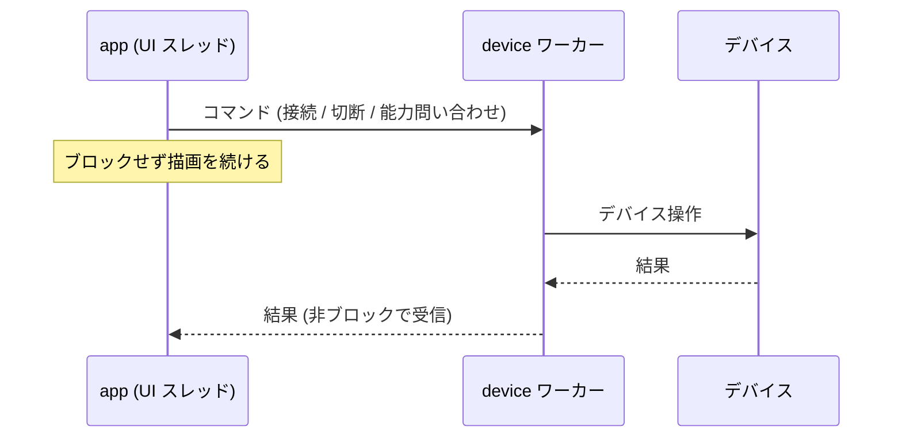
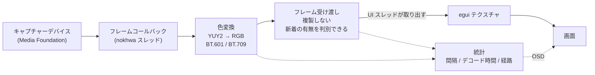
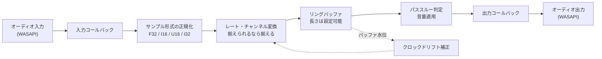

# アーキテクチャ

このドキュメントは**目指す構造**を定義する。現在のコードはまだここに到達していない。

- 差分は「現状との差分」節にまとめ、すべて Asana のリファクタリングタスクに対応させている
- 実装を変更するときは、この構造へ近づく方向を選ぶ
- 現在のコードの具体的な注意点は `CLAUDE.md`、ビルド手順は `docs/BUILD.md` を参照

## 設計の前提

判断に迷ったとき、この順序で優先する。

1. **低遅延** — キャプチャーボードの映像を見ながら操作する用途なので、遅延は機能の中核。遅延を増やす変更は、それに見合う理由が要る
2. **単体で動く** — 外部ランタイムやインストーラを必要としない単一バイナリを保つ
3. **壊れても原因が分かる** — デバイス依存の不具合が避けられない以上、失敗したときに何が起きたか追える状態を保つ
4. **画質** — 1 と衝突しない範囲で優先する

Windows 10/11 専用であることは前提として受け入れる。移植性のための抽象化は行わない。

## レイヤー構成



依存は上から下への一方向のみ。`ui` が `video` を直接呼ぶような横断は禁止する。

| レイヤー | 責務 | 持たないもの |
|---|---|---|
| `main` | ウィンドウ生成と `app` の起動 | ロジック |
| `app` | アプリ状態、フレームごとの調停、イベントの処理 | 描画の詳細、デバイス API |
| `ui` | 描画と入力の受け取り | 状態、副作用 |
| `device` | デバイス操作をワーカースレッドへ隔離し、チャネルで橋渡しする | UI の知識 |
| `video` / `audio` | デバイス固有の処理 | アプリ状態の知識 |
| `settings` | 設定の型と永続化 | 実行時状態 |
| `platform` | Windows 固有処理（フォント、アイコン、モニタ情報） | 汎用ロジック |
| `logging` | ログの初期化と出力先 | — |

## 状態管理

### 単一の所有者

アプリの状態は `AppState` 一つが所有する。**ファイルスコープの `static` に状態を置かない。** `static mut` は使わない。

設定ダイアログやホットキー入力ダイアログのような一時的な UI 状態も、`AppState` の下にぶら下げる。ダイアログを閉じたときに状態が残る、といった不整合を構造で防ぐ。

### UI は状態を持たない

`ui` の各関数は、描画に必要なデータを借りて受け取り、**発生したイベントを戻り値で返す**。`ui` 側から設定を書き換えたりデバイスを操作したりしない。

```rust
// 概念。実際のシグネチャは実装時に決める
fn show_settings_dialog(ctx: &Context, state: &SettingsDialogState) -> Vec<SettingsEvent>;
```

状態を変えるのは `app` だけ、という一点を守る。これによって「設定ダイアログが共有設定を直接書き換えていて、別経路の保存に巻き込まれる」類の問題が構造的に起きなくなる。

### 変更はイベント駆動

設定の再適用を定期ポーリングで行わない。変更イベントが発生したときだけ適用する。

「一定間隔で状態を突き合わせる」処理は、突き合わせ対象が増えるほど無駄が増え、何が引き金で何が起きたか追えなくなる。

## 並行性

### UI スレッドをブロックしない

`update()` の中で以下を行わない。

- デバイスを開く、閉じる、列挙する
- デバイス能力を問い合わせる
- ファイルの読み書き
- 画像のエンコード

これらはすべて `device` レイヤーのワーカースレッドか、使い捨てのスレッドへ逃がす。UI スレッドは結果をチャネルから受け取るだけにする。

### ロックではなくチャネル

デバイスの状態を `Arc<Mutex<..>>` で UI から直接触る形をやめ、**コマンドと結果をチャネルでやり取りする**形にする。



こうすると、複数のロックをネストして取る場面そのものが無くなり、ロック順序を気にする必要がなくなる。

例外として、映像フレームの受け渡しだけは遅延に直結するため、ロックまたはロックフリー構造で最短経路を保つ。

## 映像パイプライン



### 要求どおりのフォーマットで開く

デバイス能力を問い合わせて得た組み合わせ（フォーマット × 解像度 × fps）の中からユーザーが選び、**選んだとおりに開く**。YUY2 へ暗黙に差し替えない。

要求が通らなかった場合はフォールバックしてよいが、その事実をログに残し、UI にも反映する。ユーザーが選んだ設定と実際に動いている設定が食い違ったまま黙っている状態を作らない。

**ログに残す側は実装済み。** `video::VideoCapture::start_capture` が、要求した組み合わせ（`debug`）、フォーマットを YUY2 へ差し替えたこと（`warn`）、実際に開けた解像度とピクセルフォーマット（`info`）を出す。UI への反映は未実装。

デバイス能力は起動時と接続時にバックグラウンドで取得し、キャッシュする。設定画面を開いた時点で選択肢が揃っている状態にする。

**起動時の先読みとバックグラウンド取得は実装済み。** 取得状態は `ui::CapabilityCache` が `Pending` / `Ready` / `Failed` で持ち、取得そのものは要求ごとに spawn した使い捨てスレッドが行う。結果は mpsc チャネルで UI スレッドへ返す。デバイスへ接続し直したときの取り直しは未対応。

### 色変換

色空間は決め打ちにせず、解像度から判断する。幅 1280 または高さ 720 以上を HD とみなして BT.709、それ未満は BT.601 を使う。キャプチャーボードは入力信号の色空間を通知してこないため、解像度から推定するしかない。係数は `ColorMatrix` の表として持ち、変換関数は表を受け取る。設定で上書きできるようにしてもよい（未実装）。

高速パス（自前の整数演算）と汎用パス（デコーダ任せ）の使い分けは維持する。ただしどちらを通ったかは統計として観測できるようにする。現状は**最初の 1 枚がどちらを通ったか**と、高速パスを外れたことが `info` / `warn` でログに残るだけで、画面からは読めない。

**変換先のバッファを毎フレーム確保しない。** 1080p なら 1 フレームあたり約 6 MB の確保・ゼロクリア・解放が毎秒 60 回繰り返されるため、取り出し側が手放したフレームの `Vec` を回収して使い回す。使い回す以上、変換しなかった領域には前フレームの画素が残る。幅が奇数の場合や入力が足りない場合は、その領域を 0 で埋めてから渡す。

### フレームの受け渡し

**フレームバッファを毎フレーム複製しない。** 所有権の移動、`Arc` の共有、またはバッファプールの再利用のいずれかで、1080p で毎秒数百 MB の複製が発生しない形にする。

取り出し側は「新しいフレームが来たか」を判別できなければならない。前回のフレームを黙って返す設計をやめる。これができると以下が自然に実装できる。

- 一定時間フレームが来ないことを検出して「映像信号がありません」を出す
- デバイスの切断を検出して再接続を試みる
- 映像が来ていないときに再描画の頻度を落とす

### 統計の公開

フレーム間隔、デコード所要時間、高速パスの使用率、アンダーラン回数を収集し、**読み出す口を用意する**。収集だけして誰も読まない状態にしない。

**フレームが届いているかどうかだけは、ログから判別できる。** 1 枚目の到着を `info`、2 枚目以降を `trace` で残してある。毎フレーム `info` を出すとディスクへの書き込みが毎秒 60 回になるため、初回だけ出す判定を `FirstTimeOnly` に閉じ込めている。

これらはパフォーマンス改善の効果測定にそのまま使えるため、最適化作業より先に整える。

## 音声パイプライン



映像とは同期しない。素通しの遅延を最小にすることを優先し、リップシンクは保証しない。

### 設定は実際に効かせる

サンプルレート、チャンネル数、パススルーの有効・無効、バッファ長。**UI に出ている項目はすべて実際の動作に反映される。** 反映できない項目は UI に出さない。

デバイスが対応する組み合わせを列挙し、そこから選ばせる。映像側と同じ方針を取る。

### 入出力の差を吸収する

入力と出力でサンプルレートやチャンネル数が異なる場合に、リサンプリングとチャンネルマッピングを行う。両者を揃えられるなら揃えることを優先し、揃えられない場合のみ変換する。

長時間再生でのクロックドリフトは、バッファ水位に応じた微調整で吸収する。

### サンプルフォーマット

F32 / I16 / U16 / I32 を明示的に分岐する。未対応のフォーマットに当たった場合は、何が未対応だったかが分かるエラーを返す。

### バッファ長

遅延とアンダーラン耐性のトレードオフは環境によって最適値が違うため、ユーザーが調整できるようにする。既定値は低遅延側に置く。

## 設定

### 壊さない

設定構造体には `#[serde(default)]` を付け、**項目を追加しても既存の設定ファイルが読めることを保証する**。

読み込みに失敗した場合は、失敗した事実と理由をログに残し、壊れたファイルを退避してから既定値で起動する。黙って全項目を初期化しない。

### 書きすぎない

ウィンドウ操作や音量変更のたびにディスクへ書かない。変更を記録し、一定時間まとまってから書く。終了時には必ず書く。

### 適用の境界を明確にする

設定ダイアログはドラフトを編集し、「OK」または「適用」でのみ実行中の状態へ反映し、永続化する。「キャンセル」はドラフトを破棄するだけで済む形にする。

ドラフトと実設定を分けることで、ダイアログを閉じる経路（OK / キャンセル / ウィンドウの × / Esc）が増えても破綻しない。

ボタンの意味は次のとおり。実装は `ui::SettingsDialogState::transition_for` に 1 箇所だけ置き、呼び出し側はその結果に従う。

| 操作 | 実行中の設定へ反映 | ファイルへ保存 | 閉じる |
|---|---|---|---|
| 適用 | する | する | しない |
| OK | する | する | する |
| キャンセル | しない | しない | する |
| ×（タイトルバー） | しない | しない | する（キャンセルと同じ） |

**「適用」と「OK」の違いは閉じるかどうかだけにする。** 保存の有無で分けると、適用した値が「ウィンドウ操作などをきっかけにいずれ保存される」という曖昧な状態になり、再起動で残るかどうかが操作順に左右される。Windows のプロパティシートと同じ意味に揃えたほうが、説明も実装も単純になる。

**キャンセルは「適用」で反映済みの内容を戻さない。** 戻すには反映前の状態をもう 1 つ抱える必要があり、デバイスの開き直しも 2 度走る。「適用」は確定操作として扱い、取り消しの対象は未反映の編集だけに限る。

## エラーとログ

### エラー型

`Result<_, String>` をやめ、モジュールごとにエラー型を定義する。呼び出し側が種別で分岐できる状態にする。

これができると、たとえば「デバイスが見つからない」ならリトライせずユーザーへ通知、「一時的にビジー」ならリトライ、といった判断が書けるようになる。

表示用の文字列は UI 層で組み立てる。エラー型の中に日本語のメッセージを埋め込まない。

### ログ

`log` クレートのファサードを使い、出力先はファイルとする。`#![windows_subsystem = "windows"]` のためコンソールが存在せず、標準出力へ書いても誰にも届かない。

- 出力先は `%AppData%\capturecard_viewer\logs\`
- ローテーションを行い、際限なく増やさない
- レベルを設定または環境変数で切り替えられる
- 不具合報告時にユーザーが添付できる場所に置く

`println!` / `eprintln!` は使わない。`Cargo.toml` の `[lints.clippy]` で `print_stdout` / `print_stderr` を `warn` にしてあり、CI の `-D warnings` で混入を止めている。

**ここは `src/logging.rs` として実装済み。** ローテーションは「1 回の起動 = 1 ファイル」で、起動時に新しいものから 10 個だけ残す。レベルは環境変数 `CAPTURECARD_VIEWER_LOG` で切り替える。設定ファイルに持たせていないのは、ログを見るのが不具合調査時に限られるため。

ロガーの実装は外部クレート（`simplelog` など）を使わず `log::Log` を直接実装している。必要なのが「ファイルへ 1 行書く」だけで、時刻の整形は既に依存にある `chrono` で足りるため。`panic = "abort"` により終了時のフラッシュが走らないので、1 行ごとにフラッシュして落ちる直前のログを残す。

### ユーザーへの通知

デバイス接続の失敗、ホットキー登録の失敗、スクリーンショットの保存失敗は、UI に表示する。ログにだけ書いて画面上は無反応、という状態を作らない。

## テスト可能性

`.claude/skills/testing-conventions/SKILL.md` の方針を構造の側から支える。

- **純粋関数を自由関数として切り出す。** 色変換、ホットキーのパース、保存パスの決定、表示サイズの計算は、アプリ状態に依存させない
- **デバイス層を trait で抽象化する。** `video` と `audio` の入口を trait にしておくと、モックを差し込んで `app` のロジックを実機なしでテストできる
- **時刻に依存する処理は時刻を注入する。** デバウンスやタイムアウトを実時間の経過なしにテストできる形にする

## 現状との差分

以下は現在のコードがこの構造に到達していない点。すべて Asana のバックログに登録済み。

| 目指す姿 | 現状 | 対応するタスク |
|---|---|---|
| レイヤー分離 | `main.rs` にアプリ状態・UI・デバイス制御が同居 | main.rs のモジュール分割 |
| UI は状態を持たない | `ui.rs` から `static` / `static mut` は消え、タブ選択・デバイス能力キャッシュ・ホットキー入力の待機状態は `CaptureCardViewer` が持つ `SettingsDialogState` にある。ダイアログの開閉フラグと確定済みのホットキーは `CaptureCardViewer` が直接持つ。ホットキー入力ダイアログはまだ `&mut` で受けた値を直接書き換える | UI 層をイベント返却型にする |
| イベント駆動 | 2 秒ごとに設定を再適用するポーリング | apply_settings の 2 秒ごとの再登録 |
| チャネルでの隔離 | UI から `Arc<Mutex<..>>` 越しにデバイスを直接操作 | デバイスアクセスをワーカースレッド + チャネルにする |
| UI をブロックしない | デバイス能力の取得は別スレッドへ移した。画像エンコードは UI スレッド上のまま | JPEG エンコードの別スレッド化 |
| 要求どおりに開く | MJPEG / RGB24 を選んでも YUYV に差し替わる（差し替えたことは `warn` でログに残る） | MJPEG/RGB24 が YUYV で開かれる不具合 |
| 色空間の判断 | 解像度から BT.601 / BT.709 を選ぶ。設定での上書きは未対応 | 色空間を解像度に応じて切り替える |
| 新フレームの判別 | 世代番号で新着は判別できるが、無信号・切断の検出には使っていない | デバイス切断検出と自動再接続 |
| 統計の公開 | 収集しているが読み出し口がない（初回フレームの解像度・経路・変換時間だけログに出る） | FPS / 遅延 / デコード時間の OSD 表示 |
| 音声設定を効かせる | サンプルレート・チャンネル数は反映されるが、UI の選択肢をデバイスの能力から生成していない | オーディオの選択肢をデバイス能力から生成する |
| 入出力差の吸収 | リサンプリングなし | 入出力でレート・チャンネルが異なると音が崩れる |
| バッファ長の調整 | 50ms 固定 | 音声バッファの調整 UI |
| エラー型 | すべて `Result<_, String>` | エラー型を整理する |
| ユーザー通知 | 接続失敗が画面に出ない | エラー通知 UI |
| trait による抽象化 | デバイス型を直接利用 | デバイス層を trait で抽象化する |

バックログはこちら。

https://app.asana.com/1/1218412078016612/project/1218457296782693/list

**各タスクの `file:line` は登録時点のスナップショットなので、着手前に実コードで裏を取ること。**
