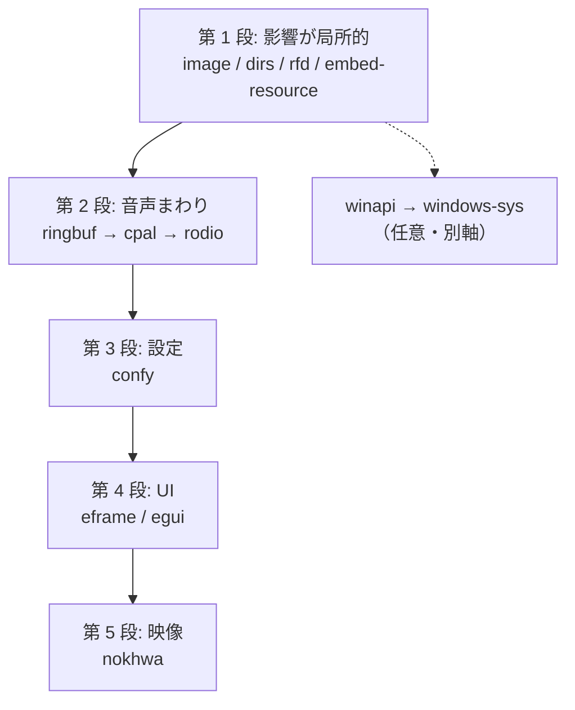

# 依存クレート

現在の依存と、更新に向けた調査結果をまとめる。

**バージョン情報は 2026-09-14 時点で crates.io を参照したもの。** 参照するときは日付を確認し、必要なら取り直すこと。

## 方針

判断の土台は `docs/ARCHITECTURE.md` の設計の前提。

> 低遅延 > 単体で動く > 原因が追える > 画質

**依存を採用するかどうかはここで決める。** 遅延を増やす、外部ランタイムを要求する、原因の追跡を難しくする依存は、新しくても採用しない。

以下はそのうえで、**採用した依存をどの版で使うか**の方針。

### 最新版を使う

**各クレートは最新版を使うことを基準とする。**

- 新しく依存を追加するときは、その時点の最新版を指定する
- 既存の依存が古くなっている場合は、更新タスクを起票して計画的に上げる。放置を既定の状態にしない
- **据え置く場合は、その理由をこのファイルに書く。** 理由が書かれていない限り、最新版へ上げてよい

現在 `Cargo.toml` に並んでいる古い版は、**意図的な選択ではなく単に更新が追いついていないだけ。** 「この版に留める理由がある」と読み取らないこと。

### 更新の進め方

最新版を基準とはするが、一度にまとめて上げるという意味ではない。

- **メジャー更新は単独の PR にする。** 特に egui は破壊的変更が広範囲に及ぶ
- 0.x のクレートはマイナー更新も破壊的変更なので、同様に扱う
- 実機確認が必要な範囲（映像・音声）に触れる更新は、確認できるタイミングで行う

### その他

- **依存は増やさない。** 標準ライブラリで書ける処理のために依存を足さない。追加するときは最新版を指定する
- `Cargo.lock` をコミットして、ビルドの再現性を確保する

0.x のクレートは**マイナー更新が破壊的変更**である点に注意する。次節の表の「差」はその前提で読む。

## 現状と最新

| クレート | 現在 | 最新 | 差 | 用途 |
|---|---|---|---|---|
| `eframe` | 0.26 | 0.36.2 | マイナー 10 | ウィンドウとアプリの骨組み |
| `egui` | 0.26 | 0.36.2 | マイナー 10 | UI |
| `nokhwa` | 0.10 | 0.10.11 | パッチのみ | 映像キャプチャ |
| `cpal` | 0.15 | 0.18.2 | マイナー 3 | 音声入出力 |
| `confy` | 0.6 | 2.0.0 | メジャー | 設定の永続化 |
| `global-hotkey` | 0.4 | 0.8.0 | マイナー 4 | グローバルホットキー |
| `image` | 0.24 | 0.25.10 | マイナー 1 | スクリーンショットの保存 |
| `rodio` | 0.17 | 0.22.2 | マイナー 5 | 効果音の再生 |
| `dirs` | 5.0 | 7.0.0 | メジャー 2 | デスクトップ等のパス取得 |
| `rfd` | 0.11 | 0.17.2 | マイナー 6 | ファイル選択ダイアログ |
| `ringbuf` | 0.3 | 0.5.2 | マイナー 2 | 音声のリングバッファ |
| `embed-resource` | 2.4 | 3.0.11 | メジャー 1 | アイコンとバージョン情報の埋め込み |
| `serde` | 1.0 | 1.x | 追随 | 設定のシリアライズ |
| `chrono` | 0.4 | 0.4.x | 追随 | スクリーンショットのタイムスタンプ |
| `winapi` | 0.3 | 0.3.x | 後述 | Windows API |
| `tempfile`（dev） | 3.27 | 3.27.x | 追随 | テストで一時ディレクトリに設定ファイルを書く |
| `toml`（dev） | 1.1 | 1.1.x | 追随 | テストで設定の TOML を直接組み立てて読ませる |

## 更新の順序

依存関係と影響範囲から、以下の順で進めるのが安全。



`Cargo.lock` はコミット済みなので、更新の前後で何が変わったかは `Cargo.lock` の差分で追える。**更新の PR には `Cargo.lock` の差分を必ず含めること。**

### 第 1 段 — 影響が局所的なもの

| クレート | 見るべき点 |
|---|---|
| `image` 0.24 → 0.25 | エンコーダ API が変わっている。スクリーンショット保存のみに影響。**JPEG 品質の指定と PNG 対応のバックログと同時にやると二度手間にならない** |
| `dirs` 5 → 7 | `desktop_dir()` のみ使用。関数名が変わっていなければ影響は小さい |
| `rfd` 0.11 → 0.17 | フォルダ選択とファイル選択のみ使用。ダイアログの API |
| `embed-resource` 2.4 → 3.0 | `build.rs` のみ。`compile()` のシグネチャを確認する |

いずれも使用箇所が少ないため、まとめて 1 つの PR にしてよい。

### 第 2 段 — 音声まわり

`ringbuf` → `cpal` → `rodio` の順。

- `ringbuf` 0.3 → 0.5 は `Producer` / `Consumer` の型と分割の API が変わっている。`src/audio.rs` の中心部分に触れる
- `cpal` 0.15 → 0.18 はストリーム構築とサンプル型の扱いに影響しうる
- `rodio` 0.17 → 0.22 は `OutputStream` と `Sink` の API。効果音再生のみに影響

**音声の既知の不具合（パススルーが効かない、レート設定が無視される、入出力差でピッチがずれる）を直す作業と重なる。** 更新を先にやってから修正に入るほうが、二度書き直さずに済む。

### 第 3 段 — 設定

`confy` 0.6 → 2.0 はメジャー更新。設定ファイルの配置場所や読み書きの API が変わる可能性がある。

**既存ユーザーの設定ファイルを読めなくすると実害が出る。** 更新する場合は、旧バージョンが書いたファイルを読めることを必ず確認する。`#[serde(default)]` の対応を先に済ませておくこと。

更新の必要性が薄いと判断するなら、据え置きも選択肢。

### 第 4 段 — UI

`eframe` / `egui` 0.26 → 0.36 が最大の山。10 回のマイナー更新をまたぐため、破壊的変更が広範囲に及ぶ。

影響が想定される箇所。

- `ViewportCommand` と `ViewportBuilder`（フルスクリーン、最前面、位置とサイズ）
- `ComboBox` と `Frame::none()`
- `TextureOptions` と `ColorImage`
- `FontDefinitions` の設定方法
- `Area` / `Window` の API

**必ず単独の PR にする。** 他の変更と混ぜるとレビューも切り分けも不可能になる。

段階的に上げるか一気に上げるかは、実際に着手して破壊的変更の量を見てから判断する。egui は各リリースに移行ガイドが付いていることが多いので、まずそれを集めるところから始める。

#### 更新すると使えるようになるもの

`egui_kittest`（現在 0.36.2、egui とバージョンが連動）が使えるようになる。AccessKit を利用した egui 向けのテストハーネスで、**ウィジェット単位のテストを自動化できる**。

`.claude/skills/testing-conventions/SKILL.md` で「要調査」としていた項目はこれに該当する。ただし本アプリの映像表示部分は `ui.painter().image()` による直接描画でアクセシビリティツリーに現れないため、**テストできるのは設定ダイアログやメニューなどのウィジェット部分に限られる**。映像・音声の検証には使えない。

この点を踏まえると、UI 更新の動機としては副次的なもの。

### 第 5 段 — 映像

`nokhwa` 0.10 → 0.10.11 はパッチ更新のみ。API の互換性は保たれているはず。

ただし **Media Foundation まわりの挙動が変わる可能性があるため、実機確認が必須。** 現在「MJPEG / RGB24 を選んでも YUYV に差し替わる」という回避策が入っているが、これが必要だった理由は記録されていない。更新後に改めて検証する価値がある。

### 別軸 — `winapi` の扱い

`winapi` 0.3 は長く更新が止まっており、Microsoft 公式の `windows-sys` / `windows` クレートへ移行するのが現在の主流。

現状 `winapi` は `Cargo.toml` に `winuser` と `windef` の feature 付きで宣言されているが、**`src/` 内で実際に使われている形跡がない。** 移行以前に、まず本当に必要かを確認すること。不要なら削除するのが最も安い。

必要になる場面としては、バックログの「復元したウィンドウ位置が画面外になる場合のフォールバック」でモニタ情報を取得する際が挙げられる。そのタスクに着手する時点で、`windows-sys` を採用するか判断する。

## 調査の再実行

```bash
cargo outdated
```

`cargo-outdated` が入っていれば一覧で確認できる。入っていない場合は crates.io の API を直接引く。

```bash
curl -s https://crates.io/api/v1/crates/eframe | jq -r .crate.max_stable_version
```

## ライセンス

`THIRD-PARTY-LICENSES.txt` は手作業で維持されている。依存を更新すると内容が古くなる。

`cargo-about` による自動生成と `cargo-deny` によるライセンスポリシーの検査がバックログにある。依存更新に着手する前に整えておくと、更新のたびに手で直す必要がなくなる。
