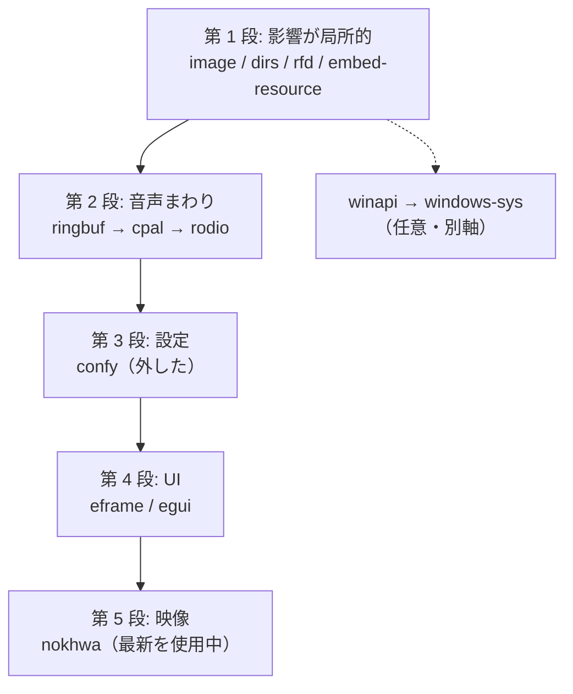

# 依存クレート

現在の依存と、更新に向けた調査結果をまとめる。

**バージョン情報は 2026-10-01 時点のもの。** 「Cargo.lock」の列は `Cargo.lock` に載っている版、「最新」の列は同じ日に `cargo search` で crates.io を引いた版（第 1 段 #301、第 2 段 #299、第 3 段 #302 の後）。`eframe` / `egui` の行だけは第 4 段 #300 で取り直した 2026-10-03 時点のもの。参照するときは日付を確認し、必要なら取り直すこと（下の「調査の再実行」）。

## 方針

判断の土台は `docs/ARCHITECTURE.md` の設計の前提。

> 低遅延 > 単体で動く > 原因が追える > 画質

**依存を採用するかどうかはここで決める。** 遅延を増やす、外部ランタイムを要求する、原因の追跡を難しくする依存は、新しくても採用しない。

以下はそのうえで、**採用した依存をどの版で使うか**の方針。

### 最新版を使う

**各クレートは最新版を使うことを基準とする。**

- 新しく依存を追加するときは、その時点の最新版を指定する
- 既存の依存が古くなっている場合は、更新タスクを起票して計画的に上げる。放置を既定の状態にしない
- **据え置く場合は、その理由をこのファイルに書く。** 理由が書かれていない限り、最新版へ上げてよい

現在 `Cargo.toml` に並んでいる古い版は、**意図的な選択ではなく単に更新が追いついていないだけ。** 「この版に留める理由がある」と読み取らないこと。

### 更新の進め方

最新版を基準とはするが、一度にまとめて上げるという意味ではない。

- **メジャー更新は単独の PR にする。** 特に egui は破壊的変更が広範囲に及ぶ
- 0.x のクレートはマイナー更新も破壊的変更なので、同様に扱う
- 実機確認が必要な範囲（映像・音声）に触れる更新は、確認できるタイミングで行う

### Dependabot の対象

**自動更新に任せるのは GitHub Actions だけ**（`.github/dependabot.yml`）。第三者の Action はコミット SHA で固定していて手では追いにくいため。

**cargo は対象にしない。** 0.x のクレートはマイナー更新も破壊的変更で、特に egui 系は単独の PR で破壊的変更を追う方針のため、自動 PR が大量に並ぶとノイズになる。クレートの更新は後述の「更新の順序」に従って人が起票する。

### その他

- **依存は増やさない。** 標準ライブラリで書ける処理のために依存を足さない。追加するときは最新版を指定する
- `Cargo.lock` をコミットして、ビルドの再現性を確保する

0.x のクレートは**マイナー更新が破壊的変更**である点に注意する。次節の表の「差」はその前提で読む。

## 現状と最新

| クレート | 指定（`Cargo.toml`） | `Cargo.lock` | 最新 | 差 | 用途 |
|---|---|---|---|---|---|
| `eframe` | 0.36 | 0.36.2 | 0.36.2 | 追随 | ウィンドウとアプリの骨組み（第 4 段、#300）。描画は glow（下の「第 4 段 — UI」） |
| `egui` | 0.36 | 0.36.2 | 0.36.2 | 追随 | UI（同上） |
| `nokhwa` | 0.10 | 0.10.11 | 0.10.11 | 追随 | 映像キャプチャ |
| `cpal` | 0.18 | 0.18.2 | 0.18.2 | 追随 | 音声入出力。`realtime` フィーチャで音声スレッドの優先度を上げる（`docs/design/audio.md` の「cpal 0.18 で変わったこと」）。`rodio` 経由の 0.17.3 も残る（下の「`cpal` 0.17 は `rodio` 経由で残る」） |
| `toml` | 1.1 | 1.1.6+spec-1.1.0 | 1.1.6+spec-1.1.0 | 追随 | 設定ファイルの読み書き。`confy` 0.6 の代わり（第 3 段、#302） |
| `log` | 0.4.34 | 0.4.34 | 0.4.34 | 追随 | ログのファサード。出力先の実装は `src/logging.rs` |
| `image` | 0.25 | 0.25.10 | 0.25.10 | 追随 | スクリーンショットの保存、埋め込みアイコンの読み込み、MJPEG の展開。`eframe` もこの 0.25 を使う |
| `rodio` | 0.22 | 0.22.2 | 0.22.2 | 追随 | 効果音の再生。フィーチャは `playback` と使う形式（MP3 / WAV / Vorbis / FLAC）だけ |
| `dirs` | 7.0 | 7.0.0 | 7.0.0 | 追随 | デスクトップ等のパス取得、設定ファイルの置き場所（`%AppData%`） |
| `rfd` | 0.17 | 0.17.2 | 0.17.2 | 追随 | ファイル選択ダイアログ |
| `ringbuf` | 0.5 | 0.5.2 | 0.5.2 | 追随 | 音声のリングバッファ、録画の差し込み口（`VideoTap` / `AudioTap`） |
| `arboard` | 3.6 | 3.6.1 | 3.6.1 | 追随 | スクリーンショットのクリップボードへのコピー |
| `embed-resource`（build） | 3.0 | 3.0.11 | 3.0.11 | 追随 | アイコンとバージョン情報の埋め込み |
| `serde` | 1.0 | 1.0.229 | 1.0.229 | 追随 | 設定のシリアライズ |
| `chrono` | 0.4 | 0.4.45 | 0.4.45 | 追随 | 日時の書式（スクリーンショットと録画のファイル名、ログ） |
| `winapi` | 0.3 | 0.3.9 | 0.3.9 | 後述 | Windows API（モニタの作業領域、キーボードフック） |
| `windows` | 0.62 | 0.62.2 | 0.62.2 | 追随 | DirectShow のバックエンド（`src/video/directshow/`）、録画の Media Foundation（`src/recording/`）、COM の初期化（`src/com.rs`） |
| `windows-core` | 0.62 | 0.62.2 | 0.100.0 | 後述 | 同上。`#[implement]` が生成するコードの参照先 |
| `ureq` | 3.4 | 3.4.2 | 3.4.2 | 追随 | 更新の確認で GitHub の Release API へ問い合わせる（`src/update/`） |
| `serde_json` | 1.0 | 1.0.151 | 1.0.151 | 追随 | 同上。API の応答（JSON）を読む |
| `semver` | 1.0 | 1.0.28 | 1.0.28 | 追随 | 同上。タグと実行中の版を比べる |
| `sha2` | 0.11 | 0.11.0 | 0.11.0 | 追随 | 更新の適用で、ダウンロードした exe を `SHA256SUMS.txt` と照合する（`src/update/apply.rs`） |
| `tempfile`（dev） | 3.27 | 3.27.0 | 3.27.0 | 追随 | テストで一時ディレクトリに設定ファイルを書く |

### `arboard` は egui-winit が既に使っている

`arboard` は `eframe` → `egui-winit` が**元から依存しているクレート**で、
スクリーンショットのクリップボード対応（Issue #116）ではそれを直接の依存へ
引き上げ、`image-data` フィーチャを有効にしただけ。クレートそのものは増えていない。

**Windows では `image-data` が `image` 0.25 を要求する。** 本体の `image` は第 1 段（#301）で
0.25 へ上げたので、本体・`arboard`・`nokhwa` は同じ 0.25 を使う。

`eframe` 0.26 が自分の依存として持っていた `image` 0.24（と `png` 0.17 の重複）は、
第 4 段（#300）で `eframe` を 0.36 へ上げて消えた。いまは `eframe` も同じ 0.25 を使う。

本体の `image` は `default-features = false` にして、使う形式（`png` / `jpeg` / `ico`）だけを
足している。既定のフィーチャは AVIF のエンコーダ（`rav1e`）や EXR / TIFF / GIF まで引き込むが、
スクリーンショットの保存（PNG / JPEG）、埋め込みアイコンの読み込み（ICO）、DirectShow の MJPEG の
展開のどれにも要らない。なお 0.25 の JPEG のデコーダは `jpeg-decoder` から `zune-jpeg` に替わっている。

`default-features = false` にしてあるのは、既定に含まれる Linux 向けの
`wayland-data-control` を持ち込まないため。

### `ureq` は native-tls で使う（2026-09-27）

更新の確認（Issue #240）のために入れた。**TLS は Windows の schannel（`native-tls`）で、
既定の rustls と ring は入れない。** 証明書は `RootCerts::PlatformVerifier` で OS の証明書ストアを使う。
社内のプロキシのように OS 側で信頼している証明書にも従えるようにするため。

- フィーチャは `native-tls` にする。`native-tls-no-default` だけでは ureq が native-tls を
  無効とみなし、問い合わせの時点でパニックする（release ビルドは `panic = "abort"` なので
  アプリごと落ちる）
- `native-tls` は同梱のルート証明書 `webpki-root-certs`（CDLA-Permissive-2.0）を必ず引き込む。
  使わないが外せないので、`about.toml` の `accepted` に CDLA-Permissive-2.0 を足した。
  表示義務だけの寛容なデータライセンスで、MIT での配布と両立する
- 既定の `gzip` も切ってある。応答は 1 回きりの小さな JSON で、圧縮の恩恵が無い
- `semver` は他の依存が元から使っていたので、クレートは増えていない。`Cargo.lock` に
  増えたのは `ureq` / `ureq-proto` / `native-tls` / `schannel` / `serde_json` と、その下の
  `http` / `httparse` / `der` / `base64` など。`openssl` 系や `security-framework` も lock には
  載るが、Windows 以外のターゲット向けで、ビルドにも配布物にも入らない

### `sha2` は照合だけに使う（2026-09-27）

更新の適用（Issue #240 の第 3 段階）で、ダウンロードした exe の SHA-256 を計算するために入れた（MIT / Apache-2.0）。
`Cargo.lock` に増えたのは `sha2` と、その下の `digest` 0.11 / `block-buffer` / `crypto-common` /
`hybrid-array` / `const-oid` / `cpufeatures` 0.3。Windows の CNG（`BCryptHash`）でも計算できるが、
`windows` クレートのフィーチャを増やしてまで unsafe の呼び出しを書くほどの差は無いので、純 Rust の実装を使う。

## 更新の順序

依存関係と影響範囲から、以下の順で進めるのが安全。


```mermaid
flowchart TD
    A["第 1 段: 影響が局所的<br/>image / dirs / rfd / embed-resource"]
    B["第 2 段: 音声まわり<br/>ringbuf → cpal → rodio"]
    C["第 3 段: 設定<br/>confy（外した）"]
    D["第 4 段: UI<br/>eframe / egui"]
    E["第 5 段: 映像<br/>nokhwa（最新を使用中）"]
    F["winapi → windows-sys<br/>（任意・別軸）"]

    A --> B --> C --> D
    D --> E
    A -.-> F
```

`Cargo.lock` はコミット済みなので、更新の前後で何が変わったかは `Cargo.lock` の差分で追える。**更新の PR には `Cargo.lock` の差分を必ず含めること。**

### 第 1 段 — 影響が局所的なもの

**済み（#301、2026-10-01）。** 1 つの PR で、コミットはクレートごとに分けた。

| クレート | 状態 | 変えたこと |
|---|---|---|
| `image` 0.24 → 0.25 | 済み | `image::io::Reader` → `image::ImageReader`、エンコーダへ渡す色の型が `ExtendedColorType` に。スクリーンショットの保存（`write_with_encoder`）はそのまま使える。フィーチャを `png` / `jpeg` / `ico` に絞った。0.24 は `eframe` 0.26 経由で残っていたが、第 4 段（#300）で消えた |
| `dirs` 5 → 7 | 済み | コードの変更なし。使っているのは `desktop_dir()` / `video_dir()` / `home_dir()` だけで、Windows では既知フォルダを引くのは変わらない |
| `rfd` 0.11 → 0.17 | 済み | `set_file_name` が値を取るようになった。既定のフィーチャ（`xdg-portal` / `wayland`）は Linux 向けなので切った。0.11 が引き込んでいた gtk 系と `windows` 0.44 が `Cargo.lock` から消えた |
| `embed-resource` 2.4 → 3.0 | 済み | `compile()` が失敗しても結果を返すだけになったので、`manifest_required()` で失敗をビルドの失敗にした。アイコンとバージョン情報の無い exe を作らないため |

### 第 2 段 — 音声まわり

**済み（#299、2026-10-01）。** 1 つの PR で、`ringbuf` と `cpal` + `rodio` の 2 つのコミットに分けた。**`cpal` と `rodio` は別々のコミットにできない。** `rodio` 0.17 は `cpal` 0.15 に依存し、`cpal` 0.15 と 0.18 は Linux 向けの `alsa-sys` の `links` が衝突して同じ `Cargo.lock` に載らないため。

| クレート | 状態 | 変えたこと |
|---|---|---|
| `ringbuf` 0.3 → 0.5 | 済み | `Producer` / `Consumer` がトレイトになり、分割した片側の型は `HeapProd` / `HeapCons`。`free_len` → `vacant_len`、`len` → `occupied_len`、`push` → `try_push`、`pop` → `try_pop`。`try_push` は 0.3 の `push` と同じく 1 要素ごとに公開するので、フレーム単位の扱い（#307）はそのまま。RUSTSEC-2026-0293 が解消し、`.cargo/audit.toml` の ignore を外した |
| `cpal` 0.15 → 0.18 | 済み | `SampleRate` が `u32` の別名に、エラー型が `cpal::Error` に統一、`name()` → `description().name()`。WASAPI の出力がレート変換付きで開くようになった、ストリームが動いたままの通知（`Xrun` など）がエラーのコールバックへ届く、音声スレッドの優先度に `realtime` フィーチャが要る、の 3 点は振る舞いが変わる（`docs/design/audio.md` の「cpal 0.18 で変わったこと」） |
| `rodio` 0.17 → 0.22 | 済み | `OutputStream` / `Sink` → `MixerDeviceSink` / `Player`。出力を開くのは `DeviceSinkBuilder::open_default_sink`（0.17 の `try_default` と同じく他の出力へ倒す）。落とすときに標準エラーへ書く既定は `log_on_drop(false)` で切った。既定のフィーチャはマイクの録音や MP4 / AAC、ディザまで引き込むので切り、0.17 の既定と同じ形式だけを足した |

### `cpal` 0.17 は `rodio` 経由で残る

`rodio` の最新（0.22.2、2026-10-01 時点）は `cpal` 0.17 を使うので、**ビルドには `cpal` 0.17 と 0.18 が両方入る。** 本体（パススルー）が 0.18、効果音の再生だけが 0.17。別々のストリームなので干渉はしない。`windows` はどちらも 0.62 を使うので、重複は `cpal` 本体だけ。**`rodio` が `cpal` 0.18 に上がったら追随して解消する。**

`rodio` の `playback` を切って効果音も本体の `cpal` 0.18 で鳴らせば 1 つにできるが、デコードした音をデバイスの形へ変換して流す部分を自前で持つことになるので採らなかった。

### 第 3 段 — 設定

**判断済み（#302、2026-10-01）。`confy` は 2.0 へ上げず、依存から外した。** 設定ファイルは `toml` 1.x で直接読み書きし、置き場所は `dirs` で決める。

| 案 | 判断 | 理由 |
|---|---|---|
| `confy` 0.6 のまま据え置く | 採らない | 頼っていたのは読み込み（`load_path`）・一時ファイルへの書き込み（`store_path`）・既定の置き場所（`get_configuration_file_path`）の 3 つだけ。保存の置き換え（#317 / #361）は既に自前。このために `directories` / `dirs-sys` 0.4 と、`toml` 0.8 系（`toml_edit` / `winnow` 0.7 / `indexmap` など）を `toml` 1.x と二重に持っていた |
| `confy` 2.0 へ上げる | 採らない | Windows の置き場所は同じ `%AppData%\capturecard_viewer\config` のままだが、置き場所を `etcetera` で決めるようになり、`etcetera` / `lazy_static` / `thiserror` 2 / `toml` 0.9 系が増える。使う 3 つの関数は自前で書いても数行 |
| `confy` を外して `toml` + `std::fs` で読む | **採った** | `toml` 1.x は `embed-resource`（ビルド時）が既に使っていて、`THIRD-PARTY-LICENSES.txt` にも載っている。`dirs` も既に直接の依存。増えるクレートは無く、12 個（`confy` / `directories` / `dirs-sys` 0.4 / `toml` 0.8 / `toml_edit` 0.22 / `toml_datetime` 0.6 / `serde_spanned` 0.6 / `toml_write` / `winnow` 0.7 / `indexmap` / `hashbrown` 0.17 / `equivalent`）が消えた |

外すときに確かめたこと。

- **置き場所が変わらない。** confy 0.6 は `directories` の `ProjectDirs::from("rs", "", "capturecard_viewer").config_dir()` に `default-config.toml` を足していた。Windows ではこれが `<FOLDERID_RoamingAppData>\capturecard_viewer\config`。`dirs::config_dir()` も同じ `FOLDERID_RoamingAppData` を引くので、その下に `capturecard_viewer\config\default-config.toml` を組み立てる（`src/config_path.rs` の `default_config_file_in`）。`CAPTURECARD_VIEWER_CONFIG_DIR` の扱いは変えていない
- **1.2.x が書いた設定ファイルをそのまま読める。** テスト用の設定（`FULL_CONFIG` / `LEGACY_CONFIG`）と、プリセット・引用符を含む名前・日本語のパスを足した設定について、confy 0.6（`toml` 0.8）が書いたものを `toml` 1.x で読み、`toml` 1.x が書いたものを confy 0.6 で読んで、どちらも同じ値に戻ることを確かめた。**書き出す内容もバイト単位で同じだった**ので、新しい版が書いたファイルを古い版へ戻しても読める。BOM 付きの UTF-8 もどちらも読める
- confy 0.6 の `load_path` はファイルが無いと既定値で作っていた。いまは既定値を返すだけで、起動時の保存（`AppSettings::save`、フォルダも作る）が作る。起動の直後にファイルができるのは同じ
- 読めなかったときの理由は、confy では「Bad TOML data」だけだった。いまは `toml` の位置（行と列）と理由を 1 行にして返す（ログと、読み込みの失敗のトースト）

### 第 4 段 — UI

**済み（#300、2026-10-03）。** `eframe` / `egui` 0.26 → 0.36 を 1 つの PR で一気に上げた。途中の版を経由しても、どの版でもビルドが通るまで直す手間が増えるだけなので段階は踏んでいない。

| 変えたこと | 中身 |
|---|---|
| 描画のバックエンド | **glow（OpenGL）のまま。** 0.36 の `eframe` の既定は wgpu だが、wgpu / naga と DirectX 12・Vulkan のバックエンドまで引き込むわりに、映像 1 枚とダイアログの画面では得るものが無い。`default-features = false` にして `accesskit` / `default_fonts` / `glow` / `links` だけを足す。`wayland` / `x11` は Linux 向けなので切った。`links` は更新の通知と「その他」タブのリンクを開くのに要る（`webbrowser`） |
| `App` | `update(ctx)` → `ui(ui)`。1 フレームの処理はドキュメントが `update()` と呼んでいるとおり `CaptureCardViewer::update` に残し、`App::ui` から呼ぶ。最小化中だけ呼ばれる `App::logic` は実装しない（0.26 と同じく最小化中は UI スレッドで何も回さない） |
| パネル | `CentralPanel` / `Panel`（`TopBottomPanel` の後継）は `Context` ではなく `Ui` を受け取る。`Window` / `Area` は `Context` のまま |
| 名前の変更 | `Context::run` → `run_ui`、`screen_rect` → `content_rect`、`style` → `global_style`、`wants_keyboard_input` → `egui_wants_keyboard_input`、`Frame::none()` → `Frame::NONE`、`Rounding` → `CornerRadius`（`u8`）、`Margin` は `i8`、`ComboBox::from_id_source` → `from_id_salt`、`SelectableLabel` → `Button::selectable`、`Slider::clamp_to_range` → `clamping`、`close_menu` → `close`、`Area::new` は `Id` を取る、`FontData` は `Arc` で渡す、`TextureOptions` に `mipmap_mode` |
| `Sense` | 構造体から bitflags に。映像エリアはフォーカスを受けないよう `CLICK \| DRAG`（`FOCUSABLE` を立てない） |
| ホイールの音量 | `InputState::raw_scroll_delta` が無くなった。滑らかにした値は数フレームに分かれて届くので、`Event::MouseWheel` を数える（`app::audio_control` の `wheel_scroll_y`） |
| 右クリックメニューのサブメニュー | `ui.menu_button` は中の項目を押すと閉じるようになった（`PopupCloseBehavior::CloseOnClick`）。0.26 と同じく外を押したときだけ閉じる（`CloseOnClickOutside`） |
| 映像の上に重ねる表示 | `Ui::new` が `UiBuilder` を取り、切り抜きを `max_rect` にするようになった。0.26 と同じく画面全体に戻す |
| テスト | `run_ui` の `FullOutput` は、テクスチャの差分を残したまま落とすと `debug_assert` で止まる。描かないテストでは `drop_without_applying_deltas` で捨てる。生成直後の `Context` は 1 回目の終わりにウィンドウのテーマを送る（`ViewportCommand::SetTheme`）ので、何も要求していない状態まで 3 回回す |

ビルドに入るクレート（`x86_64-pc-windows-msvc`）の重複は、`image` 0.24 / `png` 0.17 / `raw-window-handle` 0.5 / `windows` 0.48 / `windows-sys` 0.48・0.59 / `thiserror` 1 / `syn` 1 が消え、`hashbrown` 0.16（`accesskit_windows` 経由）が増えた。`Cargo.lock` の全体は 554 → 493 クレート。`webbrowser` は 1.2 になり、RUSTSEC-2026-0257 の ignore を `.cargo/audit.toml` から外した。

テンキー（#266 で見送った分）は 0.36 でも `egui::Key` に別のキーが無い。`egui-winit` が `Numpad0` を `Num0` に、`NumpadAdd` を `Plus` に読み替えるので、区別して割り当てることはできないまま。

#### 更新して使えるようになったもの

`egui_kittest`（egui とバージョンが連動）が使えるようになった（#419 で `[dev-dependencies]` に入れた。書き方は `.claude/skills/testing-conventions/SKILL.md` の「ウィジェットのテスト」）。AccessKit を利用した egui 向けのテストハーネスで、**ウィジェット単位のテストを自動化できる**。

`.claude/skills/testing-conventions/SKILL.md` で「要調査」としていた項目はこれに該当する。ただし本アプリの映像表示部分は `ui.painter().image()` による直接描画でアクセシビリティツリーに現れないため、**テストできるのは設定ダイアログやメニューなどのウィジェット部分に限られる**。映像・音声の検証には使えない。

この点を踏まえると、UI 更新の動機としては副次的なもの。

### 第 5 段 — 映像

**上げるものは無い（2026-10-01 時点）。** `Cargo.toml` の指定は 0.10 のまま、`Cargo.lock` は既に crates.io の最新の 0.10.11 を使っている。以前ここに書いていた 0.10 → 0.10.11 のパッチ更新は済んでいる。

残っているのは更新ではなく検証。現在「MJPEG / RGB24 を選んでも YUYV に差し替わる」という回避策が入っているが、これが必要だった理由は記録されていない。0.10.11 の上で要るかどうかを実機で確かめる価値がある。次のマイナー（0.11）が出たときは、**Media Foundation まわりの挙動が変わる可能性があるため実機確認を必須にする。**

### `windows` / `windows-core` は nokhwa と同じ版にそろえる

DirectShow のバックエンド（#143）は、`winapi` に無い DirectShow のインターフェース（`IBaseFilter` / `IPin` / `IMemInputPin` / `ICaptureGraphBuilder2` / `IAMStreamConfig` など）と、自前のレンダラーフィルターを書くための `#[implement]` マクロが要るので `windows` を使う。**`nokhwa-bindings-windows` が `windows` 0.62 を既に使っているので、クレートは増えない**（増えるのは `Win32_Graphics_Gdi` / `Win32_System_Com_StructuredStorage` / `Win32_System_Ole` / `Win32_System_Variant` のフィーチャの分だけ）。`THIRD-PARTY-LICENSES.txt` も変わらない。

`windows-core` を別に書いているのは、`#[implement]` が展開するコードが `::windows_core` を直接参照するため。**`windows-core` は `windows` と同じ 0.62 に固定する。** crates.io の最新（0.100 系）へ上げると、`windows` 0.62 が使う `windows-core` 0.62 と別のクレートになり、`#[implement]` で書いた型が `windows` のインターフェースの trait を満たさなくなる。上げるときは `windows` と `nokhwa` の側がそろって上がるのを待つ。

### 別軸 — `winapi` の扱い

`winapi` 0.3 は長く更新が止まっており、Microsoft 公式の `windows-sys` / `windows` クレートへ移行するのが現在の主流。

`winapi` は 2 か所で使っている。

- `src/platform.rs` の `monitor_work_areas`。ウィンドウ位置の復元時に、保存された位置が画面内かを判定するためモニタの作業領域を列挙する用途（`EnumDisplayMonitors` / `GetMonitorInfoW`）
- `src/keyboard_hook.rs` の `imp` モジュール。ホットキーの押下を低レベルキーボードフックで観測する用途（`SetWindowsHookExW` / `CallNextHookEx` / `MsgWaitForMultipleObjects` / `PeekMessageW` / `PostThreadMessageW` / `GetAsyncKeyState` など）。global-hotkey を外したときに、既に直接の依存だったこのクレートへ寄せた（#202）

feature は `minwindef` / `winuser` / `windef` / `libloaderapi` / `processthreadsapi` / `winbase` / `winnls` の 7 つ。

使用箇所はどちらも Windows 専用の小さな関数群に閉じているので、`windows-sys` へ移す場合の影響は小さい。移行するなら、この 2 か所の中だけを書き換えれば済む。

## 調査の再実行

```bash
cargo outdated
```

`cargo-outdated` が入っていれば一覧で確認できる。入っていない場合は crates.io の API を直接引く。

```bash
curl -s https://crates.io/api/v1/crates/eframe | jq -r .crate.max_stable_version
```

## ライセンス

`THIRD-PARTY-LICENSES.txt` は `cargo-about` が `Cargo.lock` から生成する。**手で編集しない。**

### 再生成

依存を追加・更新したら、`Cargo.lock` の差分と同じコミットで生成し直す。

```bash
cargo install cargo-about --locked --version 0.9.2 --features cli
```

```bash
cargo about generate --locked about.hbs -o THIRD-PARTY-LICENSES.txt
```

- `--features cli` を付けないと実行ファイルが作られない。付け忘れると「バイナリが無い」という警告だけ出てインストールが済んだように見える
- 版を固定するのは、cargo-about の版が変わると出力も変わりうるため。CI も同じ版を入れる
- CI（`.github/workflows/ci.yml`）が同じ手順で生成して `git diff --exit-code` にかける。**再生成を忘れると CI が落ちる**

### 設定ファイル

| ファイル | 役割 |
|---|---|
| `about.toml` | 対象ターゲット、許可するライセンス、一覧から外す依存 |
| `about.hbs` | 出力の体裁（プレーンテキストのテンプレート） |

### ライセンスポリシー

`about.toml` の `accepted` に無いライセンスの依存が入ると**生成が失敗する**。GPL / AGPL / LGPL は意図的に載せていないので、コピーレフトの依存が混ざればここで気付ける。

**この仕組みがポリシー検査を兼ねているため、`cargo-deny` は導入していない。** 脆弱性情報（RustSec）は次の節の `cargo audit` で見る。取得元レジストリの制限まで欲しくなった時点で、別途検討する。

### 脆弱性情報（RustSec）の検査

`.github/workflows/audit.yml` が `cargo audit`（0.22.2 に固定）で `Cargo.lock` を RustSec の勧告データベースと突き合わせる。

- **回るとき:** `dev` / `main` への PR と push、週 1 回（月曜 09:00 JST）の定期実行、手動（`workflow_dispatch`）。勧告は依存を変えなくても後から増えるので定期実行を入れている
- **必須チェックではない。** ジョブ名「依存の脆弱性情報（RustSec）」はルールセットの必須チェック（`fmt / clippy / build / test`）に入れていないので、落ちても PR はマージできる。新しい勧告が出た瞬間に無関係な PR が全部止まるのを避けるため。ビルドしないので `ubuntu-latest` で回し、`ci.yml` の実行時間は増えない
- **落ちたら:** 脆弱性の勧告が増えている。該当クレートが `x86_64-pc-windows-msvc` のビルドに入るかを `cargo tree -i <crate> --target x86_64-pc-windows-msvc` で確かめ、入るなら Issue を起票して依存を上げる。解消まで待つ場合や Windows に入らない場合は `.cargo/audit.toml` の `ignore` に**理由と Issue 番号を添えて**載せる。解消したら行ごと消す
- **ターゲットで絞れない。** `cargo audit` は `Cargo.lock` 全体を見るため、配布物に入らないクレートも拾う。除外は `.cargo/audit.toml` の `ignore` で 1 件ずつ行う
- **unmaintained の警告では落ちない**（`cargo audit` の既定）。2026-10-03 時点で `paste`（`nokhwa` 経由で外せない）が出ている。egui 0.26 の経由で出ていた `derivative` / `instant` / `ttf-parser` は第 4 段（#300）で消えた

手元で回すときは次のとおり。

```bash
cargo install cargo-audit --locked --version 0.22.2
cargo audit
```

生成が落ちたときに `accepted` へ機械的に足さないこと。**単一バイナリを MIT で配布できるライセンスかどうかを判断してから足す。**

### 対象範囲

- ターゲットは `x86_64-pc-windows-msvc` のみ。他のプラットフォーム向けの依存は配布物に入らないため載せない
- dev-dependencies は配布物に入らないため対象外。build-dependencies は生成物がバイナリに入りうるため対象
- `capturecard_viewer` 自身は `Cargo.toml` の `publish = false` によって一覧から外れる

### 既知の制限 — Ubuntu フォントのライセンス

`epaint_default_fonts`（egui 0.26 までは `epaint` の中にあった）は既定フォントとして Ubuntu Light を exe に埋め込んでいる。Ubuntu Font Licence 1.0 は **Font Software の各コピーに著作権表示とライセンス本文を含めること**を条件にしているため、`THIRD-PARTY-LICENSES.txt` に両方を載せる必要がある。

- **本文は自動で出る。** egui 0.36 から crate のライセンスが SPDX License List の識別子 `Ubuntu-font-1.0` になり、cargo-about が本文を差し込む。`about.toml` の `accepted` も `LicenseRef-UFL-1.0` から `Ubuntu-font-1.0` に替えた
- **著作権表示（Copyright 2011 Canonical Ltd.）は crate のメタデータに無い。** そのため `about.hbs` の末尾に、この 1 行だけの付録を手で書いている。出典は `Ubuntu-Light.ttf` のメタデータ

egui 0.26 までは crate のライセンスが `LicenseRef-UFL-1.0` で、cargo-about 0.9.2 が本文を出せなかったため、付録に本文ごと書いていた。0.36 の同梱フォント（Ubuntu-Light / Hack / NotoEmoji）は 0.26 と同じファイルで、`UFL.txt` も改行コードしか違わない（2026-10-03 に確認）。付録は自動生成の対象外なので、**egui を更新したときは同梱フォントが変わっていないか確認すること。**
