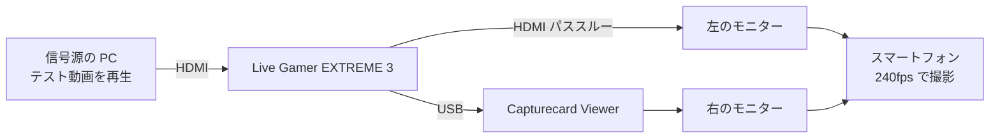

# 映像遅延の実測

**1080p60、Live Gamer EXTREME 3、Media Foundation の条件で、パススルーの表示に対して約 38ms（33〜42ms）の遅れ。**

2026-10-04 に測った（Issue #453）。**この条件での値**であり、他のボード・解像度・開き方・モニターには当てはまらない。

## 結果

| 項目 | 値 |
|---|---|
| パススルーの表示に対するアプリの表示の遅れ | 約 38ms（平均 9.2 カメラフレーム） |
| 最小 / 最大 | 33ms / 42ms（8 / 10 カメラフレーム） |
| 読み取りの誤差 | ±4ms（±1 カメラフレーム） |

## 条件

| 項目 | 内容 |
|---|---|
| アプリ | Capturecard Viewer 1.3.0 |
| 映像の開き方 | Media Foundation（このボードは Media Foundation でしか開けない） |
| 解像度と fps、形式 | 1920x1080 60fps、YUY2 |
| キャプチャーボード | AVerMedia Live Gamer EXTREME 3（USB） |
| 信号源 | 別 PC で `scripts/make-testpattern.sh` のテスト動画（1080p60、フレーム番号を焼き込み）を全画面再生 |
| モニター | MSI MAG 244F（200Hz）× 2 台。リフレッシュレート・応答速度・画面モードを同じ設定に揃えた |
| 撮影 | スマートフォン、FHD 240fps のスローモーション（1/8 倍速で保存、1 カメラフレーム = 4.17ms）。手持ち |
| 撮影した動画 | 84 秒、2533 フレーム |

## 測り方



1. 信号源の PC で、フレーム番号を焼き込んだ 1080p60 のテスト動画（`scripts/make-testpattern.sh` で作る）を全画面で再生する
2. 同じ型番のモニターを 2 台並べ、同じ設定にする。左にボードの HDMI パススルー、右にアプリの表示を出す
3. スマートフォンの 240fps のスローモーションで、2 台が 1 枚に収まるように撮る

モニターが 200Hz なので表示側の刻みは 5ms で、ソースの 60fps（16.7ms 刻み）より細かい。そのため遅れはフレーム番号の差で読める。パススルー側も同じモニターなので、モニターの表示遅延は差し引かれる。

## 解析の手順

ffmpeg 9.0.2 で撮影した動画から静止画を切り出し、番号は画像を目で見て読んだ。crop の座標は撮影ごとに合わせる。

### 1. 2 秒おきの 40 枚

ファイル時刻で 2 秒おき（実時間 0.25 秒おき）に 1 枚ずつ、左右の番号の部分だけを並べて切り出す。

```bash
ffmpeg -ss <t> -i <動画> -frames:v 1 \
  -vf "split[a][b];[a]crop=360:140:360:430[l];[b]crop=360:140:1280:430[r];[l][r]hstack" pair_NN.png
```

できた 40 枚を `tile=2x10` で一覧にして読む。40 枚すべてで 左 − 右 = 2 だった。60fps の番号の差なので 33.3ms 相当だが、番号の刻みは 16.7ms なので真の値は 1.x〜2.x フレームの幅にある。これだけでは細かく決まらないので、次の方法で詰める。

### 2. 連続区間 3 つ

連続 48 カメラフレーム（実時間 0.2 秒）を、ファイル時刻 10s / 40s / 70s の 3 区間で切り出す。

```bash
ffmpeg -ss <t> -i <動画> -frames:v 48 \
  -vf "split[a][b];[a]crop=300:120:400:440[l];[b]crop=300:120:1320:440[r];[l][r]hstack,drawtext=text='%{n}',tile=4x12" \
  -frames:v 1 burst_<t>.png
```

同じ番号 V が左に現れたカメラフレームと、右に現れたカメラフレームの番号の差を取る。

| 区間 | ファイル時刻 | 番号 | 差の最小 | 差の最大 | 差の平均 |
|---|---|---|---|---|---|
| 1 | 10s | 219〜230 | 8 | 10 | 9.1 |
| 2 | 40s | 447〜455 | 8 | 10 | 9.2 |
| 3 | 70s | 672〜680 | 8 | 10 | 9.2 |

差 9.2 カメラフレーム × 4.17ms = 約 38ms。左（パススルー）は 4 カメラフレームごと（16.7ms）に規則正しく進み、右（アプリ）は 3〜5 カメラフレームの間隔で揺れる。200Hz の描画と 60fps の到着の噛み合いによる。

## 注意

- **含まれるもの**: ボードの取り込み（USB、Media Foundation）、アプリの変換と描画
- **含まれないもの**: モニターの表示遅延（左右で同じなので差し引かれる）と、パススルー自体の遅れ。つまり絶対的な入力遅延ではなく、パススルーとの差
- 読み取りの誤差は ±1 カメラフレーム（±4ms）。手持ちの手ぶれは番号の読み取りに影響しなかった
- **同じ条件でしか比べられない。** ボード、解像度と fps、開き方、モニター、撮影の fps、アプリのバージョンのどれかが変われば測り直す

## Summary (English)

Measured on 2026-10-04 (Issue #453): with Capturecard Viewer 1.3.0, an AVerMedia Live Gamer EXTREME 3 opened through Media Foundation at 1920x1080 60fps (YUY2), and two identical MSI MAG 244F monitors at 200Hz, the app's picture lags the card's HDMI passthrough by about 38 ms (33 to 42 ms, reading error ±4 ms). A test video with burned-in frame numbers was played on another PC, both monitors were filmed with a smartphone at 240fps, and the frame numbers were read from stills extracted with ffmpeg (40 stills every 2 seconds, plus three continuous 48-frame bursts). The value includes capture, conversion, and drawing in the app, excludes the monitor's own display latency, and applies only to these conditions.
