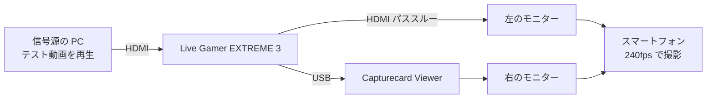

# 映像遅延の実測

**1080p60、Live Gamer EXTREME 3、Media Foundation の条件で、パススルーの表示に対して 1.3.0 は約 38ms（33〜42ms）、1.4.0（#459 を入れた版）は約 33ms（29〜42ms）、YUY2 の GPU 変換を入れた版（#456、1.4.0 の次）は約 28ms（25〜29ms）の遅れ。**

2026-10-04 と 2026-10-10 に測った（Issue #453、#456）。**この条件での値**であり、他のボード・解像度・開き方・モニターには当てはまらない。同じ機材で他のアプリも測ったところ、AVerMedia RECentral 4 が約 18ms、アマレコTV 3.10 が約 28ms だった（「他のアプリとの比較」）。1.3.0 は 3 つの中で最も遅く、GPU 変換を入れた版でアマレコTV と同等になった。

## 結果

| 項目 | 1.3.0 | 1.4.0（#459 を入れた版） | GPU 変換を入れた版（#456、1.4.0 の次） |
|---|---|---|---|
| パススルーの表示に対するアプリの表示の遅れ | 約 38ms（平均 9.2 カメラフレーム） | 約 33ms（平均 8.0 カメラフレーム、2 回の撮影の平均） | 約 28ms（平均 6.7 カメラフレーム） |
| 最小 / 最大 | 33ms / 42ms（8 / 10 カメラフレーム） | 29ms / 42ms（7 / 10 カメラフレーム） | 25ms / 29ms（6 / 7 カメラフレーム） |
| アプリ内の計測（到着→テクスチャ更新、下の「アプリ内の計測の読み方」） | 平均 8.1ms | 平均 5.3ms | 平均 0.7ms（GPU 側の転送とシェーダーの時間は含まない） |
| 読み取りの誤差 | ±4ms（±1 カメラフレーム） | 同じ | 同じ |

GPU 変換を入れた版の値は 2026-10-10 に 1 回撮った結果（連続区間の差の平均が 6.6 / 6.9 / 6.7 カメラフレーム、2 秒おきの 40 枚は 2 が 36 枚と 1 が 4 枚）。1.4.0 から約 1.3 カメラフレーム（5ms）、1.3.0 から約 10ms 速く、アマレコTV 3.10（約 28ms）と同等になった。アプリ内の計測は GPU 経路だと計測点が「GPU に預けた直後」に動くので、0.7ms には UI スレッドの転送とシェーダーの時間が含まれない。実測の縮み（約 5ms）のほうを効果として読む。

1.4.0 の値は、同じ日に同じ機材で 2 回撮った結果（連続区間の差の平均が 7.7 と 8.4 カメラフレーム。「描画バックエンド glow / wgpu の撮り比べ」の glow 側と、リリース前に dev で撮った 1 本）。1.3.0 との差は約 1 カメラフレーム（4ms）で読み取りの誤差と同じ大きさだが、アプリ内の計測の改善（8.1ms → 5.3ms）と向きも大きさも合っている。2 回目の撮影では信号源の再生がカクついていて（パススルー側が同じ番号を 2 回出したり 1 つ飛ばしたりしている）、2 秒おきの 40 枚の差は 1〜4 と揺れた。同じ番号が左右に現れるまでの差を取る連続区間の方法はこの影響を受けない。

## 条件

| 項目 | 内容 |
|---|---|
| アプリ | Capturecard Viewer 1.3.0（1.4.0 の値も同じ条件で測った。「結果」に併記） |
| 映像の開き方 | Media Foundation（DirectShow でも開ける。DirectShow で開いたときの値は未計測、#485） |
| 解像度と fps、形式 | 1920x1080 60fps、YUY2 |
| キャプチャーボード | AVerMedia Live Gamer EXTREME 3（USB） |
| 信号源 | 別 PC で `scripts/make-testpattern.sh` のテスト動画（1080p60、フレーム番号を焼き込み）を全画面再生 |
| モニター | MSI MAG 244F（200Hz）× 2 台。リフレッシュレート・応答速度・画面モードを同じ設定に揃えた |
| 撮影 | スマートフォン、FHD 240fps のスローモーション（1/8 倍速で保存、1 カメラフレーム = 4.17ms）。手持ち |
| 撮影した動画 | 84 秒、2533 フレーム |

## 測り方



1. 信号源の PC で、フレーム番号を焼き込んだ 1080p60 のテスト動画（`scripts/make-testpattern.sh` で作る）を全画面で再生する
2. 同じ型番のモニターを 2 台並べ、同じ設定にする。左にボードの HDMI パススルー、右にアプリの表示を出す
3. スマートフォンの 240fps のスローモーションで、2 台が 1 枚に収まるように撮る

モニターが 200Hz なので表示側の刻みは 5ms で、ソースの 60fps（16.7ms 刻み）より細かい。そのため遅れはフレーム番号の差で読める。パススルー側も同じ型番・同じ設定のモニターなので、モニターの表示遅延は左右で等しいとみなして差し引いている。2 台の個体差は評価していない。

## 解析の手順

ffmpeg 9.0.2 で撮影した動画から静止画を切り出し、番号は画像を目で見て読んだ。crop の座標は撮影ごとに合わせる。

### 1. 2 秒おきの 40 枚

ファイル時刻で 2 秒おき（実時間 0.25 秒おき）に 1 枚ずつ、左右の番号の部分だけを並べて切り出す。

```bash
ffmpeg -ss <t> -i <動画> -frames:v 1 \
  -vf "split[a][b];[a]crop=360:140:360:430[l];[b]crop=360:140:1280:430[r];[l][r]hstack" pair_NN.png
```

できた 40 枚を `tile=2x10` で一覧にして読む。40 枚すべてで 左 − 右 = 2 だった。60fps の番号の差なので 33.3ms 相当だが、番号の刻みは 16.7ms なので真の値は 1.x〜2.x フレームの幅にある。これだけでは細かく決まらないので、次の方法で詰める。

### 2. 連続区間 3 つ

連続 48 カメラフレーム（実時間 0.2 秒）を、ファイル時刻 10s / 40s / 70s の 3 区間で切り出す。

```bash
ffmpeg -ss <t> -i <動画> -frames:v 48 \
  -vf "split[a][b];[a]crop=300:120:400:440[l];[b]crop=300:120:1320:440[r];[l][r]hstack,drawtext=text='%{n}',tile=4x12" \
  -frames:v 1 burst_<t>.png
```

同じ番号 V が左に現れたカメラフレームと、右に現れたカメラフレームの番号の差を取る。

| 区間 | ファイル時刻 | 番号 | 差の最小 | 差の最大 | 差の平均 |
|---|---|---|---|---|---|
| 1 | 10s | 219〜230 | 8 | 10 | 9.1 |
| 2 | 40s | 447〜455 | 8 | 10 | 9.2 |
| 3 | 70s | 672〜680 | 8 | 10 | 9.2 |

差 9.2 カメラフレーム × 4.17ms = 約 38ms。左（パススルー）は 4 カメラフレームごと（16.7ms）に規則正しく進み、右（アプリ）は 3〜5 カメラフレームの間隔で揺れる。200Hz の描画と 60fps の到着の噛み合いによる。

## 他のアプリとの比較

同じ日に同じ機材・同じ信号源で、右のモニターに出すアプリだけを替えて撮り、同じ手順で読んだ（Issue #453）。値はどれもパススルーの表示に対する遅れ。

| アプリ | 映像の経路 | 遅れ | 最小 / 最大 | 2 秒おき 40 枚の 左 − 右 |
|---|---|---|---|---|
| AVerMedia RECentral 4 | 不明（ボードの純正アプリ） | 約 18ms（4.3 カメラフレーム） | 13ms / 21ms | 1 が 36 枚、0 が 1 枚、2 が 3 枚 |
| アマレコTV 3.10 | DirectShow | 約 28ms（6.8 カメラフレーム） | 21ms / 33ms | 1 が 30 枚、2 が 10 枚 |
| Capturecard Viewer 1.3.0 | Media Foundation | 約 38ms（9.2 カメラフレーム） | 33ms / 42ms | 2 が 40 枚 |
| Capturecard Viewer（GPU 変換を入れた版、2026-10-10） | Media Foundation | 約 28ms（6.7 カメラフレーム） | 25ms / 29ms | 2 が 36 枚、1 が 4 枚 |

連続区間 3 つの差（カメラフレーム）:

| アプリ | 区間 1（10s） | 区間 2（40s） | 区間 3（70s） |
|---|---|---|---|
| RECentral 4 | 番号 760〜771、差 3〜5、平均 4.0 | 番号 985〜997、差 4〜5、平均 4.7 | 番号 1209〜1221、差 4〜5、平均 4.1 |
| アマレコTV 3.10 | 番号 347〜360、差 6〜7、平均 6.7 | 番号 572〜585、差 5〜8、平均 6.5 | 番号 796〜810、差 6〜8、平均 7.1 |
| Capturecard Viewer（GPU 変換を入れた版） | 番号 263〜276、差 6〜7、平均 6.6 | 番号 488〜501、差 6〜7、平均 6.9 | 番号 713〜726、差 6〜7、平均 6.7 |

読み取れたこと:

- 3 つの中では本アプリが最も遅い。RECentral 4 との差は約 20ms（ソースの 1 フレーム強）、アマレコTV との差は約 10ms
- RECentral 4 の表示は、パススルーと同じ 4 カメラフレームの刻みで、パススルーをちょうど 1 刻み（16.7ms）ずらした形で進む。届いたフレームを次の表示にそのまま出していると読める
- アマレコTV の表示は 5〜8 カメラフレームの幅で揺れる。本アプリの 3〜5 カメラフレームの描画間隔の揺れと似た性質

比べるときの注意:

- 他のアプリの設定（表示モード、垂直同期、バッファの有無）は記録していない。ウィンドウの大きさや配置も本アプリと同じではない（切り出した画像の中でパターンの位置が違う）
- 撮影した動画は RECentral 4 が 86 秒 2580 フレーム、アマレコTV が 87 秒 2605 フレーム。crop の座標は本アプリの撮影と違う（RECentral 4 は左 `400:180:260:450`・右 `400:180:1260:460`、アマレコTV は左 `400:180:200:430`・右 `400:180:1240:430`）
- `drawtext` はフォントの設定が無い環境では落ちるので、`fontfile=` でフォントのファイルを渡す

## `MF_LOW_LATENCY` の撮り比べ（#456、効果なし）

Media Foundation のソースリーダーに `MF_LOW_LATENCY = TRUE` を付けた版（PR #461）を、同じ exe で ON と OFF（環境変数で切り替え）にして、上と同じ機材・同じ手順で撮り比べた。どちらの動画もアプリのログで ON / OFF を確かめている。リプレイバッファ（300 秒、NVIDIA の H.264 エンコーダー）は両方で ON。

| 条件 | 2 秒おき 40 枚の 左 − 右 | 連続区間 3 つの差（カメラフレーム） | 遅れ |
|---|---|---|---|
| ON | 2 が 38 枚、3 が 2 枚 | 9.0 / 9.6 / 9.0（8〜10） | 約 38ms |
| OFF | 2 が 39 枚、3 が 1 枚 | 9.3 / 9.0 / 9.0（8.5〜10） | 約 38ms |

差は読み取りの誤差（±1 カメラフレーム）の中で、効果は無かった。この属性はソースリーダーの下のデコーダーや変換の MFT の溜め込みを減らすもので、YUY2 を無変換で受け取る経路には効かないとみられる。変更は同日に戻した（`docs/design/video-pipeline.md` の「試して外したもの」）。

同じ日の実機で、アプリ内の計測（下の「アプリ内の計測の読み方」）は平均 8ms / 最大 11ms だった。約 38ms のうちアプリ内で見える分はこれだけで、残りはボードの取り込みと present・モニターの側にある。

## 描画バックエンド glow / wgpu の撮り比べ（#456、効果なし）

描画を wgpu（DX12、フリップモデル、`PresentMode::Mailbox`、溜めるフレーム 1）にした版（PR #465、マージせず閉じた）を、同じ exe で wgpu と glow（環境変数で切り替え）にして、上と同じ機材・同じ手順で撮り比べた。どちらで動いたかは統計 OSD の「描画」の行で確かめている（wgpu は Dx12 Mailbox / NVIDIA GeForce RTX 4070 Ti、glow は OpenGL）。この exe には #459（到着で UI スレッドを起こす）が入っている。

| 条件 | 2 秒おき 40 枚の 左 − 右 | 連続区間 3 つの差（カメラフレーム） | 遅れ |
|---|---|---|---|
| wgpu（DX12、Mailbox） | 2 が 39 枚、1 が 1 枚 | 7 / 8 / 7 | 約 31ms |
| glow（OpenGL） | 2 が 40 枚 | 8.1 / 8.0 / 7 | 約 32ms |

差は約 2ms で読み取りの誤差（±1 カメラフレーム）の中。200Hz のモニターでは present の 1 段が 5ms なので、フリップモデルで減らせる量がこの測り方の底を割っていたとみられる。exe が 3.7MB 増え、描画バックエンドが 2 本になる保守に見合わないので採らなかった（`docs/design/video-pipeline.md` の「試して外したもの」）。

**この撮り比べで、#459 を入れた版の遅れが 1.3.0 の約 38ms（9.2 カメラフレーム）より下がったことも分かった**（この回は 7.3〜7.7 カメラフレーム。リリース前にもう 1 本撮った結果と合わせた値は上の「結果」）。同じ日の実機で、アプリ内の計測は平均 5.3ms（#459 の前は 8.1ms）。

## 注意

- **含まれるもの**: ボードの取り込み（USB、Media Foundation）、アプリの変換と描画
- **含まれないもの**: パススルー自体の遅れ。つまり絶対的な入力遅延ではなく、パススルーとの差。モニターの表示遅延は左右で等しいとみなして差し引いているが、2 台の個体差は評価していないので、その差は値に入りうる
- 読み取りの誤差は ±1 カメラフレーム（±4ms）。手持ちの手ぶれは番号の読み取りに影響しなかった
- **同じ条件でしか比べられない。** ボード、解像度と fps、開き方、モニター、撮影の fps、アプリのバージョンのどれかが変われば測り直す

## アプリ内の計測の読み方

統計 OSD（右クリックメニューの「情報表示」）と「接続状態」タブの映像の欄に出る「表示までの遅れ: 平均 N ms / 最大 M ms」は、アプリが自分で測った値（#455）で、上の実測とは測っている範囲が違う。起点は Media Foundation（DirectShow なら自前のレンダラー）のコールバックが呼ばれた時刻で、ボードが取り込んだ時刻より後になる。終点は UI スレッドがそのフレームでテクスチャを更新した時刻で、GPU が画面へ出す（present）までと、モニターの表示遅延は含まない。つまり上の約 38ms のうち、アプリの変換と UI スレッドが取り込むまでの待ちの分だけを表す。ボードの取り込みの分は「実測の遅れ − この値 − present とモニターの分」として残る。値は直近 1 秒の平均と最大で、30 秒ごとの集計はログレベルを `debug`（環境変数 `CAPTURECARD_VIEWER_LOG=debug`）にするとログにも出る。

## Summary (English)

Measured on 2026-10-04 (Issue #453): with Capturecard Viewer 1.3.0, an AVerMedia Live Gamer EXTREME 3 opened through Media Foundation at 1920x1080 60fps (YUY2), and two identical MSI MAG 244F monitors at 200Hz, the app's picture lags the card's HDMI passthrough by about 38 ms (33 to 42 ms, reading error ±4 ms). A test video with burned-in frame numbers was played on another PC, both monitors were filmed with a smartphone at 240fps, and the frame numbers were read from stills extracted with ffmpeg (40 stills every 2 seconds, plus three continuous 48-frame bursts). The value includes capture, conversion, and drawing in the app, assumes both monitors have the same display latency (unit-to-unit differences were not evaluated), and applies only to these conditions. On the same day and setup, AVerMedia RECentral 4 lagged the passthrough by about 18 ms (13 to 21 ms) and AmaRecTV 3.10 by about 28 ms (21 to 33 ms), so Capturecard Viewer 1.3.0 was the slowest of the three. Version 1.4.0, which wakes the UI thread on frame arrival instead of polling every 16 ms (#459), measured about 33 ms (29 to 42 ms, average of two recordings on the same setup); the in-app measurement dropped from 8.1 ms to 5.3 ms. Adding MF_LOW_LATENCY to the Media Foundation source reader and switching the renderer from glow to wgpu (DX12 flip model) were both tried on the same day and made no measurable difference, so neither was kept. Converting YUY2 to RGB in a GPU shader instead of on the CPU (#456, measured on 2026-10-10 on the same setup) brought the lag down to about 28 ms (25 to 29 ms), on par with AmaRecTV 3.10; the in-app measurement reads 0.7 ms on that build, but on the GPU path it stops when the frame is handed to the GPU and so excludes the upload and shader time. The "Display latency" line in the stats overlay and the Status tab (#455) measures a narrower span inside the app: it starts when the Media Foundation (or DirectShow) callback receives the frame, which is after the card has captured it, and ends when the UI thread updates the texture, so it does not include GPU presentation or the monitor.
