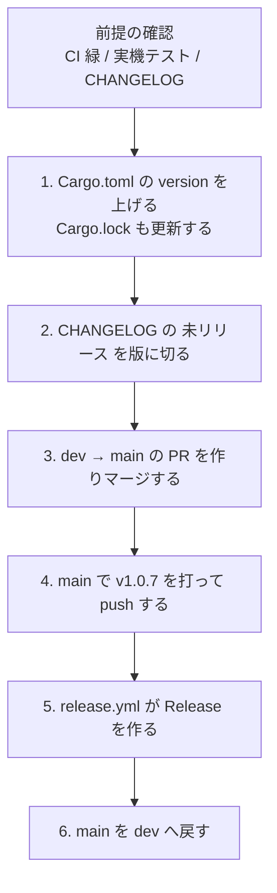

# リリース手順

`dev` に溜まった変更を 1 つの版として切り出し、GitHub Release として公開するまでの手順。

タグを push すると `.github/workflows/release.yml` が動き、release ビルド → zip 化 → Release の作成までを自動で行う。**人がやるのはバージョンの更新、`CHANGELOG.md` の整理、`dev` → `main` の PR、タグの push まで。**

Claude に手順をなぞらせる場合は `.claude/skills/release/SKILL.md` を使う。

## 全体像



## 前提

タグを打つ前に以下を満たしていること。

- **`dev` の CI が緑**（`.github/workflows/ci.yml`）。手元でも `.claude/skills/verify/SKILL.md` の検証を一通り通す
- **`docs/MANUAL-TEST.md` のチェックリストを実機で実施した。** 落ちてよいのは同ファイルの「既知の不具合により失敗する項目」に載っているものだけ
- **`CHANGELOG.md` の「未リリース」節に、この版に入る変更が書かれている**

## 1. バージョンを上げる

バージョンの出どころは `Cargo.toml` の `version` だけ（`docs/BUILD.md` の「バージョン番号」）。**`app.rc` は触らない。** `build.rs` が `version.h` を生成して exe のバージョンリソースへ流し込む。

[セマンティック バージョニング](https://semver.org/lang/ja/)に従って上げる。

| 変更の内容 | 上げる位置 |
|---|---|
| 設定ファイルの互換性が切れるなど、ユーザーの移行作業が要る変更 | major |
| 後方互換のある機能追加 | minor |
| 後方互換のある修正のみ | patch |

書き換えたら **`Cargo.lock` も更新する。** `Cargo.lock` には自分自身のパッケージの version が入っているため、更新せずに push すると CI と release ワークフローの `--locked` が「lock ファイルの更新が必要」で落ちる。

```bash
cargo check
```

`Cargo.toml` と `Cargo.lock` を同じコミットに入れる。

```
chore: バージョンを 1.0.7 に上げる
```

## 2. CHANGELOG を版に切る

`CHANGELOG.md` の `## [未リリース]` を、この版の見出しに書き換える。

```markdown
## [1.0.7] - 2026-09-19
```

日付はリリース日（JST）。書き換えたあと、その上に空の `## [未リリース]` 節を作り直す。

release ワークフローはこの見出しを目印に本文を抜き出して Release の説明にするため、**見出しの形（`## [1.0.7] - YYYY-MM-DD`）を崩さない。** 節が見つからないとワークフローはビルドの前に失敗する。

中身の書き方はファイル末尾の「記入の方針」に従う。ユーザーから見える変更だけを書き、内部のリファクタリングは挙動が変わらないなら書かない。

## 3. dev → main の PR を作る

```bash
gh pr create --base main --head dev --title "chore: 1.0.7 をリリースする"
```

- **`main` へ PR を出してよいのはこのときだけ。** 通常の PR は `dev` へ向ける（`.claude/skills/naming-conventions/SKILL.md`）
- マージは merge commit。squash も rebase も使わない
- CI が緑になってからマージする

## 4. タグを打つ

マージ後の `main` を取得してタグを打つ。

```bash
git checkout main && git pull --ff-only
git tag v1.0.7
git push origin v1.0.7
```

- **タグ名は `v<バージョン>`。** `Cargo.toml` の version と一致していないとワークフローが失敗する（`v1.0.7` ↔ `1.0.7`）
- 1.0.6 以前のタグは `Ver1.0.6` の形式だったが、今後は小文字の `v` を使う。ワークフローの起動条件が `v*` なので、`Ver1.0.7` では何も動かない
- **タグは `dev` ではなく `main` で打つ**
- Release が作られる前に間違いに気付いたら、タグを消して打ち直してよい。公開後は打ち直さず、次の版で直す

**打ち直す前に、そのタグで動き出したワークフローが終わっているか止まっているかを確認する。** ワークフローは `cancel-in-progress: false` なので、タグを消しても走っている run は止まらない。走らせたまま打ち直すと、古いコミットからビルドした zip が、新しいコミットを指すタグの Release に添付されることがある。

```bash
gh run list --workflow release.yml --limit 3
gh run cancel <run-id>
```

```bash
git push origin :refs/tags/v1.0.7 && git tag -d v1.0.7
```

## 5. ワークフローの結果を確認する

`.github/workflows/release.yml` が以下を順に行う。

1. タグ名と `Cargo.toml` の version が一致するか確認する（不一致ならここで失敗）
2. `CHANGELOG.md` から該当する版の節を抜き出す（無ければここで失敗）
3. `cargo build --locked --release`
4. `target/release/capturecard_viewer.exe` を `capturecard_viewer-v1.0.7-windows-x64.zip` に固める
5. `gh release create` で Release を作り、zip を添付して CHANGELOG の節を説明にする

```bash
gh run list --workflow release.yml --limit 1
gh release view v1.0.7
```

**zip を実際に落として展開し、exe が起動することを確認する。** ビルドが通ったことと、配った物が動くことは別。

## 配布物

**実行ファイル単体。** `icon.ico` と既定の効果音 `sound/SS.mp3` は exe に埋め込んであるため同梱しない（`docs/BUILD.md` の「配布時に同梱するもの」）。

```
capturecard_viewer-v1.0.7-windows-x64.zip
└── capturecard_viewer.exe
```

## 6. リリース後に main を dev へ戻す

`dev` → `main` をマージコミットで取り込むと、`main` に `dev` が持たないコミット（マージコミットそのもの）ができる。そのままにすると次のリリース PR の差分が読みにくくなるため、`main` を `dev` へマージして揃える。

```bash
git checkout dev && git pull --ff-only
git merge origin/main
git push origin dev
```

早送りで済む場合はこの操作自体が不要になる。`git log --oneline dev..main` が空なら何もしなくてよい。

あわせて Asana の「リリース・保守」セクションにあるタスクの状態を更新する。

## ワークフローが失敗したとき

| 症状 | 原因 | 対処 |
|---|---|---|
| タグ名と version の不一致で落ちる | `Cargo.toml` の version を上げ忘れた、またはタグを打ち間違えた | タグを消し、`Cargo.toml` を直してから打ち直す |
| CHANGELOG に節が無いと言われて落ちる | 「未リリース」を版に切り忘れた | CHANGELOG を直してタグを打ち直す |
| `--locked` で lock の更新が必要と言われる | `Cargo.lock` を更新せずにコミットした | `cargo check` で更新してコミットし、タグを打ち直す |

タグを打ち直すときは、手順 4 の注意（走っているワークフローを先に止める）に従う。

Release がまだ作られていなければ、原因を直してタグを打ち直すのが一番簡単。**Release が作られたあとや、Actions 側の障害で通らない場合は手動で出す。**

```bash
cargo build --locked --release
```

```powershell
Compress-Archive -Path target/release/capturecard_viewer.exe -DestinationPath capturecard_viewer-v1.0.7-windows-x64.zip
```

`CHANGELOG.md` の該当する節を `release-notes.md` に書き出してから Release を作る。

```bash
gh release create v1.0.7 capturecard_viewer-v1.0.7-windows-x64.zip --title v1.0.7 --notes-file release-notes.md --verify-tag
```

既に Release がある状態で zip だけ差し替える場合は以下。

```bash
gh release upload v1.0.7 capturecard_viewer-v1.0.7-windows-x64.zip --clobber
```

手動で出したあとは `release-notes.md` と zip を消して、作業ディレクトリに残さない。
