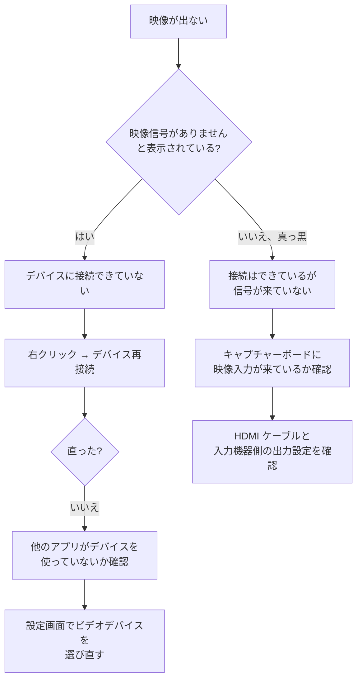

# トラブルシューティング

うまく動かないときの確認手順。

このアプリはキャプチャーボードとオーディオデバイスに強く依存するため、環境によって挙動が変わる。**手元にすべてのデバイスがあるわけではないため、ここに書かれていない事象も起こりうる。**

## まず試すこと

症状を問わず、以下を先に試す。これで直ることが多い。

1. **右クリック → デバイス再接続**
2. アプリを再起動する
3. キャプチャーボードを USB から抜き差しして、再接続する

## 起動しても映像が出ない



### 他のアプリがデバイスを掴んでいる

キャプチャーボードは同時に 1 つのアプリからしか開けないことが多い。OBS、Discord、Zoom、ブラウザのカメラ許可などが掴んでいると、こちらから開けない。

該当しそうなアプリを終了してから、デバイス再接続を実行する。

### 起動直後だけ失敗する

起動時に接続できず、デバイス再接続で直る場合がある。既知の問題として登録済みで、根本原因は未特定。現状は右クリック → デバイス再接続で回避してほしい。

### 設定した解像度やフレームレートで動かない

設定画面でフォーマットに MJPEG や RGB24 を選んでも、**現在の実装では常に YUY2 で開かれる。** YUY2 は帯域を多く使うため、デバイスによっては 1080p60 が出ない。

既知の不具合として登録済み。現時点では、その組み合わせで動く解像度・フレームレートを選んで回避してほしい。

## 音が出ない

1. **音量を確認する。** マウスホイールで下げていないか。右クリックメニューに現在の音量が出る
2. **設定画面でオーディオ入力デバイスを確認する。** キャプチャーボードの入力（製品名を含むもの）が選ばれているか
3. **Windows 側の音量ミキサーを確認する。** アプリ単位でミュートされていないか
4. **出力デバイスを「デフォルト」以外に変えてみる**

### 音声パススルーのチェックを外しても音が止まらない

既知の不具合。現在この設定は動作していない。音を止めたい場合は音量を 0% にする。

### サンプリングレートやチャンネル数を変えても何も変わらない

既知の不具合。現在これらの設定は無視され、デバイスの既定値が使われる。

### 音が途切れる、プチプチとノイズが入る

内部のバッファ長が 50ms 固定で、環境によっては短すぎる場合がある。現時点では調整する手段がない。バッファ長を設定できるようにする作業がバックログにある。

CPU 負荷が高いときに発生しやすいので、他の重いアプリを終了すると改善することがある。

### 音程がおかしい、再生が速い / 遅い

入力デバイスと出力デバイスでサンプルレートが異なる場合に発生する。現在リサンプリングを行っていないため。

Windows の設定で、出力デバイスの既定のフォーマットを入力側と揃えると回避できる場合がある。

## スクリーンショットが撮れない

### ホットキーが反応しない

1. **他のアプリが同じキーを使っていないか確認する。** グローバルホットキーは先に登録したアプリが優先される
2. **F12 は設定できない。** 他システムとの競合により登録に失敗する。別のキーを使う
3. 設定画面でホットキーを設定し直す

修飾キーだけ（Ctrl+Shift など）を登録しようとすると失敗する。通常のキーを 1 つ含める必要がある。

### 効果音が鳴らない

実行ファイルの場所と作業ディレクトリが異なると、既定の効果音 `sound/SS.mp3` が読み込めない。既知の不具合。

回避策として、設定画面から効果音ファイルを絶対パスで選び直す。

### 保存されない

保存先フォルダに書き込み権限があるか確認する。`Program Files` の下などは書き込めないことがある。

## ウィンドウが見えない、操作できない

前回終了時の位置がモニタ構成の変更で画面外になっていると、ウィンドウが見えなくなる。既知の不具合で、画面外に復元されないようにする対応がバックログにある。

回避策は設定ファイルの削除。下記の「設定を初期化する」を参照。

## アイコンが赤い四角になる

実行ファイルの場所と作業ディレクトリが異なると、`icon.ico` が読み込めない。既知の不具合。

動作には影響しない。

## 設定を初期化する

以下のフォルダを削除すると、次回起動時に既定値で作り直される。

```
%AppData%\capturecard_viewer
```

エクスプローラのアドレスバーにそのまま貼り付けると開ける。

**設定がすべて消える。** デバイスの選択、ホットキー、保存先、音量などをすべて設定し直すことになる。

### 意図せず設定が初期化された

設定ファイルの読み込みに失敗した場合、アプリは既定値で起動する。このとき、読めなかったファイルは同じフォルダへ退避される。

```
%AppData%\capturecard_viewer\config\default-config.toml.bak
```

退避したファイルが既にある場合は `.bak.1`、`.bak.2` と連番が付く。中身はテキストなので、メモ帳で開いて設定し直すときの控えにできる。

**このファイルがあれば、設定が初期化された原因は読み込みの失敗だと分かる。** 無い場合は別の原因（設定フォルダごと消えた、別のユーザーアカウントで起動したなど）を疑う。

失敗した理由そのものはまだ記録されない。ログ出力を追加する作業はバックログにある。

## 不具合を報告するとき

[Issue](https://github.com/Mui-MuiMui/Capturecard_Viewer/issues) に以下を添えてもらえると原因を絞りやすい。

- Windows のバージョン
- キャプチャーボードの製品名
- このアプリのバージョン
- 設定画面で選んでいるフォーマット・解像度・フレームレート
- オーディオの入力デバイス名と出力デバイス名
- `%AppData%\capturecard_viewer\config\default-config.toml` の内容
- 同じフォルダに `default-config.toml.bak` がある場合はその内容（設定の読み込みに失敗した証跡）

**現状このアプリはログを出力しない。** そのため、再現手順をできるだけ具体的に書いてもらえると助かる。ログ出力を追加する作業はバックログにある。
