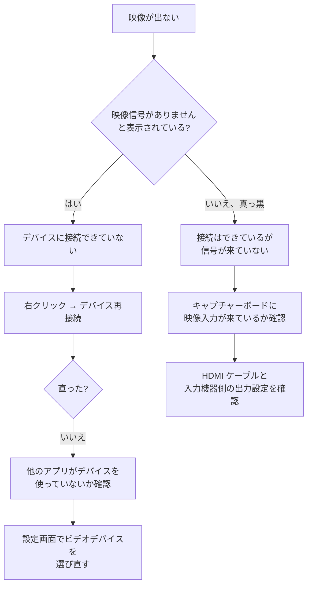

# トラブルシューティング

うまく動かないときの確認手順。

このアプリはキャプチャーボードとオーディオデバイスに強く依存するため、環境によって挙動が変わる。**手元にすべてのデバイスがあるわけではないため、ここに書かれていない事象も起こりうる。**

## まず試すこと

症状を問わず、以下を先に試す。これで直ることが多い。

1. **右クリック → デバイス再接続**
2. アプリを再起動する
3. キャプチャーボードを USB から抜き差しして、再接続する

## 起動しても映像が出ない



### 他のアプリがデバイスを掴んでいる

キャプチャーボードは同時に 1 つのアプリからしか開けないことが多い。OBS、Discord、Zoom、ブラウザのカメラ許可などが掴んでいると、こちらから開けない。

該当しそうなアプリを終了してから、デバイス再接続を実行する。

### 起動直後だけ失敗する

**待てば繋がる。** デバイスを開けなかった場合、アプリは繋がるまで自動で再試行し続ける。間隔は 0.2 秒から始めて 0.4 → 0.8 → 1.6 → 3.2 秒と広げ、5 秒で頭打ちになる。

- 起動してからキャプチャーボードを挿した場合も、そのまま待てば接続される（最大 5 秒）
- **再試行のために画面が数秒止まることはない。** 1 回の試行は長くても 0.5 秒ほどで、多くは 0.02 秒以内。操作を受け付けない状態が続く場合は別の原因
- すぐ試したいときは右クリック → デバイス再接続。待ち時間を飛ばして即座に試す
- しばらく待っても繋がらない場合は、設定のデバイス名が実際のデバイス名と食い違っている可能性がある。設定画面でビデオデバイスを選び直す

音声については、設定したデバイスで 3 回続けて失敗すると、Windows の既定の入出力デバイスで 1 度だけ試す。設定したデバイス名が古くて存在しない場合でも、既定のデバイスから音が出ることがある。

### 設定した解像度やフレームレートで動かない

設定画面でフォーマットに MJPEG や RGB24 を選んでも、**現在の実装では常に YUY2 で開かれる。** YUY2 は帯域を多く使うため、デバイスによっては 1080p60 が出ない。

既知の不具合として登録済み。現時点では、その組み合わせで動く解像度・フレームレートを選んで回避してほしい。

## 音が出ない

1. **音量を確認する。** マウスホイールで下げていないか。右クリックメニューに現在の音量が出る
2. **設定画面でオーディオ入力デバイスを確認する。** キャプチャーボードの入力（製品名を含むもの）が選ばれているか
3. **Windows 側の音量ミキサーを確認する。** アプリ単位でミュートされていないか
4. **出力デバイスを「デフォルト」以外に変えてみる**
5. **設定画面で「音声パススルー」が有効になっているか確認する。** 無効にすると無音になる

### サンプリングレートやチャンネル数を選んでも、その値にならない

選択肢をデバイスの能力から生成していないため、デバイスが対応していない値も選べてしまう。対応していない値を選んだ場合は、デバイスが対応している中で最も近い値が使われる。

チャンネル数は、WASAPI がデバイスのミックスフォーマットのチャンネル数しか報告しないため、モノラルを選んでもステレオで開かれることが多い。変えたい場合は Windows のサウンド設定でデバイスの既定のフォーマットを変更する。

選択肢をデバイスの能力から生成する作業はバックログにある。

### 音が途切れる、プチプチとノイズが入る

内部のバッファ長（既定 50ms）が環境に対して短すぎると、出力が次のぶんを取りに来たときに入力が間に合わず、プチプチという音になる。

設定 > デバイス設定 の**「音声バッファ」を大きくする**と改善する。20〜200ms の範囲で、まず 100ms 程度まで上げてみて、ノイズが消えたところから少しずつ下げて探す。**大きくするほど音の遅延も増える**ので、ノイズが出ない範囲でいちばん小さい値がよい。変更は「適用」か「OK」を押したときに効き、そのとき音声だけが開き直る。

CPU 負荷が高いときに発生しやすいので、他の重いアプリを終了すると改善することがある。

### 音程がおかしい、再生が速い / 遅い

入力デバイスと出力デバイスの形（サンプリングレートやチャンネル数）が違う場合、出力側で変換してから再生している。線形補間によるリサンプリングと、長時間再生でのクロックドリフト補正（リングバッファの水位に応じてレート比を ±0.1% の範囲で微調整）が入っているため、通常は気付く範囲のずれにはならない。

それでも次のような場合はずれが聞こえることがある。

- 入出力のレート差が大きい、またはチャンネル数の対応（モノラル ↔ ステレオなど）で品質が落ちる場合
- CPU 負荷が高くアンダーラン（「音が途切れる、プチプチとノイズが入る」を参照）が頻発し、補正が追いつかない場合

設定画面の「接続状態」タブのオーディオの項目で確認できる。「入力: …」「出力: …」に実際に開いたサンプリングレートとチャンネル数が出るので、まずこの 2 行が一致しているか見る。

- **変換なし** — 入出力の形が一致しており、そのまま出している（ずれは起きない）
- **リサンプル比** / **バッファ水位** — 変換が入っている。リサンプル比は 1.0000 付近で微調整され続けるのが正常。0.999 台や 1.001 台に張り付いたまま動かない、バッファ水位が 100%（目標水位）から大きく外れたまま戻らない場合は、補正が追いついていない

対処:

1. Windows の設定で、出力デバイスの既定のフォーマットを入力側と揃える。**変えただけでは反映を確認できないので**、変更後に設定画面を開き直し、「接続状態」タブの「入力: …」「出力: …」が実際に一致したか確認する（要求どおりに開けるとは限らない）
2. 揃えられない、または揃えても直らない場合は、設定画面の音声バッファ（`[audio]` の `buffer_ms`、既定 50ms）を大きくしてみる。アンダーランが減り、補正の余裕が増える

## スクリーンショットが撮れない

### ホットキーが反応しない

1. **「ホットキー」タブの「このアプリにフォーカスがあるときだけ反応する」がオンになっていないか確認する。** オンのときは、他のアプリを操作している間や最小化している間は反応しない
2. **管理者として実行しているアプリが前面にないか確認する。** その間はホットキーが反応しないことがある（Windows の制限）
3. **修飾キーまで同じか確認する。** `F5` の割り当ては `Ctrl+F5` では反応しない
4. 設定画面でホットキーを設定し直す

修飾キーだけ（Ctrl+Shift など）を登録しようとすると失敗する。通常のキーを 1 つ含める必要がある。

ホットキー設定ダイアログの「クリア」を押すと未設定になり、設定画面で「適用」か「OK」を押した時点でどのキーにも反応しなくなる（再起動は要らない）。撮影する手段はホットキーだけなので、クリアしたあとは設定し直す。

### 効果音が鳴らない

既定の効果音は実行ファイルに埋め込んであるため、作業ディレクトリに関係なく鳴る。設定で選んだファイルを後から移動・削除した場合も、無音にはならず既定の効果音に切り替わる。

それでも鳴らない場合は以下を確認する。

- 設定画面の効果音が「なし（効果音を鳴らさない）」になっていないか。「効果音を鳴らさない」を押すとこの状態になり、「適用」か「OK」を押した時点で無音になる（再起動は要らない）。既定の効果音へ戻すには「既定に戻す」を押して適用する
- 効果音の音量が 0% になっていないか
- Windows のサウンド設定で既定の出力デバイスが正しいか

### 保存されない

保存先フォルダに書き込み権限があるか確認する。`Program Files` の下などは書き込めないことがある。

## ウィンドウが見えない、操作できない

前回終了時の位置がモニタ構成の変更で画面外になっていても、起動時に各モニタの作業領域と照合し、十分に重ならない場合は保存された位置を使わず OS に配置を任せる。そのため画面外で起動することはない。

それでも見つからない場合は、以下を確認する。

- タスクバーのアイコンから復元できないか（最小化されたままになっていないか）
- 右クリックメニューの「最前面表示」を使っている他のアプリに隠れていないか

上記で解決しない場合は、設定ファイルの `[ui]` にある `last_window_pos` と `last_window_size` の行を削除してから起動する。設定ファイルの場所は下記の「設定を初期化する」を参照。**フォルダごと消さなくても、この 2 行だけで位置とサイズが既定に戻る。**

## アイコンが赤い四角になる

1.0.6 以前の不具合。実行ファイルの場所と作業ディレクトリが異なると `icon.ico` を読み込めず、赤い四角が表示された。

現在はアイコンを実行ファイルに埋め込んでいるため発生しない。発生する場合は版を上げる。動作そのものには影響しない。

## 文字が豆腐（□）になる

日本語の文字が表示されず、四角（豆腐）になる場合は、日本語フォントが 1 つも見つかっていない。

起動時に以下の順で候補を探し、最初に見つかったものを使う。

1. Meiryo（`meiryo.ttc`）
2. Yu Gothic UI Medium（`YuGothM.ttc`）
3. Yu Gothic UI Regular（`YuGothR.ttc`）
4. Yu Gothic（`yugothic.ttf`）
5. MS Gothic（`msgothic.ttc`）
6. BIZ UDGothic（`BIZ-UDGothicR.ttc`）

探す場所は `%WINDIR%\Fonts`（システム共通）と `%LOCALAPPDATA%\Microsoft\Windows\Fonts`（ユーザー単位でインストールされたフォント）の 2 か所。Windows の言語パックを最小構成にした環境などで Meiryo が入っていなくても、上記のいずれかがあれば日本語は表示される。**すべて見つからない場合だけ**豆腐になる（起動自体は失敗しない）。

### ログで確認する

ログファイル（`%AppData%\capturecard_viewer\logs`、場所の詳細は「不具合を報告するとき」を参照）に以下のいずれかが残る。

```
日本語フォントとして Meiryo を使用します (C:\Windows\Fonts\meiryo.ttc)
```

```
日本語フォント候補が 1 つも見つかりませんでした（探索先: [...], 候補: meiryo.ttc, YuGothM.ttc, ...）。既定フォントのまま起動します
```

後者が出ている場合は、上記 6 候補のいずれかを Windows の「オプション機能」からインストールすると直る（「言語と地域」の設定から日本語の言語パックを追加、または MS ゴシック等の個別フォントを有効化する）。

絵文字や記号（⚠ ● × 🔊 など）は上記のフォントに含まれないものがあるため、egui 既定のフォールバックフォントで描かれる。日本語フォントの候補が見つからない状態でも記号自体は表示される。

## 映像がカラーバーや青一色になる、デバイス名が「Fake Camera」になる

環境変数 `CAPTURECARD_VIEWER_FAKE_DEVICES` が設定されたまま起動している。これは**実機なしで動作を確かめるための開発者向けの機能**で、指定するとキャプチャーボードやオーディオデバイスの代わりに、アプリの中で作ったテスト用のデバイス（「Fake Camera 1」「Fake Audio Input 1」など）を使う。実機の映像や音声は出ない。

コマンドプロンプトで設定した場合は、そのウィンドウを閉じるか次のように消してから起動し直す。

```
set CAPTURECARD_VIEWER_FAKE_DEVICES=
"C:\path\to\capturecard_viewer.exe"
```

Windows の「環境変数」の設定に入れた場合は、そこから削除する。消したあとは設定画面のデバイス設定タブで、実際のキャプチャーボードとオーディオ入力を選び直す（フェイクで起動していた間に「Fake Camera 1」などを選んでいた場合）。

意図して使う場合の指定は次のとおり。

| 環境変数 | 値 | 意味 |
|---|---|---|
| `CAPTURECARD_VIEWER_FAKE_DEVICES` | 台数（1〜8） | この台数ぶんの映像デバイスと音声の入力デバイスを名乗る。指定が無い・0・数字でない場合は使わない（通常どおり実機で動く） |
| `CAPTURECARD_VIEWER_FAKE_SCENARIO` | `disconnect:<秒>` / `fail:<回数>`（カンマで並べられる） | `disconnect` は映像を開いてから指定の秒数で映像を止める（信号断の再現）。`fail` は開くのを指定の回数だけ失敗させる（接続失敗の再現） |

どちらも設定ファイルには保存されない。ログ（`CAPTURECARD_VIEWER_LOG`）と同じく、起動するときだけ指定する。

## 設定を初期化する

設定画面の「その他」タブにある「設定を初期化...」を押し、確認の「初期化する」を押す。そのあと「適用」か「OK」で反映する。

**設定がすべて既定値に戻る。** デバイスの選択、ホットキー、保存先、音量などをすべて設定し直すことになる。確認を押したあとでも、「適用」を押す前なら「キャンセル」で取り消せる。

ウィンドウの位置とサイズだけは初期化されない。これらを戻したい場合は前節の「ウィンドウが画面外に出た」を参照。

アプリが起動しない、設定画面を開けないなど、上記の手順を踏めない場合は以下のフォルダを削除する。次回起動時に既定値で作り直される。

```
%AppData%\capturecard_viewer
```

エクスプローラのアドレスバーにそのまま貼り付けると開ける。**ログファイルも一緒に消えるので、不具合を調べている最中なら先にログを退避する。**

### 初期化する前に設定を控えておく

設定画面の「その他」タブにある「設定を書き出す...」で、現在の設定を TOML ファイルとして保存できる。初期化したあとで元に戻したくなったら、同じタブの「設定を読み込む...」で読み戻す。

書き出したファイルは不具合の報告にも添えられる。どのデバイス・解像度・フォーマットで起きているかが、やりとりせずに分かる。

### 意図せず設定が初期化された

設定ファイルの読み込みに失敗した場合、アプリは既定値で起動する。このとき、読めなかったファイルを同じフォルダへ退避しようとする。退避に失敗した場合（保存先が分からない、ファイルの移動が拒否されるなど）は `.bak` が残らず、元のファイルがそのまま残る。

```
%AppData%\capturecard_viewer\config\default-config.toml.bak
```

退避したファイルが既にある場合は `.bak.1`、`.bak.2` と連番が付く。中身はテキストなので、メモ帳で開いて設定し直すときの控えにできる。

**このファイルがあれば、設定が初期化された原因は読み込みの失敗だと分かる。** 無い場合は別の原因（設定フォルダごと消えた、別のユーザーアカウントで起動したなど）を疑う。

失敗した理由はログファイルに残る。読み込めなかったこと、退避できたかどうか、退避先のパスが記録されている。場所は次節を参照。

### 設定が保存されない（読み込みに失敗した直後）

退避にも失敗した場合、**アプリは設定画面からの保存が成功するまで、設定を自動保存しない。** その間、ウィンドウの位置・サイズ、音量、右クリックメニューでの切り替えは、次回起動時に元へ戻る。

読めなかったファイルがそのまま残っているため、自動保存すると既定値で上書きしてしまい、設定を取り戻す最後の手段が消えるのを避けている。ログには次の行が残る。

```
読めなかった設定ファイルが残っているため、設定の自動保存を止める
```

解除するには、**設定画面を開いて「適用」か「OK」を押す。** 保存に成功した時点で通常の動作に戻り、以降はウィンドウ位置や音量も保存される。上書きされる前に控えを取りたい場合は、先に `default-config.toml` をどこかへコピーしておく。

## 不具合を報告するとき

[Issue](https://github.com/Mui-MuiMui/Capturecard_Viewer/issues) に以下を添えてもらえると原因を絞りやすい。

- Windows のバージョン
- キャプチャーボードの製品名
- このアプリのバージョン
- 設定画面で選んでいるフォーマット・解像度・フレームレート
- オーディオの入力デバイス名と出力デバイス名
- `%AppData%\capturecard_viewer\config\default-config.toml` の内容
- 同じフォルダに `default-config.toml.bak` がある場合はその内容。`.bak.1` 以降の連番が付いたファイルがあれば、それも全部（設定の読み込みに失敗した証跡）
- **ログファイル。** 不具合が起きた回の起動に対応するものを添付してほしい

### ログファイルの場所

設定ファイルの隣の `logs` フォルダにある。エクスプローラーのアドレス欄に貼り付ければ開ける。

```
%AppData%\capturecard_viewer\logs
```

```
capturecard_viewer-20260919-010203.log
```

ファイル名の数字は起動した日時（年月日-時分秒）で、**1 回の起動につき 1 ファイル**。直近 10 回分だけが残り、古いものは起動時に自動で消える。不具合が起きた直後にアプリを何度も起動し直すと、目的のファイルが押し出されて消えるので注意。

既定では動作の要点（デバイスの接続、ホットキーの登録、失敗の理由）だけが記録される。より詳しい記録が必要だと依頼された場合は、コマンドプロンプトから次のように起動する。

```
set CAPTURECARD_VIEWER_LOG=debug
"C:\path\to\capturecard_viewer.exe"
```

ログには設定内容とデバイス名が含まれる。公開したくない情報があれば、該当する行を伏せてから添付してかまわない。

ログがあっても再現手順は有用なので、できるだけ具体的に書いてもらえると助かる。
