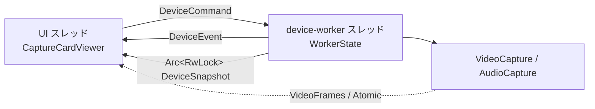

# デバイスワーカースレッド

デバイスを開く・閉じる・列挙する処理を専用スレッド 1 本へ隔離した理由と、そこで決めた取り決め。
UI スレッドとの共有の仕方、開き直しの差分判定をどちら側に置くか、最小化中の扱いを扱う。
目指す構造そのものは `docs/ARCHITECTURE.md` の「並行性」にある。

## デバイス操作はワーカースレッドが行う

**デバイスを開く・閉じる・列挙する・能力を問い合わせる処理は、すべて専用のワーカースレッド 1 本の上で起きる。** UI スレッドは `DeviceCommand` を送り、`DeviceEvent` を `update()` の中で非ブロックに受け取るだけ。`start_capture` は実測 20〜93ms、`start_passthrough` は 300ms 前後、音声デバイスの列挙も 300ms 前後かかる。これを `update()` の中でやっていた頃は、接続を試すたびに描画がその分だけ飛んでいた。

**チャネルを通さない共有が 4 つある。** どれもデバイスを開く処理を挟まないので、コマンドの列に並べる理由がない。

| 共有するもの | 型 | 触る側 |
|---|---|---|
| 映像フレーム | `video::VideoFrames`（`Arc<Mutex<FrameBuffer>>`） | フレームコールバックが書き、UI スレッドが読む |
| 色空間・レンジ・明るさ・コントラスト・彩度 | `Arc<video::SharedColorConversion>`（Atomic） | UI スレッドが書き、フレームコールバックが読む |
| 音量・ミュート・パススルー | `Arc<audio::AudioControls>`（Atomic） | UI スレッドが書き、出力コールバックが読む |
| 音声のリサンプル補正の水位・補正係数 | `Arc<audio::ResampleTelemetry>`（Atomic） | 出力コールバックが水位を書き、デバイスワーカーが `tick` の中で補正係数を書く。**入出力の形が揃っている（identity）ストリームでは作らない**（`AudioCapture::resample_telemetry()` が `None` を返す） |

**映像フレームを `DeviceEvent` で送らないこと。** 接続やデバイス列挙の後ろで待たされ、遅延が増える。

これとは別に、「いま何に繋がっているか」もチャネルを通さず `DeviceSnapshot`（`Arc<RwLock<..>>`）で共有する。UI は `update()` の先頭で 1 回だけ複製を読み、描画も「接続状態」タブもそこから引く。**イベントを取りこぼしても表示が食い違わないよう、状態は必ずこちらを正とする。** ワーカーはイベントを送る前に観測値を書き出すので、UI 側は**イベントを取り込んでからスナップショットを読む**。逆にすると「接続に失敗した」を受け取ったフレームで失敗前の観測値を見る。

**開き直しが要るかの差分判定はワーカー側が持つ。** UI は 2 秒ごとに `DeviceConfig` を丸ごと送り、ワーカーが前回接続できた対象（`last_video_target` / `last_audio_target`）と比べる。UI 側に記録を置くと、接続の成否を知っているのはワーカーなのに記録は UI、という分かれ方になる。

- コマンドは受けた順に 1 つずつ処理する。**ワーカーは止まってよい。** 音声の対応設定が無ければ開く直前にその場で取りに行く（以前は届くまで接続を見送る仕組みを UI 側に持っていた）
- ループはコマンドを待つ前に期限（`tick`）を片付ける。こうしないと、起動直後に積まれる「デバイス能力の取得」（数百 ms）の後ろで最初の接続が待たされる
- コマンドを待つ間隔は、接続を追いかけている間が 100ms、それ以外が 500ms（`next_tick_delay`）。バックオフの最小値が 200ms なので、それより細かく起きる意味はない
- 終了は `on_exit` が `DeviceWorker::shutdown()` を呼んでストリームを閉じさせ、join する。**スクリーンショットの保存スレッドと同じ扱い。** 待たないと閉じる途中でプロセスが落ちる
- **`AudioCapture` はワーカースレッドの中で作る。** `cpal::Stream` は `!Send` で、作ったスレッド以外へ持ち出せない

## 最小化中も再接続と切断監視は止まらない

接続の再試行・フレーム途絶の検出・音声ストリームのエラーの回収・Windows 側の既定デバイスの追従は、どれもワーカー自身のタイマーで回す。**`update()` からは何も駆動しない。**

eframe は最小化されたウィンドウの再描画要求を捨てるため、最小化中は `update()` が呼ばれない。`update()` から駆動していた頃は、その間これらがすべて止まっていた（#133）。**時間で動くデバイス処理を `update()` から呼ぶ形へ戻さないこと。**

`update()` に残っている `#133` の範囲は**ホットキーのアクション実行**だけ。押下の検出はリスナースレッドが行うが、実行（フルスクリーン切替、音量 OSD など）は UI スレッドでしかできないため、最小化中は復帰まで持ち越される。
