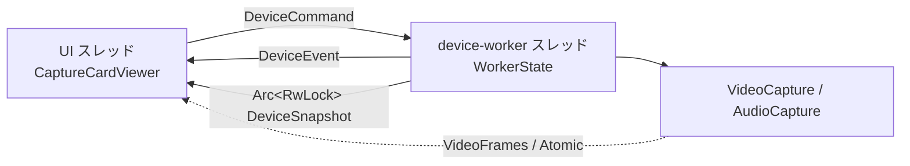
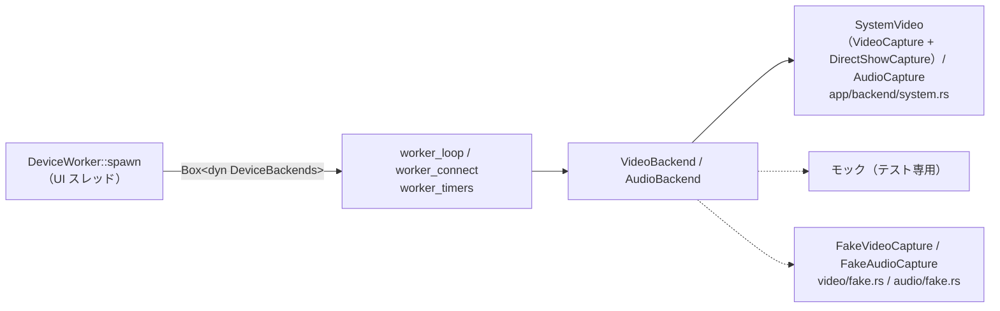

# デバイスワーカースレッド

デバイスを開く・閉じる・列挙する処理を専用スレッド 1 本へ隔離した理由と、そこで決めた取り決め。
UI スレッドとの共有の仕方、開き直しの差分判定をどちら側に置くか、最小化中の扱いを扱う。
目指す構造そのものは `docs/ARCHITECTURE.md` の「並行性」にある。

## デバイス操作はワーカースレッドが行う

**デバイスを開く・閉じる・列挙する・能力を問い合わせる処理は、すべて専用のワーカースレッド 1 本の上で起きる。** UI スレッドは `DeviceCommand` を送り、`DeviceEvent` を `update()` の中で非ブロックに受け取るだけ。`start_capture` は実測 20〜93ms、`start_passthrough` は 300ms 前後、音声デバイスの列挙も 300ms 前後かかる。これを `update()` の中でやっていた頃は、接続を試すたびに描画がその分だけ飛んでいた。

**チャネルを通さない共有が 4 つある。** どれもデバイスを開く処理を挟まないので、コマンドの列に並べる理由がない。

| 共有するもの | 型 | 触る側 |
|---|---|---|
| 映像フレーム | `video::VideoFrames`（`Arc<Mutex<FrameBuffer>>`） | フレームコールバックが書き、UI スレッドが読む |
| 色空間・レンジ・明るさ・コントラスト・彩度 | `Arc<video::SharedColorConversion>`（Atomic） | UI スレッドが書き、フレームコールバックが読む |
| 音量・ミュート・パススルー | `Arc<audio::AudioControls>`（Atomic） | UI スレッドが書き、出力コールバックが読む |
| 音声のリサンプル補正の水位・補正係数 | `Arc<audio::ResampleTelemetry>`（Atomic） | 出力コールバックが水位を書き、デバイスワーカーが `tick` の中で補正係数を書く。**入出力の形が揃っている（identity）ストリームでは作らない**（`AudioCapture::resample_telemetry()` が `None` を返す） |

**映像フレームを `DeviceEvent` で送らないこと。** 接続やデバイス列挙の後ろで待たされ、遅延が増える。

これとは別に、「いま何に繋がっているか」もチャネルを通さず `DeviceSnapshot`（`Arc<RwLock<..>>`）で共有する。UI は `update()` の先頭で 1 回だけ複製を読み、描画も「接続状態」タブもそこから引く。**イベントを取りこぼしても表示が食い違わないよう、状態は必ずこちらを正とする。** ワーカーはイベントを送る前に観測値を書き出すので、UI 側は**イベントを取り込んでからスナップショットを読む**。逆にすると「接続に失敗した」を受け取ったフレームで失敗前の観測値を見る。

**開き直しが要るかの差分判定はワーカー側が持つ。** UI は 2 秒ごとに `DeviceConfig` を丸ごと送り、ワーカーが前回接続できた対象（`last_video_target` / `last_audio_target`）と比べる。UI 側に記録を置くと、接続の成否を知っているのはワーカーなのに記録は UI、という分かれ方になる。

- コマンドは受けた順に 1 つずつ処理する。**ワーカーは止まってよい。** 音声の対応設定が無ければ開く直前にその場で取りに行く（以前は届くまで接続を見送る仕組みを UI 側に持っていた）
- ループはコマンドを待つ前に期限（`tick`）を片付ける。こうしないと、起動直後に積まれる「デバイス能力の取得」（数百 ms）の後ろで最初の接続が待たされる
- コマンドを待つ間隔は、接続を追いかけている間が 100ms、それ以外が 500ms（`next_tick_delay`）。バックオフの最小値が 200ms なので、それより細かく起きる意味はない
- 終了は `on_exit` が `DeviceWorker::shutdown()` を呼んでストリームを閉じさせ、join する。**スクリーンショットの保存スレッドと同じ扱い。** 待たないと閉じる途中でプロセスが落ちる
- **`AudioCapture` はワーカースレッドの中で作る。** `cpal::Stream` は `!Send` で、作ったスレッド以外へ持ち出せない

## 最小化中も再接続と切断監視は止まらない

接続の再試行・フレーム途絶の検出・音声ストリームのエラーの回収・Windows 側の既定デバイスの追従は、どれもワーカー自身のタイマーで回す。**`update()` からは何も駆動しない。**

eframe は最小化されたウィンドウの再描画要求を捨てるため、最小化中は `update()` が呼ばれない。`update()` から駆動していた頃は、その間これらがすべて止まっていた（#133）。**時間で動くデバイス処理を `update()` から呼ぶ形へ戻さないこと。**

ホットキーのアクション実行も、**画面が要らないもの（デバイス再接続・音量・ミュート）はリスナースレッドからこのワーカーへコマンドとして流す**（`DeviceCommand::ReconnectNow` / `AdjustVolume` / `ToggleMute`）。ワーカーがウィンドウの状態に関係なく動く唯一のスレッドだからで、UI スレッドの代役をここに置いている。実行したことは `DeviceEvent` で返し、復帰した最初のフレームで UI 側の設定と OSD を追従させる。画面が要るもの（フルスクリーン切替、最前面表示、スクリーンショット）は復帰まで持ち越す。詳しくは `docs/design/hotkeys.md` の「最小化中の扱い」。

## デバイスに触る入口は trait 1 枚で仕切る

**ワーカーは `app::backend` の `VideoBackend` / `AudioBackend` 越しにしかデバイスへ触らない。** `worker_loop` / `worker_connect` / `worker_timers` はどれも `Box<dyn ..>` を持つだけで、`VideoCapture` / `AudioCapture` という具体型を知らない。実装を選ぶのは `DeviceWorker::spawn` の 1 か所（`backend::backends_from_env`。既定は `SystemBackends`、環境変数を指定したときだけフェイク）で、そこが `BackendShared`（フレーム・色変換・音量・再描画の窓口）と一緒にワーカースレッドへ送り、**組み立てはあちら側で行う**（`cpal::Stream` が `!Send` なので、作る場所は使うスレッドでなければならない）。

**境界はワーカーがデバイスへ触る場所に置く。** 開く・閉じる・列挙する・能力を問い合わせる・観測値を読む、の 5 つだけで、`worker_connect` と `worker_timers` が呼ぶ操作がそのまま trait のメソッドに並ぶ。ここより上（コマンドの解釈、再試行の期限、途絶の判定）はもともと `WorkerState` と `monitor` / `retry` の側にあり、デバイスを知らない。ここより下は、nokhwa の開閉とフレームコールバックが `src/video/capture.rs`、cpal の開閉が `src/audio/capture.rs`、cpal のストリームの組み立てと入出力のコールバックが `src/audio/stream.rs` にある。**`video` / `audio` の側は trait を知らない。** `VideoCapture` / `AudioCapture` は自分の固有メソッドを持つだけで、trait に包むのは `app/backend/system.rs` の `impl VideoBackend for SystemVideo`（Media Foundation の `VideoCapture` と DirectShow の `DirectShowCapture` を束ねたもの）/ `impl AudioBackend for AudioCapture` の役目（フェイクは `app/backend/fake.rs`）。

**フレームコールバックと cpal のコールバックの経路には挟まない。** 映像フレームは `VideoFrames`、音量とミュートは `AudioControls` の共有ハンドル越しに今までどおり流れる。あの 2 つのコールバックはロックもアロケーションもしない決まりで（`docs/design/video-pipeline.md` / `docs/design/audio.md`）、動的ディスパッチを足す場所ではない。trait 化したのは開閉と問い合わせだけなので、1 回の接続につき数回しか通らない。

### 開いたストリームは実装自身が持つ

**`start_capture` / `start_passthrough` は `Result<(), _>` を返し、開いた結果を別のハンドル型では返さない。** 開いたストリームは実装の中にしまわれ、trait オブジェクトそのものがその窓口になる。映像なら `stop_capture` / `link_state` / `active`、音声なら `stop_capture` / `active` / `resample_status` / `resample_telemetry` / `underrun_count` / `take_stream_error` が、いま開いているストリームについて答える。閉じている間は `active()` が `None`、`underrun_count()` が `None`、`link_state().capturing` が偽になり、「開いていない」ことは戻り値で表す。

実装の中身は「開くたびに作り直すもの」と「開き直しても引き継ぐもの」に分かれている。

| 実装 | 開くたびに作り直すもの | 開き直しても引き継ぐもの |
|---|---|---|
| `VideoCapture`（`src/video/capture.rs`） | `camera`（`CallbackCamera`）、`active` | `frames`、`color_conversion`、`repaint_waker` |
| `DirectShowCapture`（`src/video/directshow/mod.rs`） | `graph`（`CaptureGraph`。フィルターグラフとレンダラー）、`active` | `frames`、`color_conversion`、`repaint_waker`、COM の初期化 |
| `AudioCapture`（`src/audio/capture.rs`） | `input_stream` / `output_stream`、`active`、`resample_telemetry`、`stream_error`、`underruns` | `host`、`controls` |

ハンドル型にするとは、左の列を別の型へ出して `start_*` の戻り値にし、閉じるのをその値の drop に任せる形のこと。#102 でこの形を採らなかった理由は「`src/video.rs`（当時 2,451 行）の中身を動かさないと切り出せない」だった。#197 で `src/video/` / `src/audio/` に分けたあとは、左の列はどちらも `capture.rs` 1 ファイルに収まっている。切り出しは `capture.rs` と `backend.rs` とワーカーの中で済むので、この理由はもう当たらない。

**それでも、今はハンドル型にしない。** 理由は 2 つある。

- **#142 のフェイクが作りやすくならない。** フェイクが開いたストリームとして持つのは「テストパターンや正弦波を吐くスレッド」と「開いた内容」くらいで、`VideoCapture` が `CallbackCamera` を抱えるのと同じ形で自分の中に持てる。フェイクを書くうえで引っかかるのは、次の項に書く可視性のほうで、ハンドルの有無とは関係がない
- **ワーカー側の書き換えが得より大きい。** `WorkerState` がバックエンドと `Option<ハンドル>` を映像・音声それぞれ別に持つことになり、`worker_loop` / `worker_connect` / `worker_timers` で観測値を読む箇所（`link_state` / `active` / `resample_*` / `underrun_count` / `take_stream_error`）がすべて `Option` 越しになる。モックもハンドル側と二重になる。得られるのは主に、`AudioCapture` の「開き直すたびにエラーの旗とアンダーランの数え手を新しい `Arc` へ差し替える」決まりを型で強制できることだが、この差し替えは `start_passthrough` と `stop_capture` の 2 か所に閉じていて、手で守れている

見直すのは、**新しいストリームを開いてから古いものを閉じたい**（切り替え時の暗転を縮める）ときか、フェイクの実装で旗の差し替えを同じように書き写すことになり、取り違えが心配になったとき。前者は「実装が同時に 1 本だけ持つ」今の形では書けないので、ハンドル型が要る。後者は #142 で現実になっていて、`FakeAudioCapture`（`src/audio/fake.rs`）が同じ差し替えを `start_passthrough` / `stop_capture` に書き写している。いまは 2 実装 × 2 か所で手で守れているが、実装がさらに増えるなら見直す。

### DirectShow のバックエンド（#143）

**Media Foundation に出ないデバイスのための 2 本目の経路。** nokhwa の Windows バックエンドは Media Foundation だけなので、DirectShow のフィルターとしてしか登録されない仮想カメラ（OBS の仮想カメラなど）や古いキャプチャーボードは一覧に出なかった。

| 置き場所 | 持つもの |
|---|---|
| `src/video/directshow/mod.rs` | `DirectShowCapture`。`VideoCapture` と同じ窓口（列挙・能力・開く・閉じる・観測）と、表示名の「(DirectShow)」の付け外し |
| `src/video/directshow/devices.rs` | 列挙（`ICreateDevEnum` の `CLSID_VideoInputDeviceCategory`、表示名は `IPropertyBag` の `FriendlyName`）、対応形式（`IAMStreamConfig::GetStreamCaps`）、開く形式の選び方（`choose_candidate`、純粋関数） |
| `src/video/directshow/graph.rs` | `CaptureGraph`。`IGraphBuilder` / `ICaptureGraphBuilder2` の組み立て、`SetFormat`、`RenderStream`、`Run`、`Stop` と破棄。グラフのイベント（`IMediaEventEx`）を待たずに読み、デバイスの喪失を拾う（`poll_device_lost`） |
| `src/video/directshow/filter.rs` | サンプルを受ける自前のレンダラーフィルター（`IBaseFilter` / `IPin` / `IMemInputPin`、`windows` クレートの `#[implement]`） |
| `src/video/directshow/media_type.rs` | `AM_MEDIA_TYPE` の読み書きと解放、COM の初期化（`ComApartment`） |
| `src/app/backend/system.rs` | `SystemVideo`。Media Foundation と DirectShow を 1 つの `VideoBackend` に束ねる |

#### 一覧と名前

- **一覧は Media Foundation を優先する。** DirectShow の列挙には Media Foundation に出るデバイス（WDM のキャプチャーボードや Web カメラ）も並ぶので、表示名が Media Foundation の一覧と同じものは捨て、DirectShow にしか無いものだけを「(DirectShow)」を添えて足す（`merge_video_devices`）。同じデバイスを 2 経路で並べても選び間違えるだけで、実績があるのは Media Foundation のほう
- **どちらで開くかは名前の印だけで決まる**（`route_for`）。設定に保存されるのも「(DirectShow)」付きの名前。**この印は翻訳しない。** 設定に残る識別子なので、画面の言語を切り替えると別のデバイス扱いになってしまう
- 名前の照合は表示名（`FriendlyName`）で行う。同じ名前のデバイスが 2 台あれば先に列挙されたほうを開く（Media Foundation の経路と同じ）

#### スレッドと COM

- **グラフの生成・開始・停止・破棄はすべてデバイスワーカースレッドで行う。** `DirectShowCapture` はワーカーの中で `SystemBackends::create` が作り、COM のオブジェクト（`IMoniker` / `IGraphBuilder` / フィルター）はワーカーから出ない
- **COM はワーカースレッドで 1 回、STA で初期化する**（`DirectShowCapture::new` の `ComApartment::enter`）。同じスレッドで nokhwa と cpal がどちらも STA で初期化しており、ここだけ MTA にすると後から初期化する側が `RPC_E_CHANGED_MODE` で失敗する（nokhwa はそれを起動の失敗として扱う）。`DirectShowCapture` が落ちるとき（ワーカーの終了時）に、グラフを手放してから初期化を戻す
- グラフが動くと、上流のフィルター（キャプチャーのフィルター。間に変換フィルターが入ればそれ）が**自分のストリーミングスレッドから**レンダラーの `IMemInputPin::Receive` を呼ぶ。nokhwa のフレームコールバックスレッドにあたり、`docs/design/threads.md` の一覧にも載せてある。**ここではロックもアロケーションもしない。** `FrameSink` は `Mutex` で包まず、ストリーミングスレッドだけが触る前提の「待たない旗」（`StreamSlot`）で守る。接続し直しの最中に重なったら、そのサンプルを捨てて待たない
- 基準時計は外す（`IMediaFilter::SetSyncSource(NULL)`）。付けたままだと途中に入った変換フィルターがタイムスタンプまで待つことがあり、その分だけ遅れる
- 閉じるときは `IMediaControl::Stop`（上流のストリーミングスレッドが止まるまで戻らない）→ 各フィルターを `RemoveFilter`（ピンの接続が切れ、フィルター・ピン・グラフの参照の循環がほどける）→ 手放す、の順

#### 自前のレンダラーフィルター

`ISampleGrabber`（qedit.h）は今の Windows SDK から消えていて、`windows` クレートにも無い。**入力ピンを 1 本だけ持つフィルターを自分で書いている。**

- 受け取る形式は YUY2（YUYV も同じ並びなので含める）/ MJPEG / RGB24 で、`FORMAT_VideoInfo` か `FORMAT_VideoInfo2`。それ以外は `QueryAccept` / `ReceiveConnection` で断る。直接繋がらなければ `RenderStream` が変換フィルターを間に挟もうとする
- 自分から勧める形式は無い（`EnumMediaTypes` は空）。形式を決めるのは、接続の前に `IAMStreamConfig::SetFormat` で選んだ 1 つ
- アロケーターは上流に任せ、求められたら標準のもの（`CLSID_MemoryAllocator`）を渡す
- **参照の数え方は DirectShow の決まりに合わせる。** フィルター → ピン、ピン → 接続先のピンは数える。ピン → フィルター、フィルター → グラフは数えない（数えると循環して解放されない）。ピンが持つフィルターの生ポインタは、フィルターが消えるときに null へ戻す

#### 形式ごとの経路

| 形式 | `FrameSink` の受け口 | 色空間・映像調整 | 変換先の確保 |
|---|---|---|---|
| YUY2 | `push_yuy2`（nokhwa の経路と同じ高速パス） | 効く | 使い回す |
| RGB24 | `push_bgr24`（B・G・R を R・G・B へ、ボトムアップなら行を逆順に） | 効かない | 使い回す |
| MJPEG | `push_mjpeg`（`convert::mjpeg_to_rgb`） | 効かない | 展開先は使い回すが、デコーダの内部で確保が起きる |

**MJPEG の展開に nokhwa のデコーダ（mozjpeg）は使わない。** mozjpeg は壊れたデータを panic で知らせて内部で `catch_unwind` するが、release は `panic = "abort"` なので（`docs/design/logging.md`）そのままプロセスが落ちる。キャプチャーの MJPEG は途中で欠けたフレームが混ざりうるので、エラーを値で返す `image` クレートの JPEG デコーダを使い、壊れたフレームは捨てて初回だけ記録する。

開く形式の選び方（`choose_candidate`）は、指定された形式がデバイスにあればその形式の中から、解像度が一致するもの → 画素数が近いもの → 形式が未指定なら YUY2・MJPEG・RGB24 の順 → fps が近いもの。解像度が未指定なら Media Foundation の経路と同じく 1280x720 60fps を求め、fps は 15〜120 へ丸める。**Media Foundation の経路と違い、MJPEG / RGB24 を選べばその形式で開く**（`docs/design/video-pipeline.md` の「UI にあるが動作していない設定がある」）。

#### DirectShow では確かめていないもの

手元で確かめたのは OBS の仮想カメラ（YUY2 / NV12 / I420 を出し、受け取れるのは YUY2 だけ）だけ。**DirectShow 専用の実機のキャプチャーボード、MJPEG / RGB24 を出すデバイス、途中で形式が変わるデバイス、変換フィルターが間に入る組み合わせは試していない。** 抜き差しの検出は、グラフのイベント（`EC_DEVICE_LOST` など、#229）とフレームの途絶（3 秒）の 2 本立て（`docs/design/reconnect.md` の「切断の検出と再接続」）。イベントがどの機器で実際に届くかは確かめていない（OBS の仮想カメラの停止で確かめる手順は `docs/MANUAL-TEST.md` の「DirectShow のデバイス（#143）」）。

### フェイクデバイス（#142）

**実機なしで映像と音声を流すための、trait の実装の 1 つ。** 環境変数 `CAPTURECARD_VIEWER_FAKE_DEVICES=<台数>` を指定して起動したときだけ使われ、指定が無ければ本番のまま何も変わらない。release ビルドにも入っているが既定では無効で、ログのレベル（`CAPTURECARD_VIEWER_LOG`、`docs/design/logging.md`）と同じく設定ファイルには持たせていない。ログを見る場面と同じで、使うのは開発や不具合の切り分けのときに限られるため。

| 置き場所 | 持つもの |
|---|---|
| `src/video/fake.rs` | `FakeVideoCapture`。デバイスとしての振る舞い（名乗る名前、対応形式、シナリオ）と生成スレッド |
| `src/video/test_pattern.rs` | テストパターンの描画（カラーバー、ベタ塗り、フレーム番号の焼き込み）。純粋関数 |
| `src/audio/fake.rs` | `FakeAudioCapture`。正弦波を出す入力と、書き込みを捨てる出力のスレッド |
| `src/app/backend/fake.rs` | `FakeBackends`（`DeviceBackends`）、上の 2 つを trait に包む impl、環境変数の解釈 |

**フェイクを `src/video/` / `src/audio/` の中に置いたのは、共有の窓口がそこにしか無いため。** `app::backend` に直接書くと届かない。

- **映像フレームを `FrameBuffer` へ積む口:** `VideoFrames::buffer()` / `FrameBuffer::push_back` は `pub(super)` で、`src/video/` の外からは積めない。さらに実機と同じ変換を通した RGB を確かめるには、nokhwa のクロージャに書かれていたフレームコールバックの本体（YUY2 → RGB、`push_back`、`RepaintWaker::wake`）を共有する必要があった。これを「幅・高さ・バイト列」を受ける `FrameSink`（`src/video/frame_sink.rs`）へ出し、nokhwa のコールバックとフェイクの生成スレッドの両方がそこを通る
- **`AudioControls` の読み方:** フィールドが `pub(super)` で、出力コールバックと同じ判定は `src/audio/stream.rs` にしか無い。cpal のクロージャの本体を `process_input` / `process_output` へ出し、フェイクの入出力スレッドも同じものを呼ぶ。開く設定の選び方も `choose_passthrough_configs`（`src/audio/stream_config.rs`）へ出して共有した。**音量・ミュート・パススルー、クロックドリフト補正の水位（`ResampleTelemetry`）、アンダーランの数え方は本物と同じ経路で動く**
- **実装を選ぶ場所:** `DeviceWorker::spawn` が `backend::backends_from_env()` を呼ぶ 1 か所だけ。ワーカーの側は何も変えていない

#### 名乗るデバイスと流すもの

| デバイス | 中身 |
|---|---|
| Fake Camera 1, 3, … | 75% のカラーバー 8 本（白・黄・シアン・緑・マゼンタ・赤・青・黒）。YUY2 |
| Fake Camera 2, 4, … | ベタ塗り。2 番が青、4 番が赤、6 番が緑、8 番が黄。YUY2 |
| Fake Audio Input 1, 2, … | 48kHz 2ch の正弦波。1 番が 440Hz、2 番が 880Hz、… |
| Fake Audio Output 1 | 48kHz 2ch。入力と形が揃うので変換しない |
| Fake Audio Output 2 | 44.1kHz 1ch。入力と揃わないので変換し、ドリフト補正の対象になる |

- 映像の台数と音声の入力の台数が `CAPTURECARD_VIEWER_FAKE_DEVICES` の値（1〜8。超えたら 8）。出力は常に 2 台。0・空・数字でない値はフェイクを使わない（打ち間違えでフェイクになるより、実機のまま起動するほうが害が小さい）
- 映像の対応形式は YUY2 の 1920x1080 / 1280x720 / 640x480 × 60 / 30fps。一覧に無い解像度は画素数が最も近いものへ、fps は実機と同じく 15〜120 へ丸める。解像度が未指定なら実機と同じ 1280x720 60fps
- 名前の引き方は実機と同じ。設定に実機のデバイス名が書かれていれば「見つからない」で再試行し続け、フェイクの先頭へは倒さない（`docs/design/reconnect.md` の「音声は繋がらなくても別のデバイスへ倒さない」と同じ考え方）。設定が空なら起動直後の既定の決定（`resolve_default_devices`）で「Fake Camera 1」「Fake Audio Input 1」が選ばれる
- どの映像にも左上へフレーム番号を焼き込む。パターンの色は、解像度が HD なら BT.709、それ未満なら BT.601 のリミテッドレンジで符号化する。色空間を「自動」にしておけば意図した色に戻り、実機のキャプチャーボードと同じく、色空間やレンジを取り違えると色がずれて見える

#### シナリオ

`CAPTURECARD_VIEWER_FAKE_SCENARIO` に、次の項目をカンマで区切って並べる。大文字小文字と前後の空白は問わない。読めない項目はログに残して読み飛ばす。

| 書式 | 起きること |
|---|---|
| `disconnect:<秒>` | 映像を開いてから `<秒>` 経つとフレームを止める（ストリームは開いたまま、信号だけが途絶える）。**開き直すたびに数え直す**ので、途絶の検出（3 秒）→ 再接続 → また `<秒>` 流れて止まる、を繰り返す。0 は受け付けない（1 枚も届かない状態は切断とみなさない決まりなので、再現にならない。`docs/design/reconnect.md`） |
| `audio-error:<秒>` | 音声を開いてから `<秒>` 経つと、ストリームのエラーの旗（本物の cpal のエラーコールバックが立てるのと同じもの）を 1 回立てる。ワーカーが `take_stream_error` で拾って開き直し、**開き直すたびに数え直す**。0 は受け付けない（開いた直後に毎回エラーになり、再接続の間隔の下限でしか音が出なくなる） |
| `fail:<回数>` | 映像と音声のそれぞれで、最初の `<回数>` 回だけ開くのに失敗する。バックオフでの再試行を再現する |

例: `CAPTURECARD_VIEWER_FAKE_SCENARIO=fail:3,disconnect:10`

#### スレッド

映像は開いている間だけ生成スレッドを 1 本（`fake-video`）、音声は入力と出力に 1 本ずつ（`fake-audio-in` / `fake-audio-out`）立てる。どれも `start_capture` / `start_passthrough` で起こし、`stop_capture` で止めて **join する**（`JoinHandle` は捨てない）。止める合図はチャネルの送り手を落とすことで、待ちは `recv_timeout` なのですぐ抜ける。「デバイスに触る使い捨てのスレッドを作らない」（`docs/design/threads.md`）とは別物で、cpal / nokhwa がストリームごとに持つコールバックスレッドの代役にあたる。

音声のスレッドは 10ms ごとに起き、開始からの経過時間ぶんに足りない数のサンプルを処理する。起きる間隔が揺れても平均のレートはずれない。

#### フェイクでは確かめられないもの

Media Foundation と WASAPI そのものの挙動（列挙の遅さ、フォーマットの癖、`Camera::new` の所要時間、MJPEG のデコード、デバイスが消えたときの cpal のエラー）は再現できない。これらは実機と `docs/MANUAL-TEST.md` のまま。

### これで実機なしに何が試せるか

テスト用のモックは `app::backend` の `mock`（`#[cfg(test)]`）にある。持たせたのは「指定回数失敗してから成功する」「列挙結果を差し替える」「フレームが止まったことにする」「音声ストリームのエラーを起こす」の 4 つだけで、映像や音声の中身は作らない。

モックを載せた `WorkerState` は、スレッドを起こさずに `tick(now)` を呼べる。**渡す時刻はテストが決めてよい**ので、バックオフ（200ms → 400ms → …）もフレームの途絶（3 秒）も実時間を待たずに跨げる。`ConnectRetry` と `monitor` がもともと `Instant` / `Duration` を引数で受け取る形だったため、時刻の注入のために足した仕組みは無い。

**カラーバーや正弦波を吐くのはモックではなくフェイク**（上の「フェイクデバイス（#142）」）。モックは「ワーカーの分岐を通す」ためだけのもので、映像や音声の中身は作らない。色変換の期待値の検証（`src/video/test_pattern.rs` のテスト）や、ワーカー本体にフェイクを載せて再試行から映像が届くまでを通すテスト（`src/app/backend/fake.rs`）、デバイス切替 UI・自動復帰・スクリーンショットの通し確認はフェイクの側で行う。
