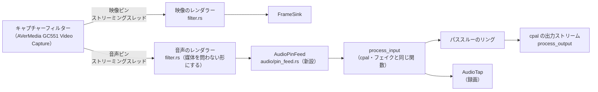
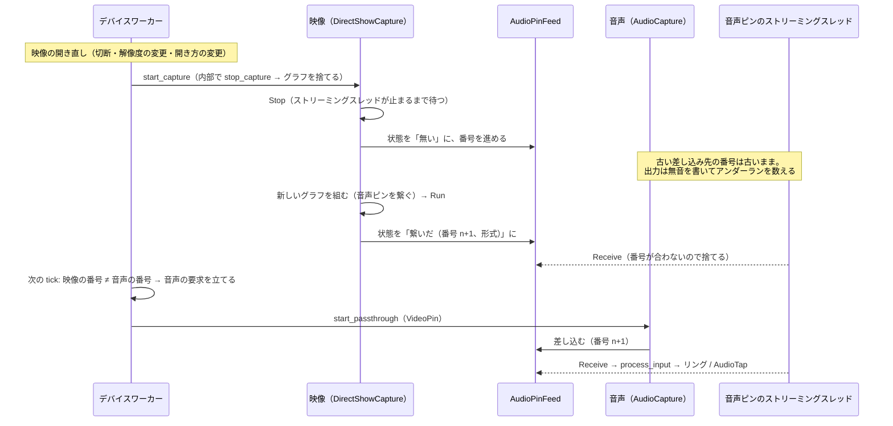

# DirectShow の映像デバイスの音声ピン（#388）

WASAPI に音声が出ないキャプチャーボード（AVerMedia GC551）の音を、DirectShow のキャプチャーフィルターが映像ピンと並べて持つ**音声ピン**から取り込むための設計。
受け口のフィルターをどこに置くか、受けた PCM を既存のパススルーと録画の経路へどう流すか、映像のグラフと音声の寿命、設定・UI・対応設定、ドリフトと録画の PTS、段階分けを扱う。

**第 1 段（設定ファイルの `[audio] input_source = "video_pin"` で鳴る・録画に入る、#393）と第 2 段（設定ダイアログの項目・初回の既定・フェイクの音声ピン、#394）を実装済み。** 第 3 段（塊の長い機種、レート・チャンネル数の選択）は実機で問題が見つかったときだけ。実装で文書と変えたところと、実機（GC551）で確かめた値は「第 1 段の実装で変えたところと実機の値」と「第 2 段の実装で変えたところ」の節にまとめた。

## 決まっていること

#388 のコメントで決まったもの。**この文書の中で覆さない。**

- GC551 の音声は WASAPI に出ない。DirectShow のフィルター「AVerMedia GC551 Video Capture」は映像ピンと音声ピンを 1 つのフィルターに持つ。ffmpeg の実測（2026-10-01）では、映像と音声を同じフィルターから同時に開いたときだけ音声ピンから `pcm_s16le 48000 Hz stereo` が取れ、音声だけのデバイス（`CLSID_AudioInputDeviceCategory`）としては見つからなかった
- **音声ピンだけを別のグラフで開く経路は無い。「DirectShow で開いた映像フィルターと同じグラフに音声ピンを繋ぐ」で確定**
- ユーザー判断（2026-10-01）: 音声は必要。1.3.0 に含める。UI と設計は Claude に任せる

範囲外にするもの: DirectShow の音声だけのフィルター（`CLSID_AudioInputDeviceCategory`）を開く経路、Media Foundation で開いた映像と組み合わせる経路（Media Foundation の映像には音声ピンが無い）。

## 前提の裏取り

2026-10-01 の `dev`（`71814c9`。#387 の行だけ `3102480`）の実コードで確かめたこと。設計はこの上に立つ。

| 対象 | 実コードでどうなっているか |
|---|---|
| グラフの組み立て（`src/video/directshow/graph.rs` の `CaptureGraph::start`） | 名札からフィルターを作る → グラフへ入れる → `IAMStreamConfig::SetFormat` → 自前のレンダラーを入れて `RenderStream(PIN_CATEGORY_CAPTURE, MEDIATYPE_Video)`（だめならカテゴリなし）→ `SetSyncSource(NULL)` → `Run`。**音声ピンには何も繋いでいない**（未接続のまま `Run` している）。破棄は `Stop` → `RemoveFilter` の順（`Drop`） |
| レンダラー（`src/video/directshow/filter.rs`） | 入力ピン 1 本の `IBaseFilter` / `IPin` / `IMemInputPin`。受け取る形式は映像（`sample_format_of`）だけ。`Receive` はロックもアロケーションもせず、中身は `StreamSlot`（待たない旗）で守る。**捨てるときも `Ok` を返す**（フラッシュ中だけ `S_FALSE`、停止中は `VFW_E_WRONG_STATE`）。映像に固有なのは `StreamState`（`FrameSink` へ渡す）と受け取る形式の判定だけで、残り（ピンとフィルターの参照の数え方、アロケーター、列挙）は媒体を問わない |
| 対応形式（`src/video/directshow/devices.rs`） | `ICaptureGraphBuilder2::FindInterface(PIN_CATEGORY_CAPTURE, MEDIATYPE_Video)` で `IAMStreamConfig` を取り、`GetStreamCaps` を `VIDEO_STREAM_CONFIG_CAPS` の大きさで読む。音声ピンの `IAMStreamConfig` は読んでいない |
| `AudioCapture::start_passthrough`（`src/audio/capture.rs`） | 入出力とも cpal。リングは `HeapRb<f32>`、容量は `ring_buffer_samples` の 2 倍、目標水位はその半分（`target_water_level`）。`producer` / `consumer` は `Arc<Mutex<..>>`。`AudioTap::begin_stream` は入力ストリームを作る前に呼ぶ。エラーの旗とアンダーラン・捨てたフレーム・`Xrun` の数え手は開くたびに新しい `Arc` へ差し替える |
| 入力のコールバック（`src/audio/stream.rs` の `process_input`） | **cpal 以外のスレッドからも呼ばれている**。フェイクの入力スレッド（`src/audio/fake_stream.rs`）が正弦波を同じ関数へ渡している。リングと `AudioTap` はどちらも `try_lock` で、待たない |
| 出力側（`stream_output.rs` の `process_output`、`convert.rs` の `PassthroughConverter`、`resample.rs`） | 入力の出どころを知らない。見るのはリングの中身と水位だけ |
| バックエンドの組み立て（`src/app/backend/system.rs` の `SystemBackends::create`） | 映像（`SystemVideo` = `VideoCapture` + `DirectShowCapture`）と音声（`AudioCapture`）を**別々の `Box` で返す**。いまは両者をつなぐものが無い。`BackendShared` は UI スレッドから来る共有だけを運ぶ |
| 自動の倒し込み（#387、`src/app/backend/system_route.rs` の `attempt_with_fallback`） | 開き方が「自動」で Media Foundation が「見つかったが開けない」なら、**同じ `start_capture` の呼び出しの中で** DirectShow でも試す。GC551 は両方の一覧に同じ名前で出て Media Foundation では開けないので、既定の設定のまま DirectShow で開く。倒したことは覚えず、開くたびに Media Foundation から試す |
| 接続の順番（`src/app/worker_timers.rs` の `poll_connection`） | 同じ `tick` で両方の期限が来ていれば、**映像を先に、音声を後に**試す |
| 終了（`WorkerState::shutdown`、`app::recording`） | `on_exit` は録画を止めてからワーカーを止める。ワーカーは映像 → 音声の順に閉じる |
| 接続対象（`src/app/worker.rs`） | `VideoTarget` は `(デバイス名, 解像度, フォーマット, fps, 開き方)`、`AudioTarget` は `(入力, 出力, レート, チャンネル数, バッファ長)` のタプル。差分が立つと開き直す |
| 既定のデバイス（`src/app/worker_connect.rs` の `resolve_default_devices`） | 起動直後の `ApplyConfig` の中で、**最初の接続を試す前に**入力の未設定を WASAPI の列挙の先頭で埋める |
| 設定（`src/settings/audio.rs`、`src/settings/preset.rs`、`src/ui/draft.rs`、`src/ui/draft_import.rs`） | `commit_draft` は `target.audio = draft.audio.clone()`、`draft_from_imported` は読み込んだ `audio` をそのまま使い、プリセットは `audio` を丸ごと写して丸ごと比べる。**`AudioSettings` の中に項目を足せば、この 3 か所は手を入れずに付いてくる** |

### 文書と実コードの食い違い

この設計とは別に、裏取りの途中で見つけたもの。どれも挙動の話ではなく説明の古さ。**5 件とも #395 で直した**（あわせて `device-worker.md` の「DirectShow で確かめたもの・確かめていないもの」へ GC551 の実機の結果を書き足した）。

- `docs/ARCHITECTURE.md` の「音声パイプライン」の図は、レート・チャンネル変換をリングバッファの**手前**に置いている。実際はリングに入力の形のまま積み、変換は出力コールバックの中（`PassthroughConverter`）で行う（`docs/design/audio.md` の「入出力の形が違う場合は出力側で変換する」が正しい）
- `docs/design/audio.md` の「ミュートは音量と別に持つ」は「`AudioCapture` の `muted`（`Arc<AtomicBool>`）」と書いているが、実際は `AudioControls::muted`（`AtomicBool`。`Arc<AudioControls>` ごと共有）
- `docs/design/device-worker.md` の「開いたストリームは実装自身が持つ」の表は、`AudioCapture` が開くたびに作り直すものに `dropped_frames`（#350）と `xruns`（#377）を挙げていない
- `src/app/backend/mod.rs` の冒頭のコメントは、trait を呼ぶのを「`worker_connect` と `worker_timers`」、本番の実装を「`VideoCapture` / `AudioCapture`」と書いている。いまは `worker_audio_connect` / `worker_audio_timers` も呼び、映像の本番は `SystemVideo`
- `docs/design/threads.md` の「DirectShow のストリーミングスレッド」の行は本数を「「(DirectShow)」のデバイスをキャプチャ中」としているが、映像の開き方を DirectShow にしたとき（#237）と、自動で Media Foundation から倒したとき（#387）は、印の無いデバイスもこの経路で開く

## 全体の形



**音声ピンは「cpal の入力ストリームの代わり」として扱う。** リングより後ろ（出力コールバック、変換、クロックドリフト補正、音量・ミュート、アンダーランの数え方）と、録画への分岐（`AudioTap`）は今の経路をそのまま通る。変えるのは、リングへ積む手前の「どこからサンプルが来るか」だけ。

グラフ（`CaptureGraph`）の持ち主は今までどおり映像のバックエンド（`DirectShowCapture`）、リングと出力ストリームの持ち主は今までどおり音声のバックエンド（`AudioCapture`）。2 つをつなぐのは、ワーカーの中で閉じた共有 `AudioPinFeed` 1 つだけ。

## (1) 受け口のフィルターの置き場所と、`Receive` のスレッド

### 案

| 案 | 中身 | 良い点 | 悪い点 |
|---|---|---|---|
| A. `filter.rs` を写して音声版を作る | `audio_filter.rs` に入力ピン・フィルター・列挙を丸ごと書く | 映像側に触らない | 700 行近い COM の決まりごと（参照の数え方、アロケーター、状態）が 2 か所になる。片方だけ直す事故が起きる |
| **B. `filter.rs` を媒体を問わない形にし、媒体ごとの部分だけを分ける（推奨）** | `StreamState` を `enum { Video(..), Audio(..) }` にし、受け取る形式の判定もその種類で分ける。音声に固有な部分（`WAVEFORMATEX` の読み取り、ピンの検出、アロケーターの提案、`AudioPinFeed` へ渡す）は新しい `src/video/directshow/audio_pin.rs` に置く | COM の決まりごとが 1 か所のまま。`enum` の `match` なので動的ディスパッチもジェネリクスも要らない | `filter.rs` に手が入る（映像の経路を壊さないことを確かめる） |
| C. 型引数で一般化する | `InputPin<S: SampleSink>` | 型で分かれる | `windows` クレートの `#[implement]` がジェネリクスをどこまで扱えるか確かめていない。得られるものが B と変わらない |

**B を推奨する。** 参照の数え方（ピン → フィルターは数えない、など。`docs/design/device-worker.md` の「自前のレンダラーフィルター」）を 2 か所で守るのは、ここまでの DirectShow の不具合の出方からして割に合わない。`filter.rs` は 686 行なので、音声の分岐を足すなら媒体ごとの処理（映像の `StreamState::receive` を含む）を別ファイルへ出して 800 行に収める。

グラフには**レンダラーを 2 つ入れる**（映像用と音声用。同じ型の別のインスタンス）。それぞれが自分の `StreamSlot` を持つので、互いに待たない。

### `Receive` を呼ぶスレッド

**音声ピンの `Receive` は、キャプチャーフィルターが音声ピンのために持つストリーミングスレッドから呼ばれる。** KS のプロキシは出力ピンごとに I/O のスレッドを持つのが普通だが、映像ピンと同じスレッドか別のスレッドかは**前提にしない**（フィルター次第で、確かめる手段は実機だけ）。レンダラーを分けてあるので、どちらでも同じに動く。

`Receive` で守ること。

- **ロックもアロケーションもしない。** `AudioPinFeed` の差し込み先は `try_lock` で取り、取れなければそのサンプルを捨てる（`process_input` がリングと `AudioTap` を `try_lock` で取るのと同じ扱い）
- **失敗を返さない。** 受け取れない・差し込み先が無い・形式が読めないときも、サンプルを捨てて `Ok` を返す（フラッシュ中と停止中は映像と同じ）。`Receive` が失敗を返すと上流のフィルターはストリームを止め、グラフが `EC_ERRORABORT` などを積む。今の切断の判定（`is_device_lost_event`）はそれを**映像の切断**として扱うので、音声の不調で映像まで開き直しになる
- 時刻は `Receive` の入口で 1 回だけ読む（映像の `received_at` と同じ）。DirectShow のタイムスタンプは使わない。基準時計を外してあるので（`SetSyncSource(NULL)`）、GC551 はタイムスタンプを付けない（`GetTime` が `VFW_E_SAMPLE_TIME_NOT_SET`。基準時計を付けても届いた時刻とほぼ同じ。#406、`docs/design/recording.md` の「DirectShow のサンプルのタイムスタンプ（#406）」）
- `IMediaSample::IsDiscontinuity` が立っていたら、取りこぼしとして数える（cpal の `Xrun` と同じ数え手。「接続状態」タブの「入力の取りこぼし」に出る）

`docs/design/threads.md` のスレッドの一覧には「DirectShow の音声ピンのストリーミングスレッド」を 1 行足す（実装の段で）。**デバイスに触る使い捨てのスレッドには当たらない。** 作るのはキャプチャーフィルターで、cpal / nokhwa のコールバックスレッドの代役にあたる。

### 音声ピンを繋ぐ手順

`CaptureGraph::start` の中、映像を繋いだあと・`Run` の前に行う。

1. `ICaptureGraphBuilder2::FindPin(source, PINDIR_OUTPUT, PIN_CATEGORY_CAPTURE, MEDIATYPE_Audio, ..)` で音声ピンを探す（だめならカテゴリなし）。**見つかったかどうかは、繋ぐかどうかに関係なく記録する**（UI がこの項目を選べるかの判定に使う。(5)）
2. 繋ぐ指定があるときだけ、音声ピンの `IAMStreamConfig` から今の形式（`GetFormat`）を読み、`IAMBufferNegotiation::SuggestAllocatorProperties` で**1 塊を 10ms**にするよう提案する（下の「塊の長さ」）
3. 音声のレンダラーを入れ、`RenderStream(PIN_CATEGORY_CAPTURE, MEDIATYPE_Audio, source, NULL, 音声のレンダラー)`（だめならカテゴリなし）。直接繋がらなければ DirectShow が変換フィルター（ACM Wrapper など）を挟もうとする
4. 繋げたら、実際の形式と、アロケーターが決めた塊の大きさ（`IAMBufferNegotiation::GetAllocatorProperties`、取れなければ最初のサンプルの長さ）をログに残す
5. **どこで失敗しても映像は止めない。** 音声のレンダラーを外し、理由を記録して映像だけで `Run` する

受け取る形式は `MEDIATYPE_Audio` + `FORMAT_WaveFormatEx` で、`WAVE_FORMAT_PCM` の 16bit（GC551 の形）、`WAVE_FORMAT_IEEE_FLOAT` の 32bit と、それらを `WAVE_FORMAT_EXTENSIBLE` で包んだもの。チャンネル数は 1〜8。それ以外は `QueryAccept` / `ReceiveConnection` で断る。24bit / 32bit 整数の PCM は実機の要望が出てから足す。

**`Run` が音声を繋いだせいで失敗したときの扱い。** 未接続のまま動いていたフィルターが、音声ピンを繋ぐと動かなくなる可能性は否定できない（確かめる手段は実機だけ）。`Run` が失敗し、かつ音声を繋いでいたら、1 度だけ `Stop` → 音声のレンダラーを `RemoveFilter`（ピンの接続が切れる）→ `Run` をやり直し、それでも失敗したら今までどおり接続の失敗として返す。やり直したことは `warn` と「接続状態」タブに残す。

### 塊の長さ

DirectShow の音声キャプチャーフィルターは、何も言わないと**数百 ms の塊**で渡してくることがある（ffmpeg の dshow が `-audio_buffer_size` を持ち、既定の大きさは 500ms の倍数のことが多いと説明しているのはこのため。GC551 の塊の長さは測っていない）。このアプリの前提はどれも 10ms 前後の塊で成り立っている。

- パススルーの遅延は `buffer_ms`（既定 50ms、下限 20ms）で、リングの容量はその 2 倍。500ms の塊が来ると 1 回で溢れ、ほとんどを捨てる
- 録画の音声の PTS は「入力コールバックの周期ぶんの誤差を許す」「最後に積んでから 200ms 以上経ったら来ていないとみなして無音で埋める」（`docs/design/recording.md` の「音声（②）」）。塊が 200ms を超えると、届いている音を無音で上書きしようとする

そこで、繋ぐ前に `SuggestAllocatorProperties` で 10ms（48kHz 2ch 16bit なら 1,920 バイト）を提案する。**フィルターが提案を無視したときは、そのストリームに限ってリングを塊の長さに合わせて広げる**（目標水位を塊 2 つぶんにする）。広げたことは `warn` で残し、「接続状態」タブのバッファの行に「設定 50ms → 実際 N ms（音声ピンの塊が M ms のため）」と出す。

- 広げずに開く案は採らない。音がほぼ全部捨てられて、原因が分からないまま「プチプチ鳴る」になる
- 開くのをやめて理由を出す案もあるが、遅れても鳴るほうがよい。理由は画面に出ているので、気付く手段はある
- 設定の `buffer_ms` は書き換えない。デバイスを替えれば元の長さで開く

## (2) PCM を既存の経路へ流す。リングと出力ストリームの持ち主

### 案

| 案 | 中身 | 良い点 | 悪い点 |
|---|---|---|---|
| **A. `AudioCapture` に入力の種類を足す（推奨）** | `start_passthrough` が「cpal の入力を開く」か「`AudioPinFeed` へリングを差し込む」かを分ける。出力ストリーム・リング・変換器・補正・数え手は共通 | `AudioBackend` の実装が 1 つのまま。観測値の窓口（`active` / `resample_*` / `underrun_count` / `dropped_frame_count` / `xrun_count` / `take_stream_error`）がそのまま使える。「開くたびに旗と数え手を新しい `Arc` へ差し替える」決まりも 2 か所（`start_passthrough` / `stop_capture`）に閉じたまま | `capture.rs`（693 行）が 800 行を超えるので、出力側の組み立てを関数へ切り出す必要がある |
| B. 別の型（`PinAudioCapture`）を作り、`SystemVideo` と同じように束ねる | 束ね役が入力の種類で実装を選ぶ | 型が分かれる | 出力側の組み立て（`start_passthrough` の後半）を共有するための切り出しは A と同じだけ要るうえ、観測値の窓口 8 つを両方に書くか束ね役で中継することになる。差し替えの決まりも 3 か所目ができる |

**A を推奨する。** 違いは入力の半分だけで、出力の半分と観測値は同じだから。`capture.rs` は「出力ストリームと変換器・補正を組み立てる」部分を関数へ出し（置き場所は実装の段で決める。`stream_output.rs` が 608 行なので別ファイルが無難）、cpal の入力と音声ピンの入力でそれを共有する。

### 入口（`PassthroughRequest`）

`AudioBackend::start_passthrough(&PassthroughRequest)` の形は変えない。`PassthroughRequest` の `input_device_name` を、入力の種類を持つ enum に置き換える。

```rust
pub enum PassthroughInput<'a> {
    /// WASAPI の入力デバイス（今までの経路）
    Device(Option<&'a str>),
    /// 映像デバイスの音声ピン（AudioPinFeed から押し込まれる）
    VideoPin,
}
```

`VideoPin` のときは `input_capabilities` を使わない（入力の対応設定は `AudioPinFeed` が持つ今の形式から作る。(6)）。

### `AudioPinFeed`（新設、`src/audio/pin_feed.rs`）

音声ピンのレンダラー（`Receive`）と `AudioCapture` をつなぐ差し込み口。`AudioTap` と同じ考え方で作る。

| 持つもの | 書く側 | 読む側 |
|---|---|---|
| 音声ピンの今の状態（無い / あるが繋いでいない / 繋いだ・形式と塊の長さ・グラフの番号 / 繋げなかった・理由） | 映像のバックエンド（ワーカースレッド。グラフを組んだとき・捨てたとき） | 音声のバックエンド（ワーカースレッド。開くとき） |
| 差し込み先（グラフの番号、リングの `producer`、`AudioTap`、捨てたフレームと取りこぼしの数え手、入力の形） | 音声のバックエンド（ワーカースレッド。開くとき差し込み、閉じるとき抜く） | 音声のレンダラーの `Receive`（`try_lock` だけ） |

- **`Receive` は自分のグラフの番号と差し込み先の番号が一致するときだけ積む。** 映像を開き直すと番号が進むので、古いグラフのレンダラー（止まる途中のもの）が新しい差し込み先へ積むことも、新しいグラフが古い形式のリングへ積むことも起きない
- 積むのは `process_input` を呼ぶことで行う。リングへのフレーム単位の積み方、溢れたフレームの数え方、録画への分岐は cpal の入力と同じ関数を通る。DirectShow のバッファはバイト列なので、`process_input` を「サンプルのスライス」ではなく「サンプルを順に返すイテレーター」でも受けられる形にするか、`align_to::<i16>()` で並びが揃っているときだけ読む（揃っていなければ捨てて数える）。前者を推奨する（並びの前提を置かずに済み、cpal の経路は `iter().copied()` を渡すだけになる）。どちらでも確保は起きない
- `process_input` は `audio` の中の `pub(super)` のまま。`AudioPinFeed` が `audio` の中にあるので、`video::directshow` は `AudioPinFeed` の公開メソッドを呼ぶだけで `process_input` を知らない
- **`AudioTap::begin_stream` は差し込む前に呼ぶ。** cpal の経路の「入力のコールバックが動き出す前に書く」は、ここでは「差し込む前に書く」になる。`Receive` は差し込まれるまで何も積まないので、録画スレッドから見た順序は同じ

**`AudioPinFeed` はワーカーの中で閉じた共有。** UI スレッドが作って `BackendShared` に載せるものではなく、`SystemBackends::create`（フェイクなら `FakeBackends::create`）が 1 つ作って映像と音声のバックエンドへ複製を渡す。`docs/design/device-worker.md` の「チャネルを通さない共有が 4 つある」の数には入れない（`ResampleTelemetry` と同じ扱い）。

## (3) 映像のグラフと音声の寿命

### 音声側はどうやって知るか

**ワーカーは映像のバックエンドの `active()` を読む。** `ActiveVideo` に音声ピンの状態（`audio_pin`）を足し、DirectShow の経路は (1) の手順の結果を、Media Foundation の経路は「対象外」を、フェイクは自分の設定を入れる。`AudioBackend` 側は `AudioPinFeed` から形式を読む。どちらも同じグラフの組み立ての結果を、同じワーカースレッドの上で読むので食い違わない。

- trait（`VideoBackend` / `AudioBackend`）に「音声ピンを問い合わせる」メソッドは足さない。観測値の 1 項目にしておけば、`DeviceSnapshot` へ写す経路と「接続状態」タブへの表示がそのまま使える（#229 で `device_lost` を `link_state` の 1 項目にしたのと同じ理由）
- `ActiveAudio` には入力の経路（WASAPI / 音声ピンとそのグラフの番号）を足す

### 開き直しの順序



- **映像を開き直したら、音声も開き直す。** 形式が同じなら差し込み先を残して続ける案もあるが、映像の開き直しはそれ自体で 1 秒前後途切れるので、音声の出力を開き直す数百 ms を惜しむ理由が薄い。形式が変わったときとそうでないときで分岐させない
- 開き直しの要求は**ワーカーの `tick` の監視で立てる**（`worker_audio_timers`）。音声の入力が音声ピンのとき、「映像の音声ピンの番号」と「音声が差し込んでいる番号」を比べ、違えば `last_audio_target = None` にして `audio_retry.request_now` する。判定は純粋関数（`app::monitor`）に出す。`try_connect_video` の成功の枝に書き足す案は採らない。映像を開き直す経路（切断からの再接続、設定の変更、右クリックの再接続、#387 の自動の倒し込み）を 1 か所でまとめて拾えるため
- 音声のストリームのエラー（`take_stream_error`）として知らせる案は採らない。エラーからの開き直しには 5 秒の下限（`AUDIO_ERROR_RECONNECT_MIN_INTERVAL`）があり、映像を開き直すたびに音が 5 秒戻らなくなる。自動再接続を切っていると「エラーで止まった」と通知まで出る（#310）
- 開き直しは `ConnectRetry` の「成功から次の開き直しまで 1 秒」の下限を受ける。音声を開いた直後に映像が開き直すと、音声は最大 1 秒待つ
- 映像が閉じた（番号が「無い」になった）ら、音声は閉じて理由を出す（(5) の「選べない理由」と同じ経路）。出力だけを開いたまま無音を流し続けない
- 起動直後は `poll_connection` が映像を先に試すので、ふつうは最初の `tick` で映像 → 音声の順に開く。音声が先に試されても、映像の音声ピンがまだ無ければ開かずに待つだけ（下の「開かずに待つ」）

### 開かずに待つ

入力が音声ピンなのに使えないとき、`try_connect_audio` は `start_passthrough` を呼ばずに待つ。**#304 の「入力が未指定なら音声を開かない」（`hold_audio_without_input`）と同じ形にする。** 開いているパススルーを閉じ、`audio_retry` を取り下げ、理由を `AudioFailed` で 1 度だけ返し、その設定を `last_audio_target` に記録する。映像の状態が変われば上の監視が要求を立て直す。

| 映像の状態 | 理由（「接続状態」タブとトースト） |
|---|---|
| 開いていない | 映像デバイスが開いていないので、映像デバイスの音声は使えない |
| Media Foundation で開いている | Media Foundation で開いた映像には音声ピンが無い。映像の開き方を「DirectShow」にすると使える |
| DirectShow で開いたが音声ピンが無い | この映像デバイスには音声ピンが無い |
| 音声ピンに繋げなかった | 音声ピンに繋げなかった（理由） |

バックオフで再試行しない理由: どれも時間が経てば直るものではなく、直るのは映像の状態が変わったときで、それは監視が拾う。再試行させると 5 秒ごとに同じ理由をトーストへ出し続ける。

「Windows 側にも見えていない」の判定（`monitor::decide_device_not_visible`）は、入力が音声ピンのときは音声について行わない。比べる WASAPI の名前が無い。

### `on_exit` の順序

今の順序（録画を止める → ワーカーを止める。ワーカーは映像 → 音声の順に閉じる）を変えない。

1. 録画を止めて `Finalize` を待つ（`AudioTap` から読む側が先に居なくなる）
2. 映像を閉じる。グラフの `Stop` は音声ピンのストリーミングスレッドも止まるまで戻らないので、以後 `Receive` は呼ばれない
3. 音声を閉じる。差し込み先を抜いてから出力ストリームを落とす

逆（音声 → 映像）でも壊れはしない（差し込み先を抜く側だけが待ち、`Receive` は `try_lock` で諦める）が、変える理由が無い。

### trait との整合

- `AudioBackend::start_passthrough` の形は変えない（`PassthroughRequest` の中身だけ変わる）
- `VideoBackend::start_capture` に「音声ピンを繋ぐか」を渡す。引数が 6 つ（`self` を入れて 7 つ）になるので、`PassthroughRequest` と同じく構造体（`CaptureRequest`）へまとめる。Media Foundation とモックは見ない。フェイクは見る。**#387 の `attempt_with_fallback` が DirectShow へ倒すときも同じ指定を渡す**（GC551 はこの経路で開くので、渡し忘れると既定の設定では音声ピンが繋がらない）
- `DeviceBackends::create` は `AudioPinFeed` を 1 つ作って両方へ渡す。モックの組み立て（`testing`）も同じ
- モックは `MockVideoState` に音声ピンの状態、`MockAudioState` に最後に渡された入力の種類を足す。ワーカーの分岐（待つ / 開く / 映像の開き直しで開き直す）はモックで CI に載せる

### 音声ピンをいつ繋ぐか

| 案 | 中身 | 良い点 | 悪い点 |
|---|---|---|---|
| A. DirectShow で開くときは、音声ピンがあれば必ず繋ぐ | 使わないときは `Receive` が捨てる | 入力の種類を切り替えても映像を開き直さずに済む | **WASAPI で音を取っている人のグラフも変わる。** 同じドライバーが音声ピンと WASAPI のエンドポイントの両方を出している機種では、KS のピンのインスタンスを取り合って WASAPI 側が開けなくなるおそれがある（確かめていない）。未接続で動いていたフィルターが繋ぐと動かなくなるおそれも全員に及ぶ |
| **B. 入力の種類が「映像デバイスの音声」のときだけ繋ぐ（推奨）** | `VideoTarget` に「音声ピンを繋ぐか」を足す。ピンの有無は繋がずに `FindPin` で調べる | 選んでいない人のグラフは今と 1 ビットも変わらない | 入力の種類を切り替えると映像も開き直す（1 秒前後の暗転が 1 回） |

**B を推奨する。** 切り替えは設定ダイアログで明示的に行う操作で、そのとき 1 回暗転するのは受け入れられる。逆に A の悪い点は、音声ピンを使わない人にまで、確かめようのない形で及ぶ。

## (4) 設定

### 項目

`[audio]` に入力の種類を 1 項目足す。**`input_device_name` は変えない。**

```toml
[audio]
input_source = "video_pin"   # "device"（既定）/ "video_pin"
input_device_name = "Line (AVerMedia Live Gamer)"   # "video_pin" の間は使わないが消さない
```

- 型は `settings::AudioInputSource { Device, VideoPin }`。設定ファイル上の名前は `device` / `video_pin`。**一度出した名前は変えない**（`HotkeyAction::as_str` と同じ理由。設定に残る識別子）
- 知らない値が書かれていたら `Device` として扱い `warn` を出す（`deserialize_video_backend` と同じ形。設定全体を失わせない）
- 既定は `Device`。キーの無い既存の設定ファイルは今までどおり WASAPI の入力で開く
- `input_device_name` を残すのは、「映像デバイスの音声」から WASAPI のデバイスへ戻したときに前の選択を戻すため。「映像デバイスの音声」を選んでいる間に書き換えない

`AudioSettings` には構造体レベルの `#[serde(default)]` が付いているので、項目を足しても古い設定ファイルは読める（`docs/design/settings.md`）。

### 触る箇所

| 箇所 | 要るか | 中身 |
|---|---|---|
| `src/settings/audio.rs` | 要る | `AudioInputSource`、`AudioSettings::input_source`、`Default`、serde の補助 |
| `src/settings/mod.rs` の `RawAppSettings` / `From` | **要らない** | `audio` を丸ごと持つだけ。GUARDRAIL の「`AppSettings` に項目を足したら `RawAppSettings` と `From` にも足す」は `AppSettings` の直下に足すときの話 |
| `src/ui/draft.rs` の `commit_draft` | **要らない** | `target.audio = draft.audio.clone()` で付いてくる。ダイアログの外から `input_source` を変える経路（起動時の既定の決定）はダイアログを開いている間には走らない（下の「初回の既定」） |
| `src/ui/draft_import.rs` の `draft_from_imported` | **要らない** | 読み込んだ `audio` をそのまま使う |
| `src/settings/preset.rs` | テストだけ | `Preset::apply_to` も `matches_preset` も `audio` を丸ごと扱うので、**比較項目には自動で入る**。`input_source` だけが違えば一致しないテストを足す。プリセットの適用で入力の種類が変わると、映像も開き直す（(3) の B） |
| `src/settings/testing.rs` の `FULL_CONFIG` | 要る | `input_source` を足し、読み書きの往復で消えないことを確かめる |
| `src/app/device.rs` の `apply_settings` | 要る | `AudioTarget` に `input_source`、`VideoTarget` に「音声ピンを繋ぐか」（`input_source == VideoPin`）を足す。`AudioTarget` は 6 要素のタプルになるので、構造体へ置き換えるかは実装の段で決める |
| `src/app/worker_audio_connect.rs` | 要る | `try_connect_audio` の入口で入力の種類を見る。`VideoPin` なら #304 の未指定の判定（`audio_input_is_selected`）と入力の対応設定の取得を飛ばし、(3) の「開かずに待つ」を通す |
| `DeviceEvent::DefaultDevicesResolved` と `device::store_resolved_devices` | 要る | 入力の種類も運び、書き戻す（下の「初回の既定」） |
| `docs/design/presets.md` | 要る | プリセットに入る項目として 1 行足す |

### 初回の既定

**入力が未設定のまま起動したとき（設定ファイルが無い初回を含む）、最初の映像の試行の結果を見て決める。**

- 映像が DirectShow で開け、音声ピンがある → `input_source = "video_pin"`（`input_device_name` は `None` のまま）
- それ以外（Media Foundation で開いた、ピンが無い、映像が開けなかった）→ 今までどおり WASAPI の列挙の先頭を `input_device_name` に入れる

今の `resolve_default_devices` は `ApplyConfig` の中、最初の接続より前に入力を埋めるので、ここを「入力の決定は映像の最初の試行のあとまで持ち越す」に変える。持ち越している間、音声は理由を出さずに待つ（「入力が選ばれていない」を出すと、初回起動のたびに一瞬トーストが出る）。決めたら `DefaultDevicesResolved` で UI へ返し、`mark_settings_dirty` 経由で書き戻す（今と同じ）。

- 映像を開いてから決めるのは、#387 の自動の倒し込みで、どちらの経路で開くかが開いてみるまで分からないため。名前の「(DirectShow)」だけでは決められない
- `video_pin` に決まると `VideoTarget` の「音声ピンを繋ぐか」が変わるので、**初回だけ映像がもう 1 度開き直る**（1 秒前後）。最初から繋いで開く形にもできるが、ワーカーが UI から来た `VideoTarget` を書き換えることになるので採らない
- 映像が開けないまま起動した（キャプチャーボードを挿していない）ときは、今までどおり WASAPI の先頭に決まる。あとからキャプチャーボードを挿しても入力は替えない（黙って入力を替えないのは `docs/design/reconnect.md` の「音声は繋がらなくても別のデバイスへ倒さない」と同じ考え方）。替えたい人は設定ダイアログで選ぶ
- 設定の初期化・読み込み（`AudioSettings::default()`）は `input_source = Device`・入力 `None` になり、今までどおり #304 で開かずに待つ。ここで音声ピンへ倒さないのも同じ理由

## (5) UI

### 「デバイス設定」タブ

「オーディオ入力デバイス」のコンボボックスの**先頭に映像デバイスの音声を 1 項目足す**。その下に区切りを置いて WASAPI のデバイスを並べる。

**利用者に「DirectShow」「音声ピン」の語を見せない**（#409。ユーザー指摘 2026-10-02: 「映像デバイスの音声 (DirectShow)」は分かりにくく、知らない人は DirectShow が何かも分からない。音声入力の一覧に映像と同じデバイス名を出して選ばせるほうが直感的）。設定ダイアログ・「接続状態」タブ・統計 OSD・トーストの文言は「映像デバイスの音声」で揃える。ただし音声入力の一覧の項目名だけは、下のとおり「[映像デバイスと連動]」と映像デバイス名にする（`ui::audio_input::video_pin_label`）。ログ・コード・設定ファイルの値（`video_pin`）・内部の名前（`VideoPin` など）は変えない。

- **基準はドラフトの映像デバイス**（#425。ユーザー決定 2026-10-03）。やりたい流れは「映像デバイスを選ぶ → 音声の一覧にその映像デバイスの音声が出る → 音声を自分で選ぶ → 適用」。#409 までは開いている映像（`DeviceSnapshot::active_video`）を基準にしていたので、映像デバイスを選び直しても「適用」を押すまで一覧が変わらなかった。判定は `app::monitor_audio_pin::draft_pin_choice`（純粋関数）で、ドラフトの映像デバイスが開いている映像と同じ（「(DirectShow)」の印を外して比べる）なら開いた結果が先（`pin_choice(開いた結果, 列挙の有無)`）、違う・開いていないなら下の「列挙の時点の有無」だけで決める（ある・不明・一覧に無い → 選べる。形式は分からないので対応設定の制約にしない。無い → 選べない）。ドラフトに映像デバイスが無ければ開いている映像を基準にする
- **映像を選び直しても音声の選択は変えない**（#425）。ドラフトの `audio.input_source` / `input_device_name` が変わるのは、利用者がこのコンボボックスの項目を選んだときだけ。勝手に「映像デバイスの音声」へ切り替えると、WASAPI で取っている人の音が黙って変わるため。初回起動の既定（(4)）はこれとは別で、変えない。**選べるかどうかのために裏でデバイスを開いて確かめることもしない。** デバイスは 1 プロセスで 1 回しか開けず、確かめる間は映像が途切れるため。選べるかは列挙の時点の有無で決め、外れていたら適用後に (3) の「開かずに待つ」で理由を出す
- **項目名は接頭辞「[映像デバイスと連動]」（`Text::AudioInputVideoPinLinked`、英語は "[Linked to video device]"）と映像デバイスの表示名**（例: 「[映像デバイスと連動] AVerMedia GC551 Video Capture」）。接頭辞はユーザー指摘（2026-10-03、#425 の確認中）で足した。名前だけでは WASAPI のデバイスと並んだときに映像デバイスの音声だと分かりにくいため。閉じたコンボボックスにも同じ項目名が出る。「接続状態」タブと統計 OSD は「映像デバイスの音声」のままにする（入力の行は経路を示せば足り、OSD は短く保つため）。ドラフトの `video.device_name`、無ければ開いている映像の名前（`ActiveVideo::device_name`）を使い（#425 で順を入れ替えた。選び直したフレームから名前が合う）、どちらも「(DirectShow)」の印は外す。どちらも無ければ `Text::AudioInputVideoPin`（「映像デバイスの音声」/ "Video device audio"）。決め方は `ui::audio_input::video_pin_label`（純粋関数）
- 選ぶと `input_source = VideoPin`。WASAPI のデバイスを選ぶと `input_source = Device` と `input_device_name` を書く
- 閉じた状態の表示は、`VideoPin` ならこの項目の名前
- 選べるときはホバーで説明（「この映像デバイスが受け取っている音声（HDMI などの音声）をそのまま使います」）を出す
- **灰色にする（選べない）のは、音声ピンが無いと分かっているときだけ**（#409）。開いた結果で無い（DirectShow で開いて `AudioPinState::Missing`）か、下の「列挙の時点の有無」で無いと分かったとき。開いていない・Media Foundation で開いた・有無が分からないときは選べ、選んで適用したら (3) の「開かずに待つ」の経路に乗って理由を出す。判定は `app::monitor_audio_pin::pin_choice`（純粋関数。対象の決め方は上の `draft_pin_choice`）。灰色のときはホバーで理由（(3) の表）を出す
- **すでに選ばれている設定は、選べない状態でも選ばれたまま表示する。** 選び直しを強いない（映像デバイスを抜いているだけ、のことがあるため）。その代わりコンボボックスの下に `notice_label` で理由を出す
- 文言は `crate::i18n` の `Text` に置く。**項目名以外は設定に残らない表示だけの文言なので翻訳してよい**（設定に残るのは `video_pin`）
- 描画はドラフトの映像デバイスと `DeviceSnapshot` から写した値（`ActiveVideo` と `video_audio_pins`）から `app` が作った `ui::VideoPinChoice` を、`SettingsDialogView` の読み取り専用の借用で受け取る。描画の中でデバイスへ問い合わせない（GUARDRAIL）
- **映像の開き方が「自動」のまま「映像デバイスの音声」を選んで適用したら、映像は最初から DirectShow で開く**（#425。ユーザー決定 2026-10-03）。`app::backend::system_route::route_for` に音声ピンを繋ぐ指定（`CaptureRequest::connect_audio_pin`）を渡し、自動でこれが立っていれば DirectShow の経路を選ぶ。利用者がそのデバイスの音声を取ると決めた以上、音声ピンのある DirectShow で開くのが正解で、裏で確かめなくても「Media Foundation でも開けるが音声は DirectShow の音声ピンにしか無い」機種の穴が埋まる。#409 では「入力の種類が映像の経路まで変えると設定の項目同士の関係が見えにくくなる」として採らなかったが、基準をドラフトにして「選んだ映像デバイスの音声」を一覧に出す以上、選んだのに鳴らない（Media Foundation で開いて理由が出る）ほうが分かりにくいので改めた
  - **DirectShow の一覧に同じ名前が無い（`DeviceNotFound`）ときだけは、今までどおり Media Foundation で開く**（`system_route::media_foundation_fallback`。指示役の判断 2026-10-03）。列挙の時点の一覧に無いデバイスは「選べる」側に倒すので、Media Foundation にだけ居る機種も選べてしまい、倒さないと映像まで開けなくなるため。音声は (3) の「Media Foundation で開いた映像には音声ピンが無い」の理由で待つ
  - DirectShow の一覧にあって開けなかったときは Media Foundation へは倒さず、DirectShow の失敗を返す。Media Foundation には音声ピンが無いので、倒しても音は鳴らない。名前が「(DirectShow)」付き（もともと DirectShow の経路）のときも倒さない
  - 開き方を「Media Foundation」に固定した設定では今までどおり倒さず、理由（「「映像の開き方」を「DirectShow」にすると使えます」）を出す。設定項目の選択肢の名前は利用者が画面で見る語なので、ここでは名指ししてよい（#409。避けるのは説明文で DirectShow の仕組みを前提にすることだけ）
  - 対応形式の問い合わせ（`SystemVideo::capabilities`）はこの指定を見ない。設定ダイアログの能力キャッシュの鍵は (名前, 開き方) で入力の種類を含まないため。両方に出る機種では選択肢が Media Foundation 側の対応形式のことがあるが、DirectShow は近い形式を選んで開く（`stream_select`）

### 列挙の時点の有無（#409）

ユーザー指摘（2026-10-02）: 映像が DirectShow で開き終わるまで（自動なら Media Foundation の失敗 → DirectShow で開く → グラフを組む、の後まで）項目が灰色のままなのは直感的でない。**開く前に、列挙の時点で音声ピンの有無を調べる。**

- DirectShow の列挙（`devices::enumerate`）の名札からフィルターを作り（`bind_filter`）、出力ピンのどれかが `MEDIATYPE_Audio` のメディアタイプを勧めるかを見る（`video::directshow::audio_pin::probe_presence`）。グラフには入れず、繋がない。結果は `AudioPinPresence`（ある / 無い / 不明）。フィルターを作れない・ピンやメディアタイプを列挙できないときは「不明」
- `ICaptureGraphBuilder2::FindPin`（開くときの `find_audio_pin`）を使わずにピンを自分で見るのは、「見つからない」と「調べられなかった」を分けるため。どちらも `E_FAIL` で返る
- **DirectShow で開いている映像は掴み直さない**（「不明」にする）。その有無は開いた結果（`ActiveVideo::audio_pin`）で分かり、動いているグラフのデバイスのフィルターをもう 1 つ作ると、ドライバーによっては映像を乱すおそれがあるため。Media Foundation で開いている映像は掴み直す（KS のフィルターのインスタンスを作ってピンの対応形式を読むだけで、ピンのインスタンスは作らない）
- 有無はデバイスごとに変わらないので、分かったもの（ある / 無い）は `DirectShowCapture` が表示名ごとに覚え、次からはフィルターを作らない。調べられなかった（不明）ものは 60 秒（`PIN_PROBE_RETRY`）空けてから調べ直す（ダイアログを開いている間の 5 秒ごとの取り直しで、遅いデバイスがワーカーを毎回塞がないように。CodeRabbit の指摘）。キャッシュの鍵を表示名にするのは、DirectShow のデバイスを表示名で選んで開いている（`find`）のと揃えるため
- 呼ぶのはワーカーのデバイス一覧の取り直し（`refresh_device_lists`。設定ダイアログを開いている間 5 秒ごと）だけ。trait に `VideoBackend::audio_pin_presence` を足し（既定は空の一覧。フェイクはシナリオ `audio-pin` で全台「ある」、無ければ全台「無い」）、結果は `WorkerState::video_audio_pins` → `DeviceSnapshot::video_audio_pins` で UI へ渡す。(3) の「trait に音声ピンを問い合わせるメソッドは足さない」は開いた映像の状態の話で、こちらは開く前の一覧の 1 項目なので別に扱う
- ダイアログは、ドラフトの映像デバイス名（無ければ開いている映像の名前）で一覧を引く（#425。`monitor_audio_pin::presence_of`。「(DirectShow)」の印を外して突き合わせる）
- 所要時間（実機、AVerMedia GC551、2026-10-02）: 1 回目（フィルターを作って調べる）55ms、2 回目（覚えた結果を返すだけ、列挙のみ）0.8ms。ログには調べた回だけ `DirectShow の映像デバイスの音声ピンを調べた（N 台中 M 台、…ms）` を出す

### 「接続状態」タブ

#409 で「音声ピン」の語を「映像デバイスの音声」に置き換えた。

- 映像の欄に「映像デバイスの音声: あり（使っていない）/ 使っている 48000Hz 2ch 16bit、10 ms ごと / なし / つなげなかった（理由）」を足す。Media Foundation で開いているときは出さない
- 音声の欄の入力に経路を出す: 「入力: 映像デバイスの音声（AVerMedia GC551 Video Capture、48000Hz 2ch）」（「(DirectShow)」の印は外す）
- 塊の長さに合わせてリングを広げたときは、バッファの行に「設定 50 ms → 実際 N ms（映像デバイスの音声が M ms ごとに届くため）」と出す（(1) の「塊の長さ」）
- 「入力の取りこぼし」は、音声ピンでは `IsDiscontinuity` の回数を出す。行の名前は変えない
- 待っている理由（(3) の表）は、今の失敗の表示（`ErrorSource::Audio`）にそのまま出る

### 統計 OSD

音声の行（アンダーランの回数）の後ろに「（映像デバイスの音声）」を添える（#394 では「（音声ピン）」、#409 で置き換えた）。経路が違うとアンダーランの出方も変わりうるので、OSD だけを見て比べるときに取り違えないため。それ以上は出さない（詳細は「接続状態」タブ）。

## (6) 対応設定（サンプリングレート・チャンネル数）

**音声ピンの入力の対応設定は、`AudioPinFeed` が持つ「繋いだ形式」1 つだけにする。** `AudioCapabilities::new` に、その形式 1 つの `SupportedStreamConfigRange`（最小 = 最大 = そのレート、そのチャンネル数、`I16` か `F32`）と既定値を入れて作る。

- `start_passthrough` はこれを入力の一覧として `choose_passthrough_configs` へ渡す。入力は繋いだ形式に決まり、出力はそれに揃えて開く（`select_aligned_configs`）。GC551 なら 48kHz 2ch で揃い、変換は入らない（ドリフト補正だけ掛かる）
- 設定ダイアログの選択肢は、入力側にこの一覧を使って今までの `selectable_sample_rates` / `selectable_channels` で作る。入力が 1 つなので、選択肢は出力と共通の 48000 / 2ch だけになる。**ワーカーへの問い合わせ（`RequestAudio(Input, ..)`）は出さない。** 一覧は `ActiveVideo::audio_pin` から写した形式で作れる。映像が開いていない間は入力側の制約なし（出力だけで作る、今の「片方だけ」の扱い）
- 音声ピンの `IAMStreamConfig::GetStreamCaps`（`AUDIO_STREAM_CONFIG_CAPS`）は**最初の段ではログに出すだけにする。** 設定のレート・チャンネル数に合わせて `SetFormat` する案は、映像のグラフを組む側が音声の希望値を知る必要があり（`CaptureRequest` に足すことになる）、GC551 は 48kHz 2ch しか出さないと見込まれるので、要望が出てから第 3 段で足す
- `AUDIO_STREAM_CONFIG_CAPS` の読み方は映像の `read_candidates` と同じく、`GetNumberOfCapabilities` が返す大きさが構造体に収まるかを確かめてから読む

`windows` クレートのフィーチャ: `WAVEFORMATEX` / `WAVEFORMATEXTENSIBLE` には `Win32_Media_Audio` が要る見込み（今は入っていない）。`MEDIATYPE_Audio` / `FORMAT_WaveFormatEx` / `AUDIO_STREAM_CONFIG_CAPS` / `IAMBufferNegotiation` は今のフィーチャ（`Win32_Media_MediaFoundation` / `Win32_Media_DirectShow`）にある見込み。どちらも実装の段で確かめる。

## (7) クロックドリフト補正と録画の PTS

### クロックドリフト補正（`ResampleTelemetry`）

**そのまま成り立つ。** 補正が見ているのはリングの水位の数秒間の平均だけで（`docs/design/audio.md` の「補正は数秒間の平均で決める」）、入力が cpal から来るか `Receive` から来るかを知らない。音声ピンの経路で比べることになる時計は「キャプチャーボードの音声の時計（DirectShow の音声ピンが刻む）」と「出力デバイスの時計」で、cpal の入力のときと同じ組み合わせ。

成り立つための条件は塊の長さ。水位は入力の塊の大きさぶん揺れるので、塊が 10ms 前後なら今と同じ揺れ方になる。塊が長いと揺れが目標水位を超えるので、(1) の「塊の長さ」でリングを広げたときは目標水位も広げる（目標は容量の半分のまま）。

### 録画の PTS（`AudioTap`）

**塊が 10ms 前後なら成り立つ。** 音声の PTS は「最後に積んだ時刻」と「累計のサンプル数」からの逆算で（`docs/design/recording.md` の「音声（②）」）、`AudioTap` に積むのは `process_input` なので、時刻は `Receive` が `process_input` を呼んだ時刻になる。前提が崩れるのは次の 2 つ。

- 逆算の誤差は塊の周期ぶん。10ms なら今と同じ（「15ms 未満のずれは直さない」に収まる）
- 「最後に積んでから 200ms 以上経ったら来ていない」の判定。塊が 200ms を超えると、届く前の間を無音で埋めてから本物を受け取り、揃え直しが毎回走る

どちらも `SuggestAllocatorProperties` で 10ms にできれば消える。**実機で塊の長さを確かめるのは第 1 段の実機確認の最初の項目にする。** フィルターが提案を無視して長い塊を返す機種が見つかったら、そのときに録画の「来ていない」の判定を塊の長さに合わせる（第 3 段）。

映像と音声のずれ（`docs/design/recording.md` の「ドリフト」）の性質は変わらない。映像は PC の時計で測った到着時刻、音声はサンプル数で数えたキャプチャーボードの時計なので、長く録るとずれる。同じフィルターから来ても同じ時計に従うとは限らない（映像の PTS は DirectShow のタイムスタンプを使っていない）。録画の音声は #288 から PC の時計へ合わせる補正を掛け、GC551 が音声を 200ms 未満だけ落としたときも揃え直す（同じ節）。

## (8) 段階分けと実機確認

実装の Issue を 3 本にする。**第 1 段と第 2 段で 1.3.0 に要るものが揃う。** 第 3 段は実機で問題が見つかったときだけ。

| 段 | できるようになること | 中身 |
|---|---|---|
| 第 1 段 | 設定ファイルに `input_source = "video_pin"` を書けば、DirectShow で開いた映像デバイスの音声ピンから鳴り、録画にも入る | `filter.rs` の一般化と `audio_pin.rs`、`AudioPinFeed`、`AudioCapture` の入力の種類、`CaptureRequest`、`VideoTarget` / `AudioTarget`、ワーカーの「開かずに待つ」と映像の開き直しに合わせた開き直し、`[audio] input_source`（設定の読み書きとプリセットの比較まで）、「接続状態」タブの経路と音声ピンの行、モックでのワーカーのテスト |
| 第 2 段 | 設定ダイアログで選べ、初回は自動で選ばれる | 「デバイス設定」タブの項目と選べない理由、対応設定の選択肢、初回の既定、統計 OSD、フェイクの音声ピン（`FakeVideoCapture` が正弦波を `AudioPinFeed` へ流す。フェイクでの通しのテスト）、`docs/MANUAL-TEST.md` の節 |
| 第 3 段（必要なら） | 塊の長い機種と、レート・チャンネル数の選択 | 音声ピンの `SetFormat`、録画の「来ていない」の判定を塊の長さに合わせる、24bit / 32bit 整数の PCM |

第 1 段で UI を出さないのは、実機の確認を先に済ませるため。音声ピンを繋いで映像が止まらないか、塊の長さが提案どおりになるかは実機でしか分からず、だめなら UI を作る前に設計を見直したい。

### `docs/MANUAL-TEST.md` に足す行の案

「DirectShow のデバイス（#143）」の後ろに「DirectShow の音声ピン（#388）」の節を足す。GC551 を DirectShow で開いて行う。

第 1 段:

- [ ] 設定ファイルに `input_source = "video_pin"` を書いて起動すると、HDMI の音が既定の出力から鳴る。ログに `音声ピンを繋いだ`（形式と塊の長さ）が出る。**塊の長さが 10ms 前後であること**（長ければ「接続状態」タブにリングを広げた旨が出る）
- [ ] 「接続状態」タブの映像の欄に「音声ピン: 繋いでいる 48000Hz 2ch 16bit」、音声の欄に「入力: 映像デバイスの音声（… の音声ピン）」が出る
- [ ] 音声ピンを繋いでも映像のフレーム間隔・FPS が繋ぐ前と変わらない（統計 OSD）
- [ ] 30 分流し続けて、アンダーランと捨てたフレームが増え続けない。「接続状態」タブのリサンプル比が ±0.1% の範囲で落ち着く
- [ ] 解像度を変えて「適用」すると、映像が開き直ったあと 2 秒以内に音が戻る
- [ ] USB を抜くと映像と音声が止まり、挿し直すと両方戻る
- [ ] 録画すると音声トラックに HDMI の音が入る。冒頭と 10 分後で口の動きと音がずれない（停止時のログのずれの値も見る）
- [ ] `input_source` を書かない（または `"device"`）ときは、グラフに音声ピンを繋がない（ログに `音声ピンを繋いだ` が出ない）。WASAPI の入力で今までどおり鳴る
- [ ] Media Foundation で開くデバイスで `input_source = "video_pin"` にすると、音は鳴らず、「接続状態」タブとトーストに「映像の開き方を DirectShow に」の理由が出る

第 2 段:

- [ ] 設定ファイルを退避して初回起動すると（GC551 を DirectShow で開く状態で）、入力が「映像デバイスの音声 (DirectShow)」に決まり、音が鳴る。設定ファイルに `input_source = "video_pin"` が書かれる
- [ ] 「デバイス設定」タブのオーディオ入力の先頭に「映像デバイスの音声 (DirectShow)」があり、選んで「適用」すると映像が 1 度開き直ってから音が鳴る。WASAPI のデバイスへ戻すと前に選んでいたデバイスに戻る
- [ ] Media Foundation で開いているときは項目が灰色で選べず、ホバーで理由が出る。選んだまま映像の開き方を Media Foundation にすると、コンボボックスの下に理由が出る
- [ ] サンプリングレートとチャンネル数の選択肢が 48000 / 2ch だけになる
- [ ] 統計 OSD の音声の行に「（音声ピン）」が付く
- [ ] 入力の種類だけが違うプリセットを読み込むと、入力の種類が切り替わる。「（変更あり）」の判定にも効く

## 第 1 段の実装で変えたところと実機の値

第 1 段（#393）は上の (1)〜(4)、(6)、(7) と (8) の第 1 段のとおりに実装した。文書と変えたところは次のとおり。どれも決定した 8 点（「決めてもらうこと」）には触れない。

| 文書 | 実装 | 理由 |
|---|---|---|
| `PassthroughInput::VideoPin`（引数なし。`AudioCapture` が `AudioPinFeed` から読む） | `PassthroughInput::VideoPin { graph }`。ワーカーが `ActiveVideo::audio_pin` から番号を読んで渡し、`AudioCapture` は `AudioPinFeed` の繋いだ音声ピンと番号が合わなければ `AudioError::VideoPinUnavailable` で開かない | ワーカーが「どの映像のグラフに対して開いたか」を明示でき、モックが番号を記録するだけで「映像の開き直しで開き直す」を CI で確かめられる。`AudioPinFeed` を持たないモックでも同じ分岐を通る |
| 判定は `app::monitor` の純粋関数 | `src/app/monitor_audio_pin.rs`（`decide_pin_readiness` / `should_resync_pin_audio`） | `monitor.rs` が 793 行で、足すと 800 行を超える |
| `capture.rs` の出力側を関数へ切り出す（置き場所は実装の段で） | 出力デバイス・リング・出力ストリームの組み立ては `src/audio/passthrough_output.rs`、入力ストリームのサンプル型ごとの組み立ては `stream.rs` の `build_input_stream`、旗と数え手は `StreamCounters` にまとめた | 文書のとおり（置き場所を決めた）。`StreamCounters` は「開くたびに作り直す」決まりを 1 つの値の差し替えにした |
| `filter.rs` の映像の受け取りを別ファイルへ | `src/video/directshow/video_stream.rs` | 文書のとおり |
| `process_input` をイテレーターでも受けられる形に | 本体を `process_input_iter`（`ExactSizeIterator`）にし、`process_input` はスライスを渡す薄い入口として残した | cpal とフェイクの呼び出しとテストを書き換えずに済む |
| `AudioTarget` を構造体へ置き換えるかは実装の段で | タプルのまま末尾に足した（`VideoTarget` の 6 つ目が「音声ピンを繋ぐか」、`AudioTarget` の 6 つ目が `AudioInputSource`） | 既存の `.0` `.1` `.4` の参照とテストを動かさずに済む |
| （書いていない） | 最初のサンプルに付く不連続の印は取りこぼしに数えない | 流れ始めには必ず付くので、数えると「入力の取りこぼし: 1」が常に出る |
| （書いていない） | 起動直後の既定の決定（`resolve_default_devices`）は、入力の種類が `video_pin` なら WASAPI の入力を埋めない | 「映像デバイスの音声」を選んでいる間は `input_device_name` を書き換えない（(4)） |
| （書いていない） | 開いている音声の観測値（アンダーラン・捨てたフレーム・取りこぼし・水位）を 30 秒ごとにデバッグログへ出す | 実機で「増え続けない」を「接続状態」タブを開かずに数で確かめるため |

### 実機で確かめた値（2026-10-01、AVerMedia GC551、HDMI に 1920x1080 60Hz のテスト動画）

| 項目 | 値 |
|---|---|
| 音声ピンの形式 | 48000Hz 2ch 16bit（`WAVE_FORMAT_PCM`） |
| 塊の長さ | **10ms の提案が通った。** アロケーターの 1 バッファ 1920 バイト、実際に届いた最も長い塊も 1920 バイト（= 10ms）。リングは広げずに開く |
| `Run` | 音声ピンを繋いでも通った（やり直しは起きない） |
| 映像の fps | 繋ぐ前 59.99、繋いだあと 60.0〜60.04（統計の実効 fps） |
| 録画 | 65 秒の MP4 に AAC 48kHz 2ch のトラックが入り、映像と音声の終わりの差は -3ms |
| `IAMStreamConfig::GetNumberOfCapabilities` の大きさ | 音声ピンでも 128 バイト（`VIDEO_STREAM_CONFIG_CAPS` の大きさ）を返す。返った大きさの領域を用意し、先頭の `AUDIO_STREAM_CONFIG_CAPS` だけを読む |

**キャプチャーフィルターごと数百 ms 止まることがある。** 映像のフレームも音声ピンの塊も同じ時刻に 200〜400ms 届かなくなり、そのあと音声ピンは溜まっていた分をまとめて渡してくる。音声ピンを繋がず、音声のバックエンドも開かない状態でも起きた（300 秒で 1 回）ので、音声ピンの実装が起こしているものではない（ドライバー・USB・入力側のどれかで、切り分けていない）。録画中（ハードウェアの H.264 エンコーダが動いている間）は回数が増えた（65 秒で 2〜3 回）。

音声ピンの入力では、止まるたびにアンダーラン（約 30 回 = 300ms）と、まとめて届いた分のうちリング（容量 100ms）に入らない分の捨てたフレーム（約 6000 フレーム = 125ms）が一度に増える。止まっていない間は増えない。WASAPI の入力ではドライバーの側で同じことが起きていても見えていなかった可能性がある。**第 1 段では手当てしない。** 手当てするなら、まとめて届いたときに古い分を捨てて水位を目標へ戻す、などの案があり、第 3 段の候補にする（起票は指示役の判断）。

## 第 2 段の実装で変えたところ

第 2 段（#394）は上の (4) の「初回の既定」、(5)、(6) と (8) の第 2 段のとおりに実装した。決定した 8 点には触れない。文書と変えたところ・書いていなかったところは次のとおり。

| 文書 | 実装 | 理由 |
|---|---|---|
| `resolve_default_devices` を「入力の決定は映像の最初の試行のあとまで持ち越す」に変える | `resolve_default_devices` は映像の名前だけを埋める。入力は `src/app/worker_default_input.rs` の `settle_default_input` が、`try_connect_video` の直後に決める。状態は `WorkerState::default_input`（`DefaultInput`: 決める必要が無い / 映像の試行を待つ / 書き戻しを待つ） | `worker_audio_connect.rs` が 800 行を超えるため。`DefaultDevicesResolved` は映像（`ApplyConfig` の中）と入力（最初の映像の試行のあと）で 2 回に分かれて届く |
| `DefaultDevicesResolved` で入力の種類も運ぶ | `input_source: Option<AudioInputSource>` を足した。`video_pin` に決めたときは `input` が `None`。UI は設定の入力がまだ決まっていないときだけ書き（`device::apply_resolved_devices`）、`video_pin` を書いたらその場で設定をワーカーへ送り直す | 2 秒ごとの再適用を待つと、その分だけ初回の音が遅れる |
| 待っている間は理由を出さない | 書き戻しが届くまでも理由を出さない。WASAPI の先頭に決めたときは往復を待たずにこの場の設定へ写して開き、書き戻す前の設定（入力なし）が届いたら決めた名前を引き継ぐ。`video_pin` に決めたときは、ワーカーは映像の接続対象を書き換えず、書き戻しが届いてから映像を開き直して音声を開く | 引き継がないと、書き戻す前の設定の差分で音声を閉じて「入力が選ばれていない」を出してしまう |
| （書いていない） | 「音声ピンを繋ぐために映像を開き直すのを待っている」（`PinWait::NotConnected`）は、映像の開き直しがまだ済んでいない（設定の映像の接続対象と開いている相手が違う）間は理由を出さない（`monitor_audio_pin::waits_silently`） | 入力を切り替えた直後と初回の既定の直後は、映像の開き直しに「成功から 1 秒」の下限が掛かり、その間に音声の試行が先に来る。第 1 段では切り替えるたびに一瞬トーストが出ていた |
| 選べるのは `audio_pin` が「無い」「対象外」以外 | そのとおり（「繋げなかった」も選べる）。判定は `monitor_audio_pin::pin_choice`、ダイアログへは `ui::VideoPinChoice` を `SettingsDialogState` に置いて `SettingsDialogView` の借用で渡す。`app` が観測値から毎フレーム作り直す（ダイアログを開いている間だけ） | 描画の中でデバイスへ問い合わせない（GUARDRAIL） |
| 「デバイス設定」タブに項目を足す | コンボボックスは `src/ui/audio_input.rs` に出した | `device_tab.rs` が 800 行に近い |
| 統計 OSD に「（音声ピン）」 | `i18n::via_audio_pin`（引数を取る文字列）で添える | `Text` の表は前後の空白を許さないので、英語の " (audio pin)" を置けない |
| フェイクの音声ピン | シナリオ `audio-pin`（引数なし）。`FakeVideoCapture::with_audio_pin` と `FakeAudioCapture::with_pin_feed` に同じ `AudioPinFeed` を渡し、映像のフェイクは繋ぐ指定で開くと `FakePinSource`（660Hz の正弦波を 48kHz 2ch 16bit、10ms ごと）を立てる | 実機と同じ形にして、`AudioCapture` と同じ差し込み方（番号の照合、出力を落とす前に抜く）をフェイクの音声でも通す |

## 実装したら書き足す場所

第 1 段で書き足したもの: `docs/design/audio.md`（要点と実機の値）、`docs/design/device-worker.md`（「音声ピン（#388）」、「開いたストリームは実装自身が持つ」の表、ワーカーの中で閉じる共有）、`docs/design/threads.md`（スレッドの一覧とロックの表）、`docs/design/presets.md`（`input_source`）、`docs/design/reconnect.md`（「映像の開き直しに合わせて音声も開き直す（音声ピン、#388）」）、`CLAUDE.md` のモジュール構成の表、`GUARDRAIL.md` の 3 行。

第 2 段で書き足したもの: `docs/MANUAL-TEST.md` の「DirectShow の音声ピン（#388）」の節、`CHANGELOG.md` の「追加」、`README.md` の音声の段落、`docs/design/audio.md` の要点、`docs/design/settings-dialog.md` の選択肢の扱い、`docs/BUILD.md` の環境変数の表（`audio-pin`）、`CLAUDE.md` のモジュール構成の表（`worker_default_input.rs` / `ui/audio_input.rs`）。

## GUARDRAIL.md に足した行

第 1 段（#393）で `GUARDRAIL.md` の「スレッドとデバイス」に足した。

- 音声ピンのレンダラーの `Receive` でロックもアロケーションもしない。受け取れないときも失敗を返さず、捨てて `Ok` を返す（理由: `docs/design/directshow-audio.md`）
- 音声ピンを繋ぐのは `[audio] input_source = "video_pin"` のときだけにする（理由: 同上）
- 映像の開き直しに合わせた音声の開き直しを、音声のストリームエラーの経路で起こさない（理由: 同上）

## 決めてもらうこと

この文書では推奨を決めてあるが、どちらも選べるもの。第 1 段に着手する前に決める。

| 論点 | この文書の推奨 | 別案 |
|---|---|---|
| 受け口のフィルター | `filter.rs` を媒体を問わない形にし、音声に固有な部分を `audio_pin.rs` へ | `filter.rs` を写して音声版を作る |
| リングと出力ストリームの持ち主 | `AudioCapture` に入力の種類を足す | 別の型を作って束ねる |
| 音声ピンをいつ繋ぐか | 入力の種類が「映像デバイスの音声」のときだけ（切り替えると映像も開き直す） | DirectShow で開くときは常に繋ぐ（切り替えで映像を開き直さない。WASAPI で取っている人のグラフも変わる） |
| 映像の開き直しに合わせた音声 | 毎回開き直す（`tick` の監視で番号を比べる） | 形式が同じなら差し込み先を残して続ける |
| 塊が長い機種 | そのストリームに限ってリングを広げ、「接続状態」タブに出す | 開かずに理由を出す |
| 初回の既定 | 最初の映像の試行のあとに決める（初回だけ映像がもう 1 度開き直る） | 今までどおり WASAPI の先頭（初回は HDMI の音が出ない） |
| 「映像デバイスの音声」を選んで映像が Media Foundation のとき | 開かずに理由を出し、映像の開き方の変更を案内する | 映像の開き方が「自動」なら DirectShow を優先して開く（**#425 でこちらに変えた**。(5)） |
| 段階分け | 第 1 段（設定ファイルで鳴る）→ 第 2 段（UI・初回の既定・フェイク）→ 必要なら第 3 段 | 第 1 段と第 2 段を 1 本にする |

**決定（2026-10-01、指示役のレビュー）: 8 点すべてこの文書の推奨どおりにする。** 第 1 段の実装はこの決定を前提にし、実機で前提（音声ピンを繋いでも映像の `Run` が通る、塊の長さが 10ms 前後になる）が崩れたときだけ、この表に戻って別案を検討する。
