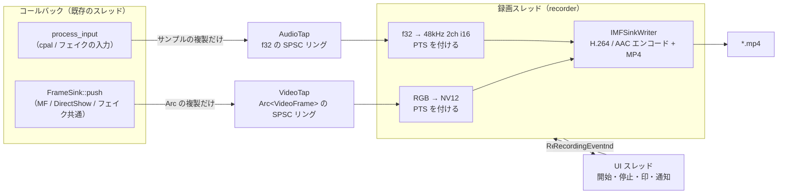
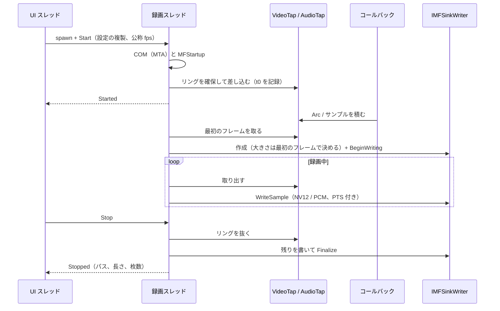
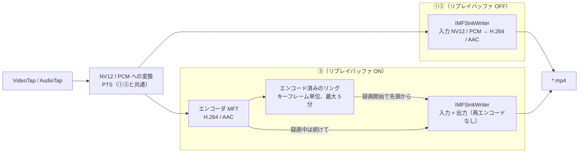

# 録画

キャプチャーボードの映像と音声を H.264 + AAC の MP4 へ書き出す仕組みの設計。Issue #120（録画）と #182（リプレイバッファ）。
フレームコールバックと cpal のコールバックから録画スレッドへ渡す経路、Media Foundation の Sink Writer の使い方、PTS の付け方、失敗の扱い、設定と UI を扱う。
**①（映像）は PR #283、②（音声）は #282 で実装済み。③はまだ設計だけで、コードは無い。** 実装した段で「状態」の列と本文を実際の形へ書き換える。①で設計から詰めたところ（エンコーダの名前の引き方、色空間の印を出力にも付けること、最小化中のホットキーの捨て方）と、②で詰めたところ（数える単位をサンプルにしたこと、途切れの位置の印、音声の起点を t0 に固定したこと、録画用の変換の渡し方）は該当の節に書いてある。

| 段階 | 中身 | 状態 |
|---|---|---|
| ① | 映像のみの録画（右クリックメニューとホットキーで開始・停止、`[recording]` の設定、録画中の印） | 実装済み（PR #283） |
| ② | 音声トラック（AAC）、`[recording]` の音声の項目 | 実装済み（#282） |
| ③ | リプレイバッファ（#182。録画開始時に直近 N 秒を先頭に含める） | 未着手 |

## 決まっていること

#120 と #182 のコメントでユーザーが決めたもの。**この文書の中で覆さない。**

- **Media Foundation の Sink Writer（`IMFSinkWriter`）で書く。** ffmpeg は同梱しないし、ユーザーが用意した ffmpeg を呼ぶ拡張も作らない。別建てでインストールするものを持たない
- **GPL / LGPL 系の依存は入れない**
- **コーデックは H.264 + AAC だけ。** HEVC / AV1 は要望が出てから
- **保存形式は MP4 固定**
- #182: さかのぼる長さの上限は **5 分**。「直近 N 秒だけ保存」のクリップ操作は入れない。リプレイバッファが ON であることの表示（OSD / 接続状態タブ）は出さない

## 全体の形

- **録画スレッドを 1 本足す。** エンコードと書き出しはこのスレッドだけが行う。UI スレッド、デバイスワーカー、コールバックのどれにも Sink Writer を触らせない
- **コールバックがするのは「リングへ 1 つ積む」だけ。** 待つロックもアロケーションも足さない（`docs/design/video-pipeline.md`、`docs/design/audio.md`）
- 録画スレッドはデバイスに触らない。「デバイスに触る使い捨てのスレッドを作らない」（`docs/design/threads.md`）には当たらない。映像と音声はリング越しに受け取るだけで、デバイスの開閉はこれまでどおりデバイスワーカーが持つ
- 置き場所は新設する `src/recording/`（録画スレッド、Sink Writer、画素と音声の変換、PTS、`RecordingError`）。リングの書き手側は `src/video/` と `src/audio/` に置く（下の「コールバックから渡す経路」）。依存の向きは `app → recording → video / audio` で、`video` / `audio` は `recording` を知らない

## コールバックから渡す経路

### 映像は変換後の RGB を `Arc` のまま渡す

録画に回す形の候補は 2 つあった。

| 渡す形 | コールバックの負担 | 録画スレッドの変換 | 画面との一致 | 対応できる入力 |
|---|---|---|---|---|
| **変換後の RGB（`Arc<VideoFrame>`）** | `Arc` の複製 1 回 | RGB → NV12（1080p60 で 1 コアの 1〜2 割と見積もる。未計測） | 一致する（色空間・レンジ・映像調整が乗った後） | 全形式（YUY2 / NV12 / I420 / YV12 / MJPEG / RGB24 / デコーダ任せ） |
| 届いたままの生データ（YUY2 など） | 1080p の YUY2 で 4MB の複製（事前に確保した枠へ） | YUY2 → NV12 はほぼ複製。形式ごとに変換を持つ | 一致しない（映像調整が乗らない。色空間とレンジはファイルの印で伝える） | YUV の 4 形式。MJPEG / RGB24 / デコーダ任せは結局 RGB からの変換が要る |

**RGB を採る。** 決め手は 3 つ。

- **コールバックの中で画素を複製しない。** `FrameSink` はもう RGB を `Arc<VideoFrame>` で持っているので、その複製を積むだけで済む
- **経路が 1 本で済む。** 生データ方式でも MJPEG / RGB24 / デコーダ任せのためには RGB → NV12 が要り、結局 2 本になる
- **ファイルが画面とスクリーンショットと同じ見た目になる。** 色空間・レンジの取り違えを設定で直している場合も、直した結果が焼き込まれる。書き出す NV12 は常に標準の組（HD は BT.709、SD は BT.601、どちらもリミテッドレンジ）にして印を付けるので、プレーヤーの解釈に左右されない

代わりに、YUV → RGB → YUV の往復で色差がわずかに鈍る。キャプチャーの録画としては許容し、画質が問題になったら生データ方式を足す（覆すなら実測を添える）。

### 書き手側（`FrameSink`）で行うこと

1. `FrameBuffer::push_back` へ `VideoFrame` ではなく `Arc<VideoFrame>` を渡す形に変える（いまは中で `Arc::new` している）
2. 置いたあと、**`RepaintWaker::wake` を呼んでから**、録画中ならリングへ `(Arc<VideoFrame>, received_at)` を積む。画面へ出す経路の後ろに置き、表示の遅延に足さない
3. リングが満杯なら積まずに捨て、`AtomicU64` の「録画に回せなかった枚数」を 1 つ増やす。待たない

**リングは録画を始めるときに録画スレッドが確保し、止めるときに抜く。** 録画していない間はリングが無く、コールバックは「差し込まれていない」を見て何もしない。差し込み口（`VideoTap`）は `VideoFrames` の隣に 1 つだけ持ち、`FrameSink::new(&frames, ..)` がそこから受け取る。**Media Foundation・DirectShow・フェイクの 3 経路はどれも `FrameSink::new` を通るので、3 つのコンストラクタは変えずに済む。**

差し込み口の取り方は、DirectShow のレンダラーの `StreamSlot` や `process_input` の `try_lock` と同じ「待たない」取り方にする。書き手（コールバック）が取れなければその 1 枚は録画に回さず数える。取り合うのは差し込み・抜き取りの瞬間の録画スレッドだけで、録画スレッドの側は取れるまで待ってよい（コールバックではないため）。

- リングは `ringbuf`（既に依存にある。音声のリングバッファと同じクレート）の `HeapRb<(Arc<VideoFrame>, Instant)>`。容量は 3。**クレートは増やさない**（`rtrb` を足す理由が無い）
- 容量を小さくしてあるのは、リングの中の `Arc` が `FrameSink` の Vec の回収（`recycled_buffer`、2 世代遅れで回収する）を妨げるため。録画スレッドが手放さないと、表示側で 1 枚あたり 6MB（1080p）の確保が起きる。**録画スレッドはリングから取ったらすぐ NV12 へ変換し、`Arc` を手放してから Sink Writer へ渡す**
- 回収に失敗した回数は `FrameSink` で数えてログに出す（録画を止めたときに 1 行）。実機で問題になったら生データ方式へ切り替える判断材料にする

### 音声は入力コールバックで f32 を複製する

`process_input`（`src/audio/stream.rs`）がデバイスのサンプルを f32 へ直してパススルーのリングバッファへ積むループの中で、録画中なら同じ値を録画用のリングにも積む。

- **入力の形のまま（入力のレート・チャンネル数）積む。** 出力側の変換（`PassthroughConverter`）とクロックドリフト補正は出力コールバックの中にあるので、録画はその手前から取ることになり、どちらの影響も受けない
- **音量・ミュート・パススルーの無効は録画に効かない。** これらは手元で聞くための操作で、判定（`output_is_audible`）は出力コールバックにある。入力から取る録画には元の音がそのまま入る
- リングは録画スレッドが確保して差し込む（映像と同じ）。容量は入力の形で 1 秒ぶん（48kHz 2ch の 1 秒を下限にする。小さいレートで開いていたあとで大きいレートへ開き直しても、1 秒を大きく割らないように）
- **空きが足りなければ、そのコールバックの分をまるごと捨てる。** 一部だけ積むと、どこが欠けたか読み手に分からない。捨てたら「溢れた回数」を数え、**途切れの位置**（その時点の累計）と**途切れの回数**を記録する
- あわせて入力コールバックが Atomic に 2 つ書く。**累計のサンプル数**と、**最後に積んだ時刻**（`AudioTap` が持つ基準の `Instant` からのナノ秒）。音声の PTS を揃えるのに使う（「PTS」の節）。時刻を先に、累計を後に書き、読み手は累計を先に読む。読んだ累計に対して時刻が古くなることはない
- **数える単位はサンプル（チャンネルをまたいだ f32 の個数）で、フレームではない。** 開き直しでチャンネル数が変わっても、リングの中の位置を同じ物差しで表すため（②の実装で決めた）
- 入力のレートとチャンネル数、それに**開き直すたびに進む番号**も `AudioTap` の Atomic に持つ。書くのはワーカーがストリームを開くとき（コールバックが動き出す前。`begin_stream`）。同時にその時点の累計を途切れの位置として記録するので、録画スレッドは途切れの前のサンプルを前の形で読み終えてから、形を読み直せる
- `AudioTap` は `AudioControls` と同じく開き直しても引き継ぐ共有物として `BackendShared` に載せ、`AudioCapture` と `FakeAudioCapture` へ渡す（`docs/design/device-worker.md` の「開いたストリームは実装自身が持つ」の右の列）
- パススルーのリングバッファと録画のリングは別々に `try_lock` で取る。片方を取れなくても、もう片方には積む

## 録画スレッド

### 持ち主と寿命

**録画スレッドの窓口（`Recorder`）は UI スレッドの `CaptureCardViewer` が持つ。** 開始で 1 本起こし、停止で `Finalize` まで終えたら自分で抜ける。`JoinHandle` は捨てず、`on_exit` で join する（スクリーンショットの保存スレッドと同じ扱い。待たないと `Finalize` の途中でプロセスが落ち、再生できない MP4 が残る）。

- やり取りは mpsc。UI → 録画が `RecordingCommand`（`Start` / `Stop`）、録画 → UI が `RecordingEvent`（`Started` / `Stopped` / `Failed`）。**録画スレッドから直接 `error!` を出さない**（`docs/design/threads.md` の保存スレッドと同じ理由）。受け取った UI スレッドがログと通知を出す
- 書いた枚数・捨てた枚数などの観測値は `Arc<RecordingTelemetry>`（Atomic）で共有し、UI が統計 OSD を描くときに読む
- `on_exit` では**デバイスワーカーを止める前に**録画を止めて join する。最後のフレームまでファイルに入れるため
- ③ でリプレイバッファが ON のあいだは、録画していなくてもこのスレッドが動き続ける（「リプレイバッファへの伸ばし方」）

デバイスワーカーに持たせる案もあった。最小化中にホットキーで録画を切り替えられるのが利点（ワーカーはウィンドウの状態に関係なく動く唯一のスレッド）。①では採らない。`src/app/worker_loop.rs` が既に 798 行で、コマンド・イベント・スナップショットに録画の分を足すと分割が要る一方、ビューアーを最小化して録画する使い方は想定しにくい。要望が出たら `DeviceCommand` 経由へ移す（「決めてもらうこと」）。

### 開始から停止まで

- **Sink Writer は最初のフレームが届いてから作る。** 大きさはフレームの幅・高さで決まり、開始の時点では映像が来ているとは限らないため。1 枚も届かないまま止めたらファイルを作らず、その旨を通知する
- 公称 fps は開始時に UI が `DeviceSnapshot` の映像の要求 fps（`ActiveVideo::requested_fps`）を渡す。使うのは入力のメディアタイプの `MF_MT_FRAME_RATE`（エンコーダのレート制御の目安）だけで、実際の時間は PTS が決める。映像が無ければ 60
- 録画スレッドは待ちに `recv_timeout` を使う（コマンドとリングの両方を見るため、数 ms で起きてリングを空にする）。`thread::sleep` で待たない

## Media Foundation の使い方

### COM と MF の初期化

- **録画スレッドは COM を MTA で初期化する。** デバイスワーカーが STA なのは、同じスレッドで nokhwa と cpal が STA で初期化するのに合わせるため（`docs/design/device-worker.md` の「スレッドと COM」）。録画スレッドは自分しか COM を使わず、メッセージループも回さないので MTA でよい。MF のオブジェクトは基本的にフリースレッドで、Sink Writer は内部の作業キューで動く
- `src/video/directshow/media_type.rs` の `ComApartment` は STA 決め打ちで `pub(super)`。**モデルを引数で受け取る形にして、`video` の外（`src/com.rs` を新設）へ移す。** 「`RPC_E_CHANGED_MODE` なら戻さずに使う」「`Drop` で 1 回戻す」「`!Send`」の考え方はそのまま
- `MFStartup(MF_VERSION, MFSTARTUP_LITE)` と `MFShutdown` も同じ形の RAII（`MfPlatform`）で包む。MF は呼んだ回数を数えるので、nokhwa が別に呼んでいても干渉しない。順序は COM → MF で、戻すのは逆順

### Sink Writer の組み立て

| 手順 | 呼ぶもの | 決めること |
|---|---|---|
| 属性 | `MFCreateAttributes` | `MF_READWRITE_ENABLE_HARDWARE_TRANSFORMS` = 設定の `hardware_encoder`、`MF_TRANSCODE_CONTAINERTYPE` = `MFTranscodeContainerType_MPEG4`、`MF_SINK_WRITER_DISABLE_THROTTLING` = TRUE |
| 作成 | `MFCreateSinkWriterFromURL(パス, None, 属性)` | 入れ物は拡張子に頼らず属性で MP4 を指定する |
| 映像の出力 | `AddStream` | `MFMediaType_Video` / `MFVideoFormat_H264`、`MF_MT_AVG_BITRATE`、`MF_MT_FRAME_SIZE`、`MF_MT_FRAME_RATE`、`MF_MT_PIXEL_ASPECT_RATIO` = 1:1、`MF_MT_INTERLACE_MODE` = progressive、`MF_MT_MPEG2_PROFILE` = High |
| 映像の入力 | `SetInputMediaType(映像, NV12, 符号化の引数)` | `MFVideoFormat_NV12`、同じ大きさと fps、`MF_MT_DEFAULT_STRIDE` = 幅、`MF_MT_YUV_MATRIX` / `MF_MT_VIDEO_PRIMARIES` / `MF_MT_VIDEO_NOMINAL_RANGE`（HD は BT.709、SD は BT.601、16〜235）。**同じ印（と `MF_MT_TRANSFER_FUNCTION`）を映像の出力のメディアタイプにも付ける。** 入力だけに付けるとエンコーダは H.264 の VUI に書かず、プレーヤーが色空間を推し量ることになる（①の実装で MF の Source Reader で読み戻して確かめた。`#[ignore]` のテスト `sink_writer_writes_a_playable_mp4` が見ている）。符号化の引数に `CODECAPI_AVEncMPVGOPSize` = fps × 2（2 秒ごとのキーフレーム） |
| 音声の出力（②） | `AddStream` | `MFAudioFormat_AAC`、48000Hz、2ch、16bit、`MF_MT_AUDIO_AVG_BYTES_PER_SECOND` = 設定のビットレート ÷ 8 |
| 音声の入力（②） | `SetInputMediaType(音声, PCM)` | `MFAudioFormat_PCM`、48000Hz、2ch、16bit、`MF_MT_AUDIO_BLOCK_ALIGNMENT` = 4 |
| 開始 | `BeginWriting` | ここでエンコーダが決まる |

- **入力は NV12 と 16bit PCM に揃える。** NV12 はハードウェアエンコーダ（Intel / NVIDIA / AMD の MFT）が必ず受け取り、Microsoft のソフトウェアの H.264 エンコーダも受け取る。RGB を渡して Sink Writer に変換を挟ませる形は、挟まるかどうかが環境次第で追えないので採らない。Microsoft の AAC エンコーダが受け取るのは 16bit PCM の 44.1kHz / 48kHz、1 / 2 / 6ch だけなので、48kHz 2ch に決め打ちして録画スレッドで寄せる
- AAC のビットレートは Microsoft の AAC エンコーダが受け付ける 96 / 128 / 160 / 192kbps の 4 つだけにする（`AVG_BYTES_PER_SECOND` = 12000 / 16000 / 20000 / 24000）
- 幅・高さが奇数なら右端・下端の 1 画素を落として偶数にする（NV12 は 2x2 画素で 1 組の色差を持つ）
- **スロットリングは切り、自分で間引く。** 既定では Sink Writer はエンコーダが遅れると `WriteSample` を止める。録画スレッドが止まるとリングの `Arc` が溜まり、表示側の Vec の回収を妨げる（上の節）。切ったうえで `GetStatistics` の「受け取った枚数 − エンコードした枚数」を見て、一定数（目安 30 枚）を超えたら NV12 へ変換する前に捨てて数える
- H.264 の 1 秒あたりのビットレートは平均値の指定だけにし、レート制御の方式（`CODECAPI_AVEncCommonRateControlMode`）は触らない。エンコーダの既定に任せる（第 1 段の割り切り）

### ハードウェアエンコーダの有無

- `hardware_encoder` が真なら `MF_READWRITE_ENABLE_HARDWARE_TRANSFORMS` を立て、Sink Writer にハードウェアの MFT を選ばせる。無ければ Microsoft のソフトウェアエンコーダへ自然に倒れる
- **D3D のデバイスマネージャ（`MF_SINK_WRITER_D3D_MANAGER`）は渡さない。** サンプルはシステムメモリに置く。ハードウェアの MFT の中にはこれを要求して `BeginWriting` や最初の `WriteSample` で失敗するものがあるので、**その場合は書きかけのファイルを消し、ハードウェアを切って作り直す。** 倒したことは `warn` で残す
- 実際に使ったエンコーダを `info` で残す。`GetServiceForStream` で MFT を取り、属性の `MFT_FRIENDLY_NAME_Attribute` と `MFT_ENUM_HARDWARE_URL_Attribute`（あればハードウェア）を読む。**名前は属性 → CLSID（属性の `MFT_TRANSFORM_CLSID_Attribute`、無ければ `IPersist::GetClassID`）から `MFTGetInfo` の登録名 → 同じ種類（ハードウェア / ソフトウェア）で NV12 → H.264 の登録が 1 つだけならその名前、の順に引く。** Microsoft のソフトウェアの H.264 エンコーダ（`H264 Encoder MFT`）は自分の属性に名前も CLSID も持たないことを①の実装で確かめたため。どれも取れなければ「名前不明」と出す（`recording::writer::SinkWriter::encoder_info`）。統計 OSD にも出す。「壊れても原因が分かる」（`docs/ARCHITECTURE.md` の「設計の前提」）ため
- ソフトウェアエンコーダで 4K60 は間に合わない見込み。間に合わなければ上の間引きで録画側がコマ落ちするだけで、表示は落とさない

### `windows` クレートのフィーチャ

**①②で足すのは `Win32_Storage_FileSystem` だけ。** 空き容量を見る `GetDiskFreeSpaceExW` に使う。

使う API はどれも、DirectShow のために既に入れてあるフィーチャに入っている（`windows` 0.62.2 のソースで確かめた）。

| API | フィーチャ |
|---|---|
| `MFStartup` / `MFShutdown` / `MFCreateAttributes` / `MFCreateMediaType` / `MFCreateSample` / `MFCreateMemoryBuffer` / `MFCreateSinkWriterFromURL` / `IMFSinkWriter` / `MFTEnumEx` / `MF_*` / `MFVideoFormat_*` / `MFAudioFormat_*` / `CODECAPI_*` | `Win32_Media_MediaFoundation`（既存） |
| `ICodecAPI::SetValue`（③でエンコーダ MFT に直接設定するとき） | 上に加えて `Win32_System_Com` / `Win32_System_Ole` / `Win32_System_Variant`（既存） |
| `CoInitializeEx` | `Win32_System_Com`（既存） |
| `GetDiskFreeSpaceExW` | **`Win32_Storage_FileSystem`（追加）** |

## 画素と音声の変換

- **RGB → NV12 は録画スレッドで行う純粋関数**（`src/recording/convert.rs`）。係数は `ColorMatrix` の逆向き（BT.709 / BT.601、リミテッドレンジ）。HD の判定は表示と同じ「幅 1280 または高さ 720 以上」。色差は 2x2 の平均。カラーバーを往復させて差が一定以内に収まることをユニットテストで確かめる
- 変換先の Vec は録画スレッドで使い回す（録画スレッドは確保してよいが、1 秒に 60 回 3MB を確保し直す理由も無い）
- 音声は入力の形（レート・チャンネル数）から 48kHz 2ch へ `PassthroughConverter`（`src/audio/convert.rs`）で寄せ、f32 → i16 は既存の `f32_to_i16` を使う。**変換器は録画用に 1 つ持ち、出力コールバックのものとは共有しない。** `PassthroughConverter` はレート比の補正（`ResampleTelemetry`）を受け取れるので、後でドリフト補正を足すときにそのまま使える（「PTS」の節）
- 録画スレッドは `next_sample` ではなく `convert_buffered` を使う（②で足した）。`next_sample` は入力が尽きると組み立て途中の状態を捨てる（リアルタイムの出力で途切れたときの扱い）。録画は数 ms ごとに溜まった分を渡すので、そのたびに捨てると補間が途切れて雑音になる。`convert_buffered` は次の出力フレームに要る入力が揃っているときだけ組み立て、端数は次の呼び出しへ持ち越す
- 途切れ（開き直し、溢れ、無音で埋めたあと）の後は変換器を作り直す。途切れの前後で補間を繋げない
- どちらも `pub(crate)` にして `recording` から呼ぶ形になる。`audio` の中だけで使う決まり（`CLAUDE.md` の「モジュール構成」）に合わせ、外から使う経路は `audio/mod.rs` の `pub use` に集める

## PTS

MF の時間の単位は 100ns。

### 映像

- **基準は録画を始めた時刻 `t0`**（録画スレッドがリングを差し込んだ時点の `Instant`）
- **映像の PTS = フレームを受け取った時刻（`received_at`）− `t0`。** `received_at` は `FrameSink` がもう持っている時刻で、変換時間の揺れを含まない（`FrameBuffer` のフレーム間隔と同じ基準）
- `t0` より前に受け取ったフレームは捨てる
- 前のフレーム以下の PTS になったら前 + 1 にする（単調増加を保つ）
- サンプルの長さは公称 fps から付ける。MP4 のサンプルの長さは次のサンプルの時刻との差で決まるので、揺れても表示の時間はずれない
- 切断などでフレームが途絶えた間は何も書かない。プレーヤーは直前のフレームを出し続ける

### 音声（②）

- **音声の PTS = 書いた出力フレーム数 ÷ 48000。** 起点は `t0`（PTS 0）に固定する
- 設計の段階では「最初に取り出したサンプルを受け取った時刻 − `t0`」を起点にする案だった。②の実装では、音声デバイスが無いまま始めた場合も同じ規則で扱えるよう、起点を 0 に置き、**最初のサンプルが届いたところで、届いた時刻に合わせて無音を足すか先頭を削る**形にした。できあがる時刻の並びは同じ
- サンプルを受け取った時刻は、`AudioTap` の「最後に積んだ時刻」と「累計のサンプル数」から逆算する（最後に積んだ時刻 −（累計 − 位置）÷ チャンネル数 ÷ 入力のレート）。2 つの Atomic は同時に読めないので、入力コールバックの周期（WASAPI の共有モードで 10ms 前後）ぶんの誤差を許す。**揃えるときも 15ms 未満のずれは直さない**（その範囲で無音を足したり削ったりすると、揃えるどころか途切れを増やすだけになる）
- **PCM は途切れさせずに渡す。** 揃え直すのは、サンプルの並びが途切れたときだけ。録画の開始、開き直し（`AudioTap` の途切れの回数が進み、形と番号が変わった）、リングの溢れ（同じく途切れの回数が進んだ）、音声が来なくなって無音で埋めたあと、の 4 つ。そのときに受け取った時刻と「次に書く位置」を比べ、ずれた分を**無音で埋めるか、先頭を削って**合わせる。PTS だけを飛ばすと、AAC のフレーム列は連続したまま時刻だけが食い違う
- 途切れの前のサンプルは前の形のまま変換し終えてから、形を読み直す（途切れの位置 = その時点の累計）
- 音声デバイスが無い・開けていない・止まっている間は、映像に合わせて無音を書き続ける（音声トラックの長さを映像と揃えるため）。「来ていない」とみなすのは、入力の形が分からない（まだ 1 度も開いていない）、まだ 1 度も積んでいない、または最後に積んでから 200ms 以上経ったとき。埋めるのは「いま − 200ms」まで（まだ届いていないだけのサンプルと重ねない）
- Sink Writer は最初の映像のフレームで作るので、それまでの音声は録画スレッドが 5 秒まで溜めておき、作られたあとで渡す。超えたら古いものから捨てる（塊は PTS を持っているので、後ろの時刻はずれない）。渡すのは約 21ms（1024 フレーム）ずつ
- 止めるときは残りを取り出し、音声が映像より短ければ映像の終わりまで無音で埋める

### ドリフト

映像の PTS は PC の時計（QPC、`Instant`）で測った到着時刻、音声の PTS はサンプル数で数えた入力デバイスの時計なので、**長く録るとずれる。** 入力デバイスの時計が PC の時計に対して 50ppm ずれていれば 1 時間で 180ms。音が映像より 45ms 以上先行する、または 125ms 以上遅れると気付かれる（ITU-R BT.1359 の検知限）ので、この例ではずれの向きによって 15〜40 分ほどで気付かれる範囲に入る。

- **クロックドリフト補正（`src/audio/resample.rs`）とは別物。** あちらは入力と出力の時計の差を、出力コールバックの中でパススルーのリングバッファの水位から直すもの。録画はその手前の入力から取るので、補正の有無に関係なく同じ音が入る
- **②では直さない。** 停止時に「映像の経過時間」と「音声のサンプル数 ÷ レート」の差を `info` で残し、実機でどれだけずれるかを測ってから決める。ログは「録画の音声: 長さ … 秒（映像 … 秒）。途切れずに続いた最後の区間で、映像の時計（PC）の N 秒に対して音声のサンプル数 ÷ レートは M 秒（差 X ms、Y ppm。負なら音声が映像より遅れていく）。揃えるために足した無音 …、削った入力 …、リングの溢れ …」の 1 行。区間は揃え直すたびに始め直すので、開き直しや溢れの前後はまたがない
- フェイクの音声は PC の時計で刻んで正弦波を吐くので、ずれは 0 になる（②の実装で確かめた値は差 +0.0ms、+0ppm）。意味のある値は実機でしか取れない
- キャプチャーボードの音声と映像が同じ HDMI の時計に従っていても、ずれは消えない。映像は PC の時計で測った到着時刻を PTS にし、音声はその時計を見ずにサンプル数から PTS を作るため、HDMI の時計と PC の時計の差が音声の側にだけ溜まる
- 直す場合は、録画用の `PassthroughConverter` のレート比を「累計サンプル数 ÷ 経過時間」から動かし、音声を PC の時計に従わせる。判定は `decide_resample_correction` と同じく純粋関数に切り出す（起票を提案する Issue に挙げる）
- 入出力のレイテンシ（キャプチャーボードの映像の遅れ、WASAPI の入力の遅れ）は補正しない。どちらも実測できる値が無い

## 失敗の扱い

| 起きること | 見つけ方 | 録画スレッドの動き | 利用者に出すもの |
|---|---|---|---|
| 保存先を作れない・書けない | 開始時の `create_dir_all`、`MFCreateSinkWriterFromURL` の `E_ACCESSDENIED` など | 始めない | トースト（保存先のパスと理由） |
| ディスクの空きが無い | 開始時と録画中 5 秒ごとの `GetDiskFreeSpaceExW`。残りが 500MB を切ったら止める | **満杯になる前に止めて `Finalize` する** | トースト（止めたこと、残り容量） |
| それでも書き込みに失敗した | `WriteSample` / `Finalize` の失敗（`ERROR_DISK_FULL` など） | 止める。`Finalize` を試み、失敗してもファイルは消さない | トースト（再生できない可能性があること） |
| H.264 / AAC のエンコーダが無い | `SetInputMediaType` / `BeginWriting` の `MF_E_TOPO_CODEC_NOT_FOUND` / `MF_E_INVALIDMEDIATYPE` | ハードウェアを切って 1 回作り直し、それでも駄目なら始めない | トースト（エンコーダが見つからない） |
| 録画中にデバイスが切断された | リングに何も来なくなるだけ | **続ける。** 同じ大きさで戻れば同じファイルへ続けて書く | 出さない（切断はこれまでどおり映像の通知が出る） |
| 録画中に音声デバイスが切断された・開き直した | 音声のリングに何も来なくなる、`AudioTap` の途切れの回数が進む | **続ける。** 来ない間は無音を書き、戻ったら受け取った時刻に揃え直す | 出さない（切断はこれまでどおり音声の通知が出る。足した無音の長さは停止時のログ） |
| 音声のリングが溢れた（録画スレッドが 1 秒以上止まった） | `AudioTap` の溢れた回数と途切れの回数が進む | 溢れた分は捨て、次のサンプルを受け取った時刻に揃え直す | 出さない（回数は停止時のログ） |
| 戻ったデバイスの大きさが違う | フレームの幅・高さが Sink Writer の入力と違う | **そのファイルを `Finalize` して止める** | トースト（大きさが変わったので止めたこと） |
| 1 枚も届かないまま止めた | Sink Writer を作る前に `Stop` | ファイルを作らない | トースト（映像が届かなかったこと） |

- **`ErrorSource::Recording` を新しく足す。** 通知は既存の `report_error(ErrorSource::Recording, 理由)` を通し、間引きもそのまま効かせる。録画を始められたら `errors.clear(ErrorSource::Recording)`（`docs/design/error-reporting.md`）
- 理由は `src/recording/` の `RecordingError`（保存先、空き容量、書き込み、エンコーダ、大きさの変化、映像なし）で返し、文言はその `Display` から `crate::i18n` を呼んで出す。`status.rs` に発生源ごとの `match` を足さない（`GUARDRAIL.md`）
- 止めたとき（成功）は「保存した: ファイル名」をトーストで出す。スクリーンショットの保存と同じ扱い
- 最小化中に起きた失敗は、復帰して `update()` が `RecordingEvent` を取り込んだときに出る。録画スレッド自身は最小化に関係なく止まる
- N エディションの Windows（Media Feature Pack 無し）では MF の DLL が無い。nokhwa が既に MF を参照しているので、アプリ自体が起動しない見込み（未確認）。録画側で特別に扱うのは「MF はあるがエンコーダが無い」場合だけ
- **標準の MP4 は `Finalize` で `moov` を書くまで再生できない。** アプリが途中で落ちると、それまでの録画は再生できないファイルとして残る（`panic = "abort"`、`docs/design/logging.md`）。断片化 MP4（`MFTranscodeContainerType_FMPEG4`）なら落ちても途中まで再生できるが、古い編集ソフトで読めないことがある（「決めてもらうこと」）

## 設定 `[recording]`

`AppSettings` に `recording: RecordingSettings` を足す。**構造体レベルの `#[serde(default)]`**、`RawAppSettings` と `From` にも足す（`GUARDRAIL.md`）。**項目は、その項目が効く段で足す。** 効かない項目を先に出さない（`docs/ARCHITECTURE.md` の「設定は実際に効かせる」）。

| 項目 | 型 | 既定 | 範囲 | 段 |
|---|---|---|---|---|
| `folder` | `PathBuf` | ビデオフォルダ → デスクトップ → `%USERPROFILE%` → exe の置き場所 → 一時フォルダ | — | ① |
| `file_name_format` | `String` | `Recording_%Y-%m-%d_%H-%M-%S` | chrono の書式。拡張子（`.mp4`）は付けない | ① |
| `video_bitrate_kbps` | `u32` | 8000 | 1000〜50000。外れたら丸める | ① |
| `hardware_encoder` | `bool` | true | — | ① |
| `audio_enabled` | `bool` | true | — | ② |
| `audio_bitrate_kbps` | `u32` | 160 | 96 / 128 / 160 / 192。それ以外は近いものへ | ② |
| `replay_enabled` | `bool` | false | — | ③ |
| `replay_seconds` | `u32` | 30 | 5〜300（上限 5 分は #182 の決定） | ③ |

- 保存先の既定は `default_screenshot_folder` と同じ理由でカレントディレクトリを使わない（`docs/design/assets.md`）。先頭の候補だけが違う（`dirs::video_dir()`）
- **ファイル名の書式は使う前に検める。** chrono は解釈できない指定子を含む書式を文字列にするとパニックする（release は `panic = "abort"`）。`StrftimeItems` に `Item::Error` が混じる、結果に Windows のファイル名に使えない文字（`\ / : * ? " < > |`）が入る、末尾が空白か `.` になる、または結果が大文字小文字を問わず Windows の予約デバイス名（`CON` / `PRN` / `AUX` / `NUL` / `COM1`〜`COM9` / `LPT1`〜`LPT9`）に一致するなら既定へ倒し、`warn` を残す。予約名は拡張子を付けても（`NUL.mp4`）予約名のままで、連番を付ける処理では避けられないため、ここで弾く。設定ダイアログでも同じ判定で注意書きを出す
- 同じ名前のファイルがあれば `_2`、`_3` … を付ける（スクリーンショットの連番と同じ考え方）
- **プリセットには入れない。** プリセットはキャプチャーボードの使い分け（`video` / `audio`）のためのもので、録画の保存先やビットレートはデバイスと一体の設定ではない（`docs/design/presets.md`）。`screenshot` を入れていないのと同じ
- `commit_draft` と `draft_from_imported` の両方で扱う（`docs/design/settings-dialog.md`）。録画中に変えた設定は次の録画から効く
- 書き出し / 読み込み / 初期化（「その他」タブ）には何もしなくても入る

## UI

### 操作

- **右クリックメニュー**に「録画を開始」を置く。録画中は同じ位置が「録画を停止（00:12:34）」になる。描画は `MenuAction::ToggleRecording` を返すだけ（`src/app/menu/items.rs` は状態を書き換えない）
- **ホットキーのアクション** `HotkeyAction::ToggleRecording`、設定ファイル上の名前は **`toggle_recording`**。**一度出したら変えない**（`docs/design/hotkeys.md`）。右クリックメニューと同じ `toggle_recording` を呼ぶ
- `runs_while_minimized()` は偽（①の時点）。**最小化中の押下は復帰しても実行しない**（押下を溜めずに捨てるので、復帰したときに実行される回数は 0）。フルスクリーンのように偶数回で打ち消す畳み方にすると、最小化中に 1 回押しただけで復帰した瞬間に録画が始まり、意図とずれるため。**実装では `folded_repeats` を 0 にせず、リスナーが最小化中の押下を溜めずに捨てる**（`HotkeyAction::discarded_while_minimized`、`PressRouting::DiscardedWhileMinimized`）。`folded_repeats` は押された回数しか受け取らないので、最小化中の押下と通常のフレームの 1 回の押下を区別できず、0 にすると通常の押下でも録画が始まらなくなるため。通常のフレームの畳み方はトグルと同じ（奇数回なら 1 回）
- 設定ダイアログに「録画」タブを足す（①は保存先・ファイル名・映像のビットレート・ハードウェアエンコーダ、②で音声、③でリプレイバッファ）。保存先のフォルダ選択は `SettingsEvent` を返し、描画の外で `rfd` を開く（`docs/design/settings-dialog.md`）。③のさかのぼる長さの横には「長くするほどメモリを使う」を添える（#182 の決定）
- 画面に出す文字列はすべて `crate::i18n` を通す（`docs/design/i18n.md`）。量が増えるので、引数を取るものは `src/i18n/update_msg.rs` にならって録画用のファイルを分ける

### 録画中の印

**統計 OSD とは別に、録画中は映像の右上に小さな印（赤い丸と経過時間）を常に出す。** 録画の失敗で一番困るのは「録っているつもりで止まっていた」「止め忘れた」なので、情報表示を切っていても見えるようにする。フルスクリーンでも出す。

- 経過時間の更新は 1 秒ごとでよい。**再描画の間隔（`next_repaint_delay`）は変えない。** 映像が来ていれば 16ms、来ていなければ 250ms で回っているので、1 秒の更新には足りる。最小化中は描かないので止まってよい
- 統計 OSD（情報表示）には録画の行を足す。経過時間、書いた枚数、捨てた枚数（リングの満杯・エンコーダの遅れ）、使っているエンコーダの名前（ハードウェアかソフトウェアか）
- ③のリプレイバッファが ON であることは出さない（#182 の決定）

## リプレイバッファへの伸ばし方（#182）

### ①②の経路と③の経路

生フレームは保持できない（1080p60 の RGB で約 370MB/s）ので、**リプレイバッファが ON のあいだはエンコーダを常時回し、エンコード済みのサンプルをメモリに持つ。** Sink Writer はファイルへ書くまでエンコードとまとめて行う作りで、エンコード済みのサンプルを取り出す口が無い。したがって③では**エンコーダ MFT（`IMFTransform`）を自分で回し**、録画を始めたら**入力と出力を同じ H.264 / AAC にした Sink Writer**（エンコードせずに MP4 へまとめるだけ）へ流す（#120 のコメントの前提）。

- **③で足すのは右下の四角だけ。** コールバックからのリング、NV12 と PCM への変換、PTS の基準、設定の節、UI、失敗の扱いは①②のものをそのまま使う。①②の設計は③を塞がない
- キーフレームの間隔は①から 2 秒にしておく（`CODECAPI_AVEncMPVGOPSize`）。③でリングから古いものを捨てるのはキーフレーム境界なので、この間隔がさかのぼれる長さの粒度になる。①②と③で出来上がるファイルの性質を揃えておく意味もある
- 録画を始めたら、リングの中で「いま − N 秒」以降の最初のキーフレームを探し、その PTS を 0 に付け替えて書き出す。以降のライブのサンプルも同じだけずらす。音声は同じ時刻より前の AAC フレームを捨てて先頭を揃える
- 録画を止めても、リプレイバッファが ON ならエンコーダとリングは回り続ける。録画スレッドの寿命は「録画中、またはリプレイバッファが ON のあいだ」になる
- 音声も AAC にしてから持つ。PCM で 5 分持つと 48kHz 2ch の f32 で約 115MB になるが、AAC 160kbps なら約 6MB で、Sink Writer も映像と同じくエンコードせずにまとめるだけで済む
- メモリは 5 分 × (8Mbps + 160kbps) で約 306MB。これが設定ダイアログに添える注意の根拠

### ③で新しく必要になるもの

- **ハードウェアのエンコーダ MFT は非同期型**（`MF_TRANSFORM_ASYNC_UNLOCK` を立て、`IMFMediaEventGenerator` の `METransformNeedInput` / `METransformHaveOutput` に従って入出力する）。①②では Sink Writer がこれを隠してくれていた。③の工数の中心はここ
- Sink Writer をエンコードなしで使うには、H.264 の入力のメディアタイプに `MF_MT_MPEG_SEQUENCE_HEADER`（SPS / PPS）、AAC に `MF_MT_USER_DATA`（AudioSpecificConfig）が要る。どちらもエンコーダ MFT の出力のメディアタイプから写す
- リプレイバッファ OFF の録画も③の経路（エンコーダ MFT + エンコードなしの Sink Writer）に一本化するかは③の Issue で決める。一本化すれば Sink Writer の使い方が 1 通りになるが、①②で実機確認した経路を置き換えることになる

別案として、Sink Writer に自前のメモリ上の `IMFByteStream` と断片化 MP4 を書かせ、断片（キーフレームで始まる）をリングに持つ形もある。非同期 MFT を自分で扱わずに済むが、書き出したファイルの時刻が 0 から始まらず、断片の通し番号も飛ぶ。プレーヤーごとの扱いを確かめる手間が大きいので本線にはしない。

## 段階ごとにできること・実機で確かめること

| 段 | できるようになること | 実機で確かめること |
|---|---|---|
| ① | 右クリックメニューとホットキーで録画を開始・停止でき、映像だけの H.264 の MP4 が保存される | 1080p60 を 10 分録り、Windows の「メディア プレーヤー」と VLC で最後まで再生できること、録画中も統計 OSD の FPS とフレーム間隔が録画前と変わらないこと、ログにエンコーダの名前が出ること |
| ② | 音声トラック（AAC 48kHz 2ch）が入る | 冒頭と 30 分後で口の動きと音のずれを比べ、停止時のログのずれの値と合うこと。録画中に音声デバイスを抜き差ししても以降の音がずれないこと |
| ③ | リプレイバッファを ON にすると、録画開始の N 秒前からがファイルに入る | 5 分に設定したときのメモリ使用量、開始前の N 秒が入り継ぎ目で映像と音声が途切れないこと、OFF のときの CPU / GPU 負荷が今と同じこと |

①で合わせて確かめること: 録画中の USB の抜き差し（同じ大きさで戻れば同じファイルへ続く）、解像度の変更で止まって通知が出ること、保存先に書けないとき・空きが少ないときの通知、4GB を超える長さでも再生できること（MF の MP4 シンクが 64bit のオフセットを書くかは未確認）。`docs/MANUAL-TEST.md` に録画の節を足す（①の Issue で行う）。

CI で回すのは純粋関数（RGB → NV12、ファイル名の書式の検め、PTS の計算、音声の起点の逆算、設定の読み書き）とフェイクを通した「リングに積まれる」まで。MF のエンコーダを実際に動かすテストは `#[ignore]` を付ける。GitHub Actions のランナー（Windows Server）に H.264 / AAC のエンコーダがあるかは確かめていない（`.claude/skills/testing-conventions/SKILL.md`）。

## 決めてもらうこと

この文書では推奨を決めてあるが、どちらも選べるもの。①の Issue に着手する前に決める。

| 論点 | この文書の推奨 | 別案 |
|---|---|---|
| 録画スレッドの窓口の持ち主 | UI スレッド（`CaptureCardViewer`）。最小化中のホットキーは効かない | デバイスワーカー。最小化中も `DeviceCommand` で切り替えられるが、`worker_loop.rs`（798 行）の分割が先に要る |
| 入れ物 | 標準の MP4。途中で落ちると再生できないファイルが残る | 断片化 MP4（`MFTranscodeContainerType_FMPEG4`、拡張子は `.mp4` のまま）。落ちても途中まで再生できるが、古い編集ソフトで読めないことがある |
| 録画中に映像の大きさが変わったとき | そのファイルを閉じて止め、通知する | 閉じたあと自動で新しいファイルに続けて録る（`_2` を付ける） |
| 録画中の印 | 右上に常に出す（フルスクリーンでも） | 設定で消せるようにする（①では足さない） |

**決定（2026-09-29、指示役）: 4 点ともこの文書の推奨で進める。** 窓口は UI スレッド（最小化中の切り替えは要望が出てから `DeviceCommand` へ移す）、入れ物は標準の MP4（編集ソフトとの相性を優先。落ちたときの救済は要望が出てから断片化を検討）、大きさが変わったら止めて通知、録画中の印は常に出す。映像を RGB の `Arc` で渡す方式も採り、①の実機確認で Vec の回収に失敗した回数を見て、問題なら生データ方式へ切り替える。実装は ① #281 → ② #282 → ③ #182。

## 実装したら書き足す場所

- `docs/design/threads.md` のスレッドの一覧に録画スレッド（`recorder`）の行を足す — ①で済み（PR #283。ロックの表と、`error!` を出さないこと・`Arc` を手放してから書くことの段落も足した）
- `docs/design/device-worker.md` の「チャネルを通さない共有」の表に `VideoTap` / `AudioTap` を足す — `VideoTap` は①で済み（PR #283）。`AudioTap` は②で済み（#282。`docs/design/threads.md` のロックの表と `docs/design/audio.md` の「録画へは入力コールバックから分岐する」も足した）
- `docs/design/video-pipeline.md` の「映像パイプライン」に録画への分岐を足す — ①で済み（PR #283）
- `CLAUDE.md` のモジュール構成の表に `src/recording/` の各ファイルを足す — ①で済み（PR #283。`src/app/recording.rs` / `src/video/tap.rs` / `src/ui/recording_tab.rs` / `src/i18n/recording_msg.rs` / `src/com.rs` も）
- `GUARDRAIL.md` に「録画スレッドから直接 `error!` を出さない」「リングの `Arc` を持ったまま `WriteSample` しない」を足す — ①で済み（PR #283。「`on_exit` では録画をデバイスワーカーより先に止める」も足した）
