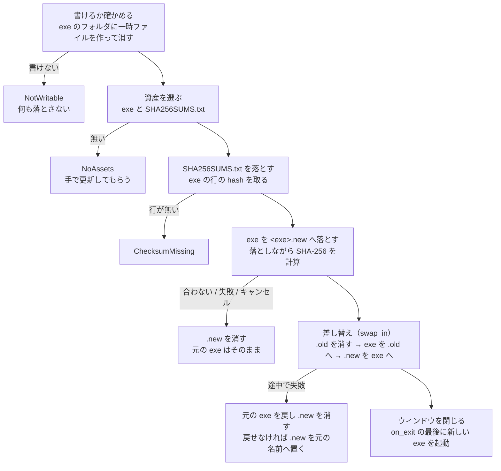

# 更新の確認と適用

GitHub の Release から新しい版を見つけて知らせ、人が「更新する」を押したら exe を差し替えて再起動する仕組み。Issue #240 を 3 本の PR に分けて進めた。

| 段階 | 中身 | 状態 |
|---|---|---|
| 1 | Release に単体の exe と `SHA256SUMS.txt` を添付する（Issue #239） | 済み（PR #241） |
| 2 | 検知、通知ダイアログ、設定 `[update]`、「その他」タブの「更新」の欄 | 済み（PR #243） |
| 3 | ダウンロード、照合、差し替え、再起動 | この文書の「適用」 |

置き場所は `src/update/mod.rs`（問い合わせと判断の純粋関数）、`src/update/apply.rs`（ダウンロードと照合の本体）、`src/update/assets.rs`（資産の選び方）、`src/update/swap.rs`（差し替えと戻し方）、`src/update/checksum.rs`（`SHA256SUMS.txt` の読み方）、`src/update/overrides.rs`（試すための環境変数）、`src/app/update.rs`（スレッドと結果の取り込み、通知ダイアログの操作、終了時の新しい exe の起動）、`src/ui/update_dialog.rs`（通知ダイアログの描画）、`src/ui/other_tab.rs`（「更新」の欄）。

## 検知

`GET https://api.github.com/repos/Mui-MuiMui/Capturecard_Viewer/releases/latest` を認証なしで 1 回呼ぶ。

- **`User-Agent` を必ず付ける。** GitHub の API は無い要求を拒否する。`capturecard_viewer/<版>` にしてある。`Accept: application/vnd.github+json` と `X-GitHub-Api-Version` も付ける
- 使うのは `tag_name` / `html_url` / `draft` / `prerelease` / `assets[].name` / `assets[].browser_download_url` だけ。知らない項目は読み飛ばす
- タグ（`v1.2.0`）から先頭の `v` を外して `semver` で読み、`CARGO_PKG_VERSION` と比べる。**新しい正式版のときだけ「更新あり」。** 同じ版・古い版（ダウングレード）・`1.2.0-rc.1` のような pre-release のタグは「最新」として扱う（`update::is_newer_stable`）。`/latest` は draft と pre-release の印を付けた Release を元から除くが、印を付け忘れたものまで勧めないよう、タグの形と `draft` / `prerelease` の値でも弾く。印を付けずに Latest で出すと `/latest` がその rc を返し、正式版の更新まで知らせなくなるので、リリースのワークフローは `-` を含むタグに印を自動で付け、Latest にしない（`docs/RELEASE.md` の「pre-release を出す」）
- タグが版として読めなければ失敗として扱う（`UpdateError::InvalidTag`）
- **`html_url` はそのままブラウザへ渡さない。** `https://github.com/Mui-MuiMui/Capturecard_Viewer/releases/tag/<タグ>` の形（タグは英数字と `.` `-` `_` だけで、`.` / `..` ではない）のときだけ使い、それ以外は最新のリリースページにする（`release_page_url`）。頭の一致だけで許すと、`.../releases/../../../他人/リポジトリ/...` をブラウザが畳んで別のリポジトリを開く
- 失敗の理由は `UpdateError` の変種で分ける。404 は「公開されたリリースが無い」、403 / 429 は認証なしの問い合わせ回数の上限（1 時間 60 回）、タイムアウト、その他の HTTP、接続の失敗、JSON を読めない、の 7 つ。文言は `Display` から `crate::i18n` を呼んで出す（`docs/design/error-reporting.md`）

### HTTP と TLS

`ureq` を `native-tls` で使う。**TLS は Windows の schannel で、証明書は OS の証明書ストアで確かめる**（`RootCerts::PlatformVerifier`）。rustls と ring は入れない。社内のプロキシのように OS 側で信頼している証明書にも従うため。

- **フィーチャは `native-tls` にすること。** `native-tls-no-default` だけでは ureq が native-tls を無効とみなし、問い合わせの時点でパニックする。release ビルドは `panic = "abort"` なのでアプリごと落ちる。コンパイルは通ってしまうので、ureq のフィーチャや TLS の設定を触ったら `#[ignore]` のネットワークのテスト（`cargo test check_latest_release_reaches_github -- --ignored`）を一度は通すこと
- `native-tls` は同梱のルート証明書（`webpki-root-certs`、CDLA-Permissive-2.0）も引き込む。使わないが外せない（`docs/DEPENDENCIES.md`）
- 上限は問い合わせ全体（名前解決・接続・応答の読み取り）で 5 秒（`REQUEST_TIMEOUT`）。失敗の文言にも秒数を書いてあるので、変えたら合わせる

## スレッド

**起動時に 1 回だけ**、最初の `update()` の「起動直後に 1 度だけ行う処理」から始める。「その他」タブの「更新を確認」も同じ入口（`start_update_check`）を通る。

- 確認ごとにスレッドを 1 本起こし（名前は `update-check`）、結果を mpsc で返す。`update()` の先頭の `drain_update_results` が取り込む。ログ・トースト・状態の更新は UI スレッドで行う。効果音の読み込み（`app::screenshot_sound`）と同じ形で、届いたら `RepaintWaker` で UI スレッドを起こす
- **ネットワークだけを触るスレッドなので、「デバイスに触る使い捨てのスレッド」の禁止（`GUARDRAIL.md`）には当たらない。** デバイスワーカーへ載せないのは、ワーカーのコマンドの列が 5 秒のネットワーク待ちで塞がるため
- **`JoinHandle` は持つが、`on_exit` で join しない。** 確認の最中に閉じても待たずに終わる。このスレッドはネットワークだけを触り、ファイルも設定も書かない（結果はチャネルで UI スレッドへ返すだけ）ので、途中で打ち切られてもプロセスの終了で消えるだけで何も壊れない。GUARDRAIL の「保存スレッドの `JoinHandle` を捨てない」は、スクリーンショットや効果音のように**ディスクへ書く・読んだものを反映する**スレッドの話で、打ち切ると書きかけのファイルが残るため待つ。ここはその理由が当たらない。以前は join して最大 5 秒待っていたが、ネットワークの無い環境で起動直後に閉じると閉じるのが遅れるのでやめた
- **確認中は重ねて始めない。** 「更新を確認」は確認中は押せず、入口でも弾く。起動時の確認と手動の確認がぶつかることも無いので、要求に番号は振っていない
- 誰が始めたか（`CheckOrigin::Startup` / `Manual`）を結果に載せて返す。ダイアログを出すのは起動時の確認だけで、「更新を確認」を始めたときは開いている通知ダイアログを閉じる（古い確認の内容を操作させない）。更新の最中と失敗の表示は閉じない

適用のスレッド（`update-apply`）と、起動時に前回の残りを消すスレッド（`update-cleanup`）も同じ扱いにする（「適用」の節）。

## 失敗の扱い

**確認の失敗で起動を止めない。** 失敗は WARN のログと、「更新」の欄の「確認できない: 理由」に出す。**`report_error(ErrorSource::Update, 理由)`（トーストと「接続状態」タブ）を通すのは「更新を確認」を押したときだけ**（`CheckOrigin::notifies_failure`）。確認できたら `errors.clear(ErrorSource::Update)` で取り下げる。

起動時の自動の確認でトーストを出さないのは、ネットワークの無い環境で起動のたびに「更新できません」が出るのは邪魔なだけで、映像を見る目的と関係が無いため。人が押した「更新を確認」は結果を待っているので、失敗も知らせる。

**適用（「更新する」）の失敗は必ずトーストにも出す**（`ErrorSource::Update`）。人が押した操作なので。トーストの定型文（`Text::HeadlineUpdate`）は確認と適用のどちらにも合うよう「更新できません」にしてある。

## 設定 `[update]`

`settings::UpdateSettings`。構造体レベルの `#[serde(default)]` で、`[update]` の無い設定ファイルでは既定値になる（`docs/design/settings.md`）。

| 項目 | 既定 | 意味 |
|---|---|---|
| `check_on_startup` | true | 起動時に確認するか。偽なら起動時は何もせず、「更新を確認」だけが使える |
| `notify_on_startup` | true | 起動時の確認で見つかったときダイアログを出すか。偽なら「更新」の欄に出すだけ |
| `skipped_version` | なし | 「この版は通知しない」を選んだ版（`1.2.0` の形）。同じ版のあいだはダイアログを出さない |

- **プリセットには入れない**（`docs/design/presets.md`）
- 2 つのチェックは「その他」タブだけで変わるので、`commit_draft` は無条件に反映する
- **`skipped_version` は通知ダイアログからも変わる**ので、`auto_reconnect` と同じく**ドラフトで変わったときだけ**反映する。無条件に入れると、設定ダイアログを開いたまま通知ダイアログで飛ばした版が「適用」で消える（`docs/design/settings-dialog.md`）
- 通知ダイアログの「この版は通知しない」は共有の設定へ書いて `mark_settings_dirty()`。ドラフトには書かないので、設定ダイアログを開いたままなら、欄の表示は開き直すまで古い
- `skipped_version` の比べ方は `update::is_skipped`。手で書かれた `v1.2.0` や前後の空白も同じ版として扱い、読めない値はどの版も指さない

## 通知ダイアログ

`ui::show_update_dialog`。映像の上に出す `egui::Window` で、Id は `update_dialog` に固定（`docs/design/i18n.md`）。**状態を持たず、押されたものを `UpdateDialogEvent` で返す。** 出すかどうかと、出す版（`UpdateCheck`）は `app::update` の `UpdateState` が持つ。設定ダイアログの `SettingsDialogState` に置かないのは、設定ダイアログを開いていなくても出るため。

最初に出すのは次の 3 つが揃ったとき（`update::should_notify_on_startup`）。「更新する」を押したあとは同じウィンドウで進み具合と結果を出す（`UpdateDialogView` の `Applying` / `Restarting` / `Failed`。Id は同じで、タイトルだけ変わる）。

1. 起動時の確認で新しい版が見つかった
2. `notify_on_startup` が真
3. `skipped_version` がその版ではない

| ボタン | 動作 |
|---|---|
| 更新する | ダウンロードと差し替えを始める（「適用」の節）。ダイアログは進み具合の表示に変わる |
| リリースノートを見る | その版のリリースページを開く。**ダイアログは閉じない**（読んでから「更新する」を押せるように）。手で更新したい人の逃げ道も兼ねる。ブラウザの起動は `egui::Context::open_url`（eframe が `webbrowser` で開く） |
| 後で（× も同じ） | 閉じるだけ。次の起動でまた出る |
| この版は通知しない | `skipped_version` に入れて閉じる |

ボタンは 2 段に分け、上の段に「リリースノートを見る」だけ、隙間を空けて下の段に「更新する」「後で」「この版は通知しない」を並べる（1 段に 4 つ並べると分かりにくい、ユーザーの指摘、Issue #250）。

更新の最中は「キャンセル」（× も同じ）だけ、失敗したら理由と「リリースページを開く」「閉じる」を出す（こちらの「リリースページを開く」は開いて閉じる）。置き換えを始めたあとと再起動の直前はボタンも × も出さない。

**中身は「新しいバージョン vX.Y.Z があります（いまは vA.B.C）」の 1 行とボタンだけにし、幅は固定する**（`DIALOG_WIDTH`。ボタンが収まらなければ折り返す）。リリースノートの本文は載せない。第 2 段階では本文の最初の `### ` より前を要約して出していたが、本文が長いと読めず、ダイアログが横に伸びた（ユーザーの指摘、2026-09-27）。本文はリリースページで読んでもらう。Release の JSON の `body` も読まなくなった。

## 「その他」タブの「更新」の欄

現在の版、「更新を確認」、結果（まだ確認していない / 確認中 / 最新 / 新しい版あり / 確認できない）、新しい版があれば「更新する」、「リリースページを開く」、2 つのチェック、飛ばした版と「解除」。

- 結果はドラフトではなく実行中のアプリの状態（`UpdateStatus`）で、`show_settings_dialog` の引数で読み取り専用に渡す
- 「更新を確認」は `SettingsEvent::CheckForUpdates` を返す。「更新する」は `SettingsEvent::StartUpdate` を返し、通知ダイアログの「更新する」と同じ入口（`start_update_apply`）を通る。更新の最中は押せない（`UpdateView::applying`）。起動時のダイアログを「後で」で閉じたときや、通知を切っているときの入口チェックと「解除」は差し替えたあとのドラフトの `update` を `SettingsEvent::SetUpdateSettings` で返し、反映は「適用」「OK」
- 「リリースページを開く」は egui のリンク（`hyperlink_to`）。見つかった版があればそのページ、無ければ最新のリリースページ

## 適用

「更新する」（通知ダイアログか「その他」タブ）から、見つかった版の exe をダウンロードして照合し、実行中の exe と差し替えて再起動する。本体は `update::apply::run_apply` で、`update-apply` スレッドで 1 本だけ走らせる（`app::update` の `start_update_apply`）。Issue #240 のコメントでユーザーが決めた内容を含む。

**元の exe を壊す経路を作らない。** これがこの節の全ての判断の前提。

### 資産

**資産名は `capturecard_viewer.exe` と `SHA256SUMS.txt`**（`docs/RELEASE.md` の「配布物」）。`UpdateCheck::assets` から名前で引く（`ApplyPlan::from_check`）。

- **exe の資産名にバージョンを入れない**（1.2.1 から。Issue #267）。差し替えは実行中の exe の名前を保つので（「手順」の 3）、資産名にバージョンがあると、ダウンロードした名前のまま使う人は更新のあとも古いバージョンの名前で新しいバージョンを動かすことになる。版なしなら、ダウンロードした名前と保たれる名前が一致する。名前を変えて使う人には元から影響しない
- **`capturecard_viewer.exe` が無ければ、1.2.0 の旧名 `capturecard_viewer-<tag>-windows-x64.exe` を探す**（`legacy_exe_asset_name`。`<tag>` は Release のタグそのまま、`UpdateCheck::tag`）。1.2.0 の Release だけがこの名前なので、更新先が 1.2.0 のとき（テスト用の問い合わせ先で古い Release を指したときなど）に効く。両方あれば版なしを選ぶ。`SHA256SUMS.txt` の行は**選んだほうの名前**で引く（`ApplyPlan::exe_name`）
- 逆向きは救えない。**1.2.0 の更新機能は旧名しか探さないので、1.2.0 → 1.2.1 は手動の更新になる**（リリースページから exe を落として置き換える）。ユーザーが 2026-09-27 に、版なしの名前の利点をこの 1 回の手間より重く見て決めた

- **どちらかが無ければ `ApplyError::NoAssets`。** 1.1.0 以前の Release は zip しか無いので、ここに当たる。「この版には自動更新用のファイルがありません。リリースページから手動で更新してください」を出し、ダイアログの「リリースページを開く」に倒す
- 資産の URL は `https://github.com/Mui-MuiMui/Capturecard_Viewer/releases/download/<tag>/<資産名>` と**完全に一致する**ものしか落とさない（`UnexpectedAssetUrl`）。`release_page_url` と同じ理由で、頭の一致では `..` で別の場所を指せる。GitHub はここから別のホストへリダイレクトし、ureq がそれを辿る
- テスト用の問い合わせ先（`CAPTURECARD_VIEWER_UPDATE_API_URL`）を使っているときだけ、`file://` と任意の `http(s)://` を受け付ける（「試すための環境変数」）

### 手順

1. **書けるかを先に確かめる**（`ensure_writable`）。exe と同じフォルダに一時ファイル（`.capturecard_viewer-write-test-<pid>.tmp`）を作って消す。どちらかに失敗したら何も落とさず、「このフォルダには書き込めないため自動更新できません。リリースページから手動で更新してください」（`NotWritable`）。Program Files に置いた場合がこれ。64 bit のプロセスなので UAC の仮想化（VirtualStore）は効かず、書けないものは書けないと分かる。**資産の有無より先に見る。** 書けないフォルダはどの版でも自動更新できず、exe を移せば直る、という伝えるべきことなので。資産（`ApplyPlan::from_check`）はこのあとで選ぶ
2. **`SHA256SUMS.txt` を先に落とす**（上限 64 KiB）。`sha256sum` の形式（`<64 桁の 16 進>  <ファイル名>`）で、exe の名前と完全に一致する行の hash を取る（`find_checksum`）。バイナリモードの印（`*`）、CRLF、BOM も読む。行が無ければ exe を落とさずに失敗（`ChecksumMissing`）
3. **exe を `<exe の名前>.new` へ落とす。** 実行中の exe が `capturecard_viewer.exe` なら `capturecard_viewer.exe.new`（名前を変えて使っていてもその名前に `.new` を足す。`ExePaths`）。64 KiB ずつ読み、書きながら SHA-256（`sha2`）を計算する。書き終えたら `sync_all` でディスクへ書き切る。上限は 256 MiB（取り違えでディスクを埋めない）。**照合は大文字小文字を区別しない**（`checksum_matches`。生成側は小文字だが、手で作り直した版が大文字でも弾かない）。合わなければ `ChecksumMismatch`
4. **差し替える**（`swap_in`）。`.old` が残っていれば消す → 実行中の exe を `.old` へ改名する（Windows は実行中の exe を消せないが改名はできる。`swap_in_can_move_a_running_exe` のテストが実際に確かめている）→ `.new` を元の名前へ改名する
5. **ウィンドウを閉じ、通常の終了（`on_exit`）を通す。** 設定の保存・デバイスワーカーの停止・スクリーンショットの保存スレッドの join が済んだ**最後**に、新しい exe を、いまのプロセスを起動したときの引数のまま `std::process::Command` で起動する（`relaunch_updated_exe`）
6. **次の起動で `.old` を消す**（`clean_up_update_leftovers`）。直後は前の版のプロセスがまだ終わりきっておらず消せないので、`update-cleanup` スレッドで 0.5 秒おきに 20 回まで試す。消せなければ WARN を残すだけで、次の起動でまた試す。同時に、ダウンロードの途中で終了したときの書きかけの `.new` も消す

### 失敗したときの戻し方

| どこで失敗したか | 元の exe | 戻すこと |
|---|---|---|
| 書けるかの確認、`SHA256SUMS.txt` | 触っていない | 何も落としていない |
| exe のダウンロード・照合・キャンセル | 触っていない | `.new` を消す |
| `.old` を消せない、exe を `.old` へ改名できない | 元の名前のまま | `.new` を消す |
| `.new` を元の名前へ改名できない | `.old` にある | **先に `.old` を元の名前へ戻し**、戻せたときだけ `.new` を消す（`Replace`） |
| 上の行で `.old` を戻せない | `.old` にある | `.new` を消さず、元の名前へ改名する（`ReplaceKeptNew`。次の起動から新しいバージョン）。それもできなければ `.old` と `.new` を残し、場所を画面で案内する（`ReplaceKeptNothing`） |
| 新しい exe を起動できない（`on_exit`） | `.old` にある | 新しい exe を `.new` へ戻し、`.old` を元の名前へ戻す。戻せなければ新しい exe を元の名前へ置き直す（`roll_back`） |

戻し方の順は純粋関数（最初の 1 手を `recovery_for`、試した結果から次の 1 手を `next_recovery`）で決め、テストで確かめている。**`.new` を消すのは、元の名前に元の exe があるときだけ。** 戻せないまま消すと、元の名前に何も無いうえに、手で置ける照合済みの exe が 1 つ減るため（Issue #305）。`.old` を戻せなかったときは `roll_back` と同じ考え方で新しい exe を元の名前へ置く。改名の失敗が 3 回重なった場合（ウイルス対策ソフトが `.old` と `.new` を掴み続けている、など）だけは元の名前に何も残らないが、そのときも `.old` と `.new` は残し、画面の文言で `.old` の名前を戻せば元のバージョンで起動できることを案内する。

失敗の理由は、ダイアログ（理由と「リリースページを開く」「閉じる」）・トースト（`report_error(ErrorSource::Update, ..)`）・ログに出す。`NotWritable` はフォルダの詳細を画面に出さないので、ログには `{:?}` で中身ごと残す。手で直す方法は `docs/TROUBLESHOOTING.md` の「更新に失敗したとき」。

### スレッドとキャンセル

- 進み具合（`ApplyProgress`: 準備 → ダウンロード中（割合、大きさが分からなければ MB）→ 置き換え中）はチャネルで `update()` へ返し、`drain_update_apply_results` が取り込む。割合が 1 つ進んだとき（大きさが分からなければ 256 KiB ごと）だけ送る。届いたら `RepaintWaker` で起こす。**最小化中は起こさず、`update()` も回らないことがある**ので、最小化したまま終わった更新は元に戻したときに取り込まれ、そこで閉じて再起動する
- **更新中もデバイスワーカーは止めない。** 映像と音声はダウンロードの間も流れる。止めるのは `on_exit` の通常の経路だけ
- **キャンセルと差し替えの開始は取り合いにする**（`ApplyControl`。`AtomicU8` の `compare_exchange` で、先に来た方だけが通る）。スレッドは差し替えの直前に `begin_swap` し、先にキャンセルされていれば差し替えない。差し替えを始めたあとのキャンセルは通らない。`Mutex` にしないのは、改名の間ロックを握ることになるため（`GUARDRAIL.md`）
- 「キャンセル」が通れば、結果を待たずにダイアログを閉じる（受信側を捨てる）。スレッドは読み取りの合間か差し替えの直前に気づいて `.new` を消す。**読み取りの合間は `SHA256SUMS.txt` の取得にもある**（exe と同じく 64 KiB ずつ読み、1 回ごとにキャンセルを見る。Issue #319 までは一気に読み切っていて、取得の間はキャンセルに気づけなかった）。通らなければ（差し替えを始めていれば）何もせず、すぐ届く結果を待つ。**キャンセルしたスレッドが終わるまで、次の更新は始めない**（`UpdateState::apply_thread` の `is_finished()`。その間「その他」タブの「更新する」は押せない）。2 本が同じ `.new` を書き、古い方が止まるときに新しい方の `.new` を消してしまうため。置き換えを始めたら（`Installing`）キャンセルは出さない
- 読み取りの上限は、接続と応答のヘッダーまで 15 秒、本文を受け取り終えるまで exe は 10 分、`SHA256SUMS.txt` は 30 秒（`EXE_BODY_TIMEOUT` / `CHECKSUMS_BODY_TIMEOUT`）。ureq には「読み取りが止まってから何秒」の上限が無く、受け取りが**完全に**止まると読み取りから戻れないので、キャンセルに気づくのもこの上限まで遅れる。そのためキャンセルは待たずに閉じる。`SHA256SUMS.txt` は数行なので短くしてある。exe と同じ 10 分だと、取得の段階で止まったときに次の「更新する」が 10 分押せない。上限の間にキャンセルされていれば、時間切れは失敗ではなくキャンセルとして返す
- 本文の時間切れは、ureq が `ErrorKind::Other` の中に `ureq::Error::Timeout` を包んで返す。中身まで見て `ApplyError::Timeout`（「時間内に受け取れなかった」）にする（`is_timeout`）。種類だけ見ると「ダウンロードに失敗」になる
- **`JoinHandle` は持つが `on_exit` で join しない**（確認のスレッドと同じ）。ダウンロードの最中に閉じたら `on_exit` でキャンセルを立てるだけで待たない。打ち切られると書きかけの `.new` が残りうるが、元の exe には触っていないので壊れず、`.new` は次の起動で消す。待つと、遅い回線で閉じるのが最大 10 分遅れる。**例外は差し替えの最中に閉じたとき**（`on_exit` のキャンセルが通らなかったとき）で、そのときだけ join する。実行中の exe を `.old` へ動かしてから `.new` を元の名前へ置くまでの間にプロセスが終わると、元の名前に exe が無くなるため。改名だけなので待つのは一瞬（CodeRabbit の指摘）
- `update-cleanup` も join しない。ファイルを 1 つ消すだけで、途中で打ち切られても次の起動でまた試す

### 新しい exe の起動を `on_exit` の最後に置く理由

差し替えが済んだ時点で新しい exe を起動すると、古い版がまだキャプチャーデバイスを掴んでいて新しい版が開けない（ワーカーの再試行で繋がるまで待たされる）。設定も、古い版が `on_exit` で保存する前の内容を新しい版が読んでしまう。`on_exit` の最後なら、デバイスは手放され、設定は書き終わっている。

代わりに、起動に失敗したことを画面で知らせられない（ウィンドウはもう無い）。起動できなければ ERROR をログに残して元の exe へ戻す（`roll_back`）ので、次に手で起動すれば元の版が動く。

## 試すための環境変数

実際に新しい Release が無くても通知の流れを確かめられるよう、フェイクデバイス（`CAPTURECARD_VIEWER_FAKE_DEVICES`）と同じ流儀で 2 つの環境変数を読む（`update::CheckOverrides`）。**起動するときだけ指定する開発者向けのもので、設定ファイルには保存しない。** 開発者向けの環境変数の一覧は `docs/BUILD.md` の「開発者向けの環境変数」。

| 環境変数 | 値 | 意味 |
|---|---|---|
| `CAPTURECARD_VIEWER_UPDATE_CURRENT_VERSION` | `1.0.0` / `v1.0.0` | 比較に使う「いまの版」を差し替える。公開済みの最新より古い版を入れれば、その最新が「新しい版」として知らされる。通知ダイアログの「いまは vA.B.C」と「その他」タブの「現在の版」もこの版になる |
| `CAPTURECARD_VIEWER_UPDATE_API_URL` | `http://` / `https://` の URL、または `file://` の URL | Release API の代わりに問い合わせる先。`file://` なら Release の JSON（`releases/latest` の応答と同じ形）のファイルをそのまま読む。`file:///C:/work/latest.json` と `file://C:/work/latest.json` は同じ。URL の符号化（`%20`）は解かない。ファイルの先頭の UTF-8 の BOM は読み飛ばす（PowerShell 5.1 の `Set-Content -Encoding UTF8` が付ける） |

- 読むのは起動時に 1 回だけ（`UpdateState::new`）。どちらかが効いていれば「更新の確認のテスト用のオーバーライドが有効」を WARN でログに残す
- 解釈は純粋関数（`CheckOverrides::from_env_values`）。空や空白だけの値は指定していないのと同じ。読めない値（版として読めない、`http://` / `https://` / `file://` のどれでもない、`http://:8000/` のようにホスト名が空、`file://` の後ろが空）は WARN を残して使わず、通常の確認に倒す
- 問い合わせ先を差し替えても、判断（版の比較、pre-release の扱い、`html_url` の確認）は通常と同じ関数を通る。**よそのリポジトリの Release を指したときは `html_url` が弾かれ、「リリースページを開く」は本物の最新のリリースページになる**
- **`CAPTURECARD_VIEWER_UPDATE_API_URL` を指定しているときだけ、資産の URL をこのリポジトリの Release 以外（`file://` / 任意の `http(s)://`）でも受け付ける**（`ApplyPlan::from_check` の `allow_any_source`）。JSON の `assets[].browser_download_url` にローカルの exe と `SHA256SUMS.txt` を `file:///C:/work/...` で書けば、ネットワーク無しで「更新する」から再起動までを試せる。手順は `docs/MANUAL-TEST.md` の「更新」

## 選ばなかった案

| 案 | 採らなかった理由 |
|---|---|
| 定期的な確認（起動中に何時間おきなど） | 起動時 1 回と手動で足りる。認証なしの API は 1 時間 60 回までなので、回数も増やしたくない |
| rustls（ureq の既定） | ring と同梱のルート証明書を増やす。Windows 専用アプリなので schannel と OS の証明書ストアで足りる |
| デバイスワーカーで問い合わせる | 5 秒のネットワーク待ちでデバイスのコマンドの列が塞がる |
| 起動を待って確認する | ネットワークの無い環境で起動が遅れる。確認は裏で行い、結果が来たら知らせる |
| ダウンロード先を `%TEMP%` にする | 別のドライブだと改名で移せず、コピーになる。コピーの途中で失敗すると exe が壊れる。ユーザーの決定で exe と同じフォルダにした（Issue #240） |
| 更新用の別の実行ファイル（アップデーター）を同梱する | 単体の exe で配る方針に反する。Windows は実行中の exe を改名できるので、自分で差し替えられる |
| 「更新する」を押したら新しい exe をすぐ起動する | 古い版がデバイスを掴んだまま・設定を保存する前に新しい版が起動し、デバイスを開けない・保存した設定を読まない。`on_exit` の最後に起動する |
| `SHA256SUMS.txt` を exe のあとで落とす | 行が無い（資産の作り間違い）と、数十 MB を落としてから失敗する。先に小さいほうを落として hash を取っておく |
